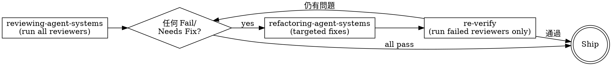

# Agent System Analysis Report

**Date:** 2026-04-14 12:00
**Project:** Reflexive Claude Code

## Project Overview

| Aspect | Finding |
|--------|---------|
| Language(s) | Python 3.11+ |
| Framework(s) | pytest（測試）, pylint（lint） |
| Project type | CLI Plugin Market — 單一 Python package + Claude Code plugin marketplace |
| CI/CD | 無（無 .github/workflows/ 或任何 CI 配置） |
| Testing | pytest（tests/hooks/） |
| Linting | pylint |
| Team scale | Solo（1 committer, 3 remote branches） |
| Notable | `.claude/settings.local.json` 存在；無 CODEOWNERS/PR template；Python-only |

## Component Inventory

| # | Type | Path | Lines | Status |
|---|------|------|-------|--------|
| 1 | CLAUDE.md | `./CLAUDE.md` | 55 | OK |
| 2 | Hook | `plugins/rcc/hooks/hooks.json` | 18 | OK |
| 3 | Hook Script | `plugins/rcc/hooks/validate_frontmatter.py` | ~150 | OK |
| 4 | Agent | `plugins/rcc/agents/claudemd-reviewer.md` | 120 | NEEDS_FIX |
| 5 | Agent | `plugins/rcc/agents/hook-reviewer.md` | 108 | NEEDS_FIX |
| 6 | Agent | `plugins/rcc/agents/rule-reviewer.md` | 131 | NEEDS_FIX |
| 7 | Agent | `plugins/rcc/agents/skill-reviewer.md` | 131 | NEEDS_FIX |
| 8 | Agent | `plugins/rcc/agents/subagent-reviewer.md` | 117 | NEEDS_FIX |
| 9 | Skill | `plugins/rcc/skills/advising-architecture` | 292 | OK |
| 10 | Skill | `plugins/rcc/skills/analyzing-agent-systems` | 293 | NEEDS_FIX |
| 11 | Skill | `plugins/rcc/skills/applying-agent-systems` | 159 | OK |
| 12 | Skill | `plugins/rcc/skills/brainstorming-workflows` | 219 | NEEDS_FIX |
| 13 | Skill | `plugins/rcc/skills/creating-plugins` | 217 | OK |
| 14 | Skill | `plugins/rcc/skills/improving-skills` | 252 | OK |
| 15 | Skill | `plugins/rcc/skills/initializing-projects` | 224 | OK |
| 16 | Skill | `plugins/rcc/skills/learning-from-failures` | 211 | NEEDS_FIX |
| 17 | Skill | `plugins/rcc/skills/migrating-agent-systems` | 204 | OK |
| 18 | Skill | `plugins/rcc/skills/migrating-plugins` | 267 | OK |
| 19 | Skill | `plugins/rcc/skills/planning-agent-systems` | 194 | OK |
| 20 | Skill | `plugins/rcc/skills/refactoring-agent-systems` | 229 | OK |
| 21 | Skill | `plugins/rcc/skills/refactoring-plugins` | 204 | OK |
| 22 | Skill | `plugins/rcc/skills/refactoring-skills` | 260 | OK |
| 23 | Skill | `plugins/rcc/skills/reflecting` | 294 | NEEDS_FIX |
| 24 | Skill | `plugins/rcc/skills/reviewing-agent-systems` | 206 | NEEDS_FIX |
| 25 | Skill | `plugins/rcc/skills/validating-plugins` | 139 | OK |
| 26 | Skill | `plugins/rcc/skills/writing-claude-md` | 278 | OK |
| 27 | Skill | `plugins/rcc/skills/writing-hooks` | 299 | OK |
| 28 | Skill | `plugins/rcc/skills/writing-rules` | 324 | NEEDS_FIX |
| 29 | Skill | `plugins/rcc/skills/writing-skills` | 305 | NEEDS_FIX |
| 30 | Skill | `plugins/rcc/skills/writing-subagents` | 342 | NEEDS_FIX |
| 31 | Command | `plugins/rcc/commands/init.md` | ~5 | OK |
| 32 | Command | `plugins/rcc/commands/init-plugin.md` | ~5 | OK |
| 33 | Command | `plugins/rcc/commands/migrate.md` | ~5 | OK |
| 34 | Command | `plugins/rcc/commands/migrate-plugin.md` | ~5 | OK |
| 35 | Command | `plugins/rcc/commands/reflect.md` | ~8 | OK |
| 36 | Settings | `.claude/settings.local.json` | 12 | OK |

**Project-level rules:** 0 個（`.claude/rules/` 無任何 rule file）
**User-root rules:** 9 個（chinese-writing, clean-architecture, dependencies, deployment, go, markdown, python, shell, typescript）

## Weakness Findings

> 包含 pipeline chain-break、state persistence、model topology 檢查

### CRITICAL（必須修復）

無 CRITICAL 問題。系統可正常運作。

### WARNING（應修復）

| # | Category | Component | Finding | Suggested Fix |
|---|----------|-----------|---------|---------------|
| W1 | 7-Architecture | 所有 reviewer agents | **Flat model topology**：5 個 agent 全部 `model: sonnet`，無差異化。簡單結構檢查（frontmatter、paths、line count）用 sonnet 過度；複雜架構推理（skill overlap、routing design）用 sonnet 不足。論文指出此設計方向正確但不穩定：成本未優化，高風險審查未獲充分算力。 | claudemd-reviewer / hook-reviewer / rule-reviewer → `model: haiku`；skill-reviewer / subagent-reviewer → `model: opus`（或 sonnet + effort:high） |
| W2 | 3-Workflow | reviewing-agent-systems → refactoring-agent-systems | **Review 無閉環**：reviewing → refactoring 是 terminal，修正後無 re-review gate。依論文原則「review 只有在 output 能被下游機械執行且有閉環修正時才有工程價值」，目前 refactoring 之後直接 ship，無驗證修正是否通過。 | refactoring-agent-systems 完成後加入條件：若有 Fail 項目，loop back → reviewing-agent-systems re-verify |
| W3 | 2-Context | writing-subagents (342), writing-rules (324), writing-skills (305) | **Skills 超過 300 行上限**：activation quality 在 300 行後下降。雖已有 references/ 目錄，但 SKILL.md 本身仍過長。 | 將 SKILL.md 中詳細 checklist、範例內容移至 references/，SKILL.md 保留骨架 + 連結即可 |
| W4 | 1-Routing | `reflecting` skill | **Auto-invoke 接狀態變更步驟**：reflecting → auto-invoke → planning-agent-systems。planning 會寫入 plan 文件（狀態變更），應需用戶確認。論文指出：state-changing chains 需 user-confirmation handoff。 | 將 reflecting 的 Handoff 改為 `user-confirmation` |

### INFO（可改善）

| # | Category | Component | Finding | Suggested Fix |
|---|----------|-----------|---------|---------------|
| I1 | 1-Routing | `learning-from-failures` | 使用 "Utility" routing pattern，不屬於系統定義的 4 種標準模式（Tree/Chain/Node/Skill Steps）。advising-architecture 文件未定義此模式，可能造成新技能作者誤用。 | 改為 Node（analysis-only）或在系統文件正式定義 Utility 模式 |
| I2 | 9-Project Context | 整個專案 `.claude/rules/` | 無 project-level rules。用戶有 9 個 user-root rules（含 python.md）但專案是 Python/pytest 專案，無任何 project-level 特化。缺少 pytest PostToolUse hook（跑測試後驗證）。 | 建立 `.claude/rules/python.md`（project-level specialization）；考慮 pytest PostToolUse hook |
| I3 | 1-Routing | analyzing-agent-systems, brainstorming-workflows | 這兩個 Chain 入口技能缺少 Skill Chain Reference 表。migrating-agent-systems 和 initializing-projects 有此表，應一致。 | 在兩個技能加入 Skill Chain Reference 表 |
| I4 | 2-Context | 所有 reviewer agents | Agents 沒有顯式 `context: fork` 聲明。雖然 Agent tool 本質上是 fork，但 frontmatter 未聲明，subagent-reviewer 文件只在文字中提及此模式而非在自身 frontmatter 中宣告。 | 在所有 reviewer agents frontmatter 加入 `context: fork` |

## Restructuring Recommendations

### Merge Recommendations

| # | ID | Components | Rationale | Priority |
|---|----|------------|-----------|----------|
| — | — | — | 無需合併項目。技能描述觸發條件清晰，無重疊。 | — |

### Extract Recommendations

#### EXTRACT-1: 將 writing-subagents / writing-rules / writing-skills 過長內容移至 references/

**Priority:** HIGH（writing-subagents 342 行超限最多）
**Type:** Extract
**Reason:** Weakness W3 — 3 個 writing-* skills 超過 300 行上限，activation quality 下降

**Migration table:**

| Source | Lines | Target | Content Summary |
|--------|-------|--------|-----------------|
| `writing-subagents/SKILL.md` | 342 → ~200 | `writing-subagents/references/checklist.md` | 詳細 checklist、驗證規則、反模式範例 |
| `writing-rules/SKILL.md` | 324 → ~200 | `writing-rules/references/checklist.md` | paths 規則、glob 範例、反模式 |
| `writing-skills/SKILL.md` | 305 → ~200 | `writing-skills/references/checklist.md` | 詳細 checklist、範例技能結構 |

**Action:** 在各 SKILL.md 保留任務骨架 + 連結到 references/ 詳細內容。

### Pipeline Recommendations

#### PIPELINE-1: Reviewer Agent 模型差異化

**Priority:** HIGH
**Type:** Pipeline（model topology 調整）
**Mode:** owner-pipe（reviewing-agent-systems 作為 owner 協調所有 reviewers）
**Reason:** Weakness W1 — 5 個 agents 全部 sonnet，無模型差異化，成本與品質均未優化

**模型分配原則（基於論文 Haiku+Sonnet+Opus 架構）：**

| Agent | 目前 | 建議 | 理由 |
|-------|------|------|------|
| claudemd-reviewer | sonnet | **haiku** | 純結構性機械檢查，**禁止 tool use**（純推理輸出） |
| hook-reviewer | sonnet | **haiku** | 純結構性機械檢查，**禁止 tool use**（純推理輸出） |
| rule-reviewer | sonnet | **haiku** | 純結構性機械檢查，**禁止 tool use**（純推理輸出） |
| skill-reviewer | sonnet | **opus** | 高風險架構推理（overlap、routing、設計正確性），Read-only tools 限制 |
| subagent-reviewer | sonnet | **opus** | 高風險架構推理（single-responsibility、tool minimalism），Read-only tools 限制 |

**Haiku 使用約束（論文核心條件）：**

Haiku 有兩種合法角色，約束條件不同：

**角色 A：Haiku 作為 main agent / orchestrator（planner）**

> Haiku 作為主代理時，**必須使用工具**。調度、任務分解、追蹤進度都需要 tool call。
> 無 tool use 的 orchestrator = 只能輸出文字，無法實際協調工作。

| 約束 | 實作 |
|------|------|
| 允許 orchestration tools | TaskCreate, TaskUpdate, Agent（dispatch sub-agents） |
| 禁止重型計算或長文生成 | 決策要快，不做 Sonnet 層的深度分析 |
| 輸出是調度指令，不是內容 | 「呼叫 skill-reviewer 審查 X」而非自己分析 X |

**角色 B：Haiku 作為結構性審查 sub-agent**

> 此時 owner（reviewing-agent-systems）**預先讀取文件內容並注入 prompt**。
> Haiku 只需判斷，無需自行讀檔 → 可以 `tools: []`。

| 約束 | 實作 |
|------|------|
| `tools: []` 或空陣列 | 禁止所有 tool 調用，內容已由 owner 注入 |
| 輸入由 owner 預先準備 | owner 先讀取文件，將內容注入 prompt |
| 輸出格式化 | `{"pass": bool, "issues": [...]}` 結構化 JSON |

claudemd-reviewer / hook-reviewer / rule-reviewer 屬於**角色 B**。

**Opus 使用約束（論文核心條件）：**

> **Opus review 只有在輸出可被下游機械執行時才有工程價值。**
> 無閉環修正 → Opus = expensive logger。

| 約束 | 實作 |
|------|------|
| 輸出必須強結構化（見下） | `{file, line_range, action, target?, reason}` 格式，**禁止 free-text fix** |
| 審查項目全部為 binary checklist | 移除主觀評分項（如 "description quality"），只保留可 pass/fail 的規則查核 |
| 禁止全文重寫 | 只能指出錯誤 + 局部修正建議，不可改寫整個 component |
| 禁止改寫 spec | 只針對 implementation，不得隱式修改 trigger/description |
| Read-only tools | `tools: ["Read", "Grep", "Glob"]`，不可 Write/Edit |
| 配合 PIPELINE-2 閉環 | 必須有 Sonnet 接收並執行 fix，再 re-verify |

**Opus 輸出格式（強制結構，保證可執行性）：**

```json
{
  "pass": false,
  "issues": [
    {
      "file": "plugins/rcc/skills/writing-rules/SKILL.md",
      "line_range": [45, 67],
      "action": "move_to_references",
      "target": "references/checklist.md",
      "reason": "exceeds 300 line limit — checklist content belongs in references/"
    }
  ]
}
```

`action` 只允許 enum 值：`move_to_references` / `delete` / `replace_line` / `add_field` / `fix_glob`。禁止 free-text。

**已知設計漏洞（待修復）：**

- **漏洞 1**：`fix_instruction: str` 允許不可執行評論 → 改為上述強結構格式
- **漏洞 2**：skill-reviewer 現有「description quality」主觀評分項 → 全部轉為 binary criteria（「包含 Use when？」「長度 50-500？」「不含 workflow 描述？」），主觀項從 Opus 職責移除

**State persistence:** `docs/agent-system/{timestamp}-review-report.md`（已存在）

#### PIPELINE-2: reviewing-agent-systems 閉環修正

**Priority:** HIGH
**Type:** Pipeline（workflow continuity 改善）
**Mode:** chain-pipe
**Reason:** Weakness W2 — review → refactoring 是 terminal，無 re-verify gate

**建議拓撲：**



**State persistence:**
- Path: `docs/agent-system/{timestamp}-review-report.md`
- 記錄每次 loop 的 reviewer 結果，標記哪些已通過、哪些仍待修

**Components:**

| # | Component | Type | Exists? | Action |
|---|-----------|------|---------|--------|
| 1 | reviewing-agent-systems | Skill | Yes | 修改：加入 loop gate logic，tracked reviewer 結果 |
| 2 | refactoring-agent-systems | Skill | Yes | 修改：完成後 handoff 回 reviewing-agent-systems（re-verify only） |

### Restructuring Summary

| Type | Count | HIGH | MEDIUM | LOW |
|------|-------|------|--------|-----|
| Merge | 0 | 0 | 0 | 0 |
| Extract | 1 | 1 | 0 | 0 |
| Pipeline | 2 | 2 | 0 | 0 |
| **Total** | **3** | **3** | **0** | **0** |

## Rules Health Summary

| Metric | Value | Status |
|--------|-------|--------|
| CLAUDE.md lines | 55 | ok |
| Global rules count / lines（project-level） | 0 / 0 | WARNING：無 project-level rules |
| Session-start total lines（CLAUDE.md + global rules） | 55 | ok（< 300 threshold） |
| Path-scoped rules | 0 | ok（無 rules 則無 dead glob 問題） |
| Rules with procedural content | 0 | ok |
| Dead glob patterns | 0 | ok |

## Summary

- Components scanned: 35（CLAUDE.md + 5 agents + 22 skills + 5 commands + 1 hook + 1 settings）
- Critical issues: 0
- Warnings: 4
- Info: 4
- Merge recommendations: 0
- Extract recommendations: 1（HIGH）
- Pipeline recommendations: 2（HIGH）

**Overall assessment:**

系統架構方向正確：chain-pipe 主幹線（analyzing → brainstorming → planning → applying → reviewing → refactoring）設計完整，reviewer agents 輸出格式化且可執行（有 file:line 引用和具體修正建議），skill 命名與結構遵循 Laws。

**最高優先修復（對應論文核心論點）：**

1. **PIPELINE-1**：reviewer agents 模型差異化。簡單結構檢查 → haiku，複雜架構推理 → 維持 sonnet 或升 opus。這直接對應「方向正確但不夠穩定」的問題。
2. **PIPELINE-2**：reviewing-agent-systems 閉環修正。論文指出：無閉環的 review = expensive logger。加入 re-verify gate，讓 Opus/Sonnet 的 review 輸出有工程價值。
3. **EXTRACT-1**：3 個 writing-* skills 超 300 行，activation quality 下降，影響這些技能最常用的寫作工作流程。
