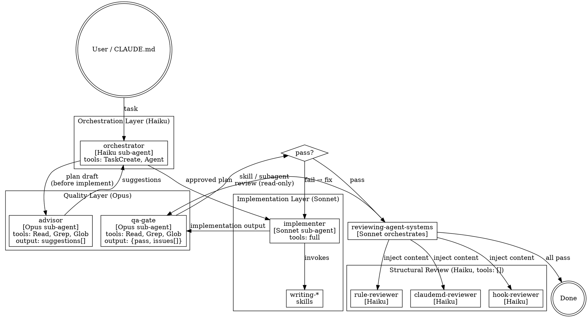

# Agent System Component Plan

**Date:** 2026-04-14 14:00
**Based on:** `docs/agent-system/20260414-1200-analysis.md`

## Architecture Flowchart



## Workflow Pattern Mapping

| Workflow | Anthropic Pattern | Rationale |
|----------|------------------|-----------|
| Haiku → Sonnet 任務調度 | **Orchestrator-Workers** | Haiku 動態分解任務，dispatch Sonnet worker 執行 |
| Opus QA gate 閉環修正 | **Evaluator-Optimizer** | 生成（Sonnet）→ 批評（Opus）→ 修正（Sonnet）循環 |
| Opus advisor → Haiku plan 修正 | **Evaluator-Optimizer** | 計畫（Haiku）→ 建議（Opus）→ 修訂（Haiku）循環 |
| Haiku structural reviewers | **Parallelization** | 3 個 Haiku reviewer 並行，owner 注入內容，無 tool use |
| CLAUDE.md → pipeline entry | **Routing** | 從 CLAUDE.md 分類意圖，路由至 Haiku orchestrator |

## Dependency Graph & Phases

| Component | Depends On | Depended By | Phase | Core/Enhancement |
|-----------|-----------|-------------|-------|-----------------|
| `agents/orchestrator.md` | — | applying, planning | 1 | **core** |
| `agents/implementer.md` | — | applying | 1 | **core** |
| `agents/qa-gate.md` | — | reviewing | 1 | **core** |
| `agents/advisor.md` | — | planning | 1 | **core** |
| `agents/claudemd-reviewer.md` (修改) | — | reviewing | 1 | **core** |
| `agents/hook-reviewer.md` (修改) | — | reviewing | 1 | **core** |
| `agents/rule-reviewer.md` (修改) | — | reviewing | 1 | **core** |
| `agents/skill-reviewer.md` (修改) | qa-gate output format | reviewing | 1 | **core** |
| `agents/subagent-reviewer.md` (修改) | qa-gate output format | reviewing | 1 | **core** |
| `skills/reviewing-agent-systems` (修改) | Phase 1 agents | applying | 2 | **core** |
| `skills/planning-agent-systems` (修改) | advisor, orchestrator | applying | 2 | **core** |
| `skills/applying-agent-systems` (修改) | orchestrator, implementer | — | 2 | **core** |
| `writing-subagents/SKILL.md` (extract) | — | — | 3 | enhancement |
| `writing-rules/SKILL.md` (extract) | — | — | 3 | enhancement |
| `writing-skills/SKILL.md` (extract) | — | — | 3 | enhancement |

## Execution Order

Phase-driven（同 phase 內可並行）：

- **Phase 1（foundation）：** 建立 4 個新 agents + 修改 5 個現有 agents（9 個 agent 可並行）
- **Phase 2（skill updates）：** 修改 reviewing / planning / applying 技能（可並行）
- **Phase 3（cleanup）：** 3 個 writing-* skills extract（可並行）

---

## Components

### Phase 1

#### 1. Agent: `orchestrator` (NEW)

- **Action:** create
- **Model:** `haiku`
- **Tools:** `["TaskCreate", "TaskUpdate", "Agent"]`
- **Context:** `fork`
- **Role:** 接收任務 → 分解為子任務 → dispatch Sonnet implementer
- **Key constraints:**
  - 只做調度決策，不做實際分析或生成
  - 輸出是調度指令（「呼叫 implementer 執行 X」），不是內容
  - 在 dispatch 前諮詢 Opus advisor（若任務為計畫性）
- **Writing skill:** `writing-subagents`
- **Traces to:** W1（flat model topology），用戶需求 #2（Haiku as orchestrator）

#### 2. Agent: `implementer` (NEW)

- **Action:** create
- **Model:** `sonnet`
- **Tools:** `["Read", "Write", "Edit", "Bash", "Glob", "Grep"]`
- **Context:** `fork`
- **Role:** 接收 Haiku 的實作指令 → 執行 writing-* skills → 輸出實作結果
- **Key constraints:**
  - 核心職責：building skills and agents
  - 完成後輸出供 Opus qa-gate 審查
- **Writing skill:** `writing-subagents`
- **Traces to:** W1（flat model topology），用戶需求 #1（Sonnet as implementer）

#### 3. Agent: `qa-gate` (NEW)

- **Action:** create
- **Model:** `opus`
- **Tools:** `["Read", "Grep", "Glob"]`（read-only）
- **Context:** `fork`
- **Role:** 接收實作輸出 → 二元判斷 pass/fail → 輸出強結構 JSON
- **Output format（強制）：**
  ```json
  {
    "pass": false,
    "issues": [
      {
        "file": "path/to/file.md",
        "line_range": [10, 25],
        "action": "move_to_references | delete | replace_line | add_field | fix_glob",
        "target": "references/checklist.md",
        "reason": "具體原因"
      }
    ]
  }
  ```
- **Constraints:**
  - `action` 只允許 enum 值，禁止 free-text fix
  - 禁止重寫整個 component
  - 禁止改 spec 或 trigger 定義
  - 所有 checklist 項目為 binary（通過 / 不通過），無主觀評分
- **Writing skill:** `writing-subagents`
- **Traces to:** W2（無閉環），W1（model topology），用戶需求 #3

#### 4. Agent: `advisor` (NEW)

- **Action:** create
- **Model:** `opus`
- **Tools:** `["Read", "Grep", "Glob"]`（read-only）
- **Context:** `fork`
- **Role:** 接收 Haiku 的計畫草案 → 提供建議給 Haiku planner 修訂
- **Output format（強制）：**
  ```json
  {
    "approved": false,
    "suggestions": [
      {
        "concern": "orchestrator 缺少 error handling 路徑",
        "recommendation": "在 dispatch 後加入 timeout 處理",
        "priority": "high | medium | low"
      }
    ]
  }
  ```
- **Constraints:**
  - 建議必須可被 Haiku 機械執行（具體動作，不是概念）
  - 禁止建議超出計畫範圍的新需求（anti-scope-creep）
  - 若 approved=true，suggestions 為空
- **Writing skill:** `writing-subagents`
- **Traces to:** 用戶需求 #4（Opus as advisor to Haiku planner）

#### 5. Agent: `claudemd-reviewer` (MODIFY)

- **Action:** modify
- **Changes:**
  - `model: sonnet` → `model: haiku`
  - `tools: ["Read", "Grep", "Glob", "Bash"]` → `tools: []`
  - 新增說明：「owner 預先注入文件內容至 prompt，Haiku 純推理輸出」
  - 輸出格式改為 `{pass: bool, issues: [{rule, finding}]}`，對齊 qa-gate 結構
  - 審查項目全部轉為 binary checklist（移除主觀評分）
- **Writing skill:** 直接修改現有文件
- **Traces to:** W1，I4

#### 6. Agent: `hook-reviewer` (MODIFY)

- **Action:** modify
- **Changes:** 同 claudemd-reviewer 模式（haiku, tools:[], binary output）
- **Traces to:** W1，I4

#### 7. Agent: `rule-reviewer` (MODIFY)

- **Action:** modify
- **Changes:** 同 claudemd-reviewer 模式（haiku, tools:[], binary output）
- **Traces to:** W1，I4

#### 8. Agent: `skill-reviewer` (MODIFY)

- **Action:** modify
- **Changes:**
  - `model: sonnet` → `model: opus`
  - 移除「description quality」主觀評分項
  - 所有 checklist 項轉為 binary criteria（「包含 Use when？」「長度 50-500？」「不含 workflow 描述？」「name 是 gerund？」「line count < 300？」）
  - 輸出格式對齊 qa-gate（`{pass, issues: [{file, line_range, action, reason}]}`）
  - 工具保留 `["Read", "Grep", "Glob"]` read-only
- **Traces to:** W1，W2（漏洞 1、漏洞 2）

#### 9. Agent: `subagent-reviewer` (MODIFY)

- **Action:** modify
- **Changes:** 同 skill-reviewer（opus, binary checklist, qa-gate 輸出格式）
- **Traces to:** W1，W2

---

### Phase 2

#### 10. Skill: `reviewing-agent-systems` (MODIFY)

- **Action:** modify
- **Key changes:**
  - Task 2（Run Reviewers）新增：owner（Sonnet）預先讀取文件內容 → 注入 Haiku reviewer prompt（`tools: []` 生效條件）
  - 整合 qa-gate output format：收集 `{pass, issues[]}` → 比較前後差異（pass/fail 明確）
  - 加入 re-verify loop gate：若有 Fail → dispatch Sonnet implementer 修正 → 只重跑失敗的 reviewer
  - 狀態追蹤：每次 loop 記錄哪些 reviewer 已通過、哪些待修
- **Writing skill:** 直接修改現有文件
- **Traces to:** W2（無閉環），W1（漏洞 1、2）

#### 11. Skill: `planning-agent-systems` (MODIFY)

- **Action:** modify
- **Key changes:**
  - Task 2（Design Architecture）加入：Haiku orchestrator 草擬計畫 → 呼叫 Opus advisor → 接收 `{approved, suggestions[]}` → Haiku 依 suggestions 修訂 → 再次諮詢 advisor（loop 直到 approved=true）
  - Task 3（Plan Components）指定：實作者 = Sonnet implementer sub-agent，明確寫入計畫
  - 新增 Haiku + Opus advisor 互動範例至 references/
- **Writing skill:** 直接修改現有文件
- **Traces to:** 用戶需求 #4，W1

#### 12. Skill: `applying-agent-systems` (MODIFY)

- **Action:** modify
- **Key changes:**
  - 明確 dispatch：呼叫 `orchestrator`（Haiku）sub-agent 開始執行計畫
  - orchestrator → dispatch `implementer`（Sonnet）執行 writing-* skills
  - 完成後 handoff → `reviewing-agent-systems`（含 qa-gate loop）
- **Writing skill:** 直接修改現有文件
- **Traces to:** 用戶需求 #1、#2

---

### Phase 3（cleanup）

#### 13. Extract: `writing-subagents/SKILL.md` 342 → ~200 行

- **Action:** move checklist + 反模式範例 → `references/checklist.md`
- **Traces to:** W3

#### 14. Extract: `writing-rules/SKILL.md` 324 → ~200 行

- **Action:** move paths 規則 + glob 範例 → `references/checklist.md`
- **Traces to:** W3

#### 15. Extract: `writing-skills/SKILL.md` 305 → ~200 行

- **Action:** move checklist + 範例結構 → `references/checklist.md`
- **Traces to:** W3

---

## Expected Fixes

| Weakness | Component | How It Fixes |
|----------|-----------|-------------|
| W1 — Flat model topology | agents 1-9 | Haiku/Sonnet/Opus 三層明確分工；haiku reviewer 零 tool；opus reviewer 有結構化 binary output |
| W2 — Review 無閉環 | reviewing-agent-systems | qa-gate pass/fail + re-verify loop；只重跑失敗項目 |
| W3 — Skills 超 300 行 | writing-subagents/rules/skills | Extract to references/，SKILL.md 降至 ~200 行 |
| W4 — Auto-invoke 狀態變更 | reflecting skill | （Phase 3 補充，本次計畫未包含，可獨立處理） |
| I1 — Utility routing pattern | — | （low priority，可在 advising-architecture 文件補定義） |
| I2 — 無 project-level rules | — | （低優先，本次不包含） |
| I3 — Chain reference 缺失 | — | （低優先，下次 reflecting 時更新） |
| I4 — 無 context: fork | agents 5-9 修改 | 在修改現有 reviewer agents 時一併加入 `context: fork` |
| 漏洞 1 — fix_instruction str | qa-gate, skill-reviewer, subagent-reviewer | 統一強結構 JSON，action enum 化 |
| 漏洞 2 — 主觀評分項 | skill-reviewer, subagent-reviewer | 移除主觀項，全部轉 binary checklist |
