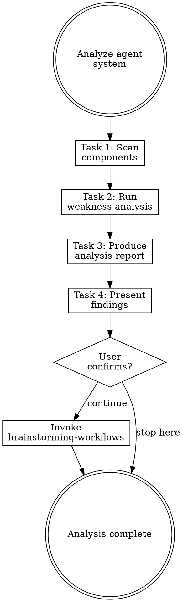
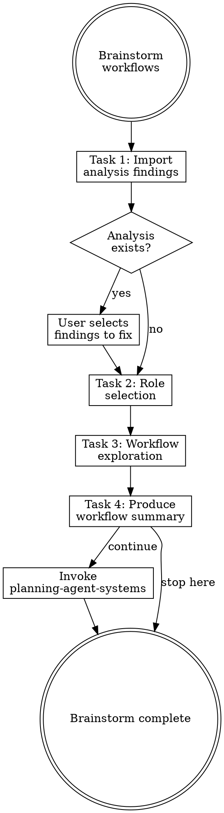
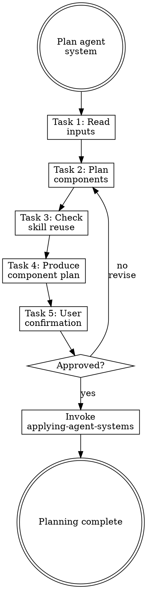
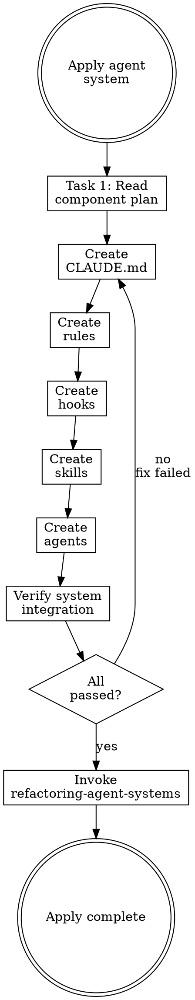
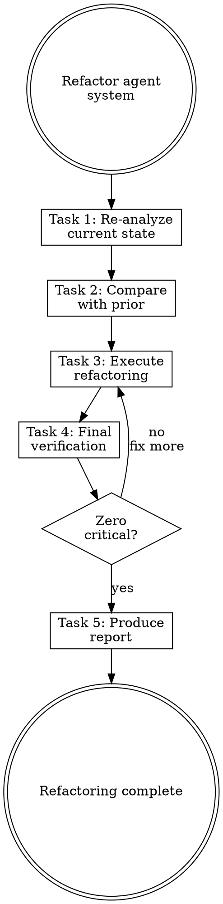
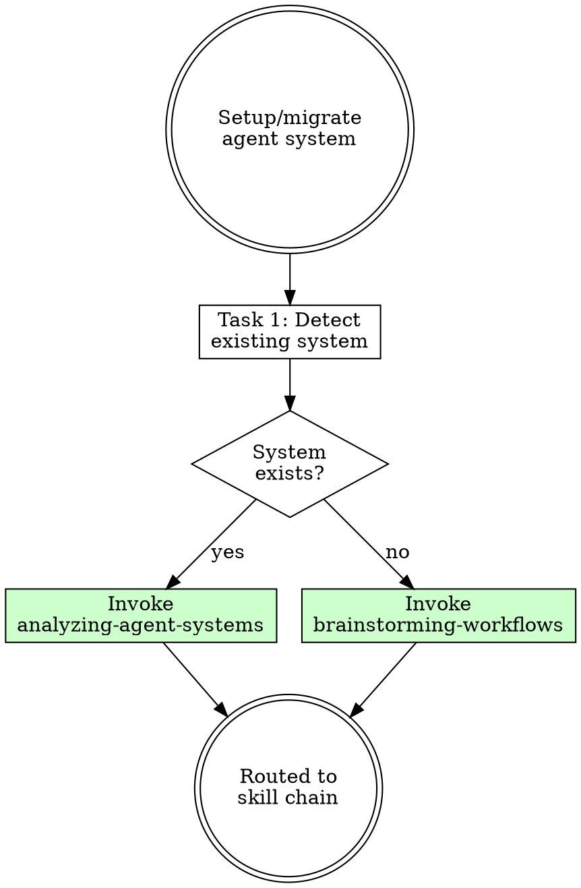

# Agent System 技能分解 Implementation Plan

> **For Claude:** REQUIRED SUB-SKILL: Use superpowers:executing-plans to implement this plan task-by-task.

**Goal:** 將 `migrating-agent-systems` 拆分為 5 個專責技能，改造 3 個調用方技能消除重複

**Architecture:** 鏈式調用架構。先建立 5 個新技能（從底層到上層），再改造 3 個現有技能。每個技能遵循 rcc 標準結構（Law 4-7）。

**Tech Stack:** Claude Code skills (SKILL.md + references/)

**Design Doc:** `docs/plans/2026-03-24-agent-system-skill-decomposition-design.md`

---

## Task 1: Create `analyzing-agent-systems` reference

**Files:**
- Create: `plugins/rcc/skills/analyzing-agent-systems/references/weakness-checklist.md`

**Step 1: Create directory**

```bash
mkdir -p plugins/rcc/skills/analyzing-agent-systems/references
```

**Step 2: Write weakness-checklist.md**

```markdown
# Agent System Weakness Checklist

## How to Use

For each category, check every item. Mark severity:
- **CRITICAL** — Must fix before system is usable
- **WARNING** — Should fix, causes degraded experience
- **INFO** — Nice to fix, minor improvement

---

## 1. Routing / Trigger Weaknesses

- [ ] Skill description is vague or generic (e.g., "improve code")
- [ ] Description summarizes workflow instead of stating triggers
- [ ] Two or more skills have overlapping trigger conditions
- [ ] No fallback when no skill matches user request
- [ ] More than 20 skills loaded (route saturation risk)
- [ ] Skill triggers use jargon users wouldn't naturally say
- [ ] Infinite handoff loop possible between skills

## 2. Context Management

- [ ] Reviewer/analyzer subagents lack `context: fork` isolation
- [ ] CLAUDE.md exceeds 200 lines
- [ ] Skill SKILL.md exceeds 300 lines
- [ ] Reference files loaded eagerly instead of on-demand
- [ ] Subagent receives full parent conversation (context pollution)
- [ ] Handoff between skills loses intent or context
- [ ] Rule files exceed 50 lines

## 3. Workflow Continuity

- [ ] Skill chain has a broken link (step N doesn't connect to N+1)
- [ ] Missing verification gate between tasks
- [ ] No error recovery path when a step fails
- [ ] Workflow exceeds 8 reasoning steps without checkpoint
- [ ] Re-running a skill produces side effects (not idempotent)
- [ ] Task list doesn't enforce sequential completion

## 4. Redundancy / Conflicts

- [ ] Two skills serve the same purpose
- [ ] Same convention appears in both CLAUDE.md and a rule file
- [ ] Same constraint appears in 2+ skills
- [ ] Rule contradicts CLAUDE.md instruction
- [ ] Hook enforces something already in a rule (duplicate layers)
- [ ] Personal and project settings conflict without clear precedence

## 5. Security / Safety

- [ ] No hook protecting sensitive files (.env, credentials, SSH keys)
- [ ] Subagent has write access it doesn't need
- [ ] Subagent used to write to `.claude/` directory (will be blocked)
- [ ] No input validation hook (UserPromptSubmit)
- [ ] Hook timeout too generous (>30 seconds)
- [ ] No file path filtering in hooks (checks all files, not just relevant ones)

## 6. Observability

- [ ] No structured output from skill invocations
- [ ] Routing decisions are opaque (can't tell why a skill was chosen)
- [ ] No report or summary produced after multi-step workflow
- [ ] Failed skill invocation produces no diagnostic output

## 7. Architecture / Scaling

- [ ] Flat topology — all skills at same level, no grouping
- [ ] Error in one skill cascades to downstream skills without cancellation
- [ ] Coordination overhead exceeds task complexity (over-orchestrated)
- [ ] Skills designed for hypothetical future requirements (YAGNI violation)

## 8. Constitution Stability

- [ ] CLAUDE.md uses custom XML tags instead of standard markdown
- [ ] Instructions are vague ("write clean code") instead of specific and verifiable
- [ ] No mechanism to detect instruction drift in long conversations
- [ ] CLAUDE.md contains domain knowledge that belongs in skills
- [ ] CLAUDE.md contains conventions that belong in rules
- [ ] CLAUDE.md contains procedures that belong in skills
```

**Step 3: Verify file exists**

```bash
cat plugins/rcc/skills/analyzing-agent-systems/references/weakness-checklist.md | head -5
```
Expected: Shows the header lines

---

## Task 2: Create `analyzing-agent-systems` SKILL.md

**Files:**
- Create: `plugins/rcc/skills/analyzing-agent-systems/SKILL.md`

**Step 1: Write SKILL.md**

```markdown
---
name: analyzing-agent-systems
description: Use when analyzing an existing agent system for weaknesses. Use when user says "analyze agent system", "check agent setup", "audit agent config". Use when called by migrating-agent-systems or refactoring-skills.
---

# Analyzing Agent Systems

## Overview

**Analyzing agent systems IS systematic weakness detection across all agent components.**

Scan every component (CLAUDE.md, rules, hooks, skills, agents), check against 8 weakness categories, produce a severity-rated report.

**Core principle:** You cannot fix what you haven't measured. Analyze before changing anything.

**Violating the letter of the rules is violating the spirit of the rules.**

## Task Initialization (MANDATORY)

Before ANY action, create task list using TaskCreate:

```
TaskCreate for EACH task below:
- Subject: "[analyzing-agent-systems] Task N: <action>"
- ActiveForm: "<doing action>"
```

**Tasks:**
1. Scan components
2. Run weakness analysis
3. Produce analysis report
4. Present findings to user

Announce: "Created 4 tasks. Starting execution..."

**Execution rules:**
1. `TaskUpdate status="in_progress"` BEFORE starting each task
2. `TaskUpdate status="completed"` ONLY after verification passes
3. If task fails → stay in_progress, diagnose, retry
4. NEVER skip to next task until current is completed
5. At end, `TaskList` to confirm all completed

## Task 1: Scan Components

**Goal:** Find all agent system components in the project.

**Scan locations:**
- `CLAUDE.md` (project root and `.claude/`)
- `.claude/rules/**/*.md`
- `.claude/settings.json` (hooks section)
- `.claude/skills/` or plugin skill directories
- `.claude/agents/` or subagent definitions
- `~/.claude/rules/` (user-level rules)

**For each component found, record:**
- Type (CLAUDE.md / rule / hook / skill / agent)
- Path
- Line count
- Brief purpose (from frontmatter or first heading)

**Verification:** Complete inventory of all components with paths and types.

## Task 2: Run Weakness Analysis

**Goal:** Check every component against the 8-category weakness checklist.

**CRITICAL:** Read [references/weakness-checklist.md](references/weakness-checklist.md) for the full checklist.

**For each weakness found, record:**
- Category (1-8)
- Severity: **CRITICAL** / **WARNING** / **INFO**
- Component affected
- Specific finding (what's wrong)
- Suggested fix (one sentence)

**Severity guidelines:**
| Severity | Criteria |
|----------|----------|
| CRITICAL | Blocks normal operation, causes errors, security risk |
| WARNING | Degrades experience, causes confusion, maintenance burden |
| INFO | Minor improvement, cosmetic, nice-to-have |

**Cross-component checks:**
- Compare all skill descriptions for overlap
- Check CLAUDE.md content against rules for duplication
- Check hook coverage against rule requirements
- Verify skill chain connections are complete

**Verification:** Every checklist item evaluated. At least one pass through each category.

## Task 3: Produce Analysis Report

**Goal:** Write structured report to `docs/agent-system/{timestamp}-analysis.md`.

**Report format:**

```markdown
# Agent System Analysis Report

**Date:** YYYY-MM-DD HH:MM
**Project:** [project name]

## Component Inventory

| # | Type | Path | Lines | Status |
|---|------|------|-------|--------|
| 1 | CLAUDE.md | ./CLAUDE.md | N | OK/NEEDS_FIX/MISSING |

## Weakness Findings

### CRITICAL (must fix)

| # | Category | Component | Finding | Suggested Fix |
|---|----------|-----------|---------|---------------|

### WARNING (should fix)

| # | Category | Component | Finding | Suggested Fix |
|---|----------|-----------|---------|---------------|

### INFO (nice to fix)

| # | Category | Component | Finding | Suggested Fix |
|---|----------|-----------|---------|---------------|

## Summary

- Components scanned: N
- Critical issues: N
- Warnings: N
- Info: N
```

**Verification:** Report written with all findings categorized by severity.

## Task 4: Present Findings to User

**Goal:** Show the user a concise summary and get confirmation.

**Present:**
1. Component count and types found
2. Critical issues (if any) — these need attention
3. Warnings — recommended fixes
4. Overall assessment (healthy / needs work / critical issues)

**Wait for user confirmation before proceeding.**

**Handoff:** After user confirms:
- 「分析完成。要繼續進行工作流探索嗎？」
- If yes → invoke `brainstorming-workflows` skill, pass analysis report path as context

## Red Flags - STOP

These thoughts mean you're rationalizing. STOP and reconsider:

- "I can see the issues already, skip the checklist"
- "Only check the obvious categories"
- "Skip cross-component checks, they're probably fine"
- "Don't need a report, I'll just tell the user"
- "This component looks fine, skip detailed analysis"

**All of these mean: You're about to miss critical weaknesses. Follow the checklist.**

## Common Rationalizations

| Excuse | Reality |
|--------|---------|
| "I know the issues" | Systematic checklist catches what intuition misses. |
| "Only major issues matter" | INFO issues compound. Document everything. |
| "Skip the report" | Reports enable before/after comparison. Essential for refactoring. |
| "Cross-checks take too long" | Cross-component issues are the hardest to find later. Check now. |
| "One pass is enough" | Different categories reveal different issues. Check all 8. |

## Flowchart: Agent System Analysis



## References

- [references/weakness-checklist.md](references/weakness-checklist.md) — Full 8-category weakness checklist
```

**Step 2: Count lines and verify structure**

```bash
wc -l plugins/rcc/skills/analyzing-agent-systems/SKILL.md
```
Expected: Under 300 lines

**Step 3: Verify frontmatter**

```bash
head -4 plugins/rcc/skills/analyzing-agent-systems/SKILL.md
```
Expected: Shows `name: analyzing-agent-systems` and description starting with "Use when"

---

## Task 3: Create `brainstorming-workflows` reference

**Files:**
- Create: `plugins/rcc/skills/brainstorming-workflows/references/role-templates.md`

**Step 1: Create directory**

```bash
mkdir -p plugins/rcc/skills/brainstorming-workflows/references
```

**Step 2: Write role-templates.md**

```markdown
# Role Templates for Workflow Brainstorming

## How to Use

Present the role table to the user. After they choose, use the corresponding deep-dive questions. Skip questions already answered by the analysis report.

---

## Software Developer

**Typical workflows:** coding, testing, code review, CI/CD, deployment, debugging

**Deep-dive questions (one at a time):**
1. What languages and frameworks do you use daily?
2. What's your testing approach? (unit, integration, e2e, manual)
3. Do you use CI/CD? What pipeline steps matter most?
4. What code quality tools do you use? (linter, formatter, type checker)
5. What's your branching and PR workflow?
6. Are there project-specific conventions your team enforces?
7. What repetitive tasks do you wish were automated?

**Likely components:**
- CLAUDE.md: code style, build commands, project structure
- Rules: language conventions, API patterns, test patterns
- Hooks: linting, formatting, type checking
- Skills: deployment, release, migration workflows

---

## Project Manager

**Typical workflows:** task tracking, reporting, scheduling, stakeholder communication

**Deep-dive questions (one at a time):**
1. What project management tools do you use? (Linear, Jira, etc.)
2. What reports do you produce regularly? (status, metrics, etc.)
3. What communication channels does your team use?
4. Do you have recurring meetings that need preparation?
5. What's your biggest time sink in project coordination?

**Likely components:**
- CLAUDE.md: project context, team structure, key dates
- Rules: document formatting, report templates
- Skills: status report generation, task sync, meeting prep

---

## Content Creator

**Typical workflows:** writing, editing, translation, publishing, social media

**Deep-dive questions (one at a time):**
1. What types of content do you produce? (docs, blog, marketing, etc.)
2. Do you work in multiple languages?
3. What's your review/approval process?
4. Do you have brand guidelines or style guides?
5. What publishing platforms do you use?

**Likely components:**
- CLAUDE.md: brand voice, style guidelines
- Rules: writing conventions, formatting standards
- Skills: translation, publishing, content review workflows

---

## Data Analyst

**Typical workflows:** data processing, visualization, reporting, automation

**Deep-dive questions (one at a time):**
1. What data tools do you use? (Python/R, SQL, BI tools)
2. What types of analysis do you do most often?
3. Do you produce recurring reports?
4. What data quality checks matter to you?
5. Are there compliance or privacy requirements?

**Likely components:**
- CLAUDE.md: data sources, key metrics, compliance rules
- Rules: SQL conventions, notebook patterns
- Hooks: data validation checks
- Skills: report generation, data pipeline workflows

---

## Operations / DevOps

**Typical workflows:** monitoring, deployment, incident response, infrastructure

**Deep-dive questions (one at a time):**
1. What infrastructure do you manage? (cloud provider, services)
2. What monitoring/alerting tools do you use?
3. What's your deployment process?
4. How do you handle incidents?
5. What IaC tools do you use? (Terraform, Pulumi, etc.)

**Likely components:**
- CLAUDE.md: infrastructure overview, critical services
- Rules: IaC conventions, security policies
- Hooks: security checks, deployment validation
- Skills: incident response, deployment, monitoring workflows

---

## Custom Role

**Approach:**
1. Ask: "Please describe your role in 2-3 sentences"
2. Ask: "What are the 3 tasks you do most often?"
3. Ask: "What tools or platforms do you use daily?"
4. Ask: "What repetitive tasks frustrate you most?"
5. Ask: "Are there rules or standards you must follow?"

**Map answers to components** using the same pattern as above.
```

**Step 3: Verify file exists**

```bash
wc -l plugins/rcc/skills/brainstorming-workflows/references/role-templates.md
```
Expected: File exists with content

---

## Task 4: Create `brainstorming-workflows` SKILL.md

**Files:**
- Create: `plugins/rcc/skills/brainstorming-workflows/SKILL.md`

**Step 1: Write SKILL.md**

```markdown
---
name: brainstorming-workflows
description: Use when exploring user workflows to design an agent system. Use when user says "explore workflows", "setup agent" for a new project. Use when called by analyzing-agent-systems or migrating-agent-systems.
---

# Brainstorming Workflows

## Overview

**Brainstorming workflows IS understanding the human before designing the system.**

Use role templates to quickly identify the user's context, then explore their specific workflows one question at a time. Don't assume the user is a developer — they may use the agent system for project management, content creation, data analysis, or other work.

**Core principle:** The agent system must serve the user's actual workflows, not an imagined ideal.

**Violating the letter of the rules is violating the spirit of the rules.**

## Task Initialization (MANDATORY)

Before ANY action, create task list using TaskCreate:

```
TaskCreate for EACH task below:
- Subject: "[brainstorming-workflows] Task N: <action>"
- ActiveForm: "<doing action>"
```

**Tasks:**
1. Import analysis findings (if available)
2. Role selection
3. Workflow exploration
4. Produce workflow summary

Announce: "Created 4 tasks. Starting execution..."

**Execution rules:**
1. `TaskUpdate status="in_progress"` BEFORE starting each task
2. `TaskUpdate status="completed"` ONLY after verification passes
3. If task fails → stay in_progress, diagnose, retry
4. NEVER skip to next task until current is completed
5. At end, `TaskList` to confirm all completed

## Task 1: Import Analysis Findings (if available)

**Goal:** If an analysis report exists, bring its findings into the conversation.

**If analysis report path was provided:**
1. Read the analysis report
2. Summarize critical and warning findings
3. Ask user: 「分析發現以下弱點，是否要在這次一併修補？」
4. Present findings as a checklist for user to select
5. Record selected items → these become requirements in the workflow summary

**If no analysis report:** Skip to Task 2.

**This allows skipping questions already answered by analysis.** For example:
- Analysis found "no linting hook" → skip asking about code quality tools
- Analysis found "CLAUDE.md > 200 lines" → skip asking about constitution preferences

**Verification:** User has confirmed which findings to address (or no analysis exists).

## Task 2: Role Selection

**Goal:** Identify the user's primary role to guide exploration.

**Present the role table:**

| Role | Typical Workflows |
|------|-------------------|
| **A) Software Developer** | coding, testing, code review, CI/CD, deployment |
| **B) Project Manager** | task tracking, reporting, scheduling, communication |
| **C) Content Creator** | writing, translation, publishing, social media |
| **D) Data Analyst** | data processing, visualization, reporting, automation |
| **E) Operations / DevOps** | monitoring, deployment, incident response, IaC |
| **F) Custom** | describe your role |

**Ask:** 「你的角色最接近哪一個？選擇字母即可。」

**Verification:** User has selected a role.

## Task 3: Workflow Exploration

**Goal:** Explore the user's specific workflows one question at a time.

**CRITICAL:** Read [references/role-templates.md](references/role-templates.md) for role-specific deep-dive questions.

**Rules:**
- **One question at a time** — never ask multiple questions in one message
- **Skip questions answered by analysis** — don't re-ask what we already know
- **Multiple choice when possible** — easier for user to answer
- **Adapt to answers** — if user reveals something unexpected, explore it
- **5-8 questions maximum** — don't exhaust the user

**Verification:** Have enough information to map workflows to agent system components.

## Task 4: Produce Workflow Summary

**Goal:** Write structured summary to `docs/agent-system/{timestamp}-workflows.md`.

**Summary format:**

```markdown
# Workflow Summary

**Date:** YYYY-MM-DD HH:MM
**Role:** [selected role]

## Core Workflows
1. [Workflow description]
2. [Workflow description]

## Tasks to Automate
- [Task] → suggested component type (hook/skill/rule)

## Weaknesses to Fix (from analysis)
- [Finding] → planned fix

## Conventions to Enforce
- [Convention] → suggested component type (rule/hook)

## Component Recommendations
| Component | Action | Rationale |
|-----------|--------|-----------|
| CLAUDE.md | create/modify | [reason] |
| Rule: [name] | create | [reason] |
| Hook: [name] | create | [reason] |
| Skill: [name] | create | [reason] |
```

**Handoff:** 「工作流摘要完成。要繼續規劃 agent system 元件嗎？」
- If yes → invoke `planning-agent-systems` skill, pass workflow summary path

**Verification:** Summary written with all workflows mapped to components.

## Red Flags - STOP

These thoughts mean you're rationalizing. STOP and reconsider:

- "The user is obviously a developer, skip role selection"
- "I know what workflows they need"
- "Ask all questions at once to save time"
- "Skip analysis import, start fresh"
- "Don't need a summary, just proceed to planning"

**All of these mean: You're about to design for assumptions, not reality. Follow the process.**

## Common Rationalizations

| Excuse | Reality |
|--------|---------|
| "Obviously a developer" | PMs, analysts, creators all use agent systems. Ask. |
| "I know the workflows" | You know common workflows. Theirs may differ. |
| "Multiple questions saves time" | Multiple questions overwhelm. One at a time. |
| "Skip analysis" | Analysis findings prevent redundant questions. Use them. |
| "Summary is overhead" | Summary is the contract for planning. Essential. |

## Flowchart: Workflow Brainstorming



## References

- [references/role-templates.md](references/role-templates.md) — Role-specific deep-dive questions and component mappings
```

**Step 2: Verify line count and structure**

```bash
wc -l plugins/rcc/skills/brainstorming-workflows/SKILL.md
```
Expected: Under 300 lines

---

## Task 5: Create `planning-agent-systems` SKILL.md

**Files:**
- Create: `plugins/rcc/skills/planning-agent-systems/SKILL.md`

**Step 1: Create directory**

```bash
mkdir -p plugins/rcc/skills/planning-agent-systems
```

**Step 2: Write SKILL.md**

```markdown
---
name: planning-agent-systems
description: Use when planning which agent system components to create or modify. Use when called by brainstorming-workflows after workflow exploration is complete.
---

# Planning Agent Systems

## Overview

**Planning agent systems IS mapping workflows to components with explicit rationale.**

Read the analysis report and workflow summary, decide what to create/modify/delete, identify which writing-* skills to invoke, and get user confirmation before execution.

**Core principle:** Every component must trace back to a workflow need or a weakness fix. No speculative components.

**Violating the letter of the rules is violating the spirit of the rules.**

## Task Initialization (MANDATORY)

Before ANY action, create task list using TaskCreate:

```
TaskCreate for EACH task below:
- Subject: "[planning-agent-systems] Task N: <action>"
- ActiveForm: "<doing action>"
```

**Tasks:**
1. Read inputs
2. Plan components
3. Check skill reuse
4. Produce component plan
5. Get user confirmation

Announce: "Created 5 tasks. Starting execution..."

**Execution rules:**
1. `TaskUpdate status="in_progress"` BEFORE starting each task
2. `TaskUpdate status="completed"` ONLY after verification passes
3. If task fails → stay in_progress, diagnose, retry
4. NEVER skip to next task until current is completed
5. At end, `TaskList` to confirm all completed

## Task 1: Read Inputs

**Goal:** Load analysis report (if available) and workflow summary.

**Read:**
- `docs/agent-system/*-analysis.md` (most recent, if exists)
- `docs/agent-system/*-workflows.md` (most recent)

**Extract:**
- Weaknesses marked for fixing
- Workflows to support
- Conventions to enforce
- Component recommendations from workflow summary

**Verification:** Have a clear list of requirements from both sources.

## Task 2: Plan Components

**Goal:** Decide action for each component type.

**For each component type, evaluate:**

| Component | Input Sources | Decision |
|-----------|--------------|----------|
| CLAUDE.md | Workflow conventions + analysis constitution findings | Create / Modify / Keep |
| Rules | Workflow conventions + analysis path-match findings | Which rules, with paths: globs |
| Hooks | Workflow quality checks + analysis security findings | Which hooks, which events |
| Skills | Workflow repeated tasks | Which skills |
| Agents | Workflow isolated analysis needs | Which agents (read-only only) |

**Decision criteria:**
- Does this component trace to a workflow need? → Create
- Does this fix an analysis weakness? → Create/Modify
- Does it already exist and work? → Keep
- Does it conflict with another component? → Modify/Delete
- Is it speculative? → **Don't create (YAGNI)**

**CRITICAL constraints:**
- CLAUDE.md MUST stay under 200 lines
- Each rule MUST stay under 50 lines
- Each skill MUST stay under 300 lines
- Agents MUST be read-only (no `.claude/` writes)
- All `.claude/` writes happen via main conversation, never subagents

**Verification:** Each planned component has a traced rationale.

## Task 3: Check Skill Reuse

**Goal:** Identify which existing writing-* skills to invoke for each component.

**Available skills:**

| Component | Writing Skill | Notes |
|-----------|--------------|-------|
| CLAUDE.md | `writing-claude-md` | Uses official markdown format |
| Rules | `writing-rules` | One invocation per rule |
| Hooks | `writing-hooks` | One invocation per hook |
| Skills | `writing-skills` | One invocation per skill |
| Agents | `writing-subagents` | One invocation per agent |

**Check for conflicts:**
- Will new components duplicate existing ones?
- Will new rules conflict with existing CLAUDE.md content?
- Will new hooks overlap with existing hooks?

**Verification:** Each component has an assigned writing-* skill and no conflicts identified.

## Task 4: Produce Component Plan

**Goal:** Write structured plan to `docs/agent-system/{timestamp}-plan.md`.

**Plan format:**

```markdown
# Agent System Component Plan

**Date:** YYYY-MM-DD HH:MM
**Based on:** [analysis report path] + [workflow summary path]

## Execution Order

Components MUST be created in this order:
1. CLAUDE.md (foundation)
2. Rules (conventions)
3. Hooks (enforcement)
4. Skills (capabilities)
5. Agents (analysis)

## Components

### 1. CLAUDE.md
- **Action:** create / modify
- **Key content:** [bullet list of what to include]
- **Writing skill:** `writing-claude-md`
- **Traces to:** [workflow/weakness references]

### 2. Rule: [name]
- **Action:** create
- **Paths:** `[glob pattern]`
- **Key constraints:** [bullet list]
- **Writing skill:** `writing-rules`
- **Traces to:** [workflow/weakness references]

[...repeat for each component...]

## Expected Fixes
| Weakness | Component | How It Fixes |
|----------|-----------|-------------|
```

**Verification:** Plan written with complete execution order and traceability.

## Task 5: Get User Confirmation

**Goal:** Present plan and get explicit approval.

**Present:**
1. Number of components to create/modify
2. Execution order
3. Which weaknesses will be fixed
4. Estimated scope (how many writing-* invocations)

**Ask:** 「這個計畫看起來可以嗎？要開始建立元件嗎？」

**Handoff:** After user confirms → invoke `applying-agent-systems` skill, pass plan path

**Verification:** User has explicitly approved the plan.

## Red Flags - STOP

These thoughts mean you're rationalizing. STOP and reconsider:

- "Create everything, we might need it later"
- "Skip traceability, the components are obvious"
- "Don't need user confirmation, the plan is solid"
- "Skip reuse check, just write new ones"
- "One big rule instead of several small ones"

**All of these mean: You're about to create an over-engineered system. Follow the process.**

## Common Rationalizations

| Excuse | Reality |
|--------|---------|
| "Create everything" | YAGNI. Only create what traces to a need. |
| "Skip traceability" | Untraceable components become mystery debt. |
| "Skip confirmation" | User approval prevents wasted effort. |
| "Skip reuse check" | Duplicating existing skills creates conflicts. |
| "One big rule" | Multiple focused rules > one bloated rule. |

## Flowchart: Agent System Planning


```

**Step 3: Verify line count**

```bash
wc -l plugins/rcc/skills/planning-agent-systems/SKILL.md
```
Expected: Under 300 lines

---

## Task 6: Create `applying-agent-systems` SKILL.md

**Files:**
- Create: `plugins/rcc/skills/applying-agent-systems/SKILL.md`

**Step 1: Create directory**

```bash
mkdir -p plugins/rcc/skills/applying-agent-systems
```

**Step 2: Write SKILL.md**

```markdown
---
name: applying-agent-systems
description: Use when executing a component plan to build agent system elements. Use when called by planning-agent-systems after plan is confirmed. Use when user says "apply agent plan", "build agent system".
---

# Applying Agent Systems

## Overview

**Applying agent systems IS orchestrating writing-* skill invocations in the correct order.**

Read the component plan, invoke the appropriate writing-* skill for each component, verify each one succeeds before moving to the next.

**Core principle:** Never create components directly. Always invoke the writing-* skill. Skills encode best practices that direct creation bypasses.

**Violating the letter of the rules is violating the spirit of the rules.**

## Task Initialization (MANDATORY)

Before ANY action, create task list using TaskCreate:

```
TaskCreate for EACH task below:
- Subject: "[applying-agent-systems] Task N: <action>"
- ActiveForm: "<doing action>"
```

**Tasks:**
1. Read component plan
2. Execute component creation (one task per component from plan)
3. Verify system integration

Announce: "Created N tasks. Starting execution..."

**Execution rules:**
1. `TaskUpdate status="in_progress"` BEFORE starting each task
2. `TaskUpdate status="completed"` ONLY after verification passes
3. If task fails → stay in_progress, diagnose, retry
4. NEVER skip to next task until current is completed
5. At end, `TaskList` to confirm all completed

## Task 1: Read Component Plan

**Goal:** Load the component plan and prepare execution order.

**Read:** `docs/agent-system/*-plan.md` (most recent)

**Create a TaskCreate for each component** in the plan's execution order:
- "[applying] Create CLAUDE.md"
- "[applying] Create rule: [name]"
- "[applying] Create hook: [name]"
- etc.

**Verification:** All components from plan have corresponding tasks.

## Task 2+: Execute Component Creation

**Goal:** For each component in order, invoke the correct writing-* skill.

**Execution order (MUST follow):**
1. CLAUDE.md → invoke `writing-claude-md`
2. Rules → invoke `writing-rules` (one per rule)
3. Hooks → invoke `writing-hooks` (one per hook)
4. Skills → invoke `writing-skills` (one per skill)
5. Agents → invoke `writing-subagents` (one per agent)

**For each component:**
1. Invoke the writing-* skill with the plan's specifications
2. Wait for skill to complete
3. Verify the component was created correctly
4. Mark task complete
5. Move to next component

**CRITICAL CONSTRAINTS:**

- **All writes happen in main conversation.** NEVER delegate writing-* skill invocations to subagents. Subagents cannot reliably write to `.claude/` directories.
- **One component at a time.** Don't batch. Each writing-* skill has its own TDD process.
- **Pass plan context.** When invoking a writing-* skill, provide the relevant section from the component plan as context.

**Verification:** Each component exists and passes the writing-* skill's own validation.

## Final Task: Verify System Integration

**Goal:** Verify all components work together.

**Checklist:**
- [ ] CLAUDE.md exists and is under 200 lines
- [ ] All planned rules exist with correct `paths:` globs
- [ ] All planned hooks are registered in `.claude/settings.json`
- [ ] Hooks return correct exit codes (test with sample input)
- [ ] All planned skills have valid frontmatter
- [ ] No conflicts between CLAUDE.md and rules
- [ ] No duplicate logic across components

**Handoff:** 「所有元件已建立並驗證。要進行 review 和重構嗎？」
- If yes → invoke `refactoring-agent-systems` skill

**Verification:** All checklist items pass.

## Red Flags - STOP

These thoughts mean you're rationalizing. STOP and reconsider:

- "I can write this component directly, skip the writing-* skill"
- "Dispatch a subagent to write the rule"
- "Create multiple components in parallel"
- "Skip verification, the writing-* skill handles it"
- "Deviate from the plan, I have a better idea"

**All of these mean: You're about to bypass quality gates. Follow the process.**

## Common Rationalizations

| Excuse | Reality |
|--------|---------|
| "Write directly" | Writing-* skills encode TDD + review. Bypass = weak components. |
| "Use subagent" | Subagents can't write to `.claude/`. Will silently fail. |
| "Parallel creation" | Components depend on each other. CLAUDE.md before rules before hooks. |
| "Skip verification" | Integration issues only appear when components interact. Verify. |
| "Better idea" | The plan was user-approved. Discuss changes, don't silently deviate. |

## Flowchart: Applying Agent System


```

**Step 3: Verify line count**

```bash
wc -l plugins/rcc/skills/applying-agent-systems/SKILL.md
```
Expected: Under 300 lines

---

## Task 7: Create `refactoring-agent-systems` SKILL.md

**Files:**
- Create: `plugins/rcc/skills/refactoring-agent-systems/SKILL.md`

**Step 1: Create directory**

```bash
mkdir -p plugins/rcc/skills/refactoring-agent-systems
```

**Step 2: Write SKILL.md**

```markdown
---
name: refactoring-agent-systems
description: Use when reviewing and cleaning up an agent system after creation or modification. Use when user says "review agent system", "cleanup agent system", "refactor agent setup". Use when called by applying-agent-systems.
---

# Refactoring Agent Systems

## Overview

**Refactoring agent systems IS applying clean code principles to agent configurations.**

Re-analyze after changes, compare before/after, fix remaining issues, simplify over-engineering.

**Core principle:** Refactoring without measurement is guessing. Analyze, then change, then verify.

**Violating the letter of the rules is violating the spirit of the rules.**

## Task Initialization (MANDATORY)

Before ANY action, create task list using TaskCreate:

```
TaskCreate for EACH task below:
- Subject: "[refactoring-agent-systems] Task N: <action>"
- ActiveForm: "<doing action>"
```

**Tasks:**
1. Re-analyze current state
2. Compare with prior analysis
3. Execute refactoring
4. Final verification
5. Produce refactoring report

Announce: "Created 5 tasks. Starting execution..."

**Execution rules:**
1. `TaskUpdate status="in_progress"` BEFORE starting each task
2. `TaskUpdate status="completed"` ONLY after verification passes
3. If task fails → stay in_progress, diagnose, retry
4. NEVER skip to next task until current is completed
5. At end, `TaskList` to confirm all completed

## Task 1: Re-analyze Current State

**Goal:** Run a fresh analysis of the agent system.

**Invoke `analyzing-agent-systems` skill** to produce a new analysis report.

This gives us the "after" snapshot to compare with the "before" analysis (if one exists).

**Verification:** New analysis report exists at `docs/agent-system/{timestamp}-analysis.md`.

## Task 2: Compare With Prior Analysis

**Goal:** Identify what improved, what remains, and what's new.

**If prior analysis exists:**

| Category | Before | After | Status |
|----------|--------|-------|--------|
| [weakness] | CRITICAL | resolved | FIXED |
| [weakness] | WARNING | WARNING | REMAINING |
| [new issue] | — | WARNING | NEW |

**If no prior analysis:** Use the new analysis as baseline. All findings are actionable.

**Verification:** Comparison table complete with clear status for each finding.

## Task 3: Execute Refactoring

**Goal:** Fix remaining and new issues.

**Refactoring actions (in priority order):**

| Issue Type | Action | Method |
|------------|--------|--------|
| Duplicate logic across components | Merge or extract to rule | Main conversation edits |
| Conflicting instructions | Unify or remove one | Main conversation edits |
| Over-engineered component | Simplify (YAGNI) | Main conversation edits |
| Weak skill trigger | Improve description | Main conversation edits |
| Missing isolation | Add `context: fork` to agent | Main conversation edits |
| CLAUDE.md too long | Move content to rules/skills | Main conversation edits |

**CRITICAL:** All edits happen in main conversation. Never delegate refactoring writes to subagents.

**For each refactoring action:**
1. Identify the specific change
2. Make the edit
3. Verify the fix resolves the issue
4. Move to next action

**Verification:** All REMAINING and NEW issues addressed.

## Task 4: Final Verification

**Goal:** Confirm no critical issues remain.

**Run `analyzing-agent-systems` one more time** (lightweight — focus on critical/warning only).

**Pass criteria:**
- Zero CRITICAL issues
- WARNING count decreased or stable
- No new issues introduced by refactoring

**If critical issues remain:** Return to Task 3 and fix.

**Verification:** Analysis shows zero critical issues.

## Task 5: Produce Refactoring Report

**Goal:** Document what was changed and why.

**Write to:** `docs/agent-system/{timestamp}-refactoring-report.md`

**Report format:**

```markdown
# Agent System Refactoring Report

**Date:** YYYY-MM-DD HH:MM

## Changes Made

| # | Component | Change | Rationale |
|---|-----------|--------|-----------|

## Before/After Comparison

| Metric | Before | After |
|--------|--------|-------|
| Components | N | N |
| Critical issues | N | 0 |
| Warnings | N | N |
| Total lines (CLAUDE.md) | N | N |

## Remaining Items (INFO)

- [Low priority items for future consideration]
```

**Verification:** Report accurately reflects all changes.

## Red Flags - STOP

These thoughts mean you're rationalizing. STOP and reconsider:

- "Skip re-analysis, I just built this"
- "No need to compare, everything is new"
- "Use a subagent to make the edits"
- "Skip final verification, I just fixed it"
- "The report is busywork"

**All of these mean: You're about to leave mess behind. Follow the process.**

## Common Rationalizations

| Excuse | Reality |
|--------|---------|
| "Skip re-analysis" | Building introduces new issues. Always re-analyze. |
| "Skip comparison" | Without before/after, you can't prove improvement. |
| "Subagent edits" | Subagents can't write to `.claude/`. Use main conversation. |
| "Skip verification" | Refactoring can break things. Verify. |
| "Skip report" | Report documents decisions for future maintainers. |

## Flowchart: Agent System Refactoring


```

**Step 3: Verify line count**

```bash
wc -l plugins/rcc/skills/refactoring-agent-systems/SKILL.md
```
Expected: Under 300 lines

---

## Task 8: Modify `migrating-agent-systems` to router

**Files:**
- Modify: `plugins/rcc/skills/migrating-agent-systems/SKILL.md` (replace entirely)

**Step 1: Write new SKILL.md (router)**

Replace entire content with:

```markdown
---
name: migrating-agent-systems
description: Use when setting up or migrating Claude Code agent system for a project. Use when user says "setup agent", "migrate agent system", "configure claude code", "add agent system".
---

# Migrating Agent Systems

## Overview

**Migrating agent systems IS routing to the correct workflow based on project state.**

Detect whether an agent system already exists, then invoke the appropriate skill chain. This skill is a thin router — all logic lives in the specialized skills.

**Core principle:** Detect, don't assume. Route, don't implement.

**Violating the letter of the rules is violating the spirit of the rules.**

## Task Initialization (MANDATORY)

Before ANY action, create task list using TaskCreate:

```
TaskCreate for EACH task below:
- Subject: "[migrating-agent-systems] Task N: <action>"
- ActiveForm: "<doing action>"
```

**Tasks:**
1. Detect existing agent system
2. Route to appropriate skill chain

Announce: "Created 2 tasks. Starting execution..."

**Execution rules:**
1. `TaskUpdate status="in_progress"` BEFORE starting each task
2. `TaskUpdate status="completed"` ONLY after verification passes
3. If task fails → stay in_progress, diagnose, retry
4. NEVER skip to next task until current is completed
5. At end, `TaskList` to confirm all completed

## Task 1: Detect Existing Agent System

**Goal:** Determine if the project already has an agent system.

**Check for existence of ANY of these:**
- `CLAUDE.md` (project root)
- `.claude/` directory
- `.claude/rules/` directory
- `.claude/settings.json`
- `.claude/skills/` directory

**Classification:**
- **Existing system** → at least one component found
- **New project** → no components found

**Verification:** Clear classification as "existing" or "new".

## Task 2: Route to Appropriate Skill Chain

**Goal:** Invoke the correct starting skill.

**If existing system:**
- Announce: 「偵測到現有 agent system，開始分析...」
- Invoke `analyzing-agent-systems` skill
- The chain will automatically continue: analyzing → brainstorming → planning → applying → refactoring

**If new project:**
- Announce: 「全新專案，開始探索工作流程...」
- Invoke `brainstorming-workflows` skill
- The chain will automatically continue: brainstorming → planning → applying → refactoring

**Verification:** Correct skill invoked based on detection result.

## Red Flags - STOP

These thoughts mean you're rationalizing. STOP and reconsider:

- "I can see it's a new project, skip detection"
- "Just start building without analyzing"
- "Handle everything in this skill instead of routing"
- "Skip brainstorming, I know what's needed"

**All of these mean: You're about to bypass the specialized skills. Route correctly.**

## Common Rationalizations

| Excuse | Reality |
|--------|---------|
| "Skip detection" | Hidden configs exist. Always check. |
| "Build without analyzing" | Existing systems have history. Analyze first. |
| "Handle here" | This skill is a router. Logic lives in specialized skills. |
| "Skip brainstorming" | Assumptions about workflows lead to misfit systems. |

## Flowchart: Agent System Migration



## Skill Chain Reference

| Step | Skill | Purpose |
|------|-------|---------|
| 0 | `analyzing-agent-systems` | Scan + weakness detection (if existing) |
| 1 | `brainstorming-workflows` | Role-based workflow exploration |
| 2 | `planning-agent-systems` | Component planning |
| 3 | `applying-agent-systems` | Invoke writing-* skills |
| 4 | `refactoring-agent-systems` | Review + cleanup |
```

**Step 2: Verify line count**

```bash
wc -l plugins/rcc/skills/migrating-agent-systems/SKILL.md
```
Expected: Under 300 lines (should be ~120 lines)

---

## Task 9: Modify `initializing-projects` Task 6

**Files:**
- Modify: `plugins/rcc/skills/initializing-projects/SKILL.md:149-158`

**Step 1: Replace Task 6 content**

Find the current Task 6 section (lines 149-158):

```markdown
## Task 6: Setup Agent System

**Goal:** Configure Claude Code for the new project.

**CRITICAL: Invoke the `migrating-agent-systems` skill.**

This handles:
- Create CLAUDE.md with project-specific laws
- Setup rules for code conventions
- Configure hooks for linting/formatting
- Create useful skills if needed

**Verification:** Agent system is configured and working.
```

Replace with:

```markdown
## Task 6: Setup Agent System

**Goal:** Configure Claude Code for the new project.

**Since this is a new project, skip analysis and go directly to workflow exploration.**

**CRITICAL: Invoke the `brainstorming-workflows` skill.**

The skill chain will automatically continue:
1. `brainstorming-workflows` → explore user's workflows
2. `planning-agent-systems` → plan components
3. `applying-agent-systems` → create components via writing-* skills
4. `refactoring-agent-systems` → review and cleanup

**Verification:** Agent system is configured and verified by the skill chain.
```

**Step 2: Also update Task 7 checklist line 168**

Find:
```markdown
- [ ] CLAUDE.md exists with specific, verifiable instructions
```

Replace with:
```markdown
- [ ] CLAUDE.md exists, under 200 lines, uses standard markdown format
```

**Step 3: Verify changes**

```bash
grep -n "brainstorming-workflows" plugins/rcc/skills/initializing-projects/SKILL.md
```
Expected: Shows the new Task 6 reference

---

## Task 10: Modify `refactoring-skills` Task 2

**Files:**
- Modify: `plugins/rcc/skills/refactoring-skills/SKILL.md:66-98`

**Step 1: Replace Task 2 content**

Find the current Task 2 section (lines 66-98):

```markdown
## Task 2: Analyze and Classify

**Goal:** Classify each skill for action.

### Classification Matrix
...
```

Replace with:

```markdown
## Task 2: Analyze and Classify

**Goal:** Classify each skill for action, informed by systematic weakness analysis.

**First: Invoke `analyzing-agent-systems` skill** to get a comprehensive analysis report covering all 8 weakness categories. This replaces manual analysis.

**Then classify each skill using both the analysis report and manual assessment:**

### Classification Matrix

| Status | Criteria | Action |
|--------|----------|--------|
| **Keep** | Well-structured, unique purpose, no weaknesses flagged | None |
| **Refactor** | Analysis flagged weaknesses but valuable | Use writing-skills to improve |
| **Merge** | Analysis found overlap with another skill | Consolidate into primary |
| **Extract** | Analysis found duplicated conventions | Move to rule file |
| **Delete** | Redundant, unused, or superseded | Remove entirely |

### Analysis-Informed Questions

For each skill, check against analysis report:
1. Did analysis flag routing/trigger weaknesses for this skill?
2. Did analysis find context management issues?
3. Did analysis detect overlap with other skills?
4. Is this skill referenced in any broken chain?
5. Does it follow current standards? (frontmatter, line count, sections)

**Optional: External Search**

If `claude-skills-mcp` is available:
```
mcp__claude-skills-mcp__search_skills query="[skill domain]"
```

Compare with community implementations. Better patterns exist?

**Verification:** Each skill has a classification and action, informed by analysis report.
```

**Step 2: Verify changes**

```bash
grep -n "analyzing-agent-systems" plugins/rcc/skills/refactoring-skills/SKILL.md
```
Expected: Shows the new Task 2 reference

---

## Task 11: Verify all files

**Step 1: Check all new skill directories exist**

```bash
ls -la plugins/rcc/skills/analyzing-agent-systems/SKILL.md
ls -la plugins/rcc/skills/analyzing-agent-systems/references/weakness-checklist.md
ls -la plugins/rcc/skills/brainstorming-workflows/SKILL.md
ls -la plugins/rcc/skills/brainstorming-workflows/references/role-templates.md
ls -la plugins/rcc/skills/planning-agent-systems/SKILL.md
ls -la plugins/rcc/skills/applying-agent-systems/SKILL.md
ls -la plugins/rcc/skills/refactoring-agent-systems/SKILL.md
```
Expected: All 7 files exist

**Step 2: Verify all SKILL.md files are under 300 lines**

```bash
wc -l plugins/rcc/skills/analyzing-agent-systems/SKILL.md
wc -l plugins/rcc/skills/brainstorming-workflows/SKILL.md
wc -l plugins/rcc/skills/planning-agent-systems/SKILL.md
wc -l plugins/rcc/skills/applying-agent-systems/SKILL.md
wc -l plugins/rcc/skills/refactoring-agent-systems/SKILL.md
wc -l plugins/rcc/skills/migrating-agent-systems/SKILL.md
```
Expected: All under 300 lines

**Step 3: Verify all descriptions start with "Use when"**

```bash
head -3 plugins/rcc/skills/analyzing-agent-systems/SKILL.md
head -3 plugins/rcc/skills/brainstorming-workflows/SKILL.md
head -3 plugins/rcc/skills/planning-agent-systems/SKILL.md
head -3 plugins/rcc/skills/applying-agent-systems/SKILL.md
head -3 plugins/rcc/skills/refactoring-agent-systems/SKILL.md
```
Expected: All descriptions start with "Use when"

**Step 4: Verify chain references are correct**

```bash
grep -l "brainstorming-workflows" plugins/rcc/skills/*/SKILL.md
grep -l "planning-agent-systems" plugins/rcc/skills/*/SKILL.md
grep -l "applying-agent-systems" plugins/rcc/skills/*/SKILL.md
grep -l "refactoring-agent-systems" plugins/rcc/skills/*/SKILL.md
grep -l "analyzing-agent-systems" plugins/rcc/skills/*/SKILL.md
```
Expected: Each skill is referenced by its upstream caller

**Step 5: Verify modified skills reference new chain**

```bash
grep "brainstorming-workflows" plugins/rcc/skills/initializing-projects/SKILL.md
grep "analyzing-agent-systems" plugins/rcc/skills/refactoring-skills/SKILL.md
```
Expected: Both show the new references
