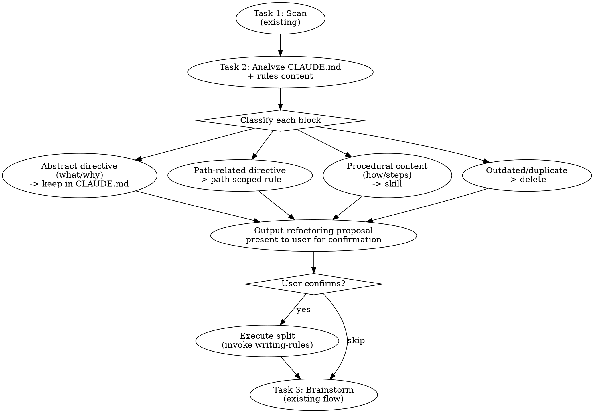
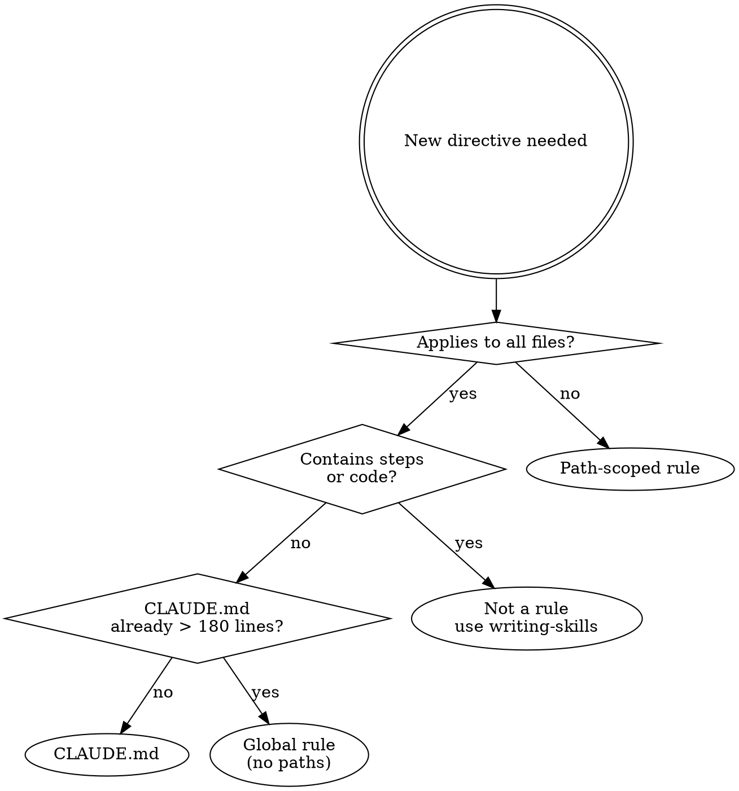

# Rules Refactoring Pipeline Design

Date: 2026-04-10

## Problem

rcc plugin 的 rules 處理有三個 gap：

1. **遷移時沒重構 rules** — CLAUDE.md 塞滿指令沒拆分
2. **rules 沒加 `paths:`** — 所有 rules 無條件載入，context 被塞滿
3. **CLAUDE.md + rules 總行數失控** — 沒有工具計算總量或警告超標

## Core Philosophy

**CLAUDE.md + rules = 指揮官命令（what/why），skills = 作戰手冊（how）。**

超過一句話能說完的流程就不該在 rules 裡。rules 和 CLAUDE.md 力保乾淨、抽象指揮的自然語言，pipeline 以流程圖呈現。

## Shared Rules (Cross-Stage)

| Rule | Threshold | Action |
|------|-----------|--------|
| CLAUDE.md line count | Single file > 200 lines | Warn, suggest split |
| Rules missing paths | No `paths:` frontmatter | Warn, unless explicitly global |
| Session-start total | CLAUDE.md + global rules > 300 lines | Warn, force review |
| Procedural content | rules/CLAUDE.md contains multi-step process, code blocks | Suggest extract to skill |

## Stage A: analyzing-agent-systems

### Category 8 (Constitution Stability) additions

- [ ] CLAUDE.md single file > 200 lines
- [ ] CLAUDE.md contains multi-step procedures (should be skill)
- [ ] CLAUDE.md contains code blocks as process instructions (should be flowchart or skill)

### Category 9 (Project Context Completeness) additions

- [ ] Count global rules (no `paths:`) and total lines
- [ ] CLAUDE.md + global rules total > 300 lines
- [ ] Rules contain procedural content (multi-step how-to should be skill)

### New Category 11: Rules Health

- [ ] Individual rule file > 50 lines
- [ ] Rule has no `paths:` but content clearly targets specific file types
- [ ] Rule overlaps with another rule
- [ ] Rule duplicates CLAUDE.md instructions
- [ ] Path-scoped rule glob matches zero files in project

### Output: Rules Health Summary

```
## Rules Health Summary
| Metric                          | Value | Status |
|---------------------------------|-------|--------|
| CLAUDE.md lines                 | 245   | >200   |
| Global rules count / lines      | 4/180 |        |
| Session-start total lines       | 425   | >300   |
| Path-scoped rules               | 3     | ok     |
| Rules with procedural content   | 2     |        |
| Dead glob patterns              | 1     |        |
```

## Stage B: migrating-agent-systems

New Task 2: Rules Refactoring Proposal, inserted between existing scan and brainstorming.

### Flow



### Refactoring Proposal Format

```
## Rules Refactoring Proposal

| # | Source | Summary | Category | Action | Target |
|---|--------|---------|----------|--------|--------|
| 1 | CLAUDE.md:15-22 | TypeScript naming | path-scoped | extract to rule | .claude/rules/typescript.md (paths: **/*.ts) |
| 2 | CLAUDE.md:30-55 | API deploy process | procedural | extract to skill | .claude/skills/deploying-api/ |
| 3 | CLAUDE.md:60-62 | Use Traditional Chinese | global cmd | keep in CLAUDE.md | - |
| 4 | rules/style.md | Duplicates CLAUDE.md:8 | dead | delete | - |
```

User confirms, then invoke `writing-rules` or `writing-skills` for each item.

## Stage C: writing-rules

### Task 1: New Decision Tree



### Task 3: Content Validation Checks

| Check | Fail condition | Action |
|-------|---------------|--------|
| Line count | > 50 lines | Must simplify or split |
| Procedural content | Contains numbered steps, multi-line code blocks | Extract to skill, rule keeps principle only |
| paths missing | Content clearly targets specific file types but no `paths:` | Must add |
| Load budget | Adding this rule pushes session-start total > 300 lines | Warn, suggest path-scoped |

### New Red Flags

- "This rule applies to everything" -- Really? Try adding paths
- "I need to explain the steps" -- That is a skill, not a rule
- "Let me add a code example" -- A rule is a directive, not a tutorial
- "50 lines is too short" -- 50 lines x N rules = massive token cost

## Stage E: rule-reviewer agent

### New Dimension 7: Load Cost Assessment

- Count rule lines
- If no `paths:`, count against session-start budget
- If total > 300 lines after adding this rule: Needs Fix

### New Dimension 8: Content Classification

- Rule contains only abstract directives (what/why): Pass
- Rule contains procedural content (numbered steps, code blocks as process): Needs Fix, suggest migrate to skill

### New Dimension 9: Glob Validity

- `paths:` glob matches files in project: count
- 0 matches = dead glob: Needs Fix
- Overly broad (e.g. `**/*`) = equivalent to no paths: Warning

### Output Format Addition

```
## Load Cost
- Rule lines: 12
- Has paths: Yes (src/**/*.ts)
- Matched files: 47
- Session-start budget impact: N/A (path-scoped)
- Rating: Pass

## Content Classification
- Abstract directives: 4/5 lines
- Procedural content: 1 block (lines 8-12) -> suggest extract to skill
- Rating: Needs Fix
```

## Implementation Order

1. analyzing-agent-systems -- add Category 11 + extend 8/9
2. rule-reviewer agent -- add dimensions 7/8/9
3. writing-rules -- add decision tree + content validation
4. migrating-agent-systems -- add Task 2 refactoring proposal

## Files to Modify

- `plugins/rcc/skills/analyzing-agent-systems/SKILL.md`
- `plugins/rcc/skills/analyzing-agent-systems/references/` (weakness checklist)
- `plugins/rcc/agents/rule-reviewer.md`
- `plugins/rcc/skills/writing-rules/SKILL.md`
- `plugins/rcc/skills/writing-rules/references/` (decision tree, examples)
- `plugins/rcc/skills/migrating-agent-systems/SKILL.md`
