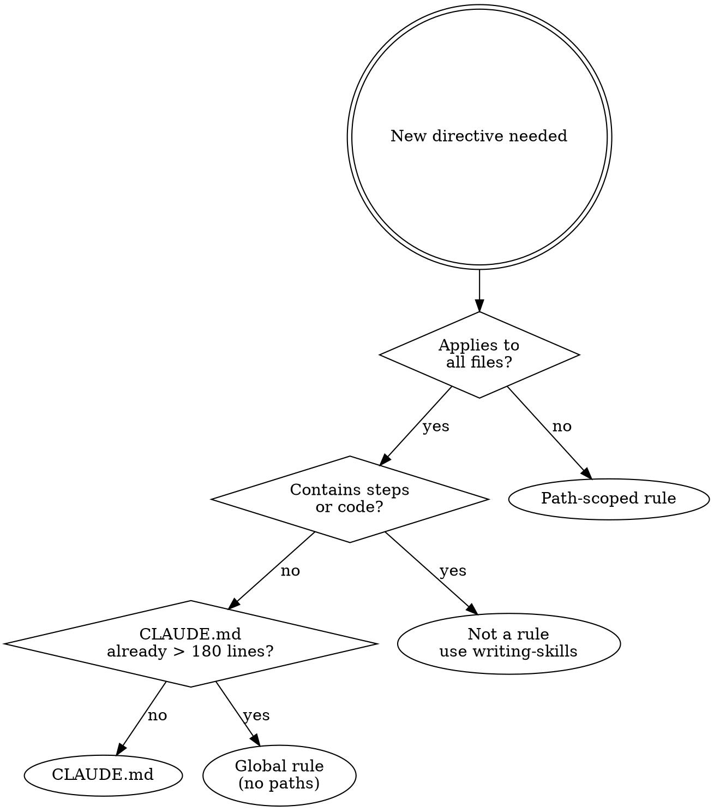
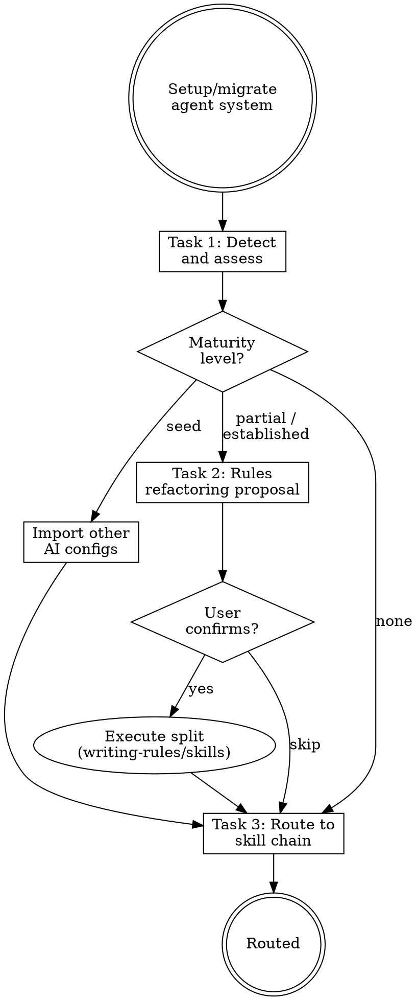

# Rules Refactoring Pipeline — Implementation Plan

> **For Claude:** REQUIRED SUB-SKILL: Use superpowers:executing-plans to implement this plan task-by-task.

**Goal:** Strengthen rules handling across 4 stages of the rcc pipeline: analyzing, rule-reviewer, writing-rules, migrating.

**Architecture:** Each task modifies one file. No new files created — all changes extend existing SKILL.md, agent .md, or reference .md files. Changes are additive (append sections, extend checklists).

**Tech Stack:** Markdown skill files, YAML frontmatter, dot flowcharts.

---

### Task 1: Extend weakness-checklist.md with Category 11

**Files:**
- Modify: `plugins/rcc/skills/analyzing-agent-systems/references/weakness-checklist.md:104-110`

**Step 1: Add Category 11 after Category 10**

Append after line 109 (end of Category 10):

```markdown

## 11. Rules Health

- [ ] Individual rule file > 50 lines (token cost scales with matches)
- [ ] Rule has no `paths:` but content clearly targets specific file types or directories
- [ ] Rule content overlaps with another rule (partial or full duplication)
- [ ] Rule duplicates instructions already in CLAUDE.md
- [ ] Path-scoped rule glob matches zero files in the project (dead glob)
- [ ] CLAUDE.md + global rules (no `paths:`) total exceeds 300 lines (session-start context overload)
- [ ] CLAUDE.md single file exceeds 200 lines (official recommended limit)
- [ ] Rule or CLAUDE.md contains multi-step procedures (should be a skill, not a directive)
- [ ] Rule or CLAUDE.md contains code blocks used as process instructions (should be flowchart or skill)
```

**Step 2: Verify**

Run: `grep -c "## 11" plugins/rcc/skills/analyzing-agent-systems/references/weakness-checklist.md`
Expected: 1

**Step 3: Commit**

```
git add plugins/rcc/skills/analyzing-agent-systems/references/weakness-checklist.md
git commit -m "feat(rcc): add Category 11 Rules Health to weakness checklist"
```

---

### Task 2: Extend analyzing-agent-systems SKILL.md

**Files:**
- Modify: `plugins/rcc/skills/analyzing-agent-systems/SKILL.md:12-13`
- Modify: `plugins/rcc/skills/analyzing-agent-systems/SKILL.md:82-84`

**Step 1: Update "10 weakness categories" to "11" in overview (line 12)**

Change:
```
Scan every component (CLAUDE.md, rules, hooks, skills, agents), check against 10 weakness categories, produce a severity-rated report.
```
To:
```
Scan every component (CLAUDE.md, rules, hooks, skills, agents), check against 11 weakness categories, produce a severity-rated report.
```

**Step 2: Update "10-category" reference in Task 2 (line 84)**

Change:
```
**CRITICAL:** Read [references/weakness-checklist.md](references/weakness-checklist.md) for the full checklist.
```
To:
```
**CRITICAL:** Read [references/weakness-checklist.md](references/weakness-checklist.md) for the full 11-category checklist.
```

**Step 3: Add Rules Health Summary to Task 3 (after line 113)**

Insert after the existing report reference line:

```markdown

**Rules Health Summary (include in report):**

```
## Rules Health Summary
| Metric                        | Value | Status |
|-------------------------------|-------|--------|
| CLAUDE.md lines               |       |        |
| Global rules count / lines    |       |        |
| Session-start total lines     |       |        |
| Path-scoped rules             |       |        |
| Rules with procedural content |       |        |
| Dead glob patterns            |       |        |
```

Thresholds: CLAUDE.md > 200 lines = WARNING. Session-start total > 300 = WARNING. Any dead glob = WARNING.
```

**Step 4: Verify file is valid markdown and line count reasonable**

Run: `wc -l plugins/rcc/skills/analyzing-agent-systems/SKILL.md`
Expected: ~190 lines (was 177)

**Step 5: Commit**

```
git add plugins/rcc/skills/analyzing-agent-systems/SKILL.md
git commit -m "feat(rcc): add Rules Health analysis to analyzing-agent-systems"
```

---

### Task 3: Extend report-template.md with Rules Health Summary

**Files:**
- Modify: `plugins/rcc/skills/analyzing-agent-systems/references/report-template.md:33-40`

**Step 1: Insert Rules Health Summary section before Summary**

Insert before the `## Summary` line (line 34):

```markdown
## Rules Health Summary

| Metric                        | Value | Status |
|-------------------------------|-------|--------|
| CLAUDE.md lines               |       |        |
| Global rules count / lines    |       |        |
| Session-start total lines     |       |        |
| Path-scoped rules             |       |        |
| Rules with procedural content |       |        |
| Dead glob patterns            |       |        |

Status values: `ok`, `>200` (CLAUDE.md lines), `>300` (session total), count for others.

```

**Step 2: Verify**

Run: `grep "Rules Health" plugins/rcc/skills/analyzing-agent-systems/references/report-template.md`
Expected: match

**Step 3: Commit**

```
git add plugins/rcc/skills/analyzing-agent-systems/references/report-template.md
git commit -m "feat(rcc): add Rules Health Summary to analysis report template"
```

---

### Task 4: Extend rule-reviewer.md with dimensions 7/8/9

**Files:**
- Modify: `plugins/rcc/agents/rule-reviewer.md`

**Step 1: Add three new review steps after step 6 (line 41)**

Insert after the "Assess Usefulness" section:

```markdown

7. **Assess Load Cost**
   - Count rule lines (body only, excluding frontmatter)
   - If no `paths:`, this rule loads every session — count against 300-line budget
   - Check CLAUDE.md + all global rules total; flag if adding this rule exceeds 300

8. **Classify Content**
   - Rule should contain only abstract directives (what/why)
   - Flag numbered steps, multi-line code blocks used as process instructions
   - Procedural content (how/steps) belongs in a skill, not a rule

9. **Validate Glob Coverage**
   - Run `Glob` tool with the rule's `paths:` patterns
   - 0 matches = dead glob (Needs Fix)
   - Overly broad patterns (`**/*`, `*`) = equivalent to no paths (Warning)
```

**Step 2: Add output sections after Priority Fixes in the output format (before line 89)**

Insert before the closing ``` of the output format:

```markdown

### Load Cost
- Rule lines: [N]
- Has paths: [Yes (patterns) / No (global)]
- Matched files: [N or N/A]
- Session-start budget impact: [N/A (path-scoped) / +N lines (now M/300 total)]
- Rating: [Pass / Needs Fix]

### Content Classification
- Abstract directives: [N/N lines]
- Procedural content: [None / N block(s) at lines X-Y — suggest extract to skill]
- Rating: [Pass / Needs Fix]
```

**Step 3: Add to Critical Rules DO section (after line 96)**

Add:
```markdown
- Count rule lines and check against session-start budget (300 lines max)
- Flag procedural content — rules are directives, not tutorials
- Verify glob patterns match at least one file in the project
```

**Step 4: Verify**

Run: `grep -c "Assess Load Cost\|Classify Content\|Validate Glob" plugins/rcc/agents/rule-reviewer.md`
Expected: 3

**Step 5: Commit**

```
git add plugins/rcc/agents/rule-reviewer.md
git commit -m "feat(rcc): add load cost, content classification, glob validity to rule-reviewer"
```

---

### Task 5: Extend writing-rules SKILL.md — Task 1 decision tree

**Files:**
- Modify: `plugins/rcc/skills/writing-rules/SKILL.md:61-80`

**Step 1: Replace the existing Task 1 decision tree (lines 72-78) with the new one**

Replace the existing decision block:
```
**Decision:**
```
Does it apply broadly to ALL project work?
├─ Yes → Put in CLAUDE.md (loaded every session)
└─ No → Is it scoped to specific file paths?
    ├─ Yes → RULE with paths: glob
    └─ No → Global rule (no paths:, but consider CLAUDE.md instead)
```
```

With:
```markdown
**Decision tree:**


```

**Step 2: Verify**

Run: `grep "digraph rule_decision" plugins/rcc/skills/writing-rules/SKILL.md`
Expected: 1 match

**Step 3: Commit**

```
git add plugins/rcc/skills/writing-rules/SKILL.md
git commit -m "feat(rcc): replace writing-rules Task 1 decision tree with flowchart"
```

---

### Task 6: Extend writing-rules SKILL.md — Task 3 content validation

**Files:**
- Modify: `plugins/rcc/skills/writing-rules/SKILL.md:172-176`

**Step 1: Replace the Task 3 verification checklist (lines 172-176) with extended version**

Replace:
```markdown
**Verification:**
- [ ] Has frontmatter with `paths:` (or intentionally global)
- [ ] < 50 lines
- [ ] Imperative language ("MUST", "NEVER")
- [ ] Not duplicating existing rules
```

With:
```markdown
**Content validation checks:**

| Check | Fail condition | Action |
|-------|---------------|--------|
| Line count | > 50 lines | Must simplify or split |
| Procedural content | Contains numbered steps, multi-line code blocks | Extract to skill, rule keeps principle only |
| paths missing | Content targets specific file types but no `paths:` | Must add |
| Load budget | Adding this rule pushes session-start total > 300 lines | Warn, suggest path-scoped |

**Verification:**
- [ ] Has frontmatter with `paths:` (or intentionally global with justification)
- [ ] < 50 lines
- [ ] Imperative language ("MUST", "NEVER")
- [ ] No procedural content (steps, code blocks as process)
- [ ] Not duplicating existing rules or CLAUDE.md
- [ ] Session-start total (CLAUDE.md + global rules) still under 300 lines
```

**Step 2: Verify**

Run: `grep "Load budget" plugins/rcc/skills/writing-rules/SKILL.md`
Expected: 1 match

**Step 3: Commit**

```
git add plugins/rcc/skills/writing-rules/SKILL.md
git commit -m "feat(rcc): add content validation checks to writing-rules Task 3"
```

---

### Task 7: Extend writing-rules SKILL.md — Red Flags

**Files:**
- Modify: `plugins/rcc/skills/writing-rules/SKILL.md:234-245`

**Step 1: Add new red flags after existing list (after line 243)**

Insert after `"One big rule is better than multiple small ones"`:

```markdown
- "This rule applies to everything" (really? try adding paths)
- "I need to explain the steps" (that is a skill, not a rule)
- "Let me add a code example" (a rule is a directive, not a tutorial)
```

**Step 2: Verify**

Run: `grep -c "STOP and reconsider" plugins/rcc/skills/writing-rules/SKILL.md`
Expected: 1 (unchanged, just more items in the list)

**Step 3: Commit**

```
git add plugins/rcc/skills/writing-rules/SKILL.md
git commit -m "feat(rcc): add content-type red flags to writing-rules"
```

---

### Task 8: Extend migrating-agent-systems SKILL.md — Task 2 refactoring proposal

**Files:**
- Modify: `plugins/rcc/skills/migrating-agent-systems/SKILL.md`

**Step 1: Change task count from 2 to 3 (line 35-38)**

Replace:
```markdown
**Tasks:**
1. Detect and assess existing agent system
2. Route to appropriate skill chain
```

With:
```markdown
**Tasks:**
1. Detect and assess existing agent system
2. Rules refactoring proposal
3. Route to appropriate skill chain
```

Update announce line accordingly:
```
Announce: "Created 3 tasks. Starting execution..."
```

**Step 2: Insert new Task 2 before the existing Task 2 (which becomes Task 3)**

Insert before line 83 (`## Task 2: Route to Appropriate Skill Chain`):

```markdown
## Task 2: Rules Refactoring Proposal

**Goal:** Analyze CLAUDE.md and rules content, propose splitting into appropriate locations.

**Skip condition:** If maturity is None or Seed, skip this task (no existing content to refactor).

**Process:**

1. Read all CLAUDE.md files and `.claude/rules/*.md`
2. For each content block, classify:

| Category | Criteria | Action |
|----------|----------|--------|
| Abstract directive (what/why) | Broad, applies to all work | Keep in CLAUDE.md |
| Path-related directive | Targets specific file types or directories | Extract to path-scoped rule |
| Procedural content (how/steps) | Multi-step process, code blocks as instructions | Extract to skill |
| Outdated/duplicate | Conflicts with or duplicates other content | Delete |

3. Produce refactoring proposal table:

```
## Rules Refactoring Proposal

| # | Source | Summary | Category | Action | Target |
|---|--------|---------|----------|--------|--------|
```

4. Present proposal to user for confirmation
5. If confirmed, invoke `writing-rules` or `writing-skills` for each item

**Verification:** User has confirmed or skipped the proposal.

```

**Step 3: Rename existing Task 2 to Task 3**

Change:
```
## Task 2: Route to Appropriate Skill Chain
```
To:
```
## Task 3: Route to Appropriate Skill Chain
```

**Step 4: Update the flowchart to include Task 2**

Replace the existing flowchart (lines 135-155) with:



**Step 5: Update Skill Chain Reference table (line 160-166)**

Replace:
```
| 0 | `analyzing-agent-systems` | Scan + 10-category weakness detection (if partial/established) |
```
With:
```
| 0 | `analyzing-agent-systems` | Scan + 11-category weakness detection (if partial/established) |
```

**Step 6: Verify**

Run: `grep -c "Task 2: Rules" plugins/rcc/skills/migrating-agent-systems/SKILL.md`
Expected: 1

Run: `grep -c "Task 3: Route" plugins/rcc/skills/migrating-agent-systems/SKILL.md`
Expected: 1

**Step 7: Commit**

```
git add plugins/rcc/skills/migrating-agent-systems/SKILL.md
git commit -m "feat(rcc): add rules refactoring proposal to migrating-agent-systems"
```

---

### Task 9: Version bump to 9.2.0

**Files:**
- Modify: `plugins/rcc/.claude-plugin/plugin.json` (version)
- Modify: `.claude-plugin/marketplace.json` (metadata.version + plugins[0].version)
- Modify: `README.md` (rcc version in header)
- Modify: `README.zh-TW.md` (rcc version in header)

**Step 1: Bump all 4 locations from 9.1.1 to 9.2.0**

plugin.json:
```json
"version": "9.2.0"
```

marketplace.json (2 places):
```json
"version": "9.2.0"
```

README.md:
```
### rcc (v9.2.0)
```

README.zh-TW.md:
```
### rcc (v9.2.0)
```

**Step 2: Verify**

Run: `grep -r "9.2.0" plugins/rcc/.claude-plugin/plugin.json .claude-plugin/marketplace.json README.md README.zh-TW.md | wc -l`
Expected: 4

**Step 3: Commit**

```
git add plugins/rcc/.claude-plugin/plugin.json .claude-plugin/marketplace.json README.md README.zh-TW.md
git commit -m "chore: bump rcc to v9.2.0 — rules refactoring pipeline"
```
