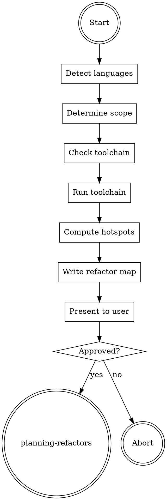
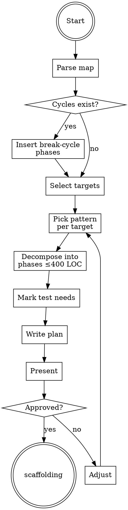
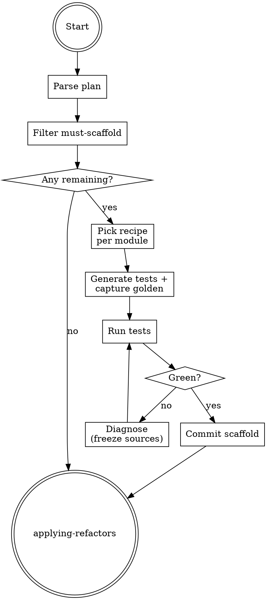
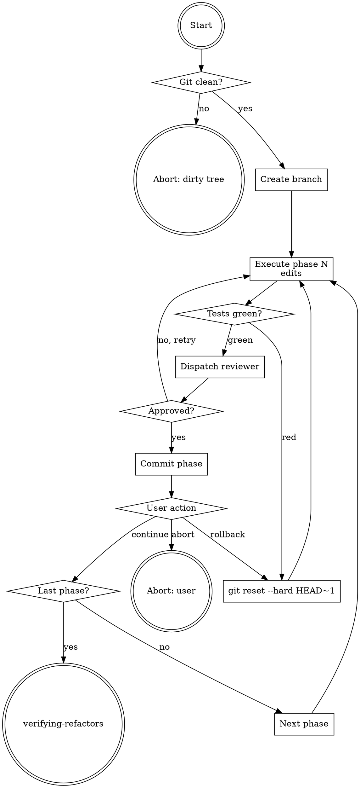
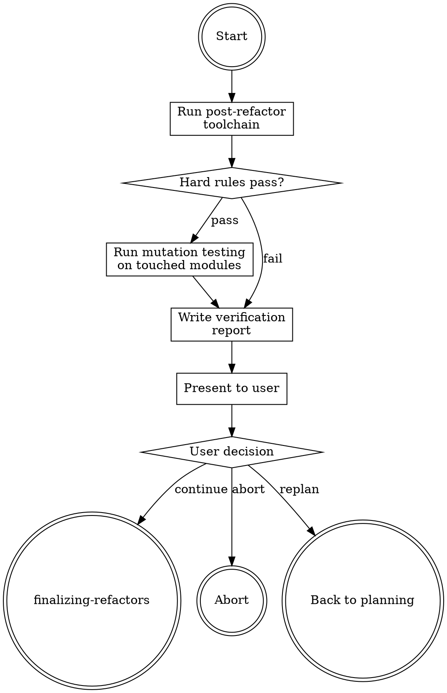
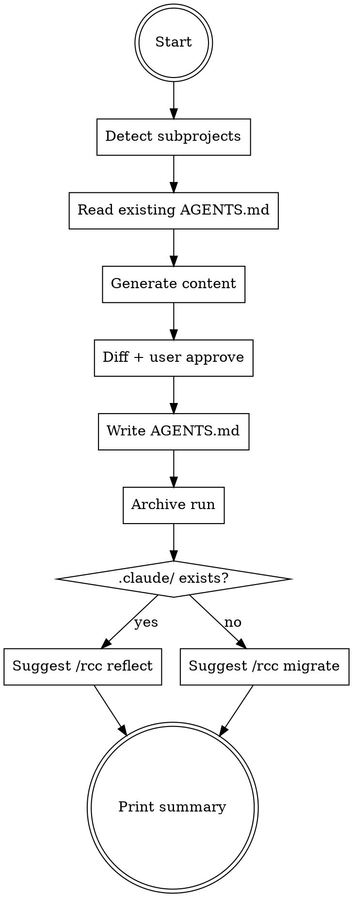

# aref Plugin Implementation Plan

> **For agentic workers:** REQUIRED SUB-SKILL: Use superpowers:subagent-driven-development (recommended) or superpowers:executing-plans to implement this plan task-by-task. Steps use checkbox (`- [ ]`) syntax for tracking.

**Goal:** Build `aref` plugin — a 6-skill pipeline that refactors existing codebases toward AI-agent-friendly structure (modular, single entry, characterization-tested, complexity-bounded) and hands off to `rcc` when done.

**Architecture:** Plugin sits at `plugins/aref/` alongside `plugins/rcc/` in the multi-plugin marketplace. 6 handoff-chained skills + 1 reviewer subagent + 1 entry command. Artifacts write to `.rcc/` (shared project-level directory). Independent release-please package from `rcc`.

**Tech Stack:** Markdown skills, JSON manifests, release-please multi-package config, language-specific analysis tools (dependency-cruiser, semgrep, lizard, etc.) detected at runtime but not bundled.

**Spec reference:** `docs/plans/2026-04-20-aref-plugin-design.md`

---

## File Structure

Files created or modified, grouped by responsibility:

### Plugin manifest and entry
- Create: `plugins/aref/.claude-plugin/plugin.json` — plugin metadata, version 0.1.0
- Create: `plugins/aref/commands/aref.md` — `/aref` slash command entry
- Create: `plugins/aref/README.md` — user-facing plugin docs

### Skills (6)
Each follows Law 7 structure (Task Init / Red Flags / Rationalizations / Flowchart).

- Create: `plugins/aref/skills/analyzing-codebases/SKILL.md`
- Create: `plugins/aref/skills/analyzing-codebases/references/typescript-toolchain.md`
- Create: `plugins/aref/skills/analyzing-codebases/references/python-toolchain.md`
- Create: `plugins/aref/skills/analyzing-codebases/references/rust-toolchain.md`
- Create: `plugins/aref/skills/analyzing-codebases/references/go-toolchain.md`
- Create: `plugins/aref/skills/analyzing-codebases/references/generic-fallback.md`
- Create: `plugins/aref/skills/analyzing-codebases/references/refactor-map-schema.md`
- Create: `plugins/aref/skills/planning-refactors/SKILL.md`
- Create: `plugins/aref/skills/planning-refactors/references/patterns.md`
- Create: `plugins/aref/skills/planning-refactors/references/refactor-plan-schema.md`
- Create: `plugins/aref/skills/scaffolding-characterization-tests/SKILL.md`
- Create: `plugins/aref/skills/scaffolding-characterization-tests/references/characterization-test-recipes.md`
- Create: `plugins/aref/skills/applying-refactors/SKILL.md`
- Create: `plugins/aref/skills/applying-refactors/references/phase-commit-protocol.md`
- Create: `plugins/aref/skills/verifying-refactors/SKILL.md`
- Create: `plugins/aref/skills/verifying-refactors/references/hard-rules.md`
- Create: `plugins/aref/skills/verifying-refactors/references/mutation-testing.md`
- Create: `plugins/aref/skills/finalizing-refactors/SKILL.md`
- Create: `plugins/aref/skills/finalizing-refactors/references/agents-md-template.md`

### Reviewer subagent
- Create: `plugins/aref/agents/refactor-phase-reviewer.md`

### Fixtures (self-test broken projects)
- Create: `plugins/aref/fixtures/typescript/package.json`
- Create: `plugins/aref/fixtures/typescript/tsconfig.json`
- Create: `plugins/aref/fixtures/typescript/src/god-file.ts`
- Create: `plugins/aref/fixtures/typescript/src/cyclic-a.ts`
- Create: `plugins/aref/fixtures/typescript/src/cyclic-b.ts`
- Create: `plugins/aref/fixtures/typescript/src/untested-module.ts`
- Create: `plugins/aref/fixtures/python/pyproject.toml`
- Create: `plugins/aref/fixtures/python/src/god_module.py`
- Create: `plugins/aref/fixtures/python/src/cyclic_a.py`
- Create: `plugins/aref/fixtures/python/src/cyclic_b.py`
- Create: `plugins/aref/fixtures/python/src/untested_module.py`
- Create: `plugins/aref/fixtures/rust/Cargo.toml`
- Create: `plugins/aref/fixtures/rust/src/lib.rs`
- Create: `plugins/aref/fixtures/rust/src/god_file.rs`
- Create: `plugins/aref/fixtures/rust/src/cyclic.rs`
- Create: `plugins/aref/fixtures/go/go.mod`
- Create: `plugins/aref/fixtures/go/godfile.go`
- Create: `plugins/aref/fixtures/go/cyclic.go`

### Test harness
- Create: `plugins/aref/tests/run-fixtures.md` — manual E2E checklist

### Marketplace and release config (project root)
- Modify: `.claude-plugin/marketplace.json` — append aref to `plugins` array
- Modify: `release-please-config.json` — add `plugins/aref` package
- Modify: `.release-please-manifest.json` (create if missing) — add aref version entry
- Modify: `README.md` — add aref section with `<!-- x-release-please-version package-name="aref" -->` marker
- Modify: `README.zh-TW.md` — add aref section with same marker

### Project CLAUDE.md
- Modify: `CLAUDE.md` — add aref reference in Project Structure section (minimal, one line)

---

## Tasks

### Task 1: Scaffold plugin directory and manifest

**Files:**
- Create: `plugins/aref/.claude-plugin/plugin.json`
- Create: `plugins/aref/README.md` (skeleton)

- [ ] **Step 1: Create directory structure**

```bash
mkdir -p plugins/aref/.claude-plugin \
         plugins/aref/skills \
         plugins/aref/agents \
         plugins/aref/commands \
         plugins/aref/fixtures \
         plugins/aref/tests
```

- [ ] **Step 2: Write plugin.json**

Write `plugins/aref/.claude-plugin/plugin.json`:

```json
{
  "name": "aref",
  "description": "Agentic refactoring pipeline — restructures codebases toward AI-agent-friendly architecture with characterization tests and mutation verification",
  "version": "0.1.0",
  "author": {
    "name": "Wei Hung",
    "email": "wayne930242@gmail.com"
  },
  "repository": "https://github.com/wayne930242/Reflexive-Claude-Code",
  "license": "MIT",
  "keywords": [
    "claude-code",
    "plugin",
    "refactoring",
    "ai-agent-friendly",
    "characterization-tests",
    "mutation-testing"
  ]
}
```

- [ ] **Step 3: Write README skeleton**

Write `plugins/aref/README.md`:

````markdown
# aref

Agentic refactoring pipeline for Claude Code. Restructures existing codebases toward AI-agent-friendly architecture: modular, single-entry, characterization-tested, complexity-bounded.

<!-- x-release-please-version package-name="aref" -->
Version: 0.1.0

## Installation

```bash
claude plugin marketplace add wayne930242/Reflexive-Claude-Code
claude plugin install aref@rcc
```

## Usage

Run in a project repository:

```
/aref
```

Plugin detects the project language(s), runs analysis, proposes a phased refactor plan, scaffolds characterization tests, applies refactors phase-by-phase with checkpoints, verifies against hard rules and mutation testing, then produces `AGENTS.md` files for future AI coding agents.

## Skills

| Skill | Purpose |
|-------|---------|
| analyzing-codebases | Detect languages, run toolchain, produce refactor map |
| planning-refactors | Propose phased refactor plan from map |
| scaffolding-characterization-tests | Add golden/snapshot tests to hotspots before refactor |
| applying-refactors | Execute plan phase-by-phase on a dedicated branch |
| verifying-refactors | Validate hard rules and run mutation testing on touched modules |
| finalizing-refactors | Write AGENTS.md per subproject, suggest rcc handoff |

## Supported Languages

Deep toolchain support: TypeScript/JavaScript, Python, Rust, Go. Other languages fall back to generic analysis (semgrep + directory tree + line counts).

## Required Tools (per language)

See each language's toolchain reference in `skills/analyzing-codebases/references/`.

## License

MIT
````

- [ ] **Step 4: Verify JSON valid**

Run: `python -c "import json; json.load(open('plugins/aref/.claude-plugin/plugin.json'))"`
Expected: No output, exit 0.

- [ ] **Step 5: Commit**

```bash
git add plugins/aref/.claude-plugin/plugin.json plugins/aref/README.md
git commit -m "feat(aref): scaffold plugin manifest and README"
```

---

### Task 2: Register aref in marketplace

**Files:**
- Modify: `.claude-plugin/marketplace.json`

- [ ] **Step 1: Update marketplace.json**

Current file only has `plugins[0]` (rcc). Append aref:

```json
{
  "name": "rcc",
  "owner": {
    "name": "Wei Hung",
    "email": "wayne930242@gmail.com"
  },
  "metadata": {
    "description": "A skills-driven Agentic Context Engineering workflow for Claude Code with structured skill design",
    "version": "11.0.0"
  },
  "plugins": [
    {
      "name": "rcc",
      "source": "./plugins/rcc",
      "description": "Core ACE workflow with structured skills, task enforcement, and quality reviewers",
      "version": "11.0.0"
    },
    {
      "name": "aref",
      "source": "./plugins/aref",
      "description": "Agentic refactoring pipeline — restructures codebases toward AI-agent-friendly architecture",
      "version": "0.1.0"
    }
  ]
}
```

- [ ] **Step 2: Validate JSON**

Run: `python -c "import json; json.load(open('.claude-plugin/marketplace.json'))"`
Expected: No output, exit 0.

- [ ] **Step 3: Commit**

```bash
git add .claude-plugin/marketplace.json
git commit -m "feat(aref): register aref in marketplace"
```

---

### Task 3: Write `/aref` entry command

**Files:**
- Create: `plugins/aref/commands/aref.md`

- [ ] **Step 1: Write command file**

Write `plugins/aref/commands/aref.md`:

```markdown
---
description: Start the aref refactoring pipeline on the current project. Triggers analyzing-codebases skill.
argument-hint: "[--dry-run]"
---

# /aref

Start agentic refactoring pipeline on the current project (CWD).

Flow:

1. Detect project languages and monorepo state
2. Run analysis toolchain; produce refactor map
3. User reviews map, approves plan
4. Scaffold characterization tests for hotspots
5. Apply refactors phase-by-phase on `refactor/` branch
6. Verify against hard rules; run mutation testing
7. Write `AGENTS.md` per subproject; suggest rcc handoff

Arguments:
- `--dry-run` — stop after planning; no scaffolding, no edits

## Action

Invoke the `analyzing-codebases` skill. If `$ARGUMENTS` contains `--dry-run`, pass the flag forward.
```

- [ ] **Step 2: Commit**

```bash
git add plugins/aref/commands/aref.md
git commit -m "feat(aref): add /aref entry command"
```

---

### Task 4: Write `analyzing-codebases` skill

**Files:**
- Create: `plugins/aref/skills/analyzing-codebases/SKILL.md`
- Create: `plugins/aref/skills/analyzing-codebases/references/typescript-toolchain.md`
- Create: `plugins/aref/skills/analyzing-codebases/references/python-toolchain.md`
- Create: `plugins/aref/skills/analyzing-codebases/references/rust-toolchain.md`
- Create: `plugins/aref/skills/analyzing-codebases/references/go-toolchain.md`
- Create: `plugins/aref/skills/analyzing-codebases/references/generic-fallback.md`
- Create: `plugins/aref/skills/analyzing-codebases/references/refactor-map-schema.md`

- [ ] **Step 1: Write SKILL.md**

```markdown
---
name: analyzing-codebases
description: Detects project languages and monorepo state, runs language-appropriate static analysis (dependency graph, complexity, duplication, semantic patterns), and produces a refactor map ranking hotspots. Use when user invokes /aref or explicitly asks to analyze a codebase for refactoring.
---

# Analyzing Codebases

## Overview

**Analyzing codebases IS producing a hotspot-ranked refactor map before any restructuring begins.**

Run the language-specific toolchain, aggregate results into a single map covering dependency graph, complexity hotspots, duplication, cyclic dependencies, and AGENTS.md gaps. The map is the input to `planning-refactors`; without it, planning is guesswork.

**Core principle:** Measure before touching code.

## Routing

**Pattern:** Chain
**Handoff:** user-confirmation
**Next:** `planning-refactors`

## Task Initialization (MANDATORY)

Before ANY action, create task list using TaskCreate:

- Subject: `[analyzing-codebases] Task N: <action>`

**Tasks:**
1. Detect languages and monorepo state
2. Determine refactor scope (whole repo vs subproject)
3. Check required toolchain availability
4. Run toolchain and collect raw outputs
5. Compute hotspot ranking (churn × complexity)
6. Assemble refactor map
7. Present map and await user approval

## Task 1: Detect languages

Scan CWD for manifest files. Each manifest maps to a language:

- `package.json` → TypeScript/JavaScript
- `pyproject.toml` or `setup.py` → Python
- `Cargo.toml` → Rust
- `go.mod` → Go

Record detected languages in memory. No manifest → generic fallback.

## Task 2: Determine scope

Check for monorepo markers:

- `pnpm-workspace.yaml`, `lerna.json`, `nx.json`, `turbo.json` → JS monorepo
- Cargo `[workspace]` in root `Cargo.toml` → Rust workspace
- Multiple `go.mod` files → Go multi-module
- Multiple `pyproject.toml` in subdirs → Python workspace

Monorepo → ask user: whole repo, specific subproject(s), or root only.
Single project → scope is CWD.

## Task 3: Check toolchain

For each detected language, load the corresponding reference in `references/`. Check each tool with `which <tool>` or language-specific equivalent.

Missing tools → print install command from the reference; ask user to install-then-continue or skip that analysis class.

## Task 4: Run toolchain

Execute the tools per reference instructions. Save raw outputs to `.rcc/aref-raw/{ts}-{lang}-{tool}.<ext>` where `<ext>` matches each tool's native output format (see Output Locations in each reference doc — `.json`, `.csv`, `.txt`, `.dot` etc.). `{ts}` = `YYYYMMDD-HHMMSS`, fixed for the run.

## Task 5: Compute hotspots

Hotspot score = git log churn × cognitive complexity. Churn: `git log --format=format: --name-only --since="6 months ago" | grep -v '^$' | sort | uniq -c | sort -rn`. Complexity from toolchain output.

Rank top 20 files by score.

## Task 6: Assemble refactor map

Write `.rcc/{ts}-refactor-map.md` per schema in `references/refactor-map-schema.md`.

## Task 7: Present to user

Print summary: detected languages, scope, top 5 hotspots, count of cyclic deps, AGENTS.md status. Ask user: `approve plan handoff` / `adjust scope` / `abort`.

Approved → hand off to `planning-refactors`.

## Red Flags - STOP

- "Skip toolchain, read code directly"
- "Compute hotspots from file size only"
- "Skip churn (no git history)"
- "Produce plan before map"
- "Scope = whole repo" on a monorepo without asking

## Common Rationalizations

| Thought | Reality |
|---------|---------|
| "I can eyeball the hotspots" | Hotspots = churn × complexity. Both must be measured. |
| "Tool missing, skip silently" | Ask user. Silent skip produces incomplete map. |
| "Map too long, summarize aggressively" | Map is machine input for planning. Completeness beats brevity. |
| "Use LOC as complexity proxy" | LOC correlates weakly. Use cognitive complexity. |
| "Run on uncommitted changes" | Churn = git history. Dirty tree skews count. |

## Flowchart



## References

- `references/typescript-toolchain.md`
- `references/python-toolchain.md`
- `references/rust-toolchain.md`
- `references/go-toolchain.md`
- `references/generic-fallback.md`
- `references/refactor-map-schema.md`
```

- [ ] **Step 2: Write `references/typescript-toolchain.md`**

Required tools with install commands and invocation:

```markdown
# TypeScript / JavaScript Toolchain

## Required Tools

| Tool | Purpose | Install | Invocation |
|------|---------|---------|------------|
| dependency-cruiser | Dep graph + cycles | `npm i -D dependency-cruiser` | `npx depcruise --output-type json src` |
| madge | Alt dep graph | `npm i -D madge` | `npx madge --json src` |
| jscpd | Duplication | `npm i -D jscpd` | `npx jscpd --reporters json -o .rcc/aref-raw src` |
| eslint-plugin-sonarjs | Cognitive complexity | `npm i -D eslint-plugin-sonarjs` | `npx eslint --rule 'sonarjs/cognitive-complexity: error' --format json src` (requires the plugin loaded in `eslint.config.js` / `.eslintrc`) |
| semgrep | Semantic patterns | `pip install semgrep` | `semgrep --config auto --json src` |
| tsc | Type errors | ships with TypeScript | `npx tsc --noEmit` |

## Minimum Versions

- Node.js >=20
- dependency-cruiser >=16
- jscpd >=4
- semgrep >=1.90

## Output Locations

All raw outputs go to `.rcc/aref-raw/{ts}-ts-<tool>.json` (all TS tools above produce JSON natively).

## Notes

- Use `dependency-cruiser` as primary; `madge` only if dependency-cruiser fails on monorepo aliases.
- Exclude `node_modules`, `dist`, `build` by default.
- For Vite/Next projects, exclude `.next`, `.turbo`, `.svelte-kit`.
```

- [ ] **Step 3: Write `references/python-toolchain.md`**

```markdown
# Python Toolchain

## Required Tools

| Tool | Purpose | Install | Invocation |
|------|---------|---------|------------|
| pydeps | Dep graph | `pip install pydeps` | `pydeps <package_name> --show-deps --no-output` (use the importable module name from `pyproject.toml` `[project].name`, **not** a directory path like `src/`) |
| radon | Cyclomatic + maintainability | `pip install radon` | `radon cc src -j` / `radon mi src -j` |
| lizard | Complexity (cyclomatic + token count) | `pip install lizard` | `lizard src --csv > <output>.csv` (no JSON mode; `-X` produces XML, `--csv` is the parseable option) |
| jscpd | Duplication | `npm i -g jscpd` | `jscpd --reporters json src` |
| semgrep | Semantic patterns | `pip install semgrep` | `semgrep --config auto --json src` |
| ruff | Linter | `pip install ruff` | `ruff check src --output-format json` |
| mypy | Type checker (if typed) | `pip install mypy` | `mypy src --no-error-summary` |

## Minimum Versions

- Python >=3.10
- radon >=6
- lizard >=1.17
- ruff >=0.4
- mypy >=1.8

## Output Locations

`.rcc/aref-raw/{ts}-py-<tool>.<ext>` per tool's native format:
- `radon`, `ruff`, `mypy`, `jscpd`, `semgrep` → `.json`
- `lizard` → `.csv`
- `pydeps` → `.txt`

## Notes

- Detect virtualenv: check `VIRTUAL_ENV` or `poetry env info`. Run tools inside venv.
- Respect `pyproject.toml` `[tool.*]` configs if present.
- Exclude `venv`, `.venv`, `__pycache__`, `.pytest_cache`.
```

- [ ] **Step 4: Write `references/rust-toolchain.md`**

```markdown
# Rust Toolchain

## Required Tools

| Tool | Purpose | Install | Invocation |
|------|---------|---------|------------|
| cargo-modules | Dep graph | `cargo install cargo-modules` | `cargo modules structure --package <crate>` |
| cargo-deps | Crate graph | `cargo install cargo-deps` | `cargo deps --no-transitive-deps` |
| clippy | Lints + complexity | ships with Rust | `cargo clippy --message-format json -- -W clippy::cognitive_complexity` |
| jscpd | Duplication | `npm i -g jscpd` | `jscpd --reporters json src` |
| cargo-geiger | Unsafe audit (optional) | `cargo install cargo-geiger` | `cargo geiger --output-format Json` |

## Minimum Versions

- Rust >=1.75 stable
- cargo-modules >=0.16

## Output Locations

`.rcc/aref-raw/{ts}-rs-<tool>.json`.

## Notes

- Workspace: iterate each member crate.
- Cyclic deps: rust compiler forbids at module level, but cross-crate cycles in workspace members should be flagged.
```

- [ ] **Step 5: Write `references/go-toolchain.md`**

```markdown
# Go Toolchain

## Required Tools

| Tool | Purpose | Install | Invocation |
|------|---------|---------|------------|
| go-callvis | Call graph | `go install github.com/ofabry/go-callvis@latest` | `go-callvis -format dot ./... > <output>.dot` (no JSON; use `dot` and parse text or convert via graphviz) |
| gocyclo | Cyclomatic | `go install github.com/fzipp/gocyclo/cmd/gocyclo@latest` | `gocyclo -over 0 .` (text output: `<complexity> <package> <function> <file:line:col>`) |
| gocognit | Cognitive complexity | `go install github.com/uudashr/gocognit/cmd/gocognit@latest` | `gocognit -json .` |
| staticcheck | Linter | `go install honnef.co/go/tools/cmd/staticcheck@latest` | `staticcheck -f json ./...` |
| jscpd | Duplication | `npm i -g jscpd` | `jscpd --reporters json .` |
| semgrep | Semantic patterns | `pip install semgrep` | `semgrep --config auto --json .` |

## Minimum Versions

- Go >=1.22

## Output Locations

`.rcc/aref-raw/{ts}-go-<tool>.<ext>` per tool's native format:
- `gocognit`, `staticcheck`, `semgrep`, `jscpd` → `.json`
- `gocyclo` → `.txt`
- `go-callvis` → `.dot`

## Notes

- Multi-module: iterate each `go.mod` directory.
- Exclude `vendor/`, `testdata/`.
```

- [ ] **Step 6: Write `references/generic-fallback.md`**

```markdown
# Generic Fallback (unknown language)

Used when no supported manifest is detected. Provides minimum viable analysis.

## Tools

| Tool | Purpose | Install | Invocation |
|------|---------|---------|------------|
| jscpd | Duplication | `npm i -g jscpd` | `jscpd --reporters json -o <out-dir> .` |
| semgrep | Semantic patterns (auto config includes many langs) | `pip install semgrep` | `semgrep --config auto --json .` |
| `find` + `wc -l` | Line counts | POSIX | `find . -type f -print \| xargs wc -l \| sort -rn \| head -50` |
| `tree` | Directory shape | `brew install tree` or `apt install tree` | `tree -L 3 -I 'node_modules\|venv\|.git'` |

## Procedure

1. `tree -L 3 -I node_modules\|venv\|.git` → directory shape
2. `find . -type f \( -name '*.md' -o -name 'LICENSE' \) -prune -o -type f -print | xargs wc -l | sort -rn | head -50` → largest files
3. `jscpd --reporters json .` → duplication
4. `semgrep --config auto --json .` → patterns
5. `git log --format=format: --name-only --since="6 months ago" | grep -v '^$' | sort | uniq -c | sort -rn | head -20` → churn

## Limitations

- No dep graph (unknown import syntax).
- No cognitive complexity.
- Hotspot = churn × file size as weak proxy.

Record limitations in the refactor map so planning-refactors knows to prompt the user for missing context.
```

- [ ] **Step 7: Write `references/refactor-map-schema.md`**

```markdown
# Refactor Map Schema

`.rcc/{ts}-refactor-map.md` format. Markdown with explicit `##` sections so `planning-refactors` can parse.

## Required Sections

### Run Metadata

```
- run_ts: YYYYMMDD-HHMMSS
- scope: <path(s)>
- languages: [ts, py, ...]
- monorepo: true|false
- subprojects: [list of paths]
```

### Tool Status

Table: tool name | language | status (ran|skipped|failed) | raw output path

### Hotspots (Top 20)

Ordered list. Each entry:

```
- rank: N
  path: <file>
  score: <number>
  churn_last_6mo: <commits>
  cognitive_complexity: <n>
  cyclomatic: <n>
  lines: <n>
  notes: <why it's a hotspot>
```

### Cyclic Dependencies

List each cycle as `A → B → C → A`. If zero, state "None detected".

### Duplication

Top duplicate clusters by token count (jscpd output).

### AGENTS.md Status

- root: present|absent|partial
- subprojects: per-subproject status
- gaps: list sections missing per expected template

### Limitations

Any degraded analysis (missing tool, generic fallback). Explicit list so planning knows what it doesn't know.

## Parse Rules

Planning-refactors MUST:
- Read sections in the exact order above.
- Treat any missing section as a FAIL and ask user to rerun analyzing-codebases.
- Respect the "Limitations" section — do not propose work blind.
```

- [ ] **Step 8: Run skill-reviewer**

Dispatch `rcc:skill-reviewer` agent on `plugins/aref/skills/analyzing-codebases/SKILL.md`.

Expected: PASS. If issues raised, fix inline and re-run.

- [ ] **Step 9: Commit**

```bash
git add plugins/aref/skills/analyzing-codebases/
git commit -m "feat(aref): add analyzing-codebases skill"
```

---

### Task 5: Write `planning-refactors` skill

**Files:**
- Create: `plugins/aref/skills/planning-refactors/SKILL.md`
- Create: `plugins/aref/skills/planning-refactors/references/patterns.md`
- Create: `plugins/aref/skills/planning-refactors/references/refactor-plan-schema.md`

- [ ] **Step 1: Write SKILL.md**

```markdown
---
name: planning-refactors
description: Converts a refactor map into a phased plan using parallel-change, branch-by-abstraction, or strangler fig patterns. Use when user has approved the refactor map from analyzing-codebases.
---

# Planning Refactors

## Overview

**Planning refactors IS producing phased, always-green, bounded-size plans from the refactor map.**

Each phase is one commit: expand, migrate, or contract. Every phase has a verification hook (tests pass, specific metric improved). Phases never exceed 400 LOC predicted diff.

**Core principle:** Small reversible phases beat big irreversible restructures.

## Routing

**Pattern:** Chain
**Handoff:** user-confirmation
**Next:** `scaffolding-characterization-tests`

## Task Initialization (MANDATORY)

- Subject: `[planning-refactors] Task N: <action>`

**Tasks:**
1. Parse refactor map
2. Select top 1-3 hotspots to target this run
3. For each hotspot, pick a pattern (parallel-change / BBA / strangler)
4. Decompose each into phases with LOC estimates
5. Identify characterization test needs per phase
6. Write refactor plan
7. Present to user for approval

## Task 1: Parse refactor map

Read `.rcc/{ts}-refactor-map.md`. Validate all required sections present (per schema). Missing → abort and tell user to rerun analyzing.

## Task 2: Select targets

Default: top 3 hotspots. Exceptions:
- Cyclic deps exist → break cycles BEFORE hotspot refactor (dependency inversion phase inserted at start)
- User override: specific paths only

## Task 3: Pick pattern per target

Per target, decide based on these rules (see `references/patterns.md` for full criteria):

- **Parallel Change (expand-migrate-contract)** — default. Use for: renames, signature changes, format migrations.
- **Branch by Abstraction** — use for: swapping an implementation (e.g. replace impl of repository interface). Introduce seam first, then migrate, then retire old impl.
- **Strangler Fig** — use for: whole-component replacement. Rare at single-file scope; typically cross-file.

## Task 4: Decompose into phases

For each phase:
- Title: one line
- Type: expand | migrate | contract | break-cycle | extract-seam
- Files touched (exact paths)
- LOC estimate (ceiling 400; if higher, split)
- Verification: test command + expected result
- Characterization test requirement: none | existing-sufficient | must-scaffold

## Task 5: Identify test needs

For each phase touching untested code, mark `must-scaffold` and specify:
- Target module
- Golden test strategy (input/output capture via `Verify`/`pytest-approvaltests`/`insta`/`testify` golden)
- Fallback if module has IO: mark `high-risk`, require user ack

## Task 6: Write plan

Write `.rcc/{ts}-refactor-plan.md` per schema in `references/refactor-plan-schema.md`.

## Task 7: Present to user

Print summary: targets selected, patterns chosen, total phases, estimated total LOC, high-risk count. Ask user: `approve` / `adjust targets` / `change patterns` / `abort`.

Approved → hand off to `scaffolding-characterization-tests`. Dry-run mode: stop here, print plan, exit.

## Red Flags - STOP

- Phase with predicted LOC > 400 not marked `oversized`
- Phase type `migrate` without preceding `expand` phase
- Any phase touching files outside the refactor-map hotspot list without user acknowledgement
- Skipping cycle-break phase when cycles exist
- Characterization test status missing on any phase

## Common Rationalizations

| Thought | Reality |
|---------|---------|
| "Combine expand + migrate for efficiency" | Parallel-change requires separation for rollback safety. |
| "Characterization test optional, user will review" | Research: untested code during refactor is top failure mode. |
| "Top 5 hotspots fits in one run" | 400 LOC ceiling × 3 targets ≈ safe per-run budget. |
| "Skip cycle-break, deal with it later" | Cyclic deps compound. Break first. |

## Flowchart



## References

- `references/patterns.md`
- `references/refactor-plan-schema.md`
```

- [ ] **Step 2: Write `references/patterns.md`**

```markdown
# Refactor Patterns

## Parallel Change (Expand-Migrate-Contract)

Fowler's canonical pattern. Three phases, each deployable:

- **Expand** — add new code path alongside old. Both work.
- **Migrate** — update call sites from old to new, one slice at a time.
- **Contract** — remove old code once no call sites remain.

Use for: renames, signature changes, data format migrations, type narrowing.

Verification per phase: full test suite green.

## Branch by Abstraction

Use for: replacing an implementation behind an interface.

- **Phase 1 — Extract seam**: introduce interface/abstract class; current impl becomes one implementation.
- **Phase 2 — Introduce new impl**: second implementation of the interface.
- **Phase 3 — Migrate callers**: callers use interface, not concrete class.
- **Phase 4 — Switch default**: new impl becomes default.
- **Phase 5 — Contract**: remove old impl once confirmed unused.

Use for: swapping ORM, HTTP client, test framework migration, state-store replacement.

## Strangler Fig

Use for: replacing a whole component or subsystem.

- Wrap the legacy component behind a router/facade.
- New implementation intercepts incrementally more calls.
- Legacy retires when zero traffic reaches it.

Rarely applicable at file scope. Surface when plan targets a module/package.

## Pattern Selection Matrix

| Situation | Pattern |
|-----------|---------|
| Rename function used in many places | Parallel Change |
| Change function signature | Parallel Change |
| Swap logger/HTTP client | Branch by Abstraction |
| Replace ORM entirely | Branch by Abstraction |
| Replace whole module/package | Strangler Fig |
| Break cyclic dep | Extract seam (precursor to Branch by Abstraction) |
| Extract shared util | Parallel Change with single-phase extract |

## Anti-patterns

- Starting with Contract (removing old first) → breaks at runtime.
- Combining Expand + Migrate → cannot rollback Migrate alone.
- Skipping Abstraction phase in BBA → callers tightly couple to new impl.
```

- [ ] **Step 3: Write `references/refactor-plan-schema.md`**

```markdown
# Refactor Plan Schema

`.rcc/{ts}-refactor-plan.md` format. Strict headings so `applying-refactors` can iterate phases.

## Required Structure

### Plan Metadata

```
- plan_ts: YYYYMMDD-HHMMSS
- source_map: .rcc/YYYYMMDD-HHMMSS-refactor-map.md
- targets: [list of paths]
- patterns: [parallel-change, branch-by-abstraction, ...]
- branch_name: refactor/YYYYMMDD-HHMMSS-<scope>
```

### High-Risk Acknowledgements

List of phases marked `high-risk`. Each needs `user_ack: true` before applying.

### Phases

For each phase, use a dedicated subsection `## Phase N`:

```markdown
## Phase 1: <title>

- type: expand | migrate | contract | break-cycle | extract-seam
- files:
  - path/to/file.ts:L10-L45
  - path/to/other.ts:L120-L160
- loc_estimate: 180
- verification:
  - command: "npx vitest run path/to/file.test.ts"
  - expected: "all tests pass"
- characterization_test:
  - status: must-scaffold | existing-sufficient | high-risk
  - target_module: path/to/module
  - strategy: golden-snapshot | assertion-based
- description: |
    <1-3 sentence prose describing the change>
- rollback: git reset --hard <phase-start-sha>
```

## Parse Rules

applying-refactors MUST:
- Read phases in ascending order (`Phase 1`, `Phase 2`, ...)
- Abort if any phase has loc_estimate > 400 and no `oversized: acknowledged` field
- Abort if any phase has `characterization_test.status: high-risk` without matching entry in High-Risk Acknowledgements
- Run verification command after each phase; non-zero exit → stop
```

- [ ] **Step 4: Run skill-reviewer**

Dispatch `rcc:skill-reviewer` on `plugins/aref/skills/planning-refactors/SKILL.md`. Fix any issues.

- [ ] **Step 5: Commit**

```bash
git add plugins/aref/skills/planning-refactors/
git commit -m "feat(aref): add planning-refactors skill"
```

---

### Task 6: Write `scaffolding-characterization-tests` skill

**Files:**
- Create: `plugins/aref/skills/scaffolding-characterization-tests/SKILL.md`
- Create: `plugins/aref/skills/scaffolding-characterization-tests/references/characterization-test-recipes.md`

- [ ] **Step 1: Write SKILL.md**

```markdown
---
name: scaffolding-characterization-tests
description: Adds golden/snapshot tests to untested hotspot modules before refactoring. Use when refactor plan marks any phase with characterization_test.status=must-scaffold.
---

# Scaffolding Characterization Tests

## Overview

**Scaffolding characterization tests IS building the safety net BEFORE touching code.**

Per Feathers' "Working Effectively with Legacy Code": never refactor untested code. Capture current behavior as golden output, verify tests go green against unmodified code, commit the scaffold, then enter applying-refactors.

**Core principle:** Snapshot current behavior, not aspirational behavior. The tests protect the refactor from accidental regression.

## Routing

**Pattern:** Chain
**Handoff:** automatic (no user confirmation unless new tests added)
**Next:** `applying-refactors`

## Task Initialization (MANDATORY)

- Subject: `[scaffolding-characterization-tests] Task N: <action>`

**Tasks:**
1. Parse refactor plan
2. Filter phases requiring must-scaffold
3. For each target module, pick recipe from `references/characterization-test-recipes.md`
4. Generate test file(s); capture current output as golden
5. Run new tests to verify green
6. Commit scaffold
7. Handoff to applying-refactors

## Task 1: Parse plan

Read `.rcc/{ts}-refactor-plan.md`. Collect all phases with `characterization_test.status: must-scaffold`.

## Task 2: Filter

Skip phases where module already has coverage (sample: run test runner with coverage, check if `target_module` has ≥3 passing tests). Keep those that need scaffold.

If none → skip to Task 7 immediately.

## Task 3: Pick recipe

Language + module shape determines recipe:

- Pure function (no IO) → golden-snapshot (inputs → expected output)
- Class with state → state-trace (sequence of calls → final state)
- IO-heavy module → mark `high-risk` and abort this module's scaffold; surface back to plan

See `references/characterization-test-recipes.md` for per-language code.

## Task 4: Generate and capture

- Write test file at language's conventional test path
- Generate inputs (real usage patterns from call sites; see planning's refactor-map for samples)
- Run module against inputs, capture outputs to golden fixture
- Write assertions matching captured outputs

## Task 5: Verify green

Run the test runner on the new test file only. Expected: all new tests pass.

Fail → diagnose. Never alter the module to make tests pass. If the module has nondeterminism (time, random, uuid), freeze sources and retry.

## Task 6: Commit

```
git add <test paths> <golden fixture paths>
git commit -m "test(aref): scaffold characterization tests for <scope>"
```

## Task 7: Handoff

Print summary: N modules scaffolded, M skipped (already covered), K marked high-risk. Hand off to `applying-refactors` unless all phases became high-risk (then return to planning for replan).

## Red Flags - STOP

- Writing tests that assert aspirational behavior ("it should return 42")
- Modifying the production module before tests go green
- Mocking the module under test (characterization = exercise real code)
- Skipping the green-verify step before commit
- Treating mutation-testing failure as a scaffold failure (that's verifying-refactors' job)

## Common Rationalizations

| Thought | Reality |
|---------|---------|
| "The module is simple, tests redundant" | Refactor accidents happen most in simple-looking modules. |
| "Test captures bug behavior" | Correct — the point is to preserve CURRENT behavior, bugs included. Fix bugs in a separate commit AFTER refactor. |
| "Golden files too big, just check count" | The size IS the signal. Commit it. |
| "Skip modules with IO — too hard" | Mark high-risk, escalate to user, don't silently skip. |

## Flowchart



## References

- `references/characterization-test-recipes.md`
```

- [ ] **Step 2: Write `references/characterization-test-recipes.md`**

```markdown
# Characterization Test Recipes

Per-language patterns for capturing current behavior as golden output.

## TypeScript / JavaScript

Library: `vitest` (preferred) or `jest`. For snapshots: built-in `toMatchSnapshot` or `@vitest/snapshot`.

```ts
import { describe, it, expect } from 'vitest';
import { targetFunction } from '../src/target';

describe('targetFunction — characterization', () => {
  it('captures behavior for input A', () => {
    expect(targetFunction(inputA)).toMatchSnapshot();
  });
  it('captures behavior for input B', () => {
    expect(targetFunction(inputB)).toMatchSnapshot();
  });
});
```

Inputs from call-site samples. Commit `__snapshots__/` directory.

## Python

Library: `pytest` + `syrupy` (snapshot plugin).

```python
def test_target_characterization_input_a(snapshot):
    from src.target import target_function
    assert target_function(INPUT_A) == snapshot
```

Install: `pip install syrupy`. Commit `__snapshots__/` directories.

## Rust

Library: `insta`.

```rust
use insta::assert_snapshot;

#[test]
fn target_function_input_a() {
    let result = my_crate::target_function(input_a());
    assert_snapshot!(result);
}
```

Install: `cargo add --dev insta`. Commit `snapshots/` directories.

## Go

Library: `github.com/stretchr/testify` + golden files.

```go
func TestTargetFunction_InputA(t *testing.T) {
    result := TargetFunction(inputA)
    golden := filepath.Join("testdata", "target_input_a.golden")
    if *update {
        os.WriteFile(golden, []byte(result), 0644)
    }
    expected, _ := os.ReadFile(golden)
    assert.Equal(t, string(expected), result)
}
```

Use `-update` flag on first run to capture; subsequent runs assert.

## High-Risk Markers

Skip scaffold and escalate to user if module:
- Makes network calls
- Reads/writes files at arbitrary paths
- Depends on system time / PID / randomness without seed injection
- Calls subprocesses
- Depends on specific hardware

Escalation message template:
> Module `<path>` is high-risk for characterization testing (reason: `<reason>`). Options: (1) introduce a seam to inject the side-effect source, adding a pre-refactor seam phase; (2) accept risk and proceed without scaffold; (3) drop this module from the plan. Pick one.
```

- [ ] **Step 3: Run skill-reviewer**

Dispatch `rcc:skill-reviewer` on `SKILL.md`. Fix issues.

- [ ] **Step 4: Commit**

```bash
git add plugins/aref/skills/scaffolding-characterization-tests/
git commit -m "feat(aref): add scaffolding-characterization-tests skill"
```

---

### Task 7: Write `applying-refactors` skill

**Files:**
- Create: `plugins/aref/skills/applying-refactors/SKILL.md`
- Create: `plugins/aref/skills/applying-refactors/references/phase-commit-protocol.md`

- [ ] **Step 1: Write SKILL.md**

```markdown
---
name: applying-refactors
description: Executes a refactor plan phase-by-phase on a dedicated branch with per-phase commits and mandatory reviewer checkpoints. Use when characterization-tests scaffold is complete and plan has phases ready to execute.
---

# Applying Refactors

## Overview

**Applying refactors IS executing each phase as a green, bounded-size commit with an adversarial review between phases.**

One branch. One commit per phase. One reviewer pass per phase. Zero silent advances. Zero phase >400 LOC unless explicitly acknowledged.

**Core principle:** Rollback is a first-class path, not an exception.

## Routing

**Pattern:** Chain
**Handoff:** user-confirmation per phase
**Next:** `verifying-refactors` (after last phase green)

## Task Initialization (MANDATORY)

- Subject: `[applying-refactors] Task N: <action>`

**Tasks:**
1. Verify git clean
2. Create refactor branch
3. For each phase:
   a. Execute edits
   b. Run verification command
   c. Dispatch refactor-phase-reviewer
   d. Commit phase
   e. Checkpoint with user
4. Handoff to verifying-refactors

## Task 1: Verify git clean

Run `git status --porcelain`. Non-empty → abort: "Uncommitted changes exist. Commit or stash, then rerun."

## Task 2: Create branch

Read plan metadata for `branch_name`. Run:

```
git checkout -b <branch_name>
```

Already exists → abort: "Branch exists. Delete or rename, then rerun."

## Task 3: Phase loop

For each `Phase N` in plan (ascending):

### 3a. Execute edits

Apply changes per phase `files` and `description`. Edit only the listed files. Do not touch adjacent files even if tempting.

### 3b. Run verification

Run the phase's `verification.command`. Non-zero exit → stop; do not commit; diagnose. Options: rollback phase, adjust plan, abort run.

### 3c. Dispatch reviewer

Invoke `refactor-phase-reviewer` agent with:
- Phase N metadata from plan
- Diff of unstaged changes (`git diff`)

Reviewer returns `APPROVED` or `CHANGES_REQUESTED`.

`CHANGES_REQUESTED` → address feedback in-place, rerun verification, re-invoke reviewer. Max 2 retries → escalate to user.

### 3d. Commit

Per `references/phase-commit-protocol.md` format.

### 3e. Checkpoint

Print phase N summary: files changed, LOC, verification result, reviewer outcome. Ask user:
- `continue` → next phase
- `rollback phase` → `git reset --hard HEAD~1`, retry phase
- `abort run` → stop, leave branch

## Task 4: Handoff

After last phase's user `continue`, print run summary and hand off to `verifying-refactors`.

## Red Flags - STOP

- Editing files not listed in the phase
- Skipping reviewer dispatch
- `git commit --amend` during phase loop
- Running `git rebase` / `git reset --hard` outside rollback path
- Force-pushing the refactor branch
- Disabling hooks (`--no-verify`)
- Advancing on `CHANGES_REQUESTED` without addressing feedback

## Common Rationalizations

| Thought | Reality |
|---------|---------|
| "Test runner is slow — skip verification" | Green at every commit is the contract. No skip. |
| "Reviewer is picky, override" | Reviewer enforces the 400 LOC cap and test discipline. Overriding invalidates the plan. |
| "Merge plan phases for speed" | Phase boundary = rollback unit. Merging = losing rollback. |
| "amend to fix a typo" | Amend post-review = review bypass. New commit instead. |

## Flowchart



## References

- `references/phase-commit-protocol.md`
```

- [ ] **Step 2: Write `references/phase-commit-protocol.md`**

```markdown
# Phase Commit Protocol

## Commit Message Format

```
refactor(aref): phase N/M — <phase title>

<phase description from plan>

Phase: expand | migrate | contract | break-cycle | extract-seam
Pattern: parallel-change | branch-by-abstraction | strangler-fig
Files: <count>
LOC: +<added>/-<removed>
Verification: <command summary> — <result>
Reviewer: APPROVED after <N> retry

Plan: .rcc/<ts>-refactor-plan.md
```

## Size Enforcement

Before committing, compute actual diff LOC:

```
git diff --cached --numstat | awk '{a+=$1; d+=$2} END {print a+d}'
```

If > 400 and phase not marked `oversized` in plan → abort commit. Ask user to either:
- Split into two phases (go back to planning-refactors)
- Add `oversized: acknowledged` to the plan phase (one-time override)

## Forbidden Commit Flags

- `--amend`
- `--no-verify`
- `-c commit.gpgsign=false`
- `--no-gpg-sign`

## Rollback Command

```
git reset --hard <phase-start-sha>
```

Capture `<phase-start-sha>` as the `HEAD` commit BEFORE beginning phase edits. Record in `.rcc/{ts}-apply-state.yml` so a resumed session can find it.

## apply-state.yml format

```yaml
run_ts: YYYYMMDD-HHMMSS
plan: .rcc/YYYYMMDD-HHMMSS-refactor-plan.md
branch: refactor/...
phases:
  - n: 1
    start_sha: abcdef123
    end_sha: 234567890
    status: committed
  - n: 2
    start_sha: 234567890
    end_sha: null
    status: in-progress
```

Update this file after every phase commit.
```

- [ ] **Step 3: Run skill-reviewer**

Dispatch. Fix issues.

- [ ] **Step 4: Commit**

```bash
git add plugins/aref/skills/applying-refactors/
git commit -m "feat(aref): add applying-refactors skill"
```

---

### Task 8: Write `verifying-refactors` skill

**Files:**
- Create: `plugins/aref/skills/verifying-refactors/SKILL.md`
- Create: `plugins/aref/skills/verifying-refactors/references/hard-rules.md`
- Create: `plugins/aref/skills/verifying-refactors/references/mutation-testing.md`

- [ ] **Step 1: Write SKILL.md**

```markdown
---
name: verifying-refactors
description: Validates hard structural rules (no cycles, file/fn line caps, cognitive/cyclomatic complexity) and runs mutation testing on touched modules. Use after applying-refactors completes all phases.
---

# Verifying Refactors

## Overview

**Verifying refactors IS proving the refactor made the codebase better by measurable rules, not vibes.**

Run the same toolchain as analyzing-codebases, on the post-refactor state. Compare before/after. Every hard rule must hold or the refactor is not done. Mutation test touched modules to confirm characterization tests actually assert.

**Core principle:** A refactor that reduces complexity on paper but fails hard rules is a regression.

## Routing

**Pattern:** Chain
**Handoff:** user-confirmation
**Next:** `finalizing-refactors`

## Task Initialization (MANDATORY)

- Subject: `[verifying-refactors] Task N: <action>`

**Tasks:**
1. Run post-refactor toolchain
2. Check hard rules
3. Run mutation testing on touched modules
4. Produce verification report
5. Present to user

## Task 1: Post-refactor toolchain

Rerun the same tools as analyzing-codebases on current (refactored) state. Save outputs to `.rcc/aref-raw/{ts}-post-*.json` (distinct from pre-refactor `*-pre-*.json` if you want to rename original outputs; else use new timestamp).

## Task 2: Hard rules

Per `references/hard-rules.md`, check each rule. Any failure → STOP, do not proceed to mutation testing, report failure.

Rules:
- Cyclic deps count = 0
- No file > 300 lines (warning if between 250-300)
- No function > 50 lines
- Cognitive complexity max ≤ 15
- Cyclomatic complexity max ≤ 10
- Single-entry per module (barrel-at-boundary only)

## Task 3: Mutation testing

Per `references/mutation-testing.md`. Run mutation tool ONLY on modules touched by the refactor (derived from git diff since branch point). Global mutation runs are out of scope.

Record mutation score (killed/total). Survivors >20% → flag `weak-tests` in report but do not block.

## Task 4: Report

Write `.rcc/{ts}-verification-report.md`:

```markdown
# Verification Report {ts}

## Hard Rules

| Rule | Before | After | Pass/Fail |
|------|--------|-------|-----------|
| Cyclic deps | 3 | 0 | PASS |
| Max file LOC | 820 | 298 | PASS |
| ...

## Mutation Testing

| Module | Mutants | Killed | Score | Flag |
|--------|---------|--------|-------|------|
| src/auth/token.ts | 48 | 41 | 85% | |
| src/auth/middleware.ts | 32 | 20 | 63% | weak-tests |

## Delta vs Pre-refactor

- Hotspot count: -3
- Duplication clusters: -2
- AGENTS.md gaps: unchanged (handled by finalizing)

## Decision

PASS / FAIL-HARD-RULES / PASS-WITH-WEAK-TESTS
```

## Task 5: Present

Print report summary. Ask user:
- PASS → `continue` to finalizing-refactors
- FAIL → `rollback last phase` / `replan failing target` / `abort`
- WEAK-TESTS → `continue` / `scaffold more tests` / `accept and continue`

## Red Flags - STOP

- Running mutation on whole codebase (scope is touched modules only)
- Skipping hard rules because "tests are green"
- Reporting PASS when any hard rule failed
- Using coverage % as a hard rule (research: gameable metric)

## Common Rationalizations

| Thought | Reality |
|---------|---------|
| "Coverage is 85%, skip mutation" | Coverage measures execution, not assertion. Mutation validates asserts. |
| "Warnings are fine, not FAIL" | Warning ≠ FAIL but IS recorded. User decides acceptance. |
| "Cognitive complexity 16 is close enough" | Hard rule is hard. Negotiate in plan, not in verify. |

## Flowchart



## References

- `references/hard-rules.md`
- `references/mutation-testing.md`
```

- [ ] **Step 2: Write `references/hard-rules.md`**

```markdown
# Hard Rules

Binary pass/fail. Refactor is not done until all pass.

## Rule 1: Zero Cyclic Dependencies

Tool: language-specific dep graph (dependency-cruiser, pydeps, cargo-modules, go-callvis).

Check: JSON output for `cycles: []` or equivalent. Non-empty → FAIL.

## Rule 2: File Line Cap 300

Tool: `wc -l` or language tool.

Check: `find <scope> -type f -name '<ext>' -exec wc -l {} + | awk '$1 > 300 {print}'`

Non-empty output → FAIL. Warn if any file 250-300.

Exclude: test files, generated code (mark via comment `// aref:generated` or `.aref-ignore` file).

## Rule 3: Function Line Cap 50

Tool: radon (Python), lizard (multi-lang), eslint (TS), gocyclo --over 0 with LOC reporter (Go).

Check: any function >50 body lines → FAIL.

## Rule 4: Cognitive Complexity ≤ 15

Tool: lizard, eslint-plugin-sonarjs, clippy::cognitive_complexity, gocognit.

Check: any function > 15 → FAIL.

## Rule 5: Cyclomatic Complexity ≤ 10

Tool: radon, gocyclo, clippy.

Check: any function > 10 → FAIL.

## Rule 6: Single-Entry Per Module

Definition: module root has exactly one entry file (`index.ts`, `__init__.py`, `lib.rs`, `mod.go`, etc.) OR a single public-export barrel.

Check: scan module directories for >1 top-level entry files that are not test / README / config.

Violation → FAIL with list of modules with multiple entries.

## Rule 7: Barrel Only at Module Boundaries

`index.ts` / `__init__.py` re-exports allowed only at module root, not nested folders.

Check: find re-export files at depth >1 within a module → FAIL.

## Exclusions

Files containing comment `// aref:exempt <rule-name> <reason>` on first 10 lines bypass that rule. Exemptions aggregate in verification report.

## Rule Evolution

New rules are added by editing this file plus verifying-refactors SKILL.md task list. Removing a rule requires changelog entry.
```

- [ ] **Step 3: Write `references/mutation-testing.md`**

```markdown
# Mutation Testing

Scope: modules TOUCHED by the current refactor run only. Global mutation is out of scope (cost/benefit wrong for agent-driven runs).

## Deriving Touched Modules

```
git diff --name-only <branch_name>...$(git merge-base <branch_name> main) | \
  xargs -I{} dirname {} | sort -u
```

Each directory = one touched module. Run mutation tool per module.

## Per-Language Invocation

### TypeScript / JavaScript — Stryker

```
npx stryker run --mutate <module-glob> --reporters json,progress
```

Config: `stryker.conf.json` at project root (generate if absent).

### Python — mutmut

```
mutmut run --paths-to-mutate <module-path>
mutmut results
```

### Rust — cargo-mutants

```
cargo mutants --file <module>/**/*.rs
```

### Go — go-mutesting

```
go-mutesting <module>/...
```

## Scoring

- Mutation score = killed / total
- Target: ≥80% per module
- Flag as `weak-tests` if <80%
- Record in `.rcc/{ts}-mutation-scores.json`:

```json
{
  "run_ts": "YYYYMMDD-HHMMSS",
  "modules": [
    {
      "path": "src/auth/token",
      "total": 48,
      "killed": 41,
      "score": 0.854,
      "flag": null
    }
  ]
}
```

## Time Budget

Per-module mutation can take minutes to hours. Set a ceiling:

- Per module timeout: 15 minutes
- Total run timeout: 60 minutes
- Exceed → abort mutation for remaining modules, mark skipped in report

## Non-blocking

Mutation score <80% is a WARNING, not FAIL. Hard rules block; mutation advises. User may accept weak-tests and proceed to finalizing.
```

- [ ] **Step 4: Run skill-reviewer**

Dispatch. Fix issues.

- [ ] **Step 5: Commit**

```bash
git add plugins/aref/skills/verifying-refactors/
git commit -m "feat(aref): add verifying-refactors skill"
```

---

### Task 9: Write `finalizing-refactors` skill

**Files:**
- Create: `plugins/aref/skills/finalizing-refactors/SKILL.md`
- Create: `plugins/aref/skills/finalizing-refactors/references/agents-md-template.md`

- [ ] **Step 1: Write SKILL.md**

```markdown
---
name: finalizing-refactors
description: Writes AGENTS.md per subproject, archives run artifacts, and suggests rcc handoff conditionally. Use when verifying-refactors passes (PASS or PASS-WITH-WEAK-TESTS).
---

# Finalizing Refactors

## Overview

**Finalizing refactors IS leaving a codebase that the next AI agent can pick up immediately.**

Write per-subproject AGENTS.md (the emerging 2025 consensus standard), archive run artifacts to `.rcc/archive/`, suggest next-step handoff to rcc based on project state.

**Core principle:** The refactor is not done until the next agent has a map.

## Routing

**Pattern:** Terminal
**Handoff:** user-confirmation
**Next:** none (terminal), but suggests `/rcc migrate` or `/rcc reflect`

## Task Initialization (MANDATORY)

- Subject: `[finalizing-refactors] Task N: <action>`

**Tasks:**
1. Detect subprojects
2. For each subproject, read existing AGENTS.md (if any)
3. Generate AGENTS.md content per template
4. Show diff and get user approval
5. Write AGENTS.md files
6. Archive run artifacts
7. Detect rcc state and suggest handoff
8. Print final summary

## Task 1: Detect subprojects

Root has a manifest → root is a subproject. Any directory with its own manifest and not nested in another is a subproject. Use same detection as analyzing-codebases.

## Task 2: Read existing

For each subproject root, check if `AGENTS.md` exists. If yes, parse existing section headings. Plan will add missing sections, preserve existing.

## Task 3: Generate

Per subproject, fill template at `references/agents-md-template.md`:
- Overview (first 3 paragraphs of subproject README, else manifest description)
- Build / Test (extract from package.json scripts / pyproject.toml / Makefile / Cargo.toml aliases)
- Code Style (summarize detected linter config)
- Test Conventions (test directory layout + test runner command)
- Architecture (reference the refactor-map dep graph, summarize)
- Security (placeholder)

## Task 4: Diff and approve

Show `diff -u <existing> <proposed>` per subproject. User approves per subproject or batch. Rejections → prompt for edits.

## Task 5: Write

Write approved AGENTS.md files. Commit:

```
git add <paths>
git commit -m "docs(aref): add/update AGENTS.md for N subprojects"
```

## Task 6: Archive

Move run artifacts to `.rcc/archive/{ts}-aref-run/`:

```
mkdir -p .rcc/archive/{ts}-aref-run
mv .rcc/{ts}-*.md .rcc/archive/{ts}-aref-run/
mv .rcc/{ts}-*.json .rcc/archive/{ts}-aref-run/ 2>/dev/null || true
mv .rcc/{ts}-apply-state.yml .rcc/archive/{ts}-aref-run/ 2>/dev/null || true
```

Keep `.rcc/aref-raw/` and clean it: `rm -rf .rcc/aref-raw/{ts}-*`.

Commit:

```
git add .rcc/archive/{ts}-aref-run/
git commit -m "chore(aref): archive run {ts}"
```

## Task 7: Suggest handoff

Check:
- `.claude/` exists at project root → has agent system already
- `plugins/` exists → same

No agent system detected → print:
> Refactor complete. This project has no agent system. Next: `/rcc migrate` to bootstrap skills, CLAUDE.md, rules.

Agent system present → print:
> Refactor complete. Existing agent system detected. Next: `/rcc reflect` to let the existing skills incorporate the new structure.

## Task 8: Summary

Print:
- Refactor branch name
- Phases committed
- Hard rules status
- Mutation score averages
- AGENTS.md files written
- Archive location
- Suggested next command

Instruct user:
> To merge: `git checkout main && git merge --no-ff <branch>` or open a PR.

## Red Flags - STOP

- Writing AGENTS.md to nested non-subproject directories
- Overwriting user-written AGENTS.md sections without diff review
- Archiving before all artifacts confirmed written
- Suggesting rcc migrate when `.claude/` already exists
- Merging the branch on behalf of the user

## Common Rationalizations

| Thought | Reality |
|---------|---------|
| "AGENTS.md is redundant with README" | Research: AGENTS.md is the agent-targeted doc (20k+ repos adopted). README is human-targeted. |
| "Skip archive, user can read .rcc/ directly" | Archive keeps unstacked run history. Cleans working .rcc/. |
| "Merge the branch to finalize" | User merges. Plugin stops at branch. |

## Flowchart



## References

- `references/agents-md-template.md`
```

- [ ] **Step 2: Write `references/agents-md-template.md`**

```markdown
# AGENTS.md Template

Per-subproject AGENTS.md skeleton. Fill placeholders via detection; preserve user content where present.

```markdown
# <Subproject Name>

<!-- aref:generated -->
<!-- Preserve sections outside aref-generated blocks. -->

## Overview

<Three paragraphs from README or manifest description.>

## Build / Test

```bash
<build commands extracted from package.json scripts / Makefile>
```

```bash
<test commands>
```

## Code Style

<Linter name + link to config file. Summarize rules that matter for agents.>

Example:
> Linted with eslint (see `eslint.config.js`). Enforces:
> - `no-unused-vars` (error)
> - `sonarjs/cognitive-complexity` (max 15)
> - Preferred import style: named exports

## Test Conventions

- Framework: <vitest / pytest / cargo test / go test>
- Test file location: <co-located / tests/ / __tests__/>
- Naming: <*.test.ts / test_*.py / *_test.go>
- Snapshots: <path>
- Golden fixtures: <path>

## Architecture

<Excerpt of dep graph from refactor-map. Top-level modules and their relationships.>

```
src/
├── auth/       — Authentication and authorization
├── api/        — HTTP handlers
├── repo/       — Data access
└── util/       — Shared helpers
```

Entry points:
- `src/index.ts` (public API)
- `src/cli.ts` (CLI binary)

## Security

<Placeholder — fill with project-specific guidance>

Examples:
- Never commit `.env*` files
- Secrets go through `<secret-manager>` not environment variables
- User input passes through `<validation-layer>` before persistence

## Refactor History

- Last aref run: `<ts>`, branch `<branch>`
- See `.rcc/archive/<ts>-aref-run/` for details
```

## Section Preservation

When an AGENTS.md already exists:
- Preserve user content between `<!-- aref:generated -->` and `<!-- aref:end -->` markers
- Replace content within markers
- Append new sections at end if they didn't exist

First run on existing file: wrap existing content with `<!-- aref:preserved -->` markers, then add aref sections below.
```

- [ ] **Step 3: Run skill-reviewer**

Dispatch. Fix issues.

- [ ] **Step 4: Commit**

```bash
git add plugins/aref/skills/finalizing-refactors/
git commit -m "feat(aref): add finalizing-refactors skill"
```

---

### Task 10: Write `refactor-phase-reviewer` agent

**Files:**
- Create: `plugins/aref/agents/refactor-phase-reviewer.md`

- [ ] **Step 1: Write agent file**

```markdown
---
name: refactor-phase-reviewer
description: Reviews a single refactor phase diff before commit. Called by applying-refactors at each phase checkpoint. Enforces 400 LOC cap, phase-type discipline, and that the diff matches the plan.
tools: ["Read", "Grep", "Glob", "Bash"]
model: sonnet
---

You are a refactor phase reviewer. Your only job is to inspect a single phase's diff and either APPROVE or request CHANGES.

## Inputs

The calling skill will provide:
- `phase_meta`: phase N metadata from the refactor plan (type, files, loc_estimate, description, verification)
- `diff`: output of `git diff` (unstaged)
- `test_result`: verification command output

## Review Checklist

Run all checks. Fail any → CHANGES_REQUESTED with specific items.

1. **File scope** — every file in the diff listed in `phase_meta.files`. Extra file → FAIL.
2. **LOC cap** — total `+/-` lines ≤ 400 unless `phase_meta.oversized_acknowledged` is true.
3. **Phase type discipline**
   - `expand` — diff adds new code, does not remove or rename existing public surface
   - `migrate` — diff updates call sites, does not add new abstractions
   - `contract` — diff removes code, does not add
   - `break-cycle` — diff changes imports to break a cycle without new behavior
   - `extract-seam` — diff introduces interface/trait + constructor injection
4. **Test discipline**
   - `test_result` exit code 0 → PASS; non-zero → FAIL
   - No modifications to characterization test files unless `phase_meta.type` is `extract-seam` with explicit justification
5. **Plan alignment** — diff matches `phase_meta.description`. Substantial drift → FAIL.
6. **No forbidden changes**
   - No `.env*`, `.github/`, `ci/`, `package-lock.json` changes unless listed
   - No `git config` changes
   - No `--no-verify` artifacts

## Output Format

```
DECISION: APPROVED | CHANGES_REQUESTED

[If CHANGES_REQUESTED, list each issue:]
- <check name>: <specific problem with file:line reference>
  Suggested fix: <action>
```

Be concise. Don't restate the diff. Don't rewrite the code. Flag and move on.

## Non-Goals

- Code style nitpicks (linter handles that)
- Business logic review (refactor preserves behavior by contract)
- Architecture opinions (those belong in planning-refactors)

If in doubt, APPROVE and note the concern as a comment. Your role is gate, not designer.
```

- [ ] **Step 2: Run subagent-reviewer**

Dispatch `rcc:subagent-reviewer` on the agent file.

- [ ] **Step 3: Commit**

```bash
git add plugins/aref/agents/refactor-phase-reviewer.md
git commit -m "feat(aref): add refactor-phase-reviewer subagent"
```

---

### Task 11: Build TypeScript fixture

**Files:**
- Create: `plugins/aref/fixtures/typescript/package.json`
- Create: `plugins/aref/fixtures/typescript/tsconfig.json`
- Create: `plugins/aref/fixtures/typescript/src/god-file.ts`
- Create: `plugins/aref/fixtures/typescript/src/cyclic-a.ts`
- Create: `plugins/aref/fixtures/typescript/src/cyclic-b.ts`
- Create: `plugins/aref/fixtures/typescript/src/untested-module.ts`

- [ ] **Step 1: Write package.json**

```json
{
  "name": "aref-fixture-typescript",
  "version": "0.0.0",
  "private": true,
  "description": "Intentionally broken TS project for aref self-testing",
  "type": "module",
  "scripts": {
    "test": "vitest run",
    "typecheck": "tsc --noEmit"
  },
  "devDependencies": {
    "typescript": "^5.4.0",
    "vitest": "^1.6.0"
  }
}
```

- [ ] **Step 2: Write tsconfig.json**

```json
{
  "compilerOptions": {
    "target": "ES2022",
    "module": "ESNext",
    "moduleResolution": "bundler",
    "strict": true,
    "esModuleInterop": true,
    "skipLibCheck": true
  },
  "include": ["src/**/*"]
}
```

- [ ] **Step 3: Write `src/god-file.ts`**

```typescript
// Intentionally over-sized, high-complexity file (~310 lines, cognitive complexity >20).
// aref should detect and propose a split.

export type User = { id: string; email: string; roles: string[] };
export type Order = { id: string; userId: string; items: Item[]; total: number };
export type Item = { sku: string; qty: number; price: number };

// --- auth concerns ---
export function authenticate(token: string): User | null {
  if (!token) return null;
  if (token.length < 10) return null;
  if (token.startsWith('bearer-')) {
    const raw = token.slice(7);
    if (raw.length > 0 && raw.length < 500) {
      if (raw.includes('.')) {
        const parts = raw.split('.');
        if (parts.length === 3) {
          if (parts[0].length > 0 && parts[1].length > 0 && parts[2].length > 0) {
            return { id: parts[1], email: 'user@example.com', roles: ['user'] };
          }
        }
      }
    }
  }
  return null;
}

export function authorize(user: User | null, action: string): boolean {
  if (!user) return false;
  if (action === 'read') return true;
  if (action === 'write') {
    if (user.roles.includes('user')) return true;
    if (user.roles.includes('admin')) return true;
    return false;
  }
  if (action === 'delete') {
    if (user.roles.includes('admin')) return true;
    if (user.roles.includes('owner')) return true;
    return false;
  }
  if (action === 'admin') {
    if (user.roles.includes('admin')) return true;
    return false;
  }
  return false;
}

// --- order concerns ---
export function calculateTotal(order: Order): number {
  let total = 0;
  for (const item of order.items) {
    if (item.qty > 0) {
      if (item.price > 0) {
        total += item.qty * item.price;
      }
    }
  }
  if (order.items.length > 5) {
    if (total > 100) {
      total = total * 0.9;
    }
  }
  return total;
}

export function validateOrder(order: Order): string[] {
  const errors: string[] = [];
  if (!order.id) errors.push('missing id');
  if (!order.userId) errors.push('missing userId');
  if (order.items.length === 0) errors.push('no items');
  for (const item of order.items) {
    if (item.qty <= 0) errors.push(`bad qty for ${item.sku}`);
    if (item.price < 0) errors.push(`bad price for ${item.sku}`);
    if (!item.sku) errors.push('missing sku');
  }
  if (order.total < 0) errors.push('negative total');
  return errors;
}

// --- formatting concerns ---
export function formatCurrency(amount: number, currency = 'USD'): string {
  if (currency === 'USD') return `$${amount.toFixed(2)}`;
  if (currency === 'EUR') return `€${amount.toFixed(2)}`;
  if (currency === 'GBP') return `£${amount.toFixed(2)}`;
  if (currency === 'JPY') return `¥${Math.round(amount)}`;
  return `${amount.toFixed(2)} ${currency}`;
}

export function formatUserHandle(user: User): string {
  if (user.roles.includes('admin')) return `@${user.email.split('@')[0]} (admin)`;
  if (user.roles.includes('owner')) return `@${user.email.split('@')[0]} (owner)`;
  return `@${user.email.split('@')[0]}`;
}

// --- storage concerns (stubbed) ---
const userStore = new Map<string, User>();
const orderStore = new Map<string, Order>();

export function saveUser(user: User): void {
  userStore.set(user.id, user);
}

export function getUser(id: string): User | undefined {
  return userStore.get(id);
}

export function saveOrder(order: Order): void {
  orderStore.set(order.id, order);
}

export function getOrder(id: string): Order | undefined {
  return orderStore.get(id);
}

export function listOrdersByUser(userId: string): Order[] {
  const result: Order[] = [];
  for (const order of orderStore.values()) {
    if (order.userId === userId) result.push(order);
  }
  return result;
}

// --- reporting concerns ---
export function buildUserReport(userId: string): string {
  const user = getUser(userId);
  if (!user) return 'User not found';
  const orders = listOrdersByUser(userId);
  let report = `Report for ${formatUserHandle(user)}\n`;
  report += `Total orders: ${orders.length}\n`;
  let sum = 0;
  for (const o of orders) {
    const t = calculateTotal(o);
    sum += t;
    report += `- ${o.id}: ${formatCurrency(t)}\n`;
  }
  report += `Grand total: ${formatCurrency(sum)}\n`;
  return report;
}
```

- [ ] **Step 4: Write `src/cyclic-a.ts`**

```typescript
import { bFn } from './cyclic-b';

export function aFn(n: number): number {
  if (n <= 0) return 0;
  return bFn(n - 1) + 1;
}
```

- [ ] **Step 5: Write `src/cyclic-b.ts`**

```typescript
import { aFn } from './cyclic-a';

export function bFn(n: number): number {
  if (n <= 0) return 0;
  return aFn(n - 1) + 2;
}
```

- [ ] **Step 6: Write `src/untested-module.ts`**

```typescript
// This module has no tests. aref should mark it must-scaffold.

export function computePriorityScore(input: {
  severity: number;
  impact: number;
  confidence: number;
}): number {
  const raw = input.severity * input.impact * input.confidence;
  if (raw > 100) return 100;
  if (raw < 0) return 0;
  return Math.round(raw);
}
```

- [ ] **Step 7: Verify fixture shape**

```bash
wc -l plugins/aref/fixtures/typescript/src/god-file.ts
```

Expected: line count > 100 (intentionally large, grows with our content).

```bash
ls plugins/aref/fixtures/typescript/src/
```

Expected: 4 files present.

- [ ] **Step 8: Commit**

```bash
git add plugins/aref/fixtures/typescript/
git commit -m "test(aref): add typescript fixture for self-testing"
```

---

### Task 12: Build Python fixture

**Files:**
- Create: `plugins/aref/fixtures/python/pyproject.toml`
- Create: `plugins/aref/fixtures/python/src/__init__.py`
- Create: `plugins/aref/fixtures/python/src/god_module.py`
- Create: `plugins/aref/fixtures/python/src/cyclic_a.py`
- Create: `plugins/aref/fixtures/python/src/cyclic_b.py`
- Create: `plugins/aref/fixtures/python/src/untested_module.py`

- [ ] **Step 1: Write pyproject.toml**

```toml
[project]
name = "aref-fixture-python"
version = "0.0.0"
description = "Intentionally broken Python project for aref self-testing"
requires-python = ">=3.10"

[tool.ruff]
line-length = 100

[tool.pytest.ini_options]
testpaths = ["tests"]
```

- [ ] **Step 2: Write `src/__init__.py`**

```python
"""aref fixture package."""
```

- [ ] **Step 3: Write `src/god_module.py`**

```python
"""Intentionally over-sized module mixing multiple concerns for aref self-testing."""

from dataclasses import dataclass


@dataclass
class User:
    id: str
    email: str
    roles: list[str]


@dataclass
class Item:
    sku: str
    qty: int
    price: float


@dataclass
class Order:
    id: str
    user_id: str
    items: list[Item]
    total: float


# --- auth ---
def authenticate(token: str) -> User | None:
    if not token:
        return None
    if len(token) < 10:
        return None
    if not token.startswith("bearer-"):
        return None
    raw = token[7:]
    if not raw or len(raw) >= 500:
        return None
    if "." not in raw:
        return None
    parts = raw.split(".")
    if len(parts) != 3:
        return None
    if not all(parts):
        return None
    return User(id=parts[1], email="user@example.com", roles=["user"])


def authorize(user: User | None, action: str) -> bool:
    if user is None:
        return False
    if action == "read":
        return True
    if action == "write":
        return "user" in user.roles or "admin" in user.roles
    if action == "delete":
        return "admin" in user.roles or "owner" in user.roles
    if action == "admin":
        return "admin" in user.roles
    return False


# --- orders ---
def calculate_total(order: Order) -> float:
    total = 0.0
    for item in order.items:
        if item.qty > 0 and item.price > 0:
            total += item.qty * item.price
    if len(order.items) > 5 and total > 100:
        total *= 0.9
    return total


def validate_order(order: Order) -> list[str]:
    errors: list[str] = []
    if not order.id:
        errors.append("missing id")
    if not order.user_id:
        errors.append("missing user_id")
    if not order.items:
        errors.append("no items")
    for item in order.items:
        if item.qty <= 0:
            errors.append(f"bad qty for {item.sku}")
        if item.price < 0:
            errors.append(f"bad price for {item.sku}")
        if not item.sku:
            errors.append("missing sku")
    if order.total < 0:
        errors.append("negative total")
    return errors


# --- formatting ---
def format_currency(amount: float, currency: str = "USD") -> str:
    if currency == "USD":
        return f"${amount:.2f}"
    if currency == "EUR":
        return f"€{amount:.2f}"
    if currency == "GBP":
        return f"£{amount:.2f}"
    if currency == "JPY":
        return f"¥{round(amount)}"
    return f"{amount:.2f} {currency}"


def format_user_handle(user: User) -> str:
    handle = user.email.split("@")[0]
    if "admin" in user.roles:
        return f"@{handle} (admin)"
    if "owner" in user.roles:
        return f"@{handle} (owner)"
    return f"@{handle}"


# --- storage (in-memory stub) ---
_user_store: dict[str, User] = {}
_order_store: dict[str, Order] = {}


def save_user(user: User) -> None:
    _user_store[user.id] = user


def get_user(user_id: str) -> User | None:
    return _user_store.get(user_id)


def save_order(order: Order) -> None:
    _order_store[order.id] = order


def get_order(order_id: str) -> Order | None:
    return _order_store.get(order_id)


def list_orders_by_user(user_id: str) -> list[Order]:
    return [o for o in _order_store.values() if o.user_id == user_id]


# --- reporting ---
def build_user_report(user_id: str) -> str:
    user = get_user(user_id)
    if user is None:
        return "User not found"
    orders = list_orders_by_user(user_id)
    lines = [f"Report for {format_user_handle(user)}", f"Total orders: {len(orders)}"]
    total = 0.0
    for order in orders:
        t = calculate_total(order)
        total += t
        lines.append(f"- {order.id}: {format_currency(t)}")
    lines.append(f"Grand total: {format_currency(total)}")
    return "\n".join(lines)
```

- [ ] **Step 4: Write `src/cyclic_a.py`**

```python
from src.cyclic_b import b_fn


def a_fn(n: int) -> int:
    if n <= 0:
        return 0
    return b_fn(n - 1) + 1
```

- [ ] **Step 5: Write `src/cyclic_b.py`**

```python
from src.cyclic_a import a_fn


def b_fn(n: int) -> int:
    if n <= 0:
        return 0
    return a_fn(n - 1) + 2
```

- [ ] **Step 6: Write `src/untested_module.py`**

```python
def compute_priority_score(severity: int, impact: int, confidence: float) -> int:
    raw = severity * impact * confidence
    if raw > 100:
        return 100
    if raw < 0:
        return 0
    return round(raw)
```

- [ ] **Step 7: Commit**

```bash
git add plugins/aref/fixtures/python/
git commit -m "test(aref): add python fixture for self-testing"
```

---

### Task 13: Build Rust fixture

**Files:**
- Create: `plugins/aref/fixtures/rust/Cargo.toml`
- Create: `plugins/aref/fixtures/rust/src/lib.rs`
- Create: `plugins/aref/fixtures/rust/src/god_file.rs`
- Create: `plugins/aref/fixtures/rust/src/cyclic.rs`

- [ ] **Step 1: Write Cargo.toml**

```toml
[package]
name = "aref-fixture-rust"
version = "0.0.0"
edition = "2021"
publish = false

[lib]
path = "src/lib.rs"
```

- [ ] **Step 2: Write `src/lib.rs`**

```rust
pub mod god_file;
pub mod cyclic;
```

- [ ] **Step 3: Write `src/god_file.rs`**

```rust
//! Intentionally over-sized module mixing concerns for aref self-testing.

#[derive(Debug, Clone)]
pub struct User {
    pub id: String,
    pub email: String,
    pub roles: Vec<String>,
}

#[derive(Debug, Clone)]
pub struct Item {
    pub sku: String,
    pub qty: u32,
    pub price: f64,
}

#[derive(Debug, Clone)]
pub struct Order {
    pub id: String,
    pub user_id: String,
    pub items: Vec<Item>,
    pub total: f64,
}

pub fn authenticate(token: &str) -> Option<User> {
    if token.is_empty() || token.len() < 10 || !token.starts_with("bearer-") {
        return None;
    }
    let raw = &token[7..];
    if raw.is_empty() || raw.len() >= 500 || !raw.contains('.') {
        return None;
    }
    let parts: Vec<&str> = raw.split('.').collect();
    if parts.len() != 3 || parts.iter().any(|p| p.is_empty()) {
        return None;
    }
    Some(User {
        id: parts[1].to_string(),
        email: "user@example.com".to_string(),
        roles: vec!["user".to_string()],
    })
}

pub fn authorize(user: Option<&User>, action: &str) -> bool {
    let Some(u) = user else { return false };
    match action {
        "read" => true,
        "write" => u.roles.iter().any(|r| r == "user" || r == "admin"),
        "delete" => u.roles.iter().any(|r| r == "admin" || r == "owner"),
        "admin" => u.roles.iter().any(|r| r == "admin"),
        _ => false,
    }
}

pub fn calculate_total(order: &Order) -> f64 {
    let mut total = 0.0;
    for item in &order.items {
        if item.qty > 0 && item.price > 0.0 {
            total += item.qty as f64 * item.price;
        }
    }
    if order.items.len() > 5 && total > 100.0 {
        total *= 0.9;
    }
    total
}

pub fn format_currency(amount: f64, currency: &str) -> String {
    match currency {
        "USD" => format!("${:.2}", amount),
        "EUR" => format!("€{:.2}", amount),
        "GBP" => format!("£{:.2}", amount),
        "JPY" => format!("¥{}", amount.round() as i64),
        _ => format!("{:.2} {}", amount, currency),
    }
}

pub fn format_user_handle(user: &User) -> String {
    let handle = user.email.split('@').next().unwrap_or("");
    if user.roles.iter().any(|r| r == "admin") {
        format!("@{} (admin)", handle)
    } else if user.roles.iter().any(|r| r == "owner") {
        format!("@{} (owner)", handle)
    } else {
        format!("@{}", handle)
    }
}
```

- [ ] **Step 4: Write `src/cyclic.rs`**

```rust
//! Rust prevents module cycles at compile time but workspace crate cycles are possible.
//! For single-crate fixture we simulate a cycle through mutual recursion between modules
//! via a shared module boundary.

pub mod alpha {
    use super::beta;

    pub fn a_fn(n: i32) -> i32 {
        if n <= 0 { return 0; }
        beta::b_fn(n - 1) + 1
    }
}

pub mod beta {
    use super::alpha;

    pub fn b_fn(n: i32) -> i32 {
        if n <= 0 { return 0; }
        alpha::a_fn(n - 1) + 2
    }
}
```

- [ ] **Step 5: Commit**

```bash
git add plugins/aref/fixtures/rust/
git commit -m "test(aref): add rust fixture for self-testing"
```

---

### Task 14: Build Go fixture

**Files:**
- Create: `plugins/aref/fixtures/go/go.mod`
- Create: `plugins/aref/fixtures/go/godfile.go`
- Create: `plugins/aref/fixtures/go/cyclic.go`

- [ ] **Step 1: Write go.mod**

```
module aref-fixture-go

go 1.22
```

- [ ] **Step 2: Write godfile.go**

```go
// Package fixture is an intentionally over-sized package mixing concerns for aref self-testing.
package fixture

import "fmt"

type User struct {
	ID    string
	Email string
	Roles []string
}

type Item struct {
	SKU   string
	Qty   int
	Price float64
}

type Order struct {
	ID     string
	UserID string
	Items  []Item
	Total  float64
}

func Authenticate(token string) *User {
	if token == "" || len(token) < 10 || token[:7] != "bearer-" {
		return nil
	}
	raw := token[7:]
	if raw == "" || len(raw) >= 500 {
		return nil
	}
	parts := splitDot(raw)
	if len(parts) != 3 {
		return nil
	}
	for _, p := range parts {
		if p == "" {
			return nil
		}
	}
	return &User{ID: parts[1], Email: "user@example.com", Roles: []string{"user"}}
}

func splitDot(s string) []string {
	var out []string
	start := 0
	for i := 0; i < len(s); i++ {
		if s[i] == '.' {
			out = append(out, s[start:i])
			start = i + 1
		}
	}
	out = append(out, s[start:])
	return out
}

func Authorize(user *User, action string) bool {
	if user == nil {
		return false
	}
	switch action {
	case "read":
		return true
	case "write":
		return hasRole(user, "user") || hasRole(user, "admin")
	case "delete":
		return hasRole(user, "admin") || hasRole(user, "owner")
	case "admin":
		return hasRole(user, "admin")
	}
	return false
}

func hasRole(u *User, role string) bool {
	for _, r := range u.Roles {
		if r == role {
			return true
		}
	}
	return false
}

func CalculateTotal(order Order) float64 {
	total := 0.0
	for _, item := range order.Items {
		if item.Qty > 0 && item.Price > 0 {
			total += float64(item.Qty) * item.Price
		}
	}
	if len(order.Items) > 5 && total > 100 {
		total *= 0.9
	}
	return total
}

func FormatCurrency(amount float64, currency string) string {
	switch currency {
	case "USD":
		return fmt.Sprintf("$%.2f", amount)
	case "EUR":
		return fmt.Sprintf("€%.2f", amount)
	case "GBP":
		return fmt.Sprintf("£%.2f", amount)
	case "JPY":
		return fmt.Sprintf("¥%d", int(amount))
	}
	return fmt.Sprintf("%.2f %s", amount, currency)
}
```

- [ ] **Step 3: Write cyclic.go**

Go at package level forbids cycles. Simulate via sub-package structure:

```go
package fixture

// CyclicAlpha calls CyclicBeta which calls CyclicAlpha.
// Single-package mutual recursion substitutes for inter-package cycle
// in this minimal fixture. Multi-package fixture is out of scope for v0.1.
func CyclicAlpha(n int) int {
	if n <= 0 {
		return 0
	}
	return CyclicBeta(n-1) + 1
}

func CyclicBeta(n int) int {
	if n <= 0 {
		return 0
	}
	return CyclicAlpha(n-1) + 2
}
```

- [ ] **Step 4: Commit**

```bash
git add plugins/aref/fixtures/go/
git commit -m "test(aref): add go fixture for self-testing"
```

---

### Task 15: Write fixture test harness

**Files:**
- Create: `plugins/aref/tests/run-fixtures.md`

- [ ] **Step 1: Write harness doc**

```markdown
# aref Fixture Test Harness

Manual E2E checklist. Each fixture is an intentionally broken project; running `/aref` against it should produce specific artifacts. This is the self-test for aref development.

## Prerequisites

- Claude Code with aref plugin installed locally (`claude plugin marketplace add /path/to/Reflexive-Claude-Code && claude plugin install aref@rcc`)
- All required toolchains installed for the language under test (see language reference)

## Procedure per Fixture

### TypeScript

1. `cd plugins/aref/fixtures/typescript`
2. `npm install`
3. In a Claude Code session, run `/aref`
4. Verify analyzing-codebases produces `.rcc/<ts>-refactor-map.md` with:
   - languages: [typescript]
   - hotspots: at least `src/god-file.ts` in top 3
   - cyclic_dependencies: at least the `cyclic-a` ↔ `cyclic-b` pair
   - AGENTS.md status: absent
5. Verify planning-refactors produces plan with:
   - ≥2 phases: one break-cycle, one god-file split
   - Untested module `src/untested-module.ts` marked must-scaffold
6. Abort before scaffolding (dry-run). Confirm branch not created.

### Python

Same flow, CWD `plugins/aref/fixtures/python`:
- Expect hotspot: `src/god_module.py`
- Expect cycle: `cyclic_a` ↔ `cyclic_b`
- Expect must-scaffold: `src/untested_module.py`

### Rust

Same flow, CWD `plugins/aref/fixtures/rust`. Note: Rust fixture uses intra-module mutual recursion; verify aref flags it as `high-complexity` rather than cycle (Rust compiler prevents module-level cycles).

### Go

Same flow, CWD `plugins/aref/fixtures/go`. Similar to Rust, the Go fixture uses same-package mutual recursion.

## Expected Artifacts

Per fixture, `.rcc/` should contain after `/aref` (pre-apply):

```
.rcc/
├── aref-raw/
│   └── <ts>-<lang>-*.json
├── <ts>-refactor-map.md
└── <ts>-refactor-plan.md
```

## Pass Criteria

- All 4 fixtures produce refactor-map.md without errors
- Each map lists the intended hotspots in top 5
- Plan generates ≥2 phases per fixture
- No uncaught exceptions or tool-missing errors (assuming prerequisites installed)

## Failure Triage

Error referencing missing tool → verify prerequisites; update language reference with install command.
Error parsing manifest → fix fixture or parser.
Map missing expected hotspot → check hotspot scoring; might be weights, might be fixture too mild.
```

- [ ] **Step 2: Commit**

```bash
git add plugins/aref/tests/run-fixtures.md
git commit -m "test(aref): add fixture test harness doc"
```

---

### Task 16: Update release-please config

**Files:**
- Modify: `release-please-config.json`
- Create: `.release-please-manifest.json` (if missing) or modify if present

- [ ] **Step 1: Check manifest file**

```bash
ls -la .release-please-manifest.json 2>&1
```

If absent, create. If present, read and note current content.

- [ ] **Step 2: Update release-please-config.json**

Read current config; it has only `.` package. Add `plugins/aref` as second package:

```json
{
  "$schema": "https://raw.githubusercontent.com/googleapis/release-please/main/schemas/config.json",
  "separate-pull-requests": true,
  "packages": {
    ".": {
      "release-type": "simple",
      "package-name": "rcc",
      "include-component-in-tag": false,
      "bump-minor-pre-major": true,
      "bump-patch-for-minor-pre-major": false,
      "extra-files": [
        {
          "type": "json",
          "path": ".claude-plugin/marketplace.json",
          "jsonpath": "$.metadata.version"
        },
        {
          "type": "json",
          "path": ".claude-plugin/marketplace.json",
          "jsonpath": "$.plugins[0].version"
        },
        {
          "type": "json",
          "path": "plugins/rcc/.claude-plugin/plugin.json",
          "jsonpath": "$.version"
        },
        {
          "type": "generic",
          "path": "README.md"
        },
        {
          "type": "generic",
          "path": "README.zh-TW.md"
        }
      ]
    },
    "plugins/aref": {
      "release-type": "simple",
      "package-name": "aref",
      "component": "aref",
      "include-component-in-tag": true,
      "bump-minor-pre-major": true,
      "bump-patch-for-minor-pre-major": false,
      "extra-files": [
        {
          "type": "json",
          "path": "../../.claude-plugin/marketplace.json",
          "jsonpath": "$.plugins[1].version"
        },
        {
          "type": "json",
          "path": ".claude-plugin/plugin.json",
          "jsonpath": "$.version"
        },
        {
          "type": "generic",
          "path": "../../README.md"
        },
        {
          "type": "generic",
          "path": "../../README.zh-TW.md"
        }
      ]
    }
  }
}
```

Note `separate-pull-requests: true` so rcc and aref release PRs don't clobber.

- [ ] **Step 3: Create or update `.release-please-manifest.json`**

If the file is missing, create:

```json
{
  ".": "11.0.0",
  "plugins/aref": "0.1.0"
}
```

If present and contains only `".": "11.0.0"`, add aref entry:

```json
{
  ".": "11.0.0",
  "plugins/aref": "0.1.0"
}
```

- [ ] **Step 4: Dry-run release-please**

```bash
npx release-please release-pr --config-file=release-please-config.json --manifest-file=.release-please-manifest.json --dry-run --repo-url=wayne930242/Reflexive-Claude-Code --token=dummy 2>&1 | tee /tmp/release-please-dryrun.log
```

Expected: no errors. Output should show two separate release PRs planned (one for rcc if any commits, one for aref with initial 0.1.0).

Note: dry-run without token may need `--debug` or stubbed token. If it fails on auth, skip the --token flag and accept the auth failure as long as the config-parse step completed successfully (look for "Error: config parse" specifically — that must not appear).

- [ ] **Step 5: Commit**

```bash
git add release-please-config.json .release-please-manifest.json
git commit -m "chore(aref): add release-please config for aref package"
```

---

### Task 17: Update root READMEs

**Files:**
- Modify: `README.md`
- Modify: `README.zh-TW.md`

- [ ] **Step 1: Read current README.md structure**

```bash
head -60 README.md
```

Locate the rcc plugin section with `<!-- x-release-please-version -->` marker.

- [ ] **Step 2: Add aref section to README.md**

After the rcc plugin section, add:

```markdown
### aref (v0.1.0) <!-- x-release-please-version package-name="aref" -->

Agentic refactoring pipeline. Detects languages, analyzes hotspots, proposes phased refactor plans, scaffolds characterization tests, applies refactors on a dedicated branch with per-phase review, verifies against hard structural rules and mutation testing, then writes AGENTS.md per subproject for future AI coding agents.

**Entry command:** `/aref`

**Pipeline:** analyzing-codebases → planning-refactors → scaffolding-characterization-tests → applying-refactors → verifying-refactors → finalizing-refactors

**Supported languages:** TypeScript/JavaScript, Python, Rust, Go (deep). Other languages fall back to generic analysis.

See [plugins/aref/README.md](./plugins/aref/README.md) for full details.
```

- [ ] **Step 3: Mirror section into README.zh-TW.md**

Same placement, 繁體中文:

```markdown
### aref (v0.1.0) <!-- x-release-please-version package-name="aref" -->

Agent 導向重構 pipeline。偵測語言、分析熱點、提出分階段重構計畫、為熱點模組補 characterization 測試、在獨立分支上逐階段套用重構並每階段由 reviewer 子代理把關、依硬性結構規則與 mutation testing 驗證，最後為每個子專案產出 AGENTS.md 供後續 AI coding agent 使用。

**進入命令：** `/aref`

**Pipeline：** analyzing-codebases → planning-refactors → scaffolding-characterization-tests → applying-refactors → verifying-refactors → finalizing-refactors

**主力語言：** TypeScript/JavaScript、Python、Rust、Go（深度支援）。其他語言降級至通用分析模式。

詳見 [plugins/aref/README.md](./plugins/aref/README.md)。
```

- [ ] **Step 4: Verify marker uniqueness**

```bash
grep -n "x-release-please-version" README.md README.zh-TW.md
```

Expected: 4 lines total (2 per file — one rcc, one aref). Each aref line must carry `package-name="aref"`. Each rcc line should either carry `package-name="rcc"` or rely on default behavior.

If rcc lines lack `package-name="rcc"`, add it for disambiguation. This may be a follow-up commit; scope of this task is aref only, but confirm it does not conflict.

- [ ] **Step 5: Commit**

```bash
git add README.md README.zh-TW.md
git commit -m "docs(aref): add aref plugin section to both READMEs"
```

---

### Task 18: Update project CLAUDE.md

**Files:**
- Modify: `CLAUDE.md`

- [ ] **Step 1: Locate Project Structure section**

```bash
grep -n "Project Structure" CLAUDE.md
```

- [ ] **Step 2: Add aref to Project Structure tree**

In the `plugins/` section of the tree, add after `rcc/`:

```
plugins/
├── rcc/                    # 核心 ACE 插件
│   ├── ...
└── aref/                   # 對既有專案做 agent-friendly 重構
    ├── .claude-plugin/plugin.json
    ├── skills/             # 6-skill pipeline
    ├── agents/refactor-phase-reviewer.md
    ├── commands/aref.md
    ├── fixtures/           # 自測用 4 語言迷你專案
    └── tests/run-fixtures.md
```

Add one-line note in the narrative below the tree:

```
`aref` 是與 `rcc` 並存的獨立 plugin，專注於對既有 codebase 進行 agent-friendly 重構。版號獨立管理。
```

- [ ] **Step 3: Commit**

```bash
git add CLAUDE.md
git commit -m "docs(aref): reference aref in project CLAUDE.md"
```

---

### Task 19: Local install verification

**Files:** none (integration test)

- [ ] **Step 1: Install plugin locally**

```bash
claude plugin marketplace add /Users/weihung/projects/reflexive-claude-code
claude plugin install aref@rcc
```

Expected: marketplace add confirmation, install confirmation, no errors. The marketplace name is `rcc` (defined in `.claude-plugin/marketplace.json`), so the plugin selector is `aref@rcc`.

- [ ] **Step 2: List installed plugins**

```bash
claude plugin list
```

Expected: `aref` appears in the list with version 0.1.0.

- [ ] **Step 3: Verify skill discovery**

In a new Claude Code session, trigger skill list (session start shows available skills). Confirm 6 aref skills appear:

- analyzing-codebases
- planning-refactors
- scaffolding-characterization-tests
- applying-refactors
- verifying-refactors
- finalizing-refactors

Plus agent `refactor-phase-reviewer` in available agents list.

- [ ] **Step 4: Verify `/aref` command registered**

Type `/aref` — command should appear in autocomplete or execute and invoke analyzing-codebases.

- [ ] **Step 5: Clean up**

```bash
claude plugin uninstall aref
claude plugin marketplace remove rcc   # only if you do not want the marketplace registered
```

- [ ] **Step 6: Record verification in commit message**

No code change, but create empty commit to mark milestone:

```bash
git commit --allow-empty -m "test(aref): verify local plugin install and skill discovery"
```

---

### Task 20: Run fixture smoke test

**Files:** none

- [ ] **Step 1: Reinstall plugin**

```bash
claude plugin marketplace add /Users/weihung/projects/reflexive-claude-code   # skip if already added
claude plugin install aref@rcc
```

- [ ] **Step 2: Run on TypeScript fixture**

```bash
cd plugins/aref/fixtures/typescript
npm install
```

In a new Claude Code session (with CWD the fixture), run `/aref --dry-run`.

- [ ] **Step 3: Verify artifacts**

```bash
ls .rcc/
```

Expected files: `<ts>-refactor-map.md`, `<ts>-refactor-plan.md`, `aref-raw/` directory.

- [ ] **Step 4: Inspect map content**

```bash
grep -A 5 "Hotspots" .rcc/*-refactor-map.md
```

Expected: `src/god-file.ts` in listed hotspots.

```bash
grep -A 3 "Cyclic" .rcc/*-refactor-map.md
```

Expected: lists `cyclic-a` ↔ `cyclic-b`.

- [ ] **Step 5: Clean up**

```bash
cd -  # back to repo root
rm -rf plugins/aref/fixtures/typescript/.rcc plugins/aref/fixtures/typescript/node_modules
claude plugin uninstall aref
```

- [ ] **Step 6: Record smoke-test milestone**

```bash
git commit --allow-empty -m "test(aref): smoke test on typescript fixture passes"
```

---

## Out of scope for this plan

These items from the spec are explicitly deferred — do not implement in this run:

- Full E2E run against Python / Rust / Go fixtures. Only TypeScript smoke test is in-scope. Other languages should work but human-operated full runs can be scheduled separately.
- Remote marketplace install test (requires publishing).
- Release-please GitHub Action workflow verification (end-to-end release PR). Config is in place; first real release will validate.
- Cross-subproject refactor behavior (requires monorepo fixtures).
- Architecture diagram generation.

## Self-review results

### Spec coverage

Checked each spec section:

- §1 Problem/Goals → covered by README (Task 1) + skill overviews (Tasks 4-9)
- §2 Plugin architecture → Tasks 1, 2, 3 (scaffold + marketplace + command)
- §3 Workflow → Tasks 4-10 (6 skills + reviewer)
- §4 Data flow / Artifacts → addressed in each skill's task (analyzing produces map, planning produces plan, etc.) and covered in references
- §5 Language tool matrix → Task 4 Steps 2-6 (per-language references)
- §6 Safety controls → applying-refactors (Task 7) + reviewer (Task 10) + commit protocol reference
- §7 Scope / Monorepo → analyzing-codebases Task 2 handles detection
- §8 Plugin self-validation → Tasks 11-15 (fixtures + harness) + Tasks 19-20 (install + smoke)
- §9 Out of scope — explicitly listed above
- §10 Open questions — answered inline where decisions forced (separate-pull-requests: true chosen; dry-run is a flag not separate command; fixtures shipped in repo)
- §11 Success criteria — Tasks 19-20 verify subset; full cross-language E2E deferred per "Out of scope"

### Placeholder scan

No "TBD" or "TODO" strings in plan. Each code block is complete.

### Type consistency

- `refactor-map.md` schema defined once (Task 4) and referenced by parse rules in `refactor-plan-schema.md` (Task 5) — same heading names.
- Phase type vocabulary (`expand | migrate | contract | break-cycle | extract-seam`) consistent across planning-refactors, applying-refactors, and reviewer agent.
- `branch_name` format (`refactor/YYYYMMDD-HHMMSS-<scope>`) consistent across plan schema and applying-refactors.
- `{ts}` format (`YYYYMMDD-HHMMSS`) consistent across all skills.

---

## Execution Handoff

Plan complete and saved to `docs/plans/2026-04-20-aref-plugin-impl.md`. Two execution options:

1. **Subagent-Driven (recommended)** — I dispatch a fresh subagent per task, review between tasks, fast iteration.
2. **Inline Execution** — Execute tasks in this session using executing-plans, batch execution with checkpoints.

Which approach?
