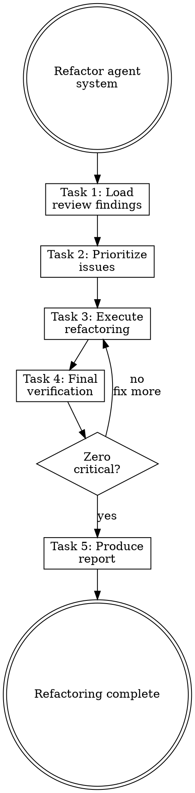
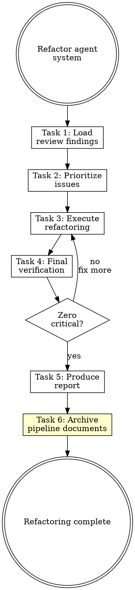

# Reflecting Skill Redesign Implementation Plan

> **For agentic workers:** REQUIRED SUB-SKILL: Use superpowers:subagent-driven-development (recommended) or superpowers:executing-plans to implement this plan task-by-task. Steps use checkbox (`- [ ]`) syntax for tracking.

**Goal:** Redesign the reflecting skill as a lightweight entry point into the planning pipeline, and add document archiving to the pipeline's terminal skill.

**Architecture:** Reflecting keeps conversation analysis and knowledge extraction, but removes its standalone classification tree and writing-* invocations. Instead, it produces a structured reflection report and routes to `planning-agent-systems`. The `refactoring-agent-systems` skill gains an archive step to clean up pipeline documents after completion.

**Tech Stack:** Markdown skill files, no code dependencies

---

## File Structure

| File | Action | Responsibility |
|------|--------|----------------|
| `plugins/rcc/skills/reflecting/SKILL.md` | Rewrite | 5-task reflecting skill (analyze → extract → report → review → route) |
| `plugins/rcc/skills/reflecting/references/report-template.md` | Create | Reflection report format template for Task 3 |
| `plugins/rcc/skills/planning-agent-systems/SKILL.md` | Modify (lines 51-65) | Task 1 reads `*-reflection.md` in addition to existing inputs |
| `plugins/rcc/skills/refactoring-agent-systems/SKILL.md` | Modify (lines 120-201) | Add Task 6 for archiving, update task count and flowchart |

---

### Task 1: Create reflection report template

**Files:**
- Create: `plugins/rcc/skills/reflecting/references/report-template.md`

- [ ] **Step 1: Create the references directory**

```bash
mkdir -p plugins/rcc/skills/reflecting/references
```

- [ ] **Step 2: Write the report template**

Create `plugins/rcc/skills/reflecting/references/report-template.md` with this content:

```markdown
# Reflection Report Template

Write the report to `docs/agent-system/{timestamp}-reflection.md` using this format:

~~~markdown
# Reflection Report — {YYYY-MM-DD}

**Date:** YYYY-MM-DD HH:MM
**Session:** [Brief description of work done]

## Session Context

[1-3 sentences describing the work that was done in this session]

## Events

| # | Event | Context | Outcome | Type |
|---|-------|---------|---------|------|
| 1 | [What happened] | [When/where it occurred] | [Result] | correction / error / discovery / repetition |

**Type definitions:**
- **correction** — user corrected the agent's approach or output
- **error** — agent made a mistake, multiple attempts needed
- **discovery** — new insight about the project, domain, or tooling
- **repetition** — same action performed multiple times (automation candidate)

## Learnings

| # | Learning | Evidence | Suggested Component | Rationale |
|---|----------|----------|---------------------|-----------|
| 1 | [Actionable insight] | Event #N | rule / law / skill / hook / doc | [Why this component type fits] |

**Suggested Component guidelines:**
- **law** — immutable, must enforce every response, project-specific
- **rule** — convention, path-scoped, enforceable by file matching
- **skill** — reusable capability, multi-step process
- **hook** — automated quality check, runs on events
- **doc** — reference material, not directly actionable

## Component Recommendations

For each suggested component, provide enough detail for planning-agent-systems to work with:

### Recommendation N: [Component Name]

- **Type:** rule / law / skill / hook / doc
- **Path hint:** [where it would live, e.g., `.claude/rules/api-response-format.md`]
- **Content summary:** [one-paragraph description of what it should contain]
- **Traces to:** Learning #N [, Learning #M]

## Weaknesses Addressed

Map learnings to the 10-category weakness checklist from analyzing-agent-systems where applicable. If a learning does not map to any weakness category, omit it from this section.

| Learning # | Weakness Category | How It Addresses |
|------------|-------------------|------------------|
| N | [category name] | [brief explanation] |
~~~

## Completeness Checklist (for Task 4 review)

Use this checklist to verify the report before routing to planning:

- [ ] Every event has at least one learning
- [ ] Every learning has a suggested component with rationale
- [ ] Every component recommendation has type, path hint, content summary, and traces-to
- [ ] No placeholder text (TBD, TODO, etc.)
- [ ] Session context accurately describes the work done
- [ ] At least 3 events documented (if fewer than 3 significant events occurred, document why)
```

- [ ] **Step 3: Commit**

```bash
git add plugins/rcc/skills/reflecting/references/report-template.md
git commit -m "feat(reflecting): add reflection report template"
```

---

### Task 2: Rewrite reflecting SKILL.md

**Files:**
- Modify: `plugins/rcc/skills/reflecting/SKILL.md` (full rewrite, all 310 lines)

- [ ] **Step 1: Rewrite the entire SKILL.md**

Replace all content of `plugins/rcc/skills/reflecting/SKILL.md` with:

```markdown
---
name: reflecting
description: Use when completing significant work to extract learnings. Use when user says "reflect", "what did we learn", "capture learnings". Use after resolving complex problems or discovering patterns.
---

# Reflecting

## Overview

**Reflecting IS converting experience into a structured report for the planning pipeline.**

Analyze what worked, what failed, and produce a reflection report with preliminary component suggestions. The report feeds into `planning-agent-systems` for classification, component planning, and execution.

**Core principle:** Experience without reflection is wasted. Capture it before context is lost. Classify it just enough for planning to act on.

**Violating the letter of the rules is violating the spirit of the rules.**

## Routing

**Pattern:** Chain
**Handoff:** auto-invoke
**Next:** `planning-agent-systems`

## Task Initialization (MANDATORY)

Before ANY action, create task list using TaskCreate:

` ` `
TaskCreate for EACH task below:
- Subject: "[reflecting] Task N: <action>"
- ActiveForm: "<doing action>"
` ` `

**Tasks:**
1. Analyze conversation
2. Extract knowledge
3. Produce reflection report
4. Review report quality
5. Route to planning

Announce: "Created 5 tasks. Starting execution..."

**Execution rules:**
1. `TaskUpdate status="in_progress"` BEFORE starting each task
2. `TaskUpdate status="completed"` ONLY after verification passes
3. If task fails → stay in_progress, diagnose, retry
4. NEVER skip to next task until current is completed
5. At end, `TaskList` to confirm all completed

## Task 1: Analyze Conversation

**Goal:** Review the conversation to identify significant events.

**Look for:**
- **Corrections:** User corrected the agent's approach or output
- **Errors:** Mistakes, multiple attempts, dead ends
- **Discoveries:** New insights about the project or domain
- **Repetitions:** Actions performed multiple times

**Document each event:**
` ` `
Event: [What happened]
Context: [When/where it occurred]
Outcome: [Success/failure/discovery]
Type: [correction/error/discovery/repetition]
` ` `

**Verification:** Listed at least 3 significant events. Each event has a type.

## Task 2: Extract Knowledge

**Goal:** Derive actionable learnings from events, each with a preliminary component suggestion.

**For each event, ask:**
- What would have prevented this failure?
- What made this succeed that could be repeated?
- What did we learn that applies beyond this task?

**For each learning, suggest a component type:**
- Could a **rule** enforce this? (convention, path-scoped)
- Should this be a **law** in CLAUDE.md? (immutable, every response)
- Does this need a **skill**? (multi-step reusable process)
- Should a **hook** automate this check? (event-driven quality gate)
- Is this just **documentation**? (reference, not actionable)

**Prefer the simplest component type that works.** A rule is simpler than a skill. A law is simpler than a rule. Documentation is simplest of all. Don't suggest a skill when a rule suffices.

**Learning format:**
` ` `yaml
Learning:
  insight: [What was learned]
  evidence: [Event # that taught this]
  suggested_component: [rule / law / skill / hook / doc]
  rationale: [Why this component type fits]
` ` `

**Verification:** Each event has at least one learning. Each learning has a suggested component with rationale.

## Task 3: Produce Reflection Report

**Goal:** Write the structured report for planning-agent-systems to consume.

**CRITICAL:** Read [references/report-template.md](references/report-template.md) for the full report format.

**Write to:** `docs/agent-system/{timestamp}-reflection.md`

**Verification:** Report written with all events, learnings, and component recommendations.

## Task 4: Review Report Quality

**Goal:** Self-check the report for completeness before handing off.

**Use the completeness checklist from [references/report-template.md](references/report-template.md).**

**Check:**
- [ ] Every event has at least one learning
- [ ] Every learning has a suggested component with rationale
- [ ] Every component recommendation has type, path hint, content summary, and traces-to
- [ ] No placeholder text (TBD, TODO, etc.)
- [ ] Session context accurately describes the work done

**If missing learnings:** Return to Task 2 and extract more.
**If format issues:** Return to Task 3 and fix the report.

**Verification:** All checklist items pass.

## Task 5: Route to Planning

**Goal:** Hand off the reflection report to the planning pipeline.

**Announce:** "反思報告完成，路由到 planning pipeline..."

**Invoke `planning-agent-systems` skill**, passing the reflection report path.

Planning will continue the chain: planning → applying → reviewing → refactoring (which archives all pipeline documents).

**Verification:** planning-agent-systems skill invoked with report path.

## When to Reflect

**Trigger reflection after:**
- Completing a significant feature
- Resolving a difficult bug
- Multiple failed attempts → eventual success
- Discovering something unexpected
- End of long working session

**Don't wait for "later" — context fades quickly.**

## Red Flags - STOP

These thoughts mean you're rationalizing. STOP and reconsider:

- "Nothing worth capturing"
- "I'll remember this"
- "Too small to document"
- "Reflection is overhead"
- "Skip the report, just create the components directly"
- "I know where this learning belongs, skip planning"

**All of these mean: You're about to lose valuable learnings or bypass the pipeline's quality gates. Follow the process.**

## Common Rationalizations

| Excuse | Reality |
|--------|---------|
| "Nothing learned" | Every session has learnings. Look harder. |
| "I'll remember" | You won't. Context fades. Capture now. |
| "Too small" | Small learnings compound. Capture them. |
| "Overhead" | 10 minutes now saves hours later. |
| "Create directly" | Direct creation bypasses conflict checks, simplicity gates, and reviews. Use the pipeline. |
| "I know where it goes" | Planning has component-planning criteria you don't. Let it decide. |

## Flowchart: Reflection Process

` ` `dot
digraph reflecting {
    rankdir=TB;

    start [label="Reflect on work", shape=doublecircle];
    analyze [label="Task 1: Analyze\nconversation", shape=box];
    extract [label="Task 2: Extract\nknowledge + suggestions", shape=box];
    report [label="Task 3: Produce\nreflection report", shape=box];
    review [label="Task 4: Review\nreport quality", shape=box];
    quality_ok [label="Complete?", shape=diamond];
    route [label="Task 5: Route to\nplanning-agent-systems", shape=box, style=filled, fillcolor="#ccffcc"];
    done [label="Handed off\nto pipeline", shape=doublecircle];

    start -> analyze;
    analyze -> extract;
    extract -> report;
    report -> review;
    review -> quality_ok;
    quality_ok -> route [label="yes"];
    quality_ok -> extract [label="no\nmissing learnings"];
    quality_ok -> report [label="no\nformat issues"];
    route -> done;
}
` ` `

## References

- [references/report-template.md](references/report-template.md) — Reflection report format and completeness checklist
- Use `planning-agent-systems` for component classification and planning
```

**Note:** The triple backticks inside the code block above are escaped as `` ` ` ` `` — when writing the actual file, use proper triple backticks (` ``` `).

- [ ] **Step 2: Verify the rewrite**

Check:
- Frontmatter `name` and `description` are unchanged
- 5 tasks listed in Task Initialization
- Routing section shows `Next: planning-agent-systems`
- No classification decision tree remains
- No direct writing-* skill invocations
- Red Flags and Rationalizations updated for new flow
- Flowchart matches the 5-task flow
- Line count is under 300

- [ ] **Step 3: Commit**

```bash
git add plugins/rcc/skills/reflecting/SKILL.md
git commit -m "feat(reflecting): rewrite as lightweight pipeline entry point

Remove standalone classification tree and direct writing-* invocations.
Reflecting now produces a structured report and routes to
planning-agent-systems for classification and execution."
```

---

### Task 3: Update planning-agent-systems Task 1

**Files:**
- Modify: `plugins/rcc/skills/planning-agent-systems/SKILL.md:51-65`

- [ ] **Step 1: Update the Read section in Task 1**

In `plugins/rcc/skills/planning-agent-systems/SKILL.md`, find the Task 1 section (around line 51-65). Replace the **Read:** block:

Old:
```markdown
**Read:**
- `docs/agent-system/*-analysis.md` (most recent, if exists)
- `docs/agent-system/*-workflows.md` (most recent)
```

New:
```markdown
**Read:**
- `docs/agent-system/*-analysis.md` (most recent, if exists)
- `docs/agent-system/*-workflows.md` (most recent)
- `docs/agent-system/*-reflection.md` (most recent, if exists)
```

- [ ] **Step 2: Update the Extract section**

In the same Task 1, find the **Extract:** block. Replace:

Old:
```markdown
**Extract:**
- Weaknesses marked for fixing
- Workflows to support
- Conventions to enforce
- Component recommendations from workflow summary
```

New:
```markdown
**Extract:**
- Weaknesses marked for fixing
- Workflows to support
- Conventions to enforce
- Component recommendations from workflow summary or reflection report
- Learnings and suggested components from reflection report (if available)
```

- [ ] **Step 3: Commit**

```bash
git add plugins/rcc/skills/planning-agent-systems/SKILL.md
git commit -m "feat(planning): read reflection reports in Task 1 inputs"
```

---

### Task 4: Add archive task to refactoring-agent-systems

**Files:**
- Modify: `plugins/rcc/skills/refactoring-agent-systems/SKILL.md:27-201`

- [ ] **Step 1: Update task count in Task Initialization**

In `plugins/rcc/skills/refactoring-agent-systems/SKILL.md`, find the Tasks list (around line 34-39). Replace:

Old:
```markdown
**Tasks:**
1. Load review findings
2. Prioritize issues
3. Execute refactoring
4. Final verification
5. Produce refactoring report
```

New:
```markdown
**Tasks:**
1. Load review findings
2. Prioritize issues
3. Execute refactoring
4. Final verification
5. Produce refactoring report
6. Archive pipeline documents
```

- [ ] **Step 2: Add Task 6 section after Task 5**

Insert after the Task 5 section (after line 153 — the closing ` ``` ` of the report format) and before the Red Flags section (line 155):

```markdown

## Task 6: Archive Pipeline Documents

**Goal:** Move all pipeline documents from the current run to the archive.

**Steps:**
1. Create archive directory: `docs/agent-system/archive/{YYYY-MM-DD}/`
2. Move ALL `*.md` files from `docs/agent-system/` to the archive directory (excluding the `archive/` directory itself)
3. Commit the archive move

```bash
mkdir -p docs/agent-system/archive/{YYYY-MM-DD}
mv docs/agent-system/*.md docs/agent-system/archive/{YYYY-MM-DD}/
git add docs/agent-system/
git commit -m "chore: archive pipeline documents from {YYYY-MM-DD}"
```

**Replace `{YYYY-MM-DD}` with today's actual date.**

**If no documents exist in `docs/agent-system/`:** Skip this task (nothing to archive).

**Verification:** `docs/agent-system/` contains only the `archive/` directory. All pipeline documents are in the dated archive subdirectory.
```

- [ ] **Step 3: Add archive task to Red Flags**

In the Red Flags section, add one more bullet:

Old:
```markdown
- "The report is busywork"
```

New:
```markdown
- "The report is busywork"
- "Skip archiving, the docs aren't hurting anything"
```

Add to the Rationalizations table:

Old:
```markdown
| "Skip report" | Report documents decisions for future maintainers. |
```

New:
```markdown
| "Skip report" | Report documents decisions for future maintainers. |
| "Skip archiving" | Accumulated documents confuse future pipeline runs. Archive. |
```

- [ ] **Step 4: Update the flowchart**

Replace the entire flowchart section:

Old:


New:


- [ ] **Step 5: Verify changes**

Check:
- Task list shows 6 tasks
- Task 6 is positioned after Task 5 and before Red Flags
- Flowchart shows `report -> archive -> done` (not `report -> done`)
- Red Flags and Rationalizations include archiving entries
- File is under 250 lines total

- [ ] **Step 6: Commit**

```bash
git add plugins/rcc/skills/refactoring-agent-systems/SKILL.md
git commit -m "feat(refactoring): add Task 6 for pipeline document archiving

After producing the refactoring report, move all pipeline documents
to docs/agent-system/archive/{date}/ to prevent accumulation."
```
