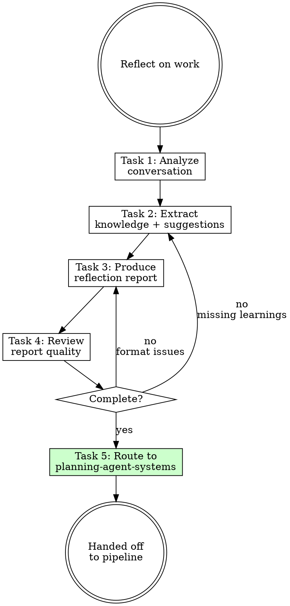

# Reflecting Skill Redesign

## Problem

The reflecting skill has a standalone classification decision tree that is disconnected from the migrate pipeline's more mature classification logic. Issues:

1. **No complexity ladder** — doesn't challenge whether a learning truly needs a skill vs a simpler rule
2. **No conflict checks** — doesn't verify against existing components
3. **No simplicity gate** — migrate pipeline actively challenges over-engineering; reflecting doesn't
4. **Duplicated logic** — reflecting's classification tree duplicates what planning-agent-systems already does better

## Design

### New Positioning

Reflecting becomes a **lightweight entry point** into the planning pipeline. It focuses on what it does best — analyzing conversations and extracting knowledge — then hands off to `planning-agent-systems` for classification, component planning, and execution via `applying-agent-systems`.

### New Flow (5 Tasks)

| Task | Purpose | Output |
|------|---------|--------|
| 1. Analyze conversation | Find corrections, errors, discoveries | Event list |
| 2. Extract knowledge | Derive actionable learnings + preliminary component suggestions | Learning list with suggestions |
| 3. Produce reflection report | Write to `docs/agent-system/{timestamp}-reflection.md` | Structured report file |
| 4. Review report quality | Self-check completeness (every event has a learning, every learning has a suggestion, no gaps) | Pass / fix loop |
| 5. Route to planning | Invoke `planning-agent-systems` with report path | Handoff |

### Reflection Report Format

Path: `docs/agent-system/{timestamp}-reflection.md`

The format is **compatible with planning-agent-systems** input expectations (weaknesses, component recommendations) but adds reflection-specific fields (events, correction records, knowledge extraction).

```markdown
# Reflection Report — {date}

## Session Context
[What work was done]

## Events

| # | Event | Context | Outcome | Type |
|---|-------|---------|---------|------|
| 1 | [What happened] | [When/where] | [Result] | correction / error / discovery / repetition |

## Learnings

| # | Learning | Evidence | Suggested Component | Rationale |
|---|----------|----------|---------------------|-----------|
| 1 | [Actionable insight] | [Event #] | rule / law / skill / hook / doc | [Why this type] |

## Component Recommendations

For each suggested component, provide enough detail for planning to work with:

- **Type:** rule / law / skill / hook / doc
- **Path hint:** where it would live (e.g., `.claude/rules/api-response-format.md`)
- **Content summary:** one-paragraph description of what it should contain
- **Traces to:** which learning(s) drive this recommendation

## Weaknesses Addressed

Map learnings to the 10-category weakness checklist from analyzing-agent-systems where applicable. This helps planning understand whether existing weaknesses are being fixed.
```

### What Gets Removed

- **Task 3 (Classify each learning)** — the standalone classification decision tree is removed. Classification becomes a "preliminary suggestion" in Task 2, with final decisions made by planning-agent-systems.
- **Task 4 (Integrate into components)** — no longer directly invokes writing-* skills. Delegated to applying-agent-systems via the pipeline.
- **Task 5 (Review integrated components)** — reviewer agents run as part of the pipeline, not reflecting.
- **Task 6 (Verify integration)** — pipeline's responsibility.
- **Classification Decision Tree** — replaced by planning's component-planning reference.
- **Scope Signals table** — planning has more complete judgment criteria.

### What Gets Retained

- **Event analysis framework** — Successes / Failures / Discoveries / Repetitions categories remain valuable for structured conversation analysis.
- **Learning extraction** — context / insight / evidence format is retained, extended with `suggested component` and `rationale` fields.
- **Red Flags and Rationalizations** — updated to reflect the new flow.
- **Reflection trigger guidance** — when to reflect remains useful.

### Required Change to planning-agent-systems

**Task 1 (Read Inputs)** currently reads:
- `docs/agent-system/*-analysis.md`
- `docs/agent-system/*-workflows.md`

Must also read:
- `docs/agent-system/*-reflection.md`

The reflection report's format (Component Recommendations, Weaknesses Addressed) is compatible with what planning expects, so Tasks 2-5 of planning require no changes.

### Routing

```
Pattern: Chain
Handoff: auto-invoke
Next: planning-agent-systems
```

Reflecting always routes to planning. Planning then continues the standard chain: planning → applying → reviewing → refactoring.

## Flowchart



## Scope

### In scope
- Rewrite reflecting SKILL.md with 5-task flow
- Create reflection report template in `references/report-template.md`
- Update planning-agent-systems Task 1 to also read `*-reflection.md`

### Out of scope
- Changes to analyzing-agent-systems, brainstorming-workflows, applying-agent-systems
- Changes to writing-* skills
- Changes to reviewer agents
