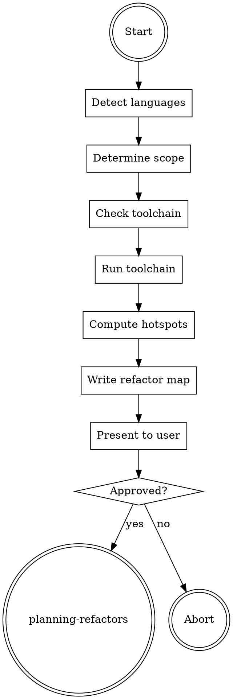

# Analyzing Codebases

## Overview

**Analyzing codebases IS producing a hotspot-ranked refactor map before any restructuring begins.**

Run the language-specific toolchain, aggregate results into a single map covering dependency graph, complexity hotspots, duplication, cyclic dependencies, and AGENTS.md gaps. The map is the input to `planning-refactors`; without it, planning is guesswork.

**Core principle:** Measure before touching code.

## Routing

**Pattern:** Chain
**Handoff:** user-confirmation
**Next:** `planning-refactors`

## Task Initialization (MANDATORY)

Before ANY action, create task list using TaskCreate:

- Subject: `[analyzing-codebases] Task N: <action>`

**Tasks:**
1. Detect languages and monorepo state
2. Determine refactor scope (whole repo vs subproject)
3. Check required toolchain availability
4. Run toolchain and collect raw outputs
5. Compute hotspot ranking (churn × complexity)
6. Assemble refactor map
7. Present map and await user approval

## Task 1: Detect languages

Scan CWD for manifest files. Each manifest maps to a language:

- `package.json` → TypeScript/JavaScript
- `pyproject.toml` or `setup.py` → Python
- `Cargo.toml` → Rust
- `go.mod` → Go

Record detected languages in memory. No manifest → generic fallback.

## Task 2: Determine scope

Check for monorepo markers:

- `pnpm-workspace.yaml`, `lerna.json`, `nx.json`, `turbo.json` → JS monorepo
- Cargo `[workspace]` in root `Cargo.toml` → Rust workspace
- Multiple `go.mod` files → Go multi-module
- Multiple `pyproject.toml` in subdirs → Python workspace

Monorepo → ask user: whole repo, specific subproject(s), or root only.
Single project → scope is CWD.

## Task 3: Check toolchain

For each detected language, load the corresponding reference in `references/`. Check each tool with `which <tool>` or language-specific equivalent.

Missing tools → print install command from the reference; ask user to install-then-continue or skip that analysis class.

## Task 4: Run toolchain

Execute the tools per reference instructions. Save raw outputs to `.rcc/aref-raw/{ts}-{lang}-{tool}.txt`. `{ts}` = `YYYYMMDD-HHMMSS`, fixed for the run.

## Task 5: Compute hotspots

Hotspot score = git log churn × cognitive complexity. Churn: `git log --format=format: --name-only --since="6 months ago" | grep -v '^$' | sort | uniq -c | sort -rn`. Complexity from toolchain output.

Rank top 20 files by score.

## Task 6: Assemble refactor map

Write `.rcc/{ts}-refactor-map.md` per schema in `references/refactor-map-schema.md`.

## Task 7: Present to user

Print summary: detected languages, scope, top 5 hotspots, count of cyclic deps, AGENTS.md status. Ask user: `approve plan handoff` / `adjust scope` / `abort`.

Approved → hand off to `planning-refactors`.

## Red Flags - STOP

- "Skip toolchain, read code directly"
- "Compute hotspots from file size only"
- "Skip churn (no git history)"
- "Produce plan before map"
- "Scope = whole repo" on a monorepo without asking

## Common Rationalizations

| Thought | Reality |
|---------|---------|
| "I can eyeball the hotspots" | Hotspots = churn × complexity. Both must be measured. |
| "Tool missing, skip silently" | Ask user. Silent skip produces incomplete map. |
| "Map too long, summarize aggressively" | Map is machine input for planning. Completeness beats brevity. |
| "Use LOC as complexity proxy" | LOC correlates weakly. Use cognitive complexity. |
| "Run on uncommitted changes" | Churn = git history. Dirty tree skews count. |

## Flowchart

## References

- `references/typescript-toolchain.md`
- `references/python-toolchain.md`
- `references/rust-toolchain.md`
- `references/go-toolchain.md`
- `references/generic-fallback.md`
- `references/refactor-map-schema.md`
