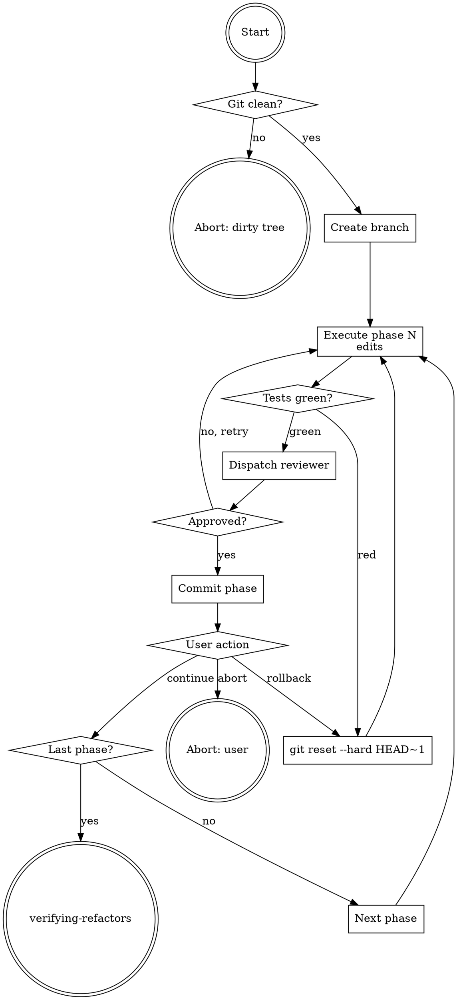

# Applying Refactors

## Overview

**Applying refactors IS executing each phase as a green, bounded-size commit with an adversarial review between phases.**

One branch. One commit per phase. One reviewer pass per phase. Zero silent advances. Zero phase >400 LOC unless explicitly acknowledged.

**Core principle:** Rollback is a first-class path, not an exception.

## Routing

**Pattern:** Chain
**Handoff:** user-confirmation per phase
**Next:** `verifying-refactors` (after last phase green)

## Task Initialization (MANDATORY)

- Subject: `[applying-refactors] Task N: <action>`

**Tasks:**
1. Verify git clean
2. Create refactor branch
3. For each phase:
   a. Execute edits
   b. Run verification command
   c. Dispatch refactor-phase-reviewer
   d. Commit phase
   e. Checkpoint with user
4. Handoff to verifying-refactors

## Task 1: Verify git clean

Run `git status --porcelain`. Non-empty → abort: "Uncommitted changes exist. Commit or stash, then rerun."

## Task 2: Create branch

Read plan metadata for `branch_name`. Run:

```
git checkout -b <branch_name>
```

Already exists → abort: "Branch exists. Delete or rename, then rerun."

## Task 3: Phase loop

For each `Phase N` in plan (ascending):

### 3a. Execute edits

Apply changes per phase `files` and `description`. Edit only the listed files. Do not touch adjacent files even if tempting.

### 3b. Run verification

Run the phase's `verification.command`. Non-zero exit → stop; do not commit; diagnose. Options: rollback phase, adjust plan, abort run.

### 3c. Dispatch reviewer

Invoke `refactor-phase-reviewer` agent with:
- Phase N metadata from plan
- Diff of unstaged changes (`git diff`)
- `test_result`: stdout + exit code from the verification command (Check 4 of the reviewer requires this)

Reviewer returns `APPROVED` or `CHANGES_REQUESTED`.

`CHANGES_REQUESTED` → address feedback in-place, rerun verification, re-invoke reviewer. Max 2 retries → escalate to user.

### 3d. Commit

Per `references/phase-commit-protocol.md` format.

### 3e. Checkpoint

Print phase N summary: files changed, LOC, verification result, reviewer outcome. Ask user:
- `continue` → next phase
- `rollback phase` → `git reset --hard HEAD~1`, retry phase
- `abort run` → stop, leave branch

## Task 4: Handoff

After last phase's user `continue`, print run summary and hand off to `verifying-refactors`.

## Red Flags - STOP

- Editing files not listed in the phase
- Skipping reviewer dispatch
- `git commit --amend` during phase loop
- Running `git rebase` / `git reset --hard` outside rollback path
- Force-pushing the refactor branch
- Disabling hooks (`--no-verify`)
- Advancing on `CHANGES_REQUESTED` without addressing feedback

## Common Rationalizations

| Thought | Reality |
|---------|---------|
| "Test runner is slow — skip verification" | Green at every commit is the contract. No skip. |
| "Reviewer is picky, override" | Reviewer enforces the 400 LOC cap and test discipline. Overriding invalidates the plan. |
| "Merge plan phases for speed" | Phase boundary = rollback unit. Merging = losing rollback. |
| "amend to fix a typo" | Amend post-review = review bypass. New commit instead. |

## Flowchart



## References

- `references/phase-commit-protocol.md`
