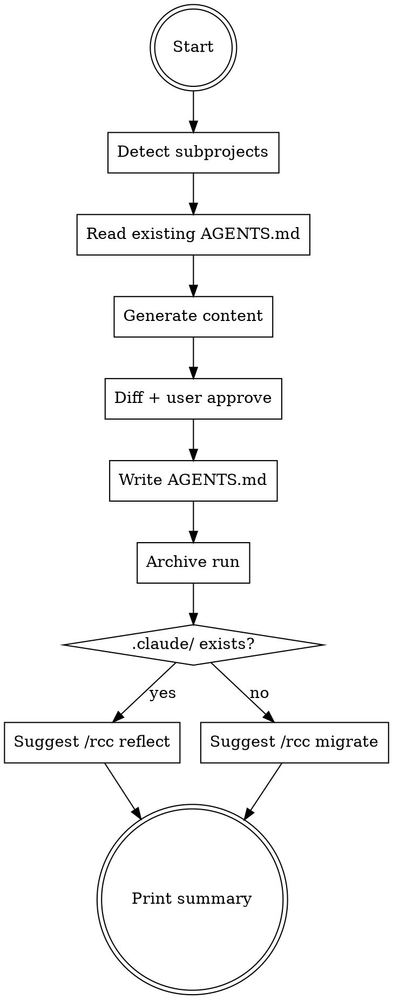

# Finalizing Refactors

## Overview

**Finalizing refactors IS leaving a codebase that the next AI agent can pick up immediately.**

Write per-subproject AGENTS.md (the emerging 2025 consensus standard), archive run artifacts to `.rcc/archive/`, suggest next-step handoff to rcc based on project state.

**Core principle:** The refactor is not done until the next agent has a map.

## Routing

**Pattern:** Terminal
**Handoff:** user-confirmation
**Next:** none (terminal), but suggests `/rcc migrate` or `/rcc reflect`

## Task Initialization (MANDATORY)

- Subject: `[finalizing-refactors] Task N: <action>`

**Tasks:**
1. Detect subprojects
2. For each subproject, read existing AGENTS.md (if any)
3. Generate AGENTS.md content per template
4. Show diff and get user approval
5. Write AGENTS.md files
6. Archive run artifacts
7. Detect rcc state and suggest handoff
8. Print final summary

## Task 1: Detect subprojects

Root has a manifest → root is a subproject. Any directory with its own manifest and not nested in another is a subproject. Use same detection as analyzing-codebases.

## Task 2: Read existing

For each subproject root, check if `AGENTS.md` exists. If yes, parse existing section headings. Plan will add missing sections, preserve existing.

## Task 3: Generate

Per subproject, fill template at `references/agents-md-template.md`:
- Overview (first 3 paragraphs of subproject README, else manifest description)
- Build / Test (extract from package.json scripts / pyproject.toml / Makefile / Cargo.toml aliases)
- Code Style (summarize detected linter config)
- Test Conventions (test directory layout + test runner command)
- Architecture (reference the refactor-map dep graph, summarize)
- Security (placeholder)

## Task 4: Diff and approve

Show `diff -u <existing> <proposed>` per subproject. User approves per subproject or batch. Rejections → prompt for edits.

## Task 5: Write

Write approved AGENTS.md files. Commit:

```
git add <paths>
git commit -m "docs(aref): add/update AGENTS.md for N subprojects"
```

## Task 6: Archive

Move run artifacts to `.rcc/archive/{ts}-aref-run/`:

```
mkdir -p .rcc/archive/{ts}-aref-run
mv .rcc/{ts}-*.md .rcc/archive/{ts}-aref-run/
mv .rcc/{ts}-*.json .rcc/archive/{ts}-aref-run/ 2>/dev/null || true
mv .rcc/{ts}-apply-state.yml .rcc/archive/{ts}-aref-run/ 2>/dev/null || true
```

Keep `.rcc/aref-raw/` and clean it: `rm -rf .rcc/aref-raw/{ts}-*`.

Commit:

```
git add .rcc/archive/{ts}-aref-run/
git commit -m "chore(aref): archive run {ts}"
```

## Task 7: Suggest handoff

Check:
- `.claude/` exists at project root → has agent system already
- `plugins/` exists → same

No agent system detected → print:
> Refactor complete. This project has no agent system. Next: `/rcc migrate` to bootstrap skills, CLAUDE.md, rules.

Agent system present → print:
> Refactor complete. Existing agent system detected. Next: `/rcc reflect` to let the existing skills incorporate the new structure.

## Task 8: Summary

Print:
- Refactor branch name
- Phases committed
- Hard rules status
- Mutation score averages
- AGENTS.md files written
- Archive location
- Suggested next command

Instruct user:
> To merge: `git checkout main && git merge --no-ff <branch>` or open a PR.

## Red Flags - STOP

- Writing AGENTS.md to nested non-subproject directories
- Overwriting user-written AGENTS.md sections without diff review
- Archiving before all artifacts confirmed written
- Suggesting rcc migrate when `.claude/` already exists
- Merging the branch on behalf of the user

## Common Rationalizations

| Thought | Reality |
|---------|---------|
| "AGENTS.md is redundant with README" | Research: AGENTS.md is the agent-targeted doc (20k+ repos adopted). README is human-targeted. |
| "Skip archive, user can read .rcc/ directly" | Archive keeps unstacked run history. Cleans working .rcc/. |
| "Merge the branch to finalize" | User merges. Plugin stops at branch. |

## Flowchart



## References

- `references/agents-md-template.md`
