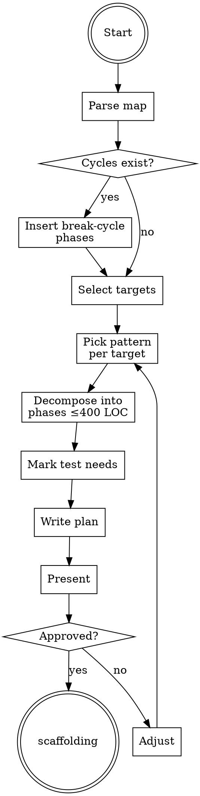

# Planning Refactors

## Overview

**Planning refactors IS producing phased, always-green, bounded-size plans from the refactor map.**

Each phase is one commit: expand, migrate, or contract. Every phase has a verification hook (tests pass, specific metric improved). Phases never exceed 400 LOC predicted diff.

**Core principle:** Small reversible phases beat big irreversible restructures.

## Routing

**Pattern:** Chain
**Handoff:** user-confirmation
**Next:** `scaffolding-characterization-tests`

## Task Initialization (MANDATORY)

- Subject: `[planning-refactors] Task N: <action>`

**Tasks:**
1. Parse refactor map
2. Select top 1-3 hotspots to target this run
3. For each hotspot, pick a pattern (parallel-change / BBA / strangler)
4. Decompose each into phases with LOC estimates
5. Identify characterization test needs per phase
6. Write refactor plan
7. Present to user for approval

## Task 1: Parse refactor map

Read `.rcc/{ts}-refactor-map.md`. Validate all required sections present (per schema). Missing → abort and tell user to rerun analyzing.

## Task 2: Select targets

Default: top 3 hotspots. Exceptions:
- Cyclic deps exist → break cycles BEFORE hotspot refactor (dependency inversion phase inserted at start)
- User override: specific paths only

## Task 3: Pick pattern per target

Per target, decide based on these rules (see `references/patterns.md` for full criteria):

- **Parallel Change (expand-migrate-contract)** — default. Use for: renames, signature changes, format migrations.
- **Branch by Abstraction** — use for: swapping an implementation (e.g. replace impl of repository interface). Introduce seam first, then migrate, then retire old impl.
- **Strangler Fig** — use for: whole-component replacement. Rare at single-file scope; typically cross-file.

## Task 4: Decompose into phases

For each phase:
- Title: one line
- Type: expand | migrate | contract | break-cycle | extract-seam
- Files touched (exact paths)
- LOC estimate (ceiling 400; if higher, split)
- Verification: test command + expected result
- Characterization test requirement: none | existing-sufficient | must-scaffold

## Task 5: Identify test needs

For each phase touching untested code, mark `must-scaffold` and specify:
- Target module
- Golden test strategy (input/output capture via `Verify`/`pytest-approvaltests`/`insta`/`testify` golden)
- Fallback if module has IO: mark `high-risk`, require user ack

## Task 6: Write plan

Write `.rcc/{ts}-refactor-plan.md` per schema in `references/refactor-plan-schema.md`.

## Task 7: Present to user

Print summary: targets selected, patterns chosen, total phases, estimated total LOC, high-risk count. Ask user: `approve` / `adjust targets` / `change patterns` / `abort`.

Approved → hand off to `scaffolding-characterization-tests`. Dry-run mode: stop here, print plan, exit.

## Red Flags - STOP

- Phase with predicted LOC > 400 not marked `oversized`
- Phase type `migrate` without preceding `expand` phase
- Any phase touching files outside the refactor-map hotspot list without user acknowledgement
- Skipping cycle-break phase when cycles exist
- Characterization test status missing on any phase

## Common Rationalizations

| Thought | Reality |
|---------|---------|
| "Combine expand + migrate for efficiency" | Parallel-change requires separation for rollback safety. |
| "Characterization test optional, user will review" | Research: untested code during refactor is top failure mode. |
| "Top 5 hotspots fits in one run" | 400 LOC ceiling × 3 targets ≈ safe per-run budget. |
| "Skip cycle-break, deal with it later" | Cyclic deps compound. Break first. |

## Flowchart

## References

- `references/patterns.md`
- `references/refactor-plan-schema.md`
