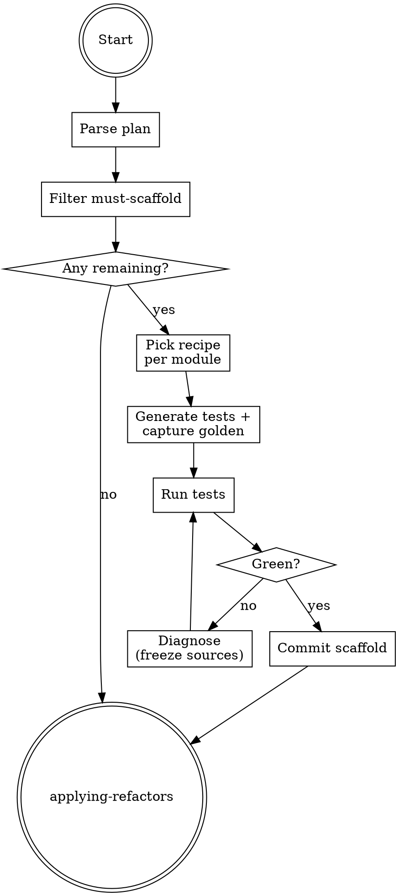

# Scaffolding Characterization Tests

## Overview

**Scaffolding characterization tests IS building the safety net BEFORE touching code.**

Per Feathers' "Working Effectively with Legacy Code": never refactor untested code. Capture current behavior as golden output, verify tests go green against unmodified code, commit the scaffold, then enter applying-refactors.

**Core principle:** Snapshot current behavior, not aspirational behavior. The tests protect the refactor from accidental regression.

## Routing

**Pattern:** Chain
**Handoff:** automatic (no user confirmation unless new tests added)
**Next:** `applying-refactors`

## Task Initialization (MANDATORY)

- Subject: `[scaffolding-characterization-tests] Task N: <action>`

**Tasks:**
1. Parse refactor plan
2. Filter phases requiring must-scaffold
3. For each target module, pick recipe from `references/characterization-test-recipes.md`
4. Generate test file(s); capture current output as golden
5. Run new tests to verify green
6. Commit scaffold
7. Handoff to applying-refactors

## Task 1: Parse plan

Read `.rcc/{ts}-refactor-plan.md`. Collect all phases with `characterization_test.status: must-scaffold`.

## Task 2: Filter

Skip phases where module already has coverage (sample: run test runner with coverage, check if `target_module` has ≥3 passing tests). Keep those that need scaffold.

If none → skip to Task 7 immediately.

## Task 3: Pick recipe

Language + module shape determines recipe:

- Pure function (no IO) → golden-snapshot (inputs → expected output)
- Class with state → state-trace (sequence of calls → final state)
- IO-heavy module → mark `high-risk` and abort this module's scaffold; surface back to plan

See `references/characterization-test-recipes.md` for per-language code.

## Task 4: Generate and capture

- Write test file at language's conventional test path
- Generate inputs (real usage patterns from call sites; see planning's refactor-map for samples)
- Run module against inputs, capture outputs to golden fixture
- Write assertions matching captured outputs

## Task 5: Verify green

Run the test runner on the new test file only. Expected: all new tests pass.

Fail → diagnose. Never alter the module to make tests pass. If the module has nondeterminism (time, random, uuid), freeze sources and retry.

## Task 6: Commit

```
git add <test paths> <golden fixture paths>
git commit -m "test(aref): scaffold characterization tests for <scope>"
```

## Task 7: Handoff

Print summary: N modules scaffolded, M skipped (already covered), K marked high-risk. Hand off to `applying-refactors` unless all phases became high-risk (then return to planning for replan).

## Red Flags - STOP

- Writing tests that assert aspirational behavior ("it should return 42")
- Modifying the production module before tests go green
- Mocking the module under test (characterization = exercise real code)
- Skipping the green-verify step before commit
- Treating mutation-testing failure as a scaffold failure (that's verifying-refactors' job)

## Common Rationalizations

| Thought | Reality |
|---------|---------|
| "The module is simple, tests redundant" | Refactor accidents happen most in simple-looking modules. |
| "Test captures bug behavior" | Correct — the point is to preserve CURRENT behavior, bugs included. Fix bugs in a separate commit AFTER refactor. |
| "Golden files too big, just check count" | The size IS the signal. Commit it. |
| "Skip modules with IO — too hard" | Mark high-risk, escalate to user, don't silently skip. |

## Flowchart



## References

- `references/characterization-test-recipes.md`
