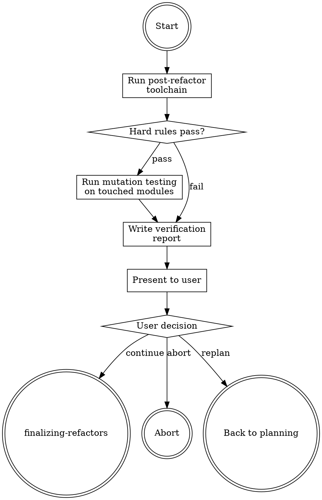

# Verifying Refactors

## Overview

**Verifying refactors IS proving the refactor made the codebase better by measurable rules, not vibes.**

Run the same toolchain as analyzing-codebases, on the post-refactor state. Compare before/after. Every hard rule must hold or the refactor is not done. Mutation test touched modules to confirm characterization tests actually assert.

**Core principle:** A refactor that reduces complexity on paper but fails hard rules is a regression.

## Routing

**Pattern:** Chain
**Handoff:** user-confirmation
**Next:** `finalizing-refactors`

## Task Initialization (MANDATORY)

- Subject: `[verifying-refactors] Task N: <action>`

**Tasks:**
1. Run post-refactor toolchain
2. Check hard rules
3. Run mutation testing on touched modules
4. Produce verification report
5. Present to user

## Task 1: Post-refactor toolchain

Rerun the same tools as analyzing-codebases on current (refactored) state. Save outputs to `.rcc/aref-raw/{ts}-post-*.json` (distinct from pre-refactor `*-pre-*.json` if you want to rename original outputs; else use new timestamp).

## Task 2: Hard rules

Per `references/hard-rules.md`, check each rule. Any failure → STOP, do not proceed to mutation testing, report failure.

Rules:
- Cyclic deps count = 0
- No file > 300 lines (warning if between 250-300)
- No function > 50 lines
- Cognitive complexity max ≤ 15
- Cyclomatic complexity max ≤ 10
- Single-entry per module (barrel-at-boundary only)

## Task 3: Mutation testing

Per `references/mutation-testing.md`. Run mutation tool ONLY on modules touched by the refactor (derived from git diff since branch point). Global mutation runs are out of scope.

Record mutation score (killed/total). Survivors >20% → flag `weak-tests` in report but do not block.

## Task 4: Report

Write `.rcc/{ts}-verification-report.md`:

```markdown
# Verification Report {ts}

## Hard Rules

| Rule | Before | After | Pass/Fail |
|------|--------|-------|-----------|
| Cyclic deps | 3 | 0 | PASS |
| Max file LOC | 820 | 298 | PASS |
| ...

## Mutation Testing

| Module | Mutants | Killed | Score | Flag |
|--------|---------|--------|-------|------|
| src/auth/token.ts | 48 | 41 | 85% | |
| src/auth/middleware.ts | 32 | 20 | 63% | weak-tests |

## Delta vs Pre-refactor

- Hotspot count: -3
- Duplication clusters: -2
- AGENTS.md gaps: unchanged (handled by finalizing)

## Decision

PASS / FAIL-HARD-RULES / PASS-WITH-WEAK-TESTS
```

## Task 5: Present

Print report summary. Ask user:
- PASS → `continue` to finalizing-refactors
- FAIL → `rollback last phase` / `replan failing target` / `abort`
- WEAK-TESTS → `continue` / `scaffold more tests` / `accept and continue`

## Red Flags - STOP

- Running mutation on whole codebase (scope is touched modules only)
- Skipping hard rules because "tests are green"
- Reporting PASS when any hard rule failed
- Using coverage % as a hard rule (research: gameable metric)

## Common Rationalizations

| Thought | Reality |
|---------|---------|
| "Coverage is 85%, skip mutation" | Coverage measures execution, not assertion. Mutation validates asserts. |
| "Warnings are fine, not FAIL" | Warning ≠ FAIL but IS recorded. User decides acceptance. |
| "Cognitive complexity 16 is close enough" | Hard rule is hard. Negotiate in plan, not in verify. |

## Flowchart



## References

- `references/hard-rules.md`
- `references/mutation-testing.md`
