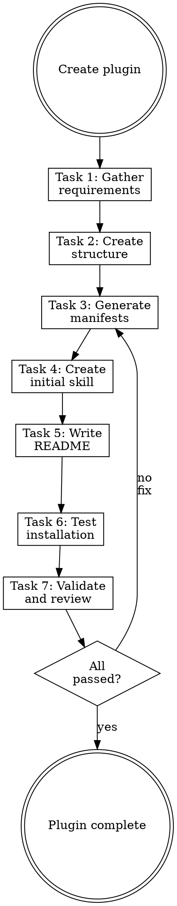

# Writing Plugins

## Overview

**Writing plugins IS packaging reusable skills for distribution.**

Plugins contain skills, commands, agents, and rules installable via `claude plugin add`. Follow the official Anthropic 2025 schema.

**Core principle:** Plugins are distributable — correctness of manifest, structure, and auto-discovery matters more than content volume.

**Violating the letter of the rules is violating the spirit of the rules.**

## Routing

**Pattern:** Skill Steps
**Handoff:** none
**Next:** none

## Task Initialization (MANDATORY)

Before ANY action, create task list using TaskCreate:

```
TaskCreate for EACH task below:
- Subject: "[writing-plugins] Task N: <action>"
- ActiveForm: "<doing action>"
```

**Tasks:**
1. Gather requirements
2. Create plugin structure
3. Generate manifests
4. Create initial skill
5. Write README
6. Test installation
7. Validate and review

Announce: "Created 7 tasks. Starting execution..."

**Execution rules:**
1. `TaskUpdate status="in_progress"` BEFORE starting each task
2. `TaskUpdate status="completed"` ONLY after verification passes
3. If task fails → stay in_progress, diagnose, retry
4. NEVER skip to next task until current is completed
5. At end, `TaskList` to confirm all completed

## Task 1: Gather Requirements

**Goal:** Understand what the plugin should contain.

**Ask:**
- Plugin name (kebab-case, max 64 chars, avoid `helper`/`utils`/`anthropic`/`claude`)
- Purpose (one sentence)
- Skills to include
- Author name/email
- Is this a marketplace or single plugin?

**Verification:** Can state plugin name and purpose in one sentence.

## Task 2: Create Plugin Structure

**Goal:** Scaffold the directory layout.

**Single plugin:**
```
<plugin-name>/
├── .claude-plugin/
│   └── plugin.json
├── skills/
│   └── <skill-name>/
│       └── SKILL.md
├── commands/            # Optional
├── agents/              # Optional
└── README.md
```

**Marketplace:**
```
<marketplace>/
├── .claude-plugin/
│   └── marketplace.json
└── plugins/
    └── <plugin-name>/
        ├── .claude-plugin/
        │   └── plugin.json
        └── skills/
```

**Key rule:** Component directories at plugin root, NOT inside `.claude-plugin/`.

**Verification:** Directory structure matches layout above.

## Task 3: Generate Manifests

**Goal:** Create plugin.json (and marketplace.json if needed).

**plugin.json:**
```json
{
  "name": "plugin-name",
  "description": "What this plugin does",
  "version": "1.0.0",
  "author": { "name": "Name", "email": "email" }
}
```

Skills are auto-discovered from `skills/*/SKILL.md`.

**marketplace.json** (if applicable):
```json
{
  "name": "marketplace-name",
  "owner": { "name": "Name", "email": "email" },
  "metadata": { "description": "...", "version": "1.0.0" },
  "plugins": [
    { "name": "plugin", "source": "./plugins/plugin", "description": "..." }
  ]
}
```

**Source options:** relative path, `{"source": "github", "repo": "owner/repo"}`, or `{"source": "url", "url": "..."}`.

**Verification:** Manifests are valid JSON with all required fields.

## Task 4: Create Initial Skill

**Goal:** Create the first skill using proper workflow.

**CRITICAL: Invoke the `writing-skills` skill.** Do not write SKILL.md directly.

**Verification:** Initial skill created and passes skill-reviewer.

## Task 5: Write README

**Goal:** Document the plugin for users.

**Template:**
```markdown
# Plugin Name

One-line description.

## Installation
\`\`\`bash
claude plugin add <path-or-url>
\`\`\`

## Skills
| Skill | Description |
|-------|-------------|

## Usage
[Examples]
```

**Verification:** README has installation instructions and skill list.

## Task 6: Test Installation

**Goal:** Verify plugin installs and works.

```bash
claude plugin add <path>
# Verify skills appear
claude plugin remove <name>
```

**Verification:** Plugin installs without errors, skills are discoverable.

## Task 7: Validate and Review

**Goal:** Final quality check.

**Checklist:**
- [ ] `.claude-plugin/plugin.json` exists with name, description, version
- [ ] Component directories at plugin root (not inside .claude-plugin)
- [ ] All skills have valid frontmatter (name + "Use when..." description)
- [ ] README has installation and skill list
- [ ] Plugin installs and uninstalls cleanly

**Verification:** All checklist items pass.

## Skills vs Commands

| Aspect | Skills | Commands |
|--------|--------|----------|
| Activation | Automatic (context-based) | Explicit (`/command`) |
| Location | `skills/<name>/SKILL.md` | `commands/<name>.md` |
| Use case | Recurring workflows | On-demand actions |

## Red Flags - STOP

These thoughts mean you're rationalizing. STOP and reconsider:

- "Skip skill creation, I'll add it later"
- "Don't need README for a simple plugin"
- "Skip testing, the manifest is valid"
- "Put everything in one mega-skill"
- "Write SKILL.md directly, skip writing-skills"

**All of these mean: You're about to create a weak plugin. Follow the process.**

## Common Rationalizations

| Excuse | Reality |
|--------|---------|
| "Add skills later" | Empty plugins are useless. Ship with at least one. |
| "Skip README" | Undocumented plugins don't get used. |
| "Skip testing" | Broken installs frustrate users. Test it. |
| "One big skill" | Multiple focused skills > one bloated skill. |
| "Write directly" | writing-skills encodes TDD + review. Bypass = weak skill. |

## Flowchart: Plugin Creation



## Publishing

1. **Local:** share directory path
2. **GitHub:** `claude plugin add github:username/repo`
3. **npm:** publish to npm registry
