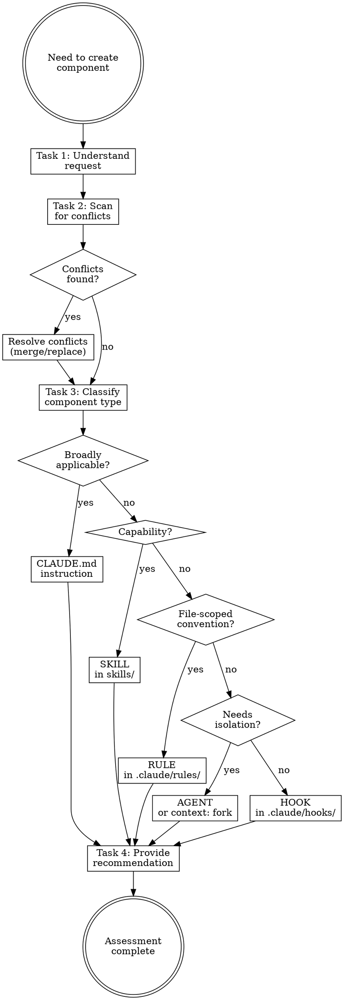

# Advising Architecture

## Overview

**Advising architecture IS classifying knowledge into the correct Claude Code component.**

One concept, one location. Misclassification wastes tokens (global rule that should be scoped) or misses enforcement (advisory instruction that should be a deterministic hook).

**Core principle:** CLAUDE.md = broad project instructions. Rules = path-scoped conventions. Skills = on-demand capabilities. Agents = isolated workers. Hooks = deterministic enforcement.

**Violating the letter of the rules is violating the spirit of the rules.**

## Routing

**Pattern:** Node
**Handoff:** none
**Next:** none

## Task Initialization (MANDATORY)

Before ANY action, create task list using TaskCreate:

```
TaskCreate for EACH task below:
- Subject: "[advising-architecture] Task N: <action>"
- ActiveForm: "<doing action>"
```

**Tasks:**
1. Understand the request
2. Scan for conflicts
3. Classify component type
4. Provide recommendation

Announce: "Created 4 tasks. Starting execution..."

**Execution rules:**
1. `TaskUpdate status="in_progress"` BEFORE starting each task
2. `TaskUpdate status="completed"` ONLY after verification passes
3. If task fails → stay in_progress, diagnose, retry
4. NEVER skip to next task until current is completed
5. At end, `TaskList` to confirm all completed

## Component Hierarchy (Priority Order)

```
1. CLAUDE.md (highest)       - Broad project instructions
   └─ Loaded every session (expensive — keep < 200 lines)
   └─ Only what Claude can't figure out from code
   └─ Specific, verifiable instructions with MUST/NEVER emphasis

2. Rules (.claude/rules/)    - Path-scoped conventions
   └─ Auto-injected when paths: glob matches
   └─ < 50 lines each (token cost)
   └─ Frontmatter: paths (YAML array of globs)
   └─ No paths = global (loaded at session start)

3. Skills (.claude/skills/)  - Capabilities (how to do)
   └─ Loaded on-demand by Claude OR invoked via /skill-name
   └─ Progressive disclosure: SKILL.md + references/
   └─ Gerund naming: writing-skills, not write-skill
   └─ Frontmatter: name, description, argument-hint,
      allowed-tools, model, effort, context, agent,
      hooks, user-invocable, disable-model-invocation

4. Agents (.claude/agents/)  - Isolated context workers
   └─ Invoked via Agent tool
   └─ Frontmatter: name, description, tools,
      disallowedTools, model, maxTurns, skills,
      permissionMode, effort, isolation, background,
      memory, mcpServers, hooks

5. Hooks (.claude/hooks/)    - Automated quality gates
   └─ Exit code 2 = block action
   └─ < 5 seconds execution
   └─ Static checks only
```

## Classification Decision Tree

```
Does it apply BROADLY to all project work?
├─ Yes → CLAUDE.md instruction
│   Examples: Communication style, build commands, architecture
│   Key: Keep < 200 lines, specific and verifiable
│
└─ No → What type of knowledge?
    │
    ├─ HOW TO DO something (capability)?
    │   → SKILL in skills/
    │   Naming: gerund form (writing-*, creating-*)
    │   Structure: Overview → Routing → Tasks → Red Flags → Flowchart
    │   Routing pattern:
    │     ├─ Contains decision points → Tree
    │     ├─ Part of multi-skill workflow → Chain
    │     ├─ Simple, single task → Node (context: fork, model: haiku)
    │     └─ Internal steps only → Skill Steps
    │   Consider: context: fork for analysis-oriented skills
    │   Consider: model selection (haiku for fast, opus for complex)
    │
    ├─ WHAT TO DO (convention for specific files)?
    │   → RULE in .claude/rules/
    │   Use when: different paths need different conventions
    │     e.g., monorepo packages with different frameworks,
    │     src/ vs tests/ with different coding standards,
    │     frontend (React) vs backend (Express) rules
    │   paths: glob isolates rules to matching files only
    │   Format: paths as YAML array of globs
    │   Keep < 50 lines, imperative language
    │
    ├─ ISOLATED WORKER (needs separate context)?
    │   First consider: built-in subagent types (Explore, Plan, general-purpose)
    │   Then consider: skill with context: fork
    │   Last resort: custom AGENT in agents/
    │   CRITICAL: isolated context = no conversation history
    │   → Design argument-hint/prompt to pass sufficient context
    │
    └─ AUTOMATED CHECK (quality gate)?
        → HOOK in .claude/hooks/
        Python script, exit 2 to block
        Configure in settings.json
```

## Best Practices per Component

### CLAUDE.md
- **< 200 lines** — loaded every session; only what Claude can't figure out from code
- Specific and verifiable; use `MUST`/`NEVER` sparingly
- NOT for: linter-enforceable rules (hooks), path-scoped (rules), workflows (skills)

### Rules (.claude/rules/)
- **< 50 lines each**; use `paths:` YAML array to scope to file patterns
- Imperative language; best for monorepo/frontend-vs-backend conventions
- NOT for: procedures (skills), broad instructions (CLAUDE.md)

### Skills (.claude/skills/)
- On-demand loading = token efficient; use `context: fork` for analysis tasks
- Use `model` to optimize cost; `disable-model-invocation: true` for manual-only
- NOT for: conventions (rules), broad instructions (CLAUDE.md)

### Agents (.claude/agents/)
- First consider built-in types (Explore/Plan/general-purpose), then `context: fork`
- Tools declared upfront — subagents CANNOT request at runtime
- NOT for: guidance (skills), conventions (rules)

### Hooks (.claude/hooks/)
- Deterministic enforcement; exit code 2 = block; keep < 5 seconds
- Best for: lint checks, format validation, commit message enforcement
- NOT for: complex workflows (skills), advisory guidelines (CLAUDE.md/rules)

## Task 1: Understand the Request

**Goal:** Clarify what is being created or modified.

**Questions to answer:**
- What knowledge is being encoded?
- Does it apply broadly to all project work, or only to specific paths?
- Does it teach a capability (how to) or enforce a convention (what to)?
- Does it need deterministic enforcement (hook) or advisory guidance (CLAUDE.md/rule)?

**Verification:** Can state the knowledge type in one sentence.

## Task 2: Scan for Conflicts

**Goal:** Check existing components for overlaps.

**Process:**
1. Check CLAUDE.md for related instructions
2. Check `.claude/rules/` for overlapping conventions
3. Check skills/ for duplicate capabilities
4. Check agents/ for overlapping responsibilities

**Verification:** Listed all related existing components (or confirmed none).

## Task 3: Classify Component Type

**Goal:** Apply decision tree to determine correct component type.

| If it... | Then it's a... |
|----------|----------------|
| Applies broadly to all project work | CLAUDE.md instruction |
| Different paths need different conventions (monorepo, frontend vs backend) | RULE with paths: |
| Teaches how to do something | SKILL |
| Needs isolated execution context | AGENT (or skill with `context: fork`) |
| Is an automated quality gate | HOOK |

**Verification:** Classification matches decision tree logic.

## Task 4: Provide Recommendation

**Goal:** Deliver structured recommendation.

**Output format:**
```markdown
## Architecture Assessment

**Request:** [What you're trying to create]

**Classification:** [CLAUDE.md / rule / skill / agent / hook]

**Rationale:** [Why this classification]

**Location:** [Exact path where it should go]

**Conflicts Found:**
- [List any existing components that overlap, or "None"]

**Key Constraints:**
- [Important rules for this component type]

**Recommendation:** [Proceed / Reconsider / Merge with existing]
```

**Verification:** Recommendation includes all fields above.

## Red Flags - STOP

These thoughts mean you're rationalizing. STOP and reconsider:

- "This is both a rule AND a skill"
- "CLAUDE.md is overkill, a rule is fine"
- "Global rule is fine without paths:"
- "Skip conflict scan, it's obviously new"
- "Agent is needed" (before considering built-in types or context: fork)

**All of these mean: You're about to misclassify. Follow the decision tree.**

## Common Rationalizations

| Excuse | Reality |
|--------|---------|
| "It's a bit of both" | Every knowledge has ONE correct location. Classify precisely. |
| "CLAUDE.md is too heavy" | If it applies broadly, it belongs in CLAUDE.md. If it must be enforced, use a hook. |
| "Global rule is simpler" | Global = always injected = token cost. Scope it. |
| "Need a custom agent" | Built-in types or context: fork often suffice. |
| "Conflict scan is overkill" | Duplicated knowledge = contradictions. Always scan. |

## Flowchart: Architecture Assessment


