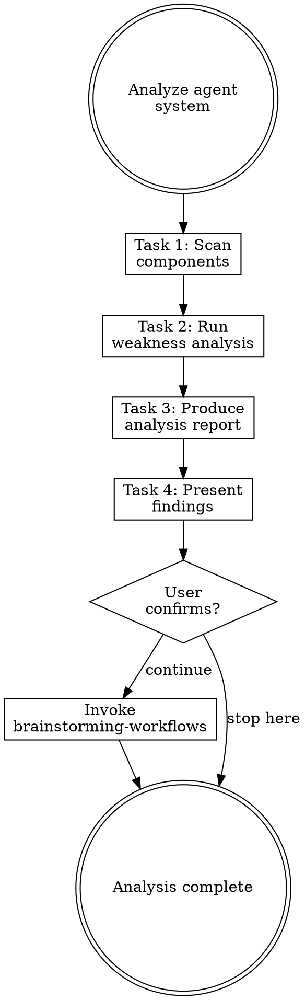

# Analyzing Agent Systems

## Overview

**Analyzing agent systems IS systematic weakness detection across all agent components.**

Scan every component (CLAUDE.md, rules, hooks, skills, agents), check against 8 weakness categories, produce a severity-rated report.

**Core principle:** You cannot fix what you haven't measured. Analyze before changing anything.

**Violating the letter of the rules is violating the spirit of the rules.**

## Task Initialization (MANDATORY)

Before ANY action, create task list using TaskCreate:

```
TaskCreate for EACH task below:
- Subject: "[analyzing-agent-systems] Task N: <action>"
- ActiveForm: "<doing action>"
```

**Tasks:**
1. Scan components
2. Run weakness analysis
3. Produce analysis report
4. Present findings to user

Announce: "Created 4 tasks. Starting execution..."

**Execution rules:**
1. `TaskUpdate status="in_progress"` BEFORE starting each task
2. `TaskUpdate status="completed"` ONLY after verification passes
3. If task fails → stay in_progress, diagnose, retry
4. NEVER skip to next task until current is completed
5. At end, `TaskList` to confirm all completed

## Task 1: Scan Components

**Goal:** Find all agent system components in the project.

**Scan locations:**
- `CLAUDE.md` (project root and `.claude/`)
- `.claude/rules/**/*.md`
- `.claude/settings.json` (hooks section)
- `.claude/skills/` or plugin skill directories
- `.claude/agents/` or subagent definitions
- `~/.claude/rules/` (user-level rules)

**For each component found, record:**
- Type (CLAUDE.md / rule / hook / skill / agent)
- Path
- Line count
- Brief purpose (from frontmatter or first heading)

**Verification:** Complete inventory of all components with paths and types.

## Task 2: Run Weakness Analysis

**Goal:** Check every component against the 8-category weakness checklist.

**CRITICAL:** Read [references/weakness-checklist.md](references/weakness-checklist.md) for the full checklist.

**For each weakness found, record:**
- Category (1-8)
- Severity: **CRITICAL** / **WARNING** / **INFO**
- Component affected
- Specific finding (what's wrong)
- Suggested fix (one sentence)

**Severity guidelines:**
| Severity | Criteria |
|----------|----------|
| CRITICAL | Blocks normal operation, causes errors, security risk |
| WARNING | Degrades experience, causes confusion, maintenance burden |
| INFO | Minor improvement, cosmetic, nice-to-have |

**Cross-component checks:**
- Compare all skill descriptions for overlap
- Check CLAUDE.md content against rules for duplication
- Check hook coverage against rule requirements
- Verify skill chain connections are complete

**Verification:** Every checklist item evaluated. At least one pass through each category.

## Task 3: Produce Analysis Report

**Goal:** Write structured report to `docs/agent-system/{timestamp}-analysis.md`.

**Report format:**

```markdown
# Agent System Analysis Report

**Date:** YYYY-MM-DD HH:MM
**Project:** [project name]

## Component Inventory

| # | Type | Path | Lines | Status |
|---|------|------|-------|--------|
| 1 | CLAUDE.md | ./CLAUDE.md | N | OK/NEEDS_FIX/MISSING |

## Weakness Findings

### CRITICAL (must fix)

| # | Category | Component | Finding | Suggested Fix |
|---|----------|-----------|---------|---------------|

### WARNING (should fix)

| # | Category | Component | Finding | Suggested Fix |
|---|----------|-----------|---------|---------------|

### INFO (nice to fix)

| # | Category | Component | Finding | Suggested Fix |
|---|----------|-----------|---------|---------------|

## Summary

- Components scanned: N
- Critical issues: N
- Warnings: N
- Info: N
```

**Verification:** Report written with all findings categorized by severity.

## Task 4: Present Findings to User

**Goal:** Show the user a concise summary and get confirmation.

**Present:**
1. Component count and types found
2. Critical issues (if any) — these need attention
3. Warnings — recommended fixes
4. Overall assessment (healthy / needs work / critical issues)

**Wait for user confirmation before proceeding.**

**Handoff:** After user confirms:
- "分析完成。要繼續進行工作流探索嗎？"
- If yes → invoke `brainstorming-workflows` skill, pass analysis report path as context

## Red Flags - STOP

These thoughts mean you're rationalizing. STOP and reconsider:

- "I can see the issues already, skip the checklist"
- "Only check the obvious categories"
- "Skip cross-component checks, they're probably fine"
- "Don't need a report, I'll just tell the user"
- "This component looks fine, skip detailed analysis"

**All of these mean: You're about to miss critical weaknesses. Follow the checklist.**

## Common Rationalizations

| Excuse | Reality |
|--------|---------|
| "I know the issues" | Systematic checklist catches what intuition misses. |
| "Only major issues matter" | INFO issues compound. Document everything. |
| "Skip the report" | Reports enable before/after comparison. Essential for refactoring. |
| "Cross-checks take too long" | Cross-component issues are the hardest to find later. Check now. |
| "One pass is enough" | Different categories reveal different issues. Check all 8. |

## Flowchart: Agent System Analysis



## References

- [references/weakness-checklist.md](references/weakness-checklist.md) — Full 8-category weakness checklist
