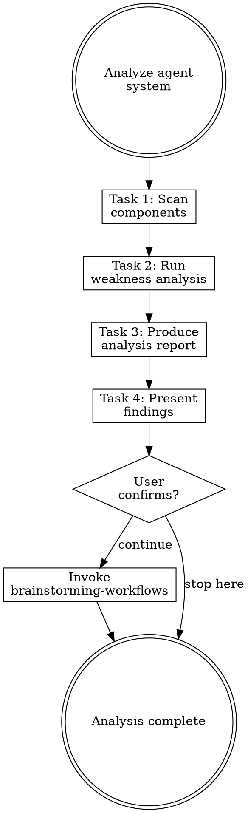

# Analyzing Agent Systems

## Overview

**Analyzing agent systems IS systematic weakness detection across all agent components.**

Scan every component (CLAUDE.md, rules, hooks, skills, agents), check against 11 weakness categories, produce a severity-rated report.

**Core principle:** You cannot fix what you haven't measured. Analyze before changing anything.

**Violating the letter of the rules is violating the spirit of the rules.**

## Routing

**Pattern:** Chain
**Handoff:** user-confirmation
**Next:** `brainstorming-workflows`
**Chain:** main

## Task Initialization (MANDATORY)

Before ANY action, create task list using TaskCreate:

```
TaskCreate for EACH task below:
- Subject: "[analyzing-agent-systems] Task N: <action>"
- ActiveForm: "<doing action>"
```

**Tasks:**
1. Scan components
2. Run weakness analysis
3. Produce analysis report
4. Present findings to user

Announce: "Created 4 tasks. Starting execution..."

**Execution rules:**
1. `TaskUpdate status="in_progress"` BEFORE starting each task
2. `TaskUpdate status="completed"` ONLY after verification passes
3. If task fails → stay in_progress, diagnose, retry
4. NEVER skip to next task until current is completed
5. At end, `TaskList` to confirm all completed

## Task 1: Scan Components

**Goal:** Find all agent system components in the project.

**Scan locations:**
- `CLAUDE.md` (project root and `.claude/`)
- `.claude/rules/**/*.md`
- `.claude/settings.json` (hooks section)
- `.claude/skills/` or plugin skill directories
- `.claude/agents/` or subagent definitions
- `~/.claude/rules/` (user-level rules)
- `~/.claude/CLAUDE.md` (user-level constitution)
- `~/.claude/skills/` (user-level skills)
- `.cursorrules`, `.github/copilot-instructions.md`, `.windsurfrules` (other AI tool configs)
- `.editorconfig`, linter configs (conventions that should be mirrored)

**For each component found, record:**
- Type (CLAUDE.md / rule / hook / skill / agent)
- Scope (user-root / project)
- Path
- Line count
- Brief purpose (from frontmatter or first heading)

**User-root gap analysis:**
Compare `~/.claude/rules/` against `.claude/rules/`:
- Which user-root rules have no project-level specialization?
- Which languages/frameworks are used in the project but have no matching rules or hooks?
- Does the project have a `settings.local.json` for sensitive data?

**Verification:** Complete inventory of all components with paths, types, and scope. Gap analysis between user-root and project level documented.

## Task 2: Run Weakness Analysis

**Goal:** Check every component against the 11-category weakness checklist.

**CRITICAL:** Read [references/weakness-checklist.md](references/weakness-checklist.md) for the full 11-category checklist.

**For each weakness found, record:**
- Category (1-11)
- Severity: **CRITICAL** / **WARNING** / **INFO**
- Component affected
- Specific finding (what's wrong)
- Suggested fix (one sentence)

**Severity guidelines:**
| Severity | Criteria |
|----------|----------|
| CRITICAL | Blocks normal operation, causes errors, security risk |
| WARNING | Degrades experience, causes confusion, maintenance burden |
| INFO | Minor improvement, cosmetic, nice-to-have |

**Cross-component checks:**
- Compare all skill descriptions for overlap
- Check CLAUDE.md content against rules for duplication
- Check hook coverage against rule requirements
- Verify skill chain connections are complete

**Verification:** Every checklist item evaluated. At least one pass through each category.

## Task 3: Produce Analysis Report

**Goal:** Write structured report to `docs/agent-system/{timestamp}-analysis.md`.

**CRITICAL:** Read [references/report-template.md](references/report-template.md) for the full report format.

**Rules Health Summary (include in report):**

```
## Rules Health Summary
| Metric                        | Value | Status |
|-------------------------------|-------|--------|
| CLAUDE.md lines               |       |        |
| Global rules count / lines    |       |        |
| Session-start total lines     |       |        |
| Path-scoped rules             |       |        |
| Rules with procedural content |       |        |
| Dead glob patterns            |       |        |
```

Thresholds: CLAUDE.md > 200 lines = WARNING. Session-start total > 300 = WARNING. Any dead glob = WARNING.

**Verification:** Report written with all findings categorized by severity.

## Task 4: Present Findings to User

**Goal:** Show the user the full analysis and get confirmation.

**Present ALL findings with detail.** Do NOT summarize into brief bullet points:
1. Component inventory: each component found, its type, and current state
2. Critical issues: what's wrong, why it matters, and suggested fix
3. Warnings: what could be improved and the impact of not fixing
4. Overall assessment with rationale

**Anti-pattern:** "Found 3 critical issues, 2 warnings" without explaining what they are is NOT presenting. The user must see enough detail to understand each finding.

**Wait for user confirmation before proceeding.**

**Handoff:** After user confirms:
- "分析完成。要繼續進行工作流探索嗎？"
- If yes → invoke `brainstorming-workflows` skill, pass analysis report path as context

## Red Flags - STOP

These thoughts mean you're rationalizing. STOP and reconsider:

| Thought | Reality |
|---------|---------|
| "I know the issues" | Systematic checklist catches what intuition misses. |
| "Only major issues matter" | INFO issues compound. Document everything. |
| "Skip the report" | Reports enable before/after comparison. Essential for refactoring. |
| "Cross-checks take too long" | Cross-component issues are the hardest to find later. Check now. |
| "One pass is enough" | Different categories reveal different issues. Check all 11. |

## Flowchart: Agent System Analysis



## References

- [references/weakness-checklist.md](references/weakness-checklist.md) — Full 11-category weakness checklist
- [references/report-template.md](references/report-template.md) — Analysis report document format
