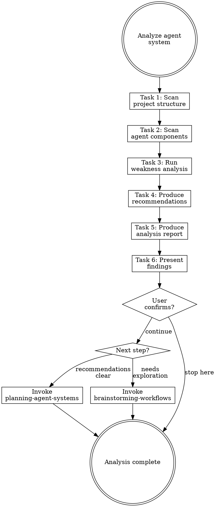

# Analyzing Agent Systems

## Overview

**Analyzing agent systems IS understanding the project context, detecting weaknesses, and producing actionable restructuring recommendations.**

Scan the project structure, inventory every agent component (CLAUDE.md, rules, hooks, skills, agents), check against 11 weakness categories, generate restructuring recommendations, and produce a severity-rated report.

**Core principle:** Analyze the project first, then the agent system. Recommendations without project context are guesses.

**Violating the letter of the rules is violating the spirit of the rules.**

## Routing

**Pattern:** Chain
**Handoff:** user-confirmation
**Next:** `planning-agent-systems` (if recommendations are clear) or `brainstorming-workflows` (if more exploration needed)
**Chain:** main

## Task Initialization (MANDATORY)

Before ANY action, create task list using TaskCreate:

```
TaskCreate for EACH task below:
- Subject: "[analyzing-agent-systems] Task N: <action>"
- ActiveForm: "<doing action>"
```

**Tasks:**
1. Scan project structure
2. Scan agent components
3. Run weakness analysis
4. Produce restructuring recommendations
5. Produce analysis report
6. Present findings to user

Announce: "Created 6 tasks. Starting execution..."

**Execution rules:**
1. `TaskUpdate status="in_progress"` BEFORE starting each task
2. `TaskUpdate status="completed"` ONLY after verification passes
3. If task fails → stay in_progress, diagnose, retry
4. NEVER skip to next task until current is completed
5. At end, `TaskList` to confirm all completed

## Task 1: Scan Project Structure

**Goal:** Understand the project before analyzing its agent system.

**CRITICAL:** Read [references/project-scanning.md](references/project-scanning.md) for the full scanning guide.

**Scan areas:**
- Language and framework detection (package.json, Cargo.toml, go.mod, pyproject.toml, etc.)
- Project type inference (monorepo, library, application, CLI tool, etc.)
- Dev workflow detection (CI/CD configs, Makefile, scripts/, etc.)
- Team scale signals (CODEOWNERS, contributing guides, PR templates, branch protection)

**Record findings in Project Overview format:**
- Primary language(s) and framework(s)
- Project type and structure
- Build and test tooling
- Dev workflow and CI/CD
- Team size signals
- Notable conventions or constraints

**Verification:** Project overview complete with all aspects filled.

## Task 2: Scan Agent Components

**Goal:** Find all agent system components in the project.

**Scan locations:**
- `CLAUDE.md` (project root and `.claude/`)
- `.claude/rules/**/*.md`
- `.claude/settings.json` (hooks section)
- `.claude/skills/` or plugin skill directories
- `.claude/agents/` or subagent definitions
- `~/.claude/rules/` (user-level rules)
- `~/.claude/CLAUDE.md` (user-level constitution)
- `~/.claude/skills/` (user-level skills)
- `.cursorrules`, `.github/copilot-instructions.md`, `.windsurfrules` (other AI tool configs)
- `.editorconfig`, linter configs (conventions that should be mirrored)

**For each component found, record:**
- Type (CLAUDE.md / rule / hook / skill / agent)
- Scope (user-root / project)
- Path
- Line count
- Brief purpose (from frontmatter or first heading)

**User-root gap analysis:**
Compare `~/.claude/rules/` against `.claude/rules/`:
- Which user-root rules have no project-level specialization?
- Which languages/frameworks are used in the project but have no matching rules or hooks?
- Does the project have a `settings.local.json` for sensitive data?

**Verification:** Complete inventory of all components with paths, types, and scope. Gap analysis between user-root and project level documented.

## Task 3: Run Weakness Analysis

**Goal:** Check every component against the 11-category weakness checklist.

**CRITICAL:** Read [references/weakness-checklist.md](references/weakness-checklist.md) for the full 11-category checklist.

**For each weakness found, record:**
- Category (1-11)
- Severity: **CRITICAL** / **WARNING** / **INFO**
- Component affected
- Specific finding (what's wrong)
- Suggested fix (one sentence)

**Severity guidelines:**
| Severity | Criteria |
|----------|----------|
| CRITICAL | Blocks normal operation, causes errors, security risk |
| WARNING | Degrades experience, causes confusion, maintenance burden |
| INFO | Minor improvement, cosmetic, nice-to-have |

**Cross-component checks:**
- Compare all skill descriptions for overlap
- Check CLAUDE.md content against rules for duplication
- Check hook coverage against rule requirements
- Verify skill chain connections are complete

**Pipeline checks:**
- Scan all skill handoff definitions, build skill call graph
- Detect chain breaks: skill A hands off to B, but B doesn't exist or doesn't accept A's output
- Detect orphan nodes: skill with no inbound handoffs and not an entry point
- Detect dead ends: skill with no handoff and no explicit termination
- Check state persistence: does each pipeline have state files/directory for recoverability?
- Classify pipeline mode: owner-pipe vs chain-pipe, check for mode mismatch

**Verification:** Every checklist item evaluated. At least one pass through each category. Pipeline checks complete.

## Task 4: Produce Restructuring Recommendations

**Goal:** Transform weakness findings and project overview into actionable recommendations.

**CRITICAL:** Read [references/restructuring-guide.md](references/restructuring-guide.md) for the full recommendation guide.

**Generate recommendations by type:**

**Merge recommendations:**
- Overlapping skills that should be consolidated
- Redundant rules covering the same concern
- Duplicate content across CLAUDE.md and rules

**Extract recommendations:**
- CLAUDE.md sections that should be extracted to rules (scoped or global)
- Monolithic rules that should be split by concern

**Pipeline recommendations:**
- Pipeline design based on project type (monorepo vs single-app vs library)
- Pipeline mode selection (owner-pipe vs chain-pipe) with rationale
- State persistence strategy for recoverability

**Traceability requirement:** Every recommendation must trace to a specific weakness finding or project characteristic.
Do NOT generate recommendations that lack a traced reason.

**Record for each recommendation:**
- Type (merge / extract / pipeline / new / remove)
- Affected files (paths)
- Traced reason (which weakness or project characteristic)
- Priority (high / medium / low)
- Effort estimate (small / medium / large)

**Verification:** All recommendations have type, affected files, traced reason, and priority.

## Task 5: Produce Analysis Report

**Goal:** Write structured report to `docs/agent-system/{timestamp}-analysis.md`.

**CRITICAL:** Read [references/report-template.md](references/report-template.md) for the full 6-section report format.

**Report sections:**
1. **Project Overview** — language, framework, project type, team signals
2. **Component Inventory** — all components with type, scope, path, line count
3. **Weakness Findings** — categorized by severity, with category and suggested fix
4. **Restructuring Recommendations** — grouped by type, with traceability
5. **Rules Health Summary** — metrics table with threshold alerts
6. **Summary** — overall assessment and recommended next steps

**Rules Health Summary (include in report):**

```
## Rules Health Summary
| Metric                        | Value | Status |
|-------------------------------|-------|--------|
| CLAUDE.md lines               |       |        |
| Global rules count / lines    |       |        |
| Session-start total lines     |       |        |
| Path-scoped rules             |       |        |
| Rules with procedural content |       |        |
| Dead glob patterns            |       |        |
```

Thresholds: CLAUDE.md > 200 lines = WARNING. Session-start total > 300 = WARNING. Any dead glob = WARNING.

**Verification:** Report written with all 6 sections complete.

## Task 6: Present Findings to User

**Goal:** Show the user the full analysis AND restructuring recommendations.

**Present ALL findings with detail.** Do NOT summarize into brief bullet points:
1. Project overview: language, framework, project type, notable conventions
2. Component inventory: each component found, its type, and current state
3. Critical issues: what's wrong, why it matters, and suggested fix
4. Warnings: what could be improved and the impact of not fixing
5. Restructuring recommendations: grouped by priority (high → medium → low)
6. Overall assessment with rationale

**Anti-pattern:** "Found 3 critical issues, 2 warnings" without explaining what they are is NOT presenting. The user must see enough detail to understand each finding.

**Wait for user confirmation before proceeding.**

**Handoff:** After user confirms, ask user to choose next step:
- "建議明確，直接進入規劃" → invoke `planning-agent-systems` skill, pass analysis report path as context
- "需要進一步探索" → invoke `brainstorming-workflows` skill, pass analysis report path as context

## Red Flags - STOP

These thoughts mean you're rationalizing. STOP and reconsider:

- "I know the issues"
- "I know the project type"
- "Only major issues matter"
- "Skip the report"
- "Skip project scanning"
- "Cross-checks take too long"
- "One pass is enough"
- "Recommendations are obvious"

## Common Rationalizations

| Thought | Reality |
|---------|---------|
| "I know the issues" | Systematic checklist catches what intuition misses. |
| "I know the project type" | package.json alone doesn't tell you it's a monorepo. Scan properly. |
| "Only major issues matter" | INFO issues compound. Document everything. |
| "Skip the report" | Reports enable before/after comparison. Essential for refactoring. |
| "Skip project scanning" | Recommendations without project context are guesses. Scan first. |
| "Cross-checks take too long" | Cross-component issues are the hardest to find later. Check now. |
| "One pass is enough" | Different categories reveal different issues. Check all 11. |
| "Recommendations are obvious" | Obvious to you isn't obvious to the user. Document with traceability. |

## Flowchart: Agent System Analysis



## References

- [references/project-scanning.md](references/project-scanning.md) — Project structure scanning guide
- [references/weakness-checklist.md](references/weakness-checklist.md) — Full 11-category weakness checklist
- [references/restructuring-guide.md](references/restructuring-guide.md) — Recommendation generation guide
- [references/report-template.md](references/report-template.md) — Analysis report document format
