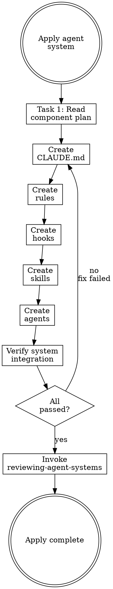

# Applying Agent Systems

## Overview

**Applying agent systems IS orchestrating writing-* skill invocations in the correct order.**

Read the component plan, invoke the appropriate writing-* skill for each component, verify each one succeeds before moving to the next.

**Core principle:** Never create components directly. Always invoke the writing-* skill. Skills encode best practices that direct creation bypasses.

**Violating the letter of the rules is violating the spirit of the rules.**

## Routing

**Pattern:** Chain
**Handoff:** user-confirmation
**Next:** `reviewing-agent-systems`
**Chain:** main

## Task Initialization (MANDATORY)

Before ANY action, create task list using TaskCreate:

```
TaskCreate for EACH task below:
- Subject: "[applying-agent-systems] Task N: <action>"
- ActiveForm: "<doing action>"
```

**Tasks:**
1. Read component plan
2. Execute component creation (one task per component from plan)
3. Verify system integration

Announce: "Created N tasks. Starting execution..."

**Execution rules:**
1. `TaskUpdate status="in_progress"` BEFORE starting each task
2. `TaskUpdate status="completed"` ONLY after verification passes
3. If task fails → stay in_progress, diagnose, retry
4. NEVER skip to next task until current is completed
5. At end, `TaskList` to confirm all completed

## Task 1: Read Component Plan

**Goal:** Load the component plan and prepare execution order.

**Read:** `docs/agent-system/*-plan.md` (most recent)

**Create a TaskCreate for each component** in the plan's execution order:
- "[applying] Create CLAUDE.md"
- "[applying] Create rule: [name]"
- "[applying] Create hook: [name]"
- etc.

**Verification:** All components from plan have corresponding tasks.

## Task 2+: Execute Component Creation

**Goal:** For each component in order, invoke the correct writing-* skill.

**Execution order (MUST follow):**
1. CLAUDE.md → invoke `writing-claude-md`
2. Rules → invoke `writing-rules` (one per rule)
3. Hooks → invoke `writing-hooks` (one per hook)
4. Skills → invoke `writing-skills` (one per skill)
5. Agents → invoke `writing-subagents` (one per agent)

**For each component:**
1. Invoke the writing-* skill with the plan's specifications
2. Wait for skill to complete
3. Verify the component was created correctly
4. Mark task complete
5. Move to next component

**CRITICAL CONSTRAINTS:**

- **All writes happen in main conversation.** NEVER delegate writing-* skill invocations to subagents. Subagents cannot reliably write to `.claude/` directories.
- **One component at a time.** Don't batch. Each writing-* skill has its own TDD process.
- **Pass plan context.** When invoking a writing-* skill, provide the relevant section from the component plan as context.

**Verification:** Each component exists and passes the writing-* skill's own validation.

## Final Task: Verify System Integration

**Goal:** Verify all components work together.

**Checklist:**
- [ ] CLAUDE.md exists and is under 200 lines
- [ ] All planned rules exist with correct `paths:` globs
- [ ] All planned hooks are registered in `.claude/settings.json`
- [ ] Hooks return correct exit codes (test with sample input)
- [ ] All planned skills have valid frontmatter
- [ ] No conflicts between CLAUDE.md and rules
- [ ] No duplicate logic across components

**Handoff:** "所有元件已建立並驗證。要進行品質審查嗎？"
- If yes → invoke `reviewing-agent-systems` skill

**Verification:** All checklist items pass.

## Red Flags - STOP

These thoughts mean you're rationalizing. STOP and reconsider:

- "I can write this component directly, skip the writing-* skill"
- "Dispatch a subagent to write the rule"
- "Create multiple components in parallel"
- "Skip verification, the writing-* skill handles it"
- "Deviate from the plan, I have a better idea"

**All of these mean: You're about to bypass quality gates. Follow the process.**

## Common Rationalizations

| Excuse | Reality |
|--------|---------|
| "Write directly" | Writing-* skills encode TDD + review. Bypass = weak components. |
| "Use subagent" | Subagents can't write to `.claude/`. Will silently fail. |
| "Parallel creation" | Components depend on each other. CLAUDE.md before rules before hooks. |
| "Skip verification" | Integration issues only appear when components interact. Verify. |
| "Better idea" | The plan was user-approved. Discuss changes, don't silently deviate. |

## Flowchart: Applying Agent System


