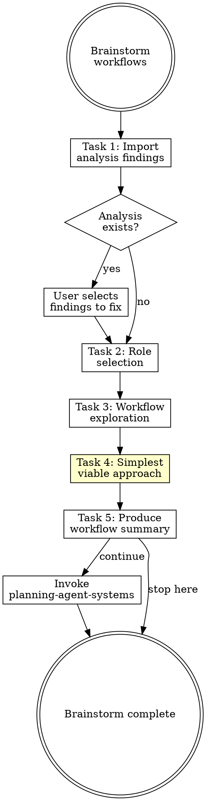

# Brainstorming Workflows

## Overview

**Brainstorming workflows IS understanding the human before designing the system.**

Use role templates to quickly identify the user's context, then explore their specific workflows one question at a time. Don't assume the user is a developer — they may use the agent system for project management, content creation, data analysis, or other work.

**Core principle:** The agent system must serve the user's actual workflows, not an imagined ideal.

**Violating the letter of the rules is violating the spirit of the rules.**

## Routing

**Pattern:** Chain
**Handoff:** user-confirmation
**Next:** `planning-agent-systems`
**Chain:** main

## Task Initialization (MANDATORY)

Before ANY action, create task list using TaskCreate:

```
TaskCreate for EACH task below:
- Subject: "[brainstorming-workflows] Task N: <action>"
- ActiveForm: "<doing action>"
```

**Tasks:**
1. Import analysis findings (if available)
2. Role selection
3. Workflow exploration
4. Identify simplest viable approach
5. Produce workflow summary

Announce: "Created 5 tasks. Starting execution..."

**Execution rules:**
1. `TaskUpdate status="in_progress"` BEFORE starting each task
2. `TaskUpdate status="completed"` ONLY after verification passes
3. If task fails → stay in_progress, diagnose, retry
4. NEVER skip to next task until current is completed
5. At end, `TaskList` to confirm all completed

## Task 1: Import Analysis Findings (if available)

**Goal:** If an analysis report exists, bring its findings into the conversation.

**If analysis report path was provided:**
1. Read the analysis report
2. Summarize critical and warning findings
3. Ask user: "分析發現以下弱點，是否要在這次一併修補？"
4. Present findings as a checklist for user to select
5. Record selected items → these become requirements in the workflow summary

**If no analysis report:** Skip to Task 2.

**This allows skipping questions already answered by analysis.** For example:
- Analysis found "no linting hook" → skip asking about code quality tools
- Analysis found "CLAUDE.md > 200 lines" → skip asking about constitution preferences

**Verification:** User has confirmed which findings to address (or no analysis exists).

## Task 2: Role Selection

**Goal:** Identify the user's primary role to guide exploration.

**Present the role table:**

| Role | Typical Workflows |
|------|-------------------|
| **A) Software Developer** | coding, testing, code review, CI/CD, deployment |
| **B) Project Manager** | task tracking, reporting, scheduling, communication |
| **C) Content Creator** | writing, translation, publishing, social media |
| **D) Data Analyst** | data processing, visualization, reporting, automation |
| **E) Operations / DevOps** | monitoring, deployment, incident response, IaC |
| **F) Custom** | describe your role |

**Ask:** "你的角色最接近哪一個？選擇字母即可。"

**Verification:** User has selected a role.

## Task 3: Workflow Exploration

**Goal:** Explore the user's specific workflows one question at a time.

**CRITICAL:** Read [references/role-templates.md](references/role-templates.md) for role-specific deep-dive questions.

**Rules:**
- **One question at a time** — never ask multiple questions in one message
- **Skip questions answered by analysis** — don't re-ask what we already know
- **Multiple choice when possible** — easier for user to answer
- **Adapt to answers** — if user reveals something unexpected, explore it
- **5-8 questions maximum** — don't exhaust the user
- **Ask about failures** — "What have you tried before? What didn't work?" reveals more than "What do you want?"
- **Ask for a walkthrough** — "Walk me through the last time you did X, step by step" beats generic "What tools do you use?"

**After workflow exploration, classify into two layers:**

**Layer 1 — Anthropic workflow patterns** (how workflows execute):
Read [references/anthropic-patterns.md](references/anthropic-patterns.md) for the six patterns and their signal phrases from user answers.

**Layer 2 — Skill routing patterns** (how skills connect):
Read [references/routing-patterns.md](references/routing-patterns.md) for Tree/Chain/Node/Skill Steps classification.

**Verification:** Have enough information to map workflows to BOTH Anthropic patterns and skill routing patterns.

## Task 4: Identify Simplest Viable Approach

**Goal:** Before producing the summary, challenge every workflow for simplicity.

**Core question:** "What is the simplest approach that works for each workflow?"

Anthropic's guidance: "Success in the LLM space isn't about building the most sophisticated system. It's about building the right level of complexity for your needs."

**For each workflow, ask:**
1. Can this be solved with a single CLAUDE.md instruction instead of a skill?
2. Can this be a rule instead of a hook?
3. Can this be a simple prompt chain instead of a multi-agent orchestration?
4. Does this need a custom skill, or does an existing skill/plugin already handle it?

Read [references/anthropic-patterns.md](references/anthropic-patterns.md) for the complexity ladder (Levels 1-6). Prefer the lowest level that works.

**Present the assessment to the user:** Show each workflow with its proposed complexity level and ask if they agree. Users often accept over-engineering without questioning — push back gently.

**Verification:** Every workflow has an assigned complexity level, and the user has confirmed the approach.

## Task 5: Produce Workflow Summary

**Goal:** Write structured summary to `docs/agent-system/{timestamp}-workflows.md`.

**CRITICAL:** Read [references/summary-template.md](references/summary-template.md) for the full summary format.

**Handoff:** "工作流摘要完成。要繼續規劃 agent system 元件嗎？"
- If yes → invoke `planning-agent-systems` skill, pass workflow summary path

**Verification:** Summary written with all workflows mapped to components.

## Red Flags - STOP

These thoughts mean you're rationalizing. STOP and reconsider:

- "Obviously a developer"
- "I know the workflows"
- "Multiple questions saves time"
- "Skip analysis"
- "Summary is overhead"
- "This needs a skill"
- "Skip past failures"

## Common Rationalizations

| Thought | Reality |
|---------|---------|
| "Obviously a developer" | PMs, analysts, creators all use agent systems. Ask. |
| "I know the workflows" | You know common workflows. Theirs may differ. |
| "Multiple questions saves time" | Multiple questions overwhelm. One at a time. |
| "Skip analysis" | Analysis findings prevent redundant questions. Use them. |
| "Summary is overhead" | Summary is the contract for planning. Essential. |
| "This needs a skill" | Most workflows need less than you think. Check the complexity ladder. |
| "Skip past failures" | Past failures are the highest-value context. Always ask. |

## Flowchart: Workflow Brainstorming



## References

- [references/role-templates.md](references/role-templates.md) — Role-specific deep-dive questions and component mappings
- [references/anthropic-patterns.md](references/anthropic-patterns.md) — Six Anthropic workflow patterns and complexity ladder
- [references/summary-template.md](references/summary-template.md) — Workflow summary document format
