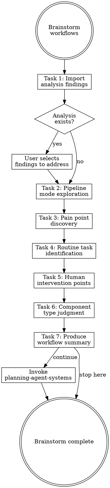

# Brainstorming Workflows

## Overview

**Brainstorming workflows IS targeted exploration of how users actually work, what frustrates them, and what can be automated.**

The analysis report tells you what the system looks like; brainstorming tells you what the user needs.
These are different data sources — never skip one because the other exists.

**Core principle:** Ask about failures before wishes.

**Violating the letter of the rules is violating the spirit of the rules.**

## Routing

**Pattern:** Chain
**Handoff:** user-confirmation
**Next:** `planning-agent-systems`
**Chain:** main

## Task Initialization (MANDATORY)

Before ANY action, create task list using TaskCreate:

```
TaskCreate for EACH task below:
- Subject: "[brainstorming-workflows] Task N: <action>"
- ActiveForm: "<doing action>"
```

**Tasks:**
1. Import analysis findings
2. Pipeline mode exploration
3. Pain point discovery
4. Routine task identification
5. Human intervention point discovery
6. Component type judgment
7. Produce workflow summary

Announce: "Created 7 tasks. Starting execution..."

**Execution rules:**
1. `TaskUpdate status="in_progress"` BEFORE starting each task
2. `TaskUpdate status="completed"` ONLY after verification passes
3. If task fails → stay in_progress, diagnose, retry
4. NEVER skip to next task until current is completed
5. At end, `TaskList` to confirm all completed

## Task 1: Import Analysis Findings

**Goal:** Load analysis report and let user select which findings to address.

**If analysis report path was provided:**
1. Read the analysis report
2. Present restructuring recommendations grouped by priority
3. Ask: "The analysis report suggests these improvements. Which ones do you want to address this time?"
4. Present as checklist for user to select
5. Selected items become requirements in workflow summary

**If no analysis report:** Note that no analysis was done, proceed to Task 2.

**Skip questions in later tasks that the analysis already answered.**

**Verification:** User has confirmed which findings to address (or no analysis exists).

## Task 2: Pipeline Mode Exploration

**Goal:** Determine how workflows connect and what state management they need.

**CRITICAL:** Read [references/exploration-questions.md](references/exploration-questions.md) for the question bank (Pipeline section).

**Rules:**
- Ask **ONE question at a time** about workflow entry points, step counts, work scope
- Classify each workflow as **owner-pipe** or **chain-pipe**
- Determine if script-managed state is needed (based on step count + work scope)
- Skip questions answered by the analysis report

**Verification:** Each identified workflow has mode + state management decision.

## Task 3: Pain Point Discovery

**Goal:** Find where the current agent system fails or is missing.

**CRITICAL:** Read [references/exploration-questions.md](references/exploration-questions.md) for the question bank (Pain Point section).

**Rules:**
- Ask about past failures, missing automation, repeated corrections
- For each pain point, note the likely component type (rule / hook / skill / CLAUDE.md)
- Ask **ONE question at a time**

**Verification:** Pain points documented with root cause and component type.

## Task 4: Routine Task Identification

**Goal:** Find repetitive small tasks that could be automated.

**CRITICAL:** Read [references/exploration-questions.md](references/exploration-questions.md) for the question bank (Routine Task section).

**Rules:**
- Ask about daily repetitive work, search patterns, format/check tasks
- For each task, note automation approach and component type
- Ask **ONE question at a time**

**Verification:** Routine tasks documented with automation approach.

## Task 5: Human Intervention Point Discovery

**Goal:** Find where humans must review, approve, or intervene in the workflows.

**CRITICAL:** Read [references/exploration-questions.md](references/exploration-questions.md) for the question bank (Human-in-the-Loop section).

**Rules:**
- Ask about irreversible operations, external visibility, trust boundaries
- For each intervention point, note the type: **review checkpoint** / **confirmation gate** / **guardrail trigger**
- These findings directly affect Task 6 — intervention points determine which components need `user-confirmation` handoff vs auto-invoke
- Ask **ONE question at a time**

**Required question — quality gate loop:**

Ask: "When a reviewer reports issues, do you want fixes applied automatically before re-reviewing (auto loop), or do you want to confirm each fix before continuing (manual loop)?"

Record the answer — this determines whether review skills use `auto-invoke` or `user-confirmation` handoff to the next fixing step.

**Verification:** Intervention points documented with type and affected workflow step. Quality gate loop preference recorded.

## Task 6: Component Type Judgment

**Goal:** Map every discovered need to the right component type.

For each pain point, routine task, intervention point, and analysis finding:
- Behavioral constraint → **rule**
- Automated check → **hook** (PostToolUse or PreToolUse)
- Multi-step workflow → **skill**
- Independent execution → **agent** (subagent)
- Simple instruction → **CLAUDE.md** addition

**Present the mapping to user for confirmation.**

Challenge any over-engineering: "Can this be a rule instead of a skill?"

Read [references/anthropic-patterns.md](references/anthropic-patterns.md) for the complexity ladder — prefer lowest level that works.

**Verification:** Every need mapped to component type, user confirmed.

## Task 7: Produce Workflow Summary

**Goal:** Write structured summary to `docs/agent-system/{timestamp}-workflows.md`.

**CRITICAL:** Read [references/summary-template.md](references/summary-template.md) for the full summary format.

**Include:** pipeline mode mapping, pain points, routine tasks, human intervention points, component recommendations.

**Handoff:** "Workflow summary complete. Continue to plan agent system components?"
- If yes → invoke `planning-agent-systems` skill, pass workflow summary path

**Verification:** Summary written with all sections filled.

## Red Flags - STOP

These thoughts mean you're rationalizing. STOP and reconsider:

- "I already know from the analysis"
- "Skip the questions"
- "Multiple questions saves time"
- "This obviously needs a skill"
- "Skip past failures"
- "The user knows what they want"

## Common Rationalizations

| Thought | Reality |
|---------|---------|
| "I already know from the analysis" | Analysis finds system weaknesses. Users reveal workflow needs. Different data. |
| "Skip the questions" | Questions surface needs that code scanning can never find. |
| "Multiple questions saves time" | Multiple questions overwhelm. One at a time. |
| "This obviously needs a skill" | Most workflows need less than you think. Check the complexity ladder. |
| "Skip past failures" | Past failures are the highest-value context. Always ask. |
| "The user knows what they want" | Users describe solutions, not problems. Dig for the actual need. |

## Flowchart: Workflow Brainstorming



## References

- [references/exploration-questions.md](references/exploration-questions.md) — Targeted exploration question bank
- [references/anthropic-patterns.md](references/anthropic-patterns.md) — Six Anthropic workflow patterns and complexity ladder
- [references/routing-patterns.md](references/routing-patterns.md) — Pipeline mode classification (owner-pipe, chain-pipe)
- [references/summary-template.md](references/summary-template.md) — Workflow summary document format
