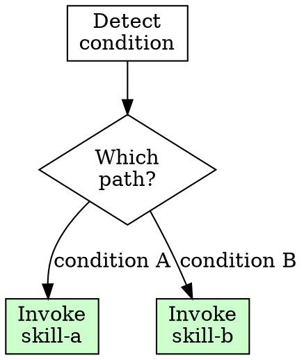
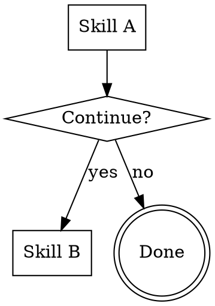
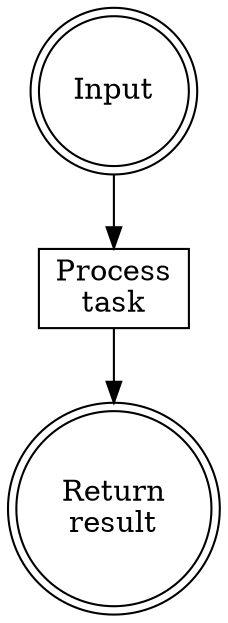
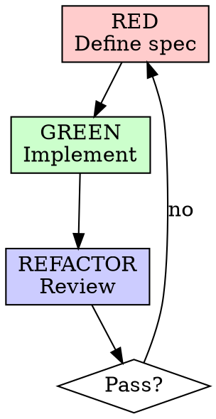

# Routing Patterns Reference

Agent system 中的 skill 路由有四種模式。設計工作流時，每個 skill 必須明確選擇一種模式。

## 四種路由模式

### 1. Tree（決策樹）

**定義：** 包含決策點，根據條件分支路由到不同 skill。

**特徵：**
- Flowchart 含 diamond 決策節點
- 至少 2 條分支路徑
- 決策基於偵測或分類結果
- 自動調用（決策點不需用戶確認）

**適用場景：** 偵測器、分類器、路由器

**Handoff 模板：**
```markdown
**Route:** Based on [decision]:
- [condition A] → invoke `skill-a`
- [condition B] → invoke `skill-b`
```

**Flowchart 片段：**


**本插件範例：**
- `migrating-agent-systems` — 偵測 existing/new → 路由到 analyzing 或 brainstorming
- `refactoring-skills` — 分類 keep/refactor/merge/delete → 路由到對應動作
- `reflecting` — 分類 law/skill/rule/doc → 路由到對應 writing-* skill

---

### 2. Chain（鏈式）

**定義：** 多個 skill 串聯組成完整工作流，有明確的主入口和順序。

**特徵：**
- 線性流程，每個 skill 完成後 handoff 到下一個
- 有主入口（entry point）
- 考慮 skill 複用（同一 skill 可被多條 chain 調用）
- Handoff 可設為用戶確認或自動調用

**適用場景：** 完整工作流（設計→規劃→實作→審查→重構）

**Handoff 模板（用戶確認）：**
```markdown
**Handoff:** "[完成摘要]。要繼續[下一步]嗎？"
- If yes → invoke `next-skill` skill, pass [artifact-path]
- If no → end
```

**Handoff 模板（自動調用）：**
```markdown
**Handoff:** Invoke `next-skill` skill, pass [artifact-path]
```

**何時用戶確認 vs 自動調用：**
- 用戶確認：進入長 chain、產出重大變更、需要用戶審閱中間產物
- 自動調用：chain 內部步驟、用戶已在入口確認過、變更風險低

**Flowchart 片段：**


**本插件 Chain 清單：**

| Chain | 入口 | 流程 |
|-------|------|------|
| main | migrating-agent-systems | analyzing → brainstorming → planning → applying → reviewing → refactoring |
| bootstrap | initializing-projects | bootstrap → brainstorming → planning → applying → reviewing → refactoring |
| maintenance | refactoring-skills | discover → analyze → classify → execute → extract → validate → report |

---

### 3. Node（節點）

**定義：** 單一任務，獨立執行，無外部 handoff。

**特徵：**
- 終端 skill，不 handoff 到其他 skill
- 可使用 `context: fork` 隔離執行環境
- 簡單分析工作可降級使用 `model: haiku`
- 結果直接回傳給用戶或調用者

**適用場景：** 分析、分類、驗證、輕量查詢

**Frontmatter 考量：**
```yaml
# 分析型 Node — fork + haiku
context: fork
agent: Explore
model: haiku

# 需要推理的 Node — fork only
context: fork
agent: Plan
```

**Flowchart 片段：**


**本插件範例：**
- `advising-architecture` — fork + Explore，分類元件類型
- `improving-skills` — 單一 skill 優化，無 handoff

---

### 4. Skill Steps（步驟式）

**定義：** 單一 skill 包含內部步驟流程，使用 Task Initialization 管理。

**特徵：**
- 內部步驟有驗證閘門（verification）
- 使用 reference link 載入必要文件（按需）
- 不 handoff 到外部 skill（可調用 reviewer subagent）
- 大型工作可存暫存文件到工作空間

**適用場景：** TDD 工作流、腳手架、建立單一元件

**Context 載入策略：**
- Reference link `[file.md](references/file.md)` — 按需載入，省 token（預設）
- `!cat references/file.md` — 強制在特定步驟載入（僅當必須在該步驟使用時）

**暫存文件慣例：**
- 路徑：`docs/agent-system/{YYYYMMDD-HHMM}-{artifact-type}.md`
- 類型：`analysis`, `workflows`, `plan`, `review-report`, `refactoring-report`
- 目的：跨 skill 傳遞 context、保留歷史紀錄

**Flowchart 片段（TDD）：**


**本插件範例：**
- `writing-skills` — TDD: RED → GREEN → REFACTOR
- `writing-claude-md` / `writing-rules` / `writing-hooks` / `writing-subagents` — 同上
- `creating-plugins` / `refactoring-plugins` — 內部步驟流程

---

## 路由模式選擇指南

```
設計新 skill 時，問自己：

這個 skill 需要根據條件選擇不同路徑嗎？
├─ Yes → Tree
│   需要路由到不同 skill（不只是內部分支）
│
└─ No → 這個 skill 是多步工作流的一部分嗎？
    ├─ Yes → Chain
    │   有明確的前置和後續 skill
    │
    └─ No → 這個 skill 只做一件事嗎？
        ├─ Yes, 且很簡單 → Node
        │   考慮 context: fork、model: haiku
        │
        └─ Yes, 但有內部步驟 → Skill Steps
            使用 Task Initialization 管理步驟
```

## Skill Routing 區段標準

每個 SKILL.md 在 Overview 之後、Task Initialization 之前，必須包含：

```markdown
## Routing

**Pattern:** Tree | Chain | Node | Skill Steps
**Handoff:** auto-invoke | user-confirmation | none
**Next:** `skill-name` | none
**Chain:** chain-name (if applicable)
```

## 全局路由圖

```
Entry Points:
  migrating-agent-systems (Tree) ──┐
  initializing-projects (Chain) ───┤
  refactoring-skills (Tree) ───────┤
                                    ▼
Main Chain:
  analyzing → brainstorming → planning → applying → reviewing → refactoring
                                            │
                                            ▼ (invokes)
                                    writing-claude-md
                                    writing-rules
                                    writing-hooks
                                    writing-skills
                                    writing-subagents

Standalone:
  advising-architecture (Node)
  improving-skills (Node)
  reflecting (Tree)
  creating-plugins (Skill Steps)
  refactoring-plugins (Skill Steps)
```
