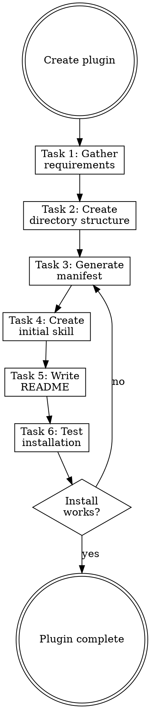

# Creating Plugins

## Overview

**Creating plugins IS scaffolding a distributable skill package.**

Plugins contain skills, commands, agents, and rules that can be installed via `claude plugin add`.

**Core principle:** Plugins are reusable across projects. Keep them focused and well-documented.

**Violating the letter of the rules is violating the spirit of the rules.**

## Task Initialization (MANDATORY)

Before ANY action, create task list using TaskCreate:

```
TaskCreate for EACH task below:
- Subject: "[creating-plugins] Task N: <action>"
- ActiveForm: "<doing action>"
```

**Tasks:**
1. Gather requirements
2. Create directory structure
3. Generate plugin manifest
4. Create initial skill
5. Write README
6. Test installation

Announce: "Created 6 tasks. Starting execution..."

**Execution rules:**
1. `TaskUpdate status="in_progress"` BEFORE starting each task
2. `TaskUpdate status="completed"` ONLY after verification passes
3. If task fails → stay in_progress, diagnose, retry
4. NEVER skip to next task until current is completed
5. At end, `TaskList` to confirm all completed

## Task 1: Gather Requirements

**Goal:** Understand what the plugin should contain.

**Questions to ask:**
- What is the plugin name? (kebab-case)
- What capability does it provide?
- What skills should it include?
- Who is the author?

**Naming rules:**
- Kebab-case only: `my-plugin`
- Avoid: `helper`, `utils`, `anthropic`, `claude`
- Max 64 characters

**Verification:** Can state plugin name and purpose in one sentence.

## Task 2: Create Directory Structure

**Goal:** Scaffold the plugin directory.

### Plugin Structure

```
<plugin-name>/
├── .claude-plugin/
│   └── plugin.json      # Manifest
├── skills/
│   └── <skill-name>/
│       └── SKILL.md
├── commands/            # Optional
│   └── <command>.md
├── agents/              # Optional
│   └── <agent>.md
└── README.md
```

**Verification:** Directory structure created with all required paths.

## Task 3: Generate Plugin Manifest

**Goal:** Create the plugin.json manifest file.

### Manifest Format

```json
{
  "name": "plugin-name",
  "description": "What this plugin does",
  "version": "1.0.0",
  "author": "Author Name",
  "skills": []
}
```

**Fields:**

| Field | Required | Description |
|-------|----------|-------------|
| `name` | Yes | Plugin identifier (kebab-case) |
| `description` | Yes | One-line description |
| `version` | Yes | Semantic version |
| `author` | No | Author name or org |
| `skills` | No | Leave empty for auto-discovery |

**Note:** Skills are auto-discovered from `skills/*/SKILL.md`. Only specify explicitly if you need to limit which skills are exposed.

**Verification:** plugin.json is valid JSON with required fields.

## Task 4: Create Initial Skill

**Goal:** Create the first skill using the writing-skills workflow.

**CRITICAL: Invoke the `writing-skills` skill.**

Do not write SKILL.md directly. The writing-skills skill ensures:
- Proper frontmatter format
- TDD baseline testing
- Quality review via skill-reviewer

**Verification:** Initial skill created and passes skill-reviewer.

## Task 5: Write README

**Goal:** Document the plugin for users.

### README Template

```markdown
# Plugin Name

One-line description.

## Installation

\`\`\`bash
claude plugin add <path-or-url>
\`\`\`

## Skills

| Skill | Description |
|-------|-------------|
| skill-name | What it does |

## Usage

[Examples of how to use the plugin]

## License

[License]
```

**Verification:** README has installation instructions and skill list.

## Task 6: Test Installation

**Goal:** Verify the plugin installs and works correctly.

**Process:**
1. Install the plugin locally:
   ```bash
   claude plugin add <path>
   ```
2. Verify skills appear in skill list
3. Trigger a skill and verify it loads
4. Uninstall and clean up:
   ```bash
   claude plugin remove <name>
   ```

**Verification:**
- Plugin installs without errors
- Skills are discoverable
- Skills load correctly

## Red Flags - STOP

These thoughts mean you're rationalizing. STOP and reconsider:

- "Skip skill creation, I'll add it later"
- "Don't need README for a simple plugin"
- "Skip testing, the manifest is valid"
- "Put everything in one mega-skill"
- "Don't need version numbers yet"

**All of these mean: You're about to create a weak plugin. Follow the process.**

## Common Rationalizations

| Excuse | Reality |
|--------|---------|
| "Add skills later" | Empty plugins are useless. Ship with at least one. |
| "Skip README" | Undocumented plugins don't get used. |
| "Skip testing" | Broken installs frustrate users. Test it. |
| "One big skill" | Multiple focused skills > one bloated skill. |
| "Version later" | Version from day 1. Semantic versioning matters. |

## Flowchart: Plugin Creation



## Publishing

Once your plugin is ready:

1. **Local sharing:** Share the directory path
2. **Git hosting:** Push to GitHub/GitLab
   ```bash
   claude plugin add github:username/repo
   ```
3. **npm (if applicable):** Publish to npm registry

## References

- Plugin specification: https://docs.anthropic.com/claude-code/plugins
