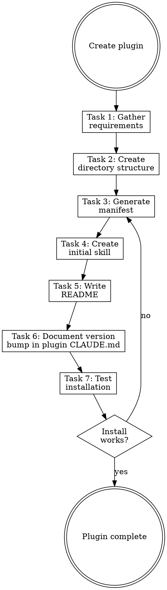

# Creating Plugins

## Overview

**Creating plugins IS scaffolding a distributable agent engineering package.**

A plugin is the distribution unit for agent engineering — it bundles skills, commands, agents, hooks, MCP servers, and LSP configs into a single installable package. Plugins are not just "skill containers" — they can provide complete workflows with automated enforcement (hooks), external tool access (MCP), and language intelligence (LSP).

**Core principle:** Plugins are reusable across projects. Keep them focused and well-documented.

**Violating the letter of the rules is violating the spirit of the rules.**

## Routing

**Pattern:** Skill Steps
**Handoff:** none
**Next:** none

## Task Initialization (MANDATORY)

Before ANY action, create task list using TaskCreate:

```
TaskCreate for EACH task below:
- Subject: "[creating-plugins] Task N: <action>"
- ActiveForm: "<doing action>"
```

**Tasks:**
1. Gather requirements
2. Create directory structure
3. Generate plugin manifest
4. Create initial skill
5. Write README
6. Document version bump locations in plugin CLAUDE.md
7. Test installation

Announce: "Created 7 tasks. Starting execution..."

**Execution rules:**
1. `TaskUpdate status="in_progress"` BEFORE starting each task
2. `TaskUpdate status="completed"` ONLY after verification passes
3. If task fails → stay in_progress, diagnose, retry
4. NEVER skip to next task until current is completed
5. At end, `TaskList` to confirm all completed

## Task 1: Gather Requirements

**Goal:** Understand what the plugin should contain.

**Questions to ask:**
- What is the plugin name? (kebab-case)
- What capability does it provide?
- What skills should it include?
- Who is the author?

**Naming rules:**
- Kebab-case only: `my-plugin`
- Avoid: `helper`, `utils`, `anthropic`, `claude`
- Max 64 characters

**Verification:** Can state plugin name and purpose in one sentence.

## Task 2: Create Directory Structure

**Goal:** Scaffold the plugin directory.

### Plugin Structure

```
<plugin-name>/
├── .claude-plugin/
│   └── plugin.json      # Manifest
├── skills/              # Capabilities (auto-discovered)
│   └── <skill-name>/
│       ├── SKILL.md
│       └── references/  # On-demand loaded docs
├── commands/            # Slash command aliases (auto-discovered)
│   └── <command>.md
├── agents/              # Subagent definitions (auto-discovered)
│   └── <agent>.md
├── hooks/               # Lifecycle hooks (auto-discovered)
│   └── hooks.json
├── .mcp.json            # MCP server configs (auto-discovered)
├── .lsp.json            # Language server configs (auto-discovered)
└── README.md
```

### Key Variables for Plugin Skills

**In SKILL.md content (substituted at runtime):**

| Variable | Purpose |
|----------|---------|
| `${CLAUDE_SKILL_DIR}` | This skill's directory — use to reference bundled scripts/data regardless of CWD |
| `${CLAUDE_SESSION_ID}` | Current session ID |
| `$ARGUMENTS` / `$N` | Arguments passed when invoking the skill |

**In hooks/hooks.json only — NOT available in SKILL.md content:**

| Variable | Purpose |
|----------|---------|
| `${CLAUDE_PLUGIN_ROOT}` | Plugin install directory (changes on update — do not write here) |
| `${CLAUDE_PLUGIN_DATA}` | Persistent data directory that survives updates (`~/.claude/plugins/data/{id}/`) |

Skills can also inject live data using shell commands (execute as preprocessing before Claude sees content). See [references/plugin-templates.md](references/plugin-templates.md) for exact shell-injection syntax (inline form, plugin-internal file form, multi-line fenced form, and PowerShell setup).

**If the plugin includes scripts or hooks:** Read [cross-platform-scripts.md](../../references/cross-platform-scripts.md) for mandatory cross-platform rules (paths, shell commands, line endings).

**Verification:** Directory structure created with all required paths.

## Task 3: Generate Plugin Manifest

**Goal:** Create the plugin.json manifest file.

**Important:** Read [references/plugin-templates.md](references/plugin-templates.md) for manifest format, required fields, and marketplace structure.

**Verification:** plugin.json is valid JSON with required fields.

## Task 4: Create Initial Skill

**Goal:** Create the first skill using the writing-skills workflow.

**Important:** Invoke the `writing-skills` skill.

Do not write SKILL.md directly. The writing-skills skill ensures:
- Proper frontmatter format
- TDD baseline testing
- Quality review via skill-reviewer

**Verification:** Initial skill created and passes skill-reviewer.

## Task 5: Write README

**Goal:** Document the plugin for users.

**Important:** Read [references/plugin-templates.md](references/plugin-templates.md) for README template.

**Verification:** README has installation instructions and skill list.

## Task 6: Document Version Bump Locations in Plugin CLAUDE.md

**Goal:** Plugin root `CLAUDE.md` lists every file containing this plugin's version string, so Claude can sync them correctly regardless of whether release automation is in place.

**Why:** Plugin has 3+ version fields (plugin.json, marketplace.json entry, README headers). Release-automation scripts (release-please, semantic-release) fail in various ways — cross-package path limits, marker scope collisions, CI permission issues. CLAUDE.md is authoritative session guidance; when a commit bumps version, Claude reads it and syncs every location. Scripts remain optional — not required by this skill.

**Action:**
1. Enumerate every file containing this plugin's version string (typically `plugin.json`, marketplace entry, README headers in both languages)
2. Create `<plugin-root>/CLAUDE.md` with a "Version Bump Locations" section listing:
   - Each file path + field (e.g., `plugin.json → version`)
   - Cross-package or manual-only locations flagged explicitly
   - Conventional Commits → version mapping (`fix:` → patch, `feat:` → minor, `feat!:` / `BREAKING CHANGE:` → major)
   - Commit scope convention (e.g., `feat(plugin-name):` for multi-plugin repos)

**Optional release automation:** If the user explicitly asks for release-please / semantic-release, see [references/plugin-templates.md](references/plugin-templates.md) for config templates. Do not prompt for it here — it is orthogonal to this task.

**Verification:** `<plugin-root>/CLAUDE.md` exists and lists every file containing a version string for this plugin.

## Task 7: Test Installation

**Goal:** Verify the plugin installs and works correctly.

Install locally:
```
claude plugin marketplace add <repo-path-or-url>
claude plugin install <plugin-name>@<marketplace-name>
```
Verify skills are discoverable and load correctly. Clean up: `claude plugin uninstall <plugin-name>` (or `remove`). Note: there is no `claude plugin add` command; the install flow is two-step (marketplace then plugin).

**Verification:** Plugin installs without errors, skills are discoverable and load correctly.

## Red Flags - STOP

- "Add skills later"
- "Skip README"
- "Skip testing"
- "One big skill"
- "Version later"
- "Skip plugin CLAUDE.md, version sync is obvious"
- "Release automation will handle it, no need to document"

## Common Rationalizations

| Thought | Reality |
|---------|---------|
| "Add skills later" | Empty plugins are useless. Ship with at least one. |
| "Skip README" | Undocumented plugins don't get used. |
| "Skip testing" | Broken installs frustrate users. Test it. |
| "One big skill" | Multiple focused skills > one bloated skill. |
| "Version later" | Version from day 1. Semantic versioning matters. |
| "Skip plugin CLAUDE.md" | 3+ version fields drift silently. CLAUDE.md is the fallback when automation breaks. |
| "Automation will handle it" | Release-please etc. fail on cross-package paths, marker scopes, CI perms. Document so Claude can recover. |

## Flowchart: Plugin Creation


```dot
digraph plugin_creation {
    rankdir=TB;

    start [label="Create plugin", shape=doublecircle];
    gather [label="Task 1: Gather\nrequirements", shape=box];
    structure [label="Task 2: Create\ndirectory structure", shape=box];
    manifest [label="Task 3: Generate\nmanifest", shape=box];
    skill [label="Task 4: Create\ninitial skill", shape=box];
    readme [label="Task 5: Write\nREADME", shape=box];
    release [label="Task 6: Document version\nbump in plugin CLAUDE.md", shape=box];
    test [label="Task 7: Test\ninstallation", shape=box];
    test_pass [label="Install\nworks?", shape=diamond];
    done [label="Plugin complete", shape=doublecircle];

    start -> gather;
    gather -> structure;
    structure -> manifest;
    manifest -> skill;
    skill -> readme;
    readme -> release;
    release -> test;
    test -> test_pass;
    test_pass -> done [label="yes"];
    test_pass -> manifest [label="no"];
}
```

## Publishing

Once your plugin is ready:

1. **Local sharing:** Share the directory path
2. **Git hosting:** Push to GitHub/GitLab
   ```bash
   /plugin marketplace add username/repo
   /plugin install plugin-name@marketplace-name
   ```
3. **npm (if applicable):** Publish to npm registry

## References

- [references/plugin-templates.md](references/plugin-templates.md) — Manifest format, marketplace structure, README template
