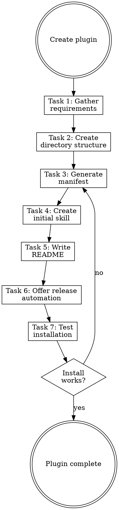

# Creating Plugins

## Overview

**Creating plugins IS scaffolding a distributable agent engineering package.**

A plugin is the distribution unit for agent engineering — it bundles skills, commands, agents, hooks, MCP servers, and LSP configs into a single installable package. Plugins are not just "skill containers" — they can provide complete workflows with automated enforcement (hooks), external tool access (MCP), and language intelligence (LSP).

**Core principle:** Plugins are reusable across projects. Keep them focused and well-documented.

**Violating the letter of the rules is violating the spirit of the rules.**

## Routing

**Pattern:** Skill Steps
**Handoff:** none
**Next:** none

## Task Initialization (MANDATORY)

Before ANY action, create task list using TaskCreate:

```
TaskCreate for EACH task below:
- Subject: "[creating-plugins] Task N: <action>"
- ActiveForm: "<doing action>"
```

**Tasks:**
1. Gather requirements
2. Create directory structure
3. Generate plugin manifest
4. Create initial skill
5. Write README
6. Set up release automation
7. Test installation

Announce: "Created 7 tasks. Starting execution..."

**Execution rules:**
1. `TaskUpdate status="in_progress"` BEFORE starting each task
2. `TaskUpdate status="completed"` ONLY after verification passes
3. If task fails → stay in_progress, diagnose, retry
4. NEVER skip to next task until current is completed
5. At end, `TaskList` to confirm all completed

## Task 1: Gather Requirements

**Goal:** Understand what the plugin should contain.

**Questions to ask:**
- What is the plugin name? (kebab-case)
- What capability does it provide?
- What skills should it include?
- Who is the author?

**Naming rules:**
- Kebab-case only: `my-plugin`
- Avoid: `helper`, `utils`, `anthropic`, `claude`
- Max 64 characters

**Verification:** Can state plugin name and purpose in one sentence.

## Task 2: Create Directory Structure

**Goal:** Scaffold the plugin directory.

### Plugin Structure

```
<plugin-name>/
├── .claude-plugin/
│   └── plugin.json      # Manifest
├── skills/              # Capabilities (auto-discovered)
│   └── <skill-name>/
│       ├── SKILL.md
│       └── references/  # On-demand loaded docs
├── commands/            # Slash command aliases (auto-discovered)
│   └── <command>.md
├── agents/              # Subagent definitions (auto-discovered)
│   └── <agent>.md
├── hooks/               # Lifecycle hooks (auto-discovered)
│   └── hooks.json
├── .mcp.json            # MCP server configs (auto-discovered)
├── .lsp.json            # Language server configs (auto-discovered)
└── README.md
```

### Key Variables for Plugin Skills

**In SKILL.md content (substituted at runtime):**

| Variable | Purpose |
|----------|---------|
| `${CLAUDE_SKILL_DIR}` | This skill's directory — use to reference bundled scripts/data regardless of CWD |
| `${CLAUDE_SESSION_ID}` | Current session ID |
| `$ARGUMENTS` / `$N` | Arguments passed when invoking the skill |

**In hooks/hooks.json only — NOT available in SKILL.md content:**

| Variable | Purpose |
|----------|---------|
| `${CLAUDE_PLUGIN_ROOT}` | Plugin install directory (changes on update — do not write here) |
| `${CLAUDE_PLUGIN_DATA}` | Persistent data directory that survives updates (`~/.claude/plugins/data/{id}/`) |

Skills can also inject live data using shell commands (execute as preprocessing before Claude sees content):
- Inline: `` !`git status` `` — workspace operations (CWD = user's project)
- Plugin-internal files: `` !`cat "${CLAUDE_SKILL_DIR}/references/context.md"` ``
- Multi-line: `` ```! `` code block
- PowerShell: set `shell: powershell` in frontmatter AND user must set `CLAUDE_CODE_USE_POWERSHELL_TOOL=1`. Ask the user which shell they use if the plugin needs cross-platform support.

**If the plugin includes scripts or hooks:** Read [cross-platform-scripts.md](../../references/cross-platform-scripts.md) for mandatory cross-platform rules (paths, shell commands, line endings).

**Verification:** Directory structure created with all required paths.

## Task 3: Generate Plugin Manifest

**Goal:** Create the plugin.json manifest file.

**Important:** Read [references/plugin-templates.md](references/plugin-templates.md) for manifest format, required fields, and marketplace structure.

**Verification:** plugin.json is valid JSON with required fields.

## Task 4: Create Initial Skill

**Goal:** Create the first skill using the writing-skills workflow.

**Important:** Invoke the `writing-skills` skill.

Do not write SKILL.md directly. The writing-skills skill ensures:
- Proper frontmatter format
- TDD baseline testing
- Quality review via skill-reviewer

**Verification:** Initial skill created and passes skill-reviewer.

## Task 5: Write README

**Goal:** Document the plugin for users.

**Important:** Read [references/plugin-templates.md](references/plugin-templates.md) for README template.

**Verification:** README has installation instructions and skill list.

## Task 6: Offer Release Automation

**Goal:** Ask the user whether to set up release-please so version bumps happen via Conventional Commits, not manual edits.

**Why ask:** Plugin has 3+ version fields (plugin.json, marketplace.json × 2, README headers). Manual sync drifts. Automation removes the error class entirely — but it assumes GitHub + Conventional Commits, which not every project uses.

**Ask the user:**
> 這個 plugin 有 3+ 處版號欄位（plugin.json、marketplace.json、README）。要建立 release-please 自動版號管理嗎？
> - **是** — 建立 `release-please-config.json`、manifest、GitHub Actions workflow；未來用 `feat:` / `fix:` commits 自動 bump
> - **否** — 跳過，README 新增 Contributing 區塊記錄手動 bump 步驟

**If yes:**
1. Read [references/plugin-templates.md](references/plugin-templates.md) for `release-please-config.json`, `.release-please-manifest.json`, `.github/workflows/release-please.yml` templates. Generate all three
2. Add `<!-- x-release-please-version -->` marker next to every version string in README(s)
3. Tell user: enable repo Settings → Actions → Workflow permissions = "Read and write"
4. State Conventional Commits rules: `fix:` → patch, `feat:` → minor, `feat!:` / `BREAKING CHANGE:` → major

**If no:** Add a "Version Management" section to README listing every file containing a version field, marked as manual-sync.

**Verification:** User decision recorded. If yes — 3 config files exist + README markers added. If no — manual-sync locations documented.

## Task 7: Test Installation

**Goal:** Verify the plugin installs and works correctly.

Install locally (`claude plugin add <path>`), verify skills are discoverable and load correctly, then clean up (`claude plugin remove <name>`).

**Verification:** Plugin installs without errors, skills are discoverable and load correctly.

## Red Flags - STOP

- "Add skills later"
- "Skip README"
- "Skip testing"
- "One big skill"
- "Version later"
- "I'll bump versions manually, it's just a few files"
- "Skip release automation, plugin is too small"

## Common Rationalizations

| Thought | Reality |
|---------|---------|
| "Add skills later" | Empty plugins are useless. Ship with at least one. |
| "Skip README" | Undocumented plugins don't get used. |
| "Skip testing" | Broken installs frustrate users. Test it. |
| "One big skill" | Multiple focused skills > one bloated skill. |
| "Version later" | Version from day 1. Semantic versioning matters. |
| "Manual bumps are fine" | 3+ version fields drift silently. Automation costs one config file. |
| "Plugin too small for CI" | Release-please runs free on public GitHub. No size threshold justifies manual bumps. |

## Flowchart: Plugin Creation


```dot
digraph plugin_creation {
    rankdir=TB;

    start [label="Create plugin", shape=doublecircle];
    gather [label="Task 1: Gather\nrequirements", shape=box];
    structure [label="Task 2: Create\ndirectory structure", shape=box];
    manifest [label="Task 3: Generate\nmanifest", shape=box];
    skill [label="Task 4: Create\ninitial skill", shape=box];
    readme [label="Task 5: Write\nREADME", shape=box];
    release [label="Task 6: Offer release\nautomation", shape=box];
    test [label="Task 7: Test\ninstallation", shape=box];
    test_pass [label="Install\nworks?", shape=diamond];
    done [label="Plugin complete", shape=doublecircle];

    start -> gather;
    gather -> structure;
    structure -> manifest;
    manifest -> skill;
    skill -> readme;
    readme -> release;
    release -> test;
    test -> test_pass;
    test_pass -> done [label="yes"];
    test_pass -> manifest [label="no"];
}
```

## Publishing

Once your plugin is ready:

1. **Local sharing:** Share the directory path
2. **Git hosting:** Push to GitHub/GitLab
   ```bash
   /plugin marketplace add username/repo
   /plugin install plugin-name@marketplace-name
   ```
3. **npm (if applicable):** Publish to npm registry

## References

- [references/plugin-templates.md](references/plugin-templates.md) — Manifest format, marketplace structure, README template
