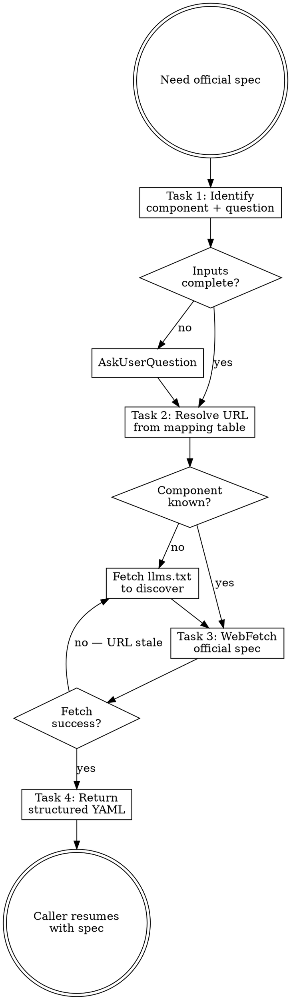

# Fetching Claude Docs

## Overview

**Fetching Claude docs IS pulling the latest official Anthropic specification before designing or reviewing any Claude Code component.**

This skill exists because the project has historically drifted from official docs (e.g. self-invented `<law>` block removed in v7.1, invalid `context: fork` on agents fixed in v9.3, `inherit` anti-pattern formalized only in v10.9.2). Always pull current spec rather than rely on cached memory.

**Core principle:** Return official source verbatim with URL. Do NOT paraphrase — paraphrasing reintroduces drift.

**Violating the letter of the rules is violating the spirit of the rules.**

## Routing

**Pattern:** Skill Steps
**Handoff:** none
**Next:** caller skill resumes its Task 1 with fetched spec as input

## Task Initialization (MANDATORY)

Before ANY action, create task list using TaskCreate:

```
TaskCreate for EACH task below:
- Subject: "[fetching-claude-docs] Task N: <action>"
- ActiveForm: "<doing action>"
```

**Tasks:**
1. Identify component type and question
2. Resolve URL from mapping table
3. Fetch official spec via WebFetch
4. Return verbatim excerpt + URL to caller

Announce: "Created 4 tasks. Starting execution..."

## Task 1: Identify Component Type and Question

**Goal:** Pin down what to fetch.

**Inputs expected from caller:**
- `component`: one of `subagent | skill | hook | rule | slash-command | plugin | plugin-marketplace | settings | mcp | output-style | statusline | memory | agent-team | best-practices`
- `question`: specific aspect (e.g. "frontmatter fields", "tool inheritance", "trigger description format")

**If caller did not provide:** ask user via AskUserQuestion before fetching.

**Verification:** `component` is a recognizable Claude Code concept (subagent, skill, hook, etc.) — no static list to match against; llms.txt is the authoritative source in Task 2.

## Task 2: Resolve URL from llms.txt

**Goal:** Pull the official URL index and locate the page for this component. **`llms.txt` is the only source of truth — no static URL table is kept in this skill.**

**Action:**
```
WebFetch
  url: https://code.claude.com/docs/llms.txt
  prompt: "Return all entries related to: <component>. Include both
           reference and guide URLs if both exist. Quote the URLs verbatim."
```

Then pick the URL matching the question type:
- spec / fields / schema / frontmatter → reference page (e.g. `hooks.md`)
- workflow / usage / examples → guide page (e.g. `hooks-guide.md`)
- both relevant → fetch reference first, guide second in Task 3

**Cache:** WebFetch has built-in 15-minute cache. The same `llms.txt` request in the same session is free, so calling this skill multiple times per session has near-zero overhead. Cross-session cost is one ~5KB fetch — negligible.

**Why no static URL map:** Hard-coded URLs drift (Anthropic restructures docs). `llms.txt` is small enough that fetching it every time is cheaper than maintaining a stale map.

**Verification:** Resolved URL ends with `.md` and is on `code.claude.com`.

## Task 3: Fetch Official Spec

**Goal:** Pull live content from Anthropic.

**Action:**
```
WebFetch
  url: <resolved URL>
  prompt: "Extract the section addressing: <question>. Return verbatim
           excerpts including all rules, frontmatter fields, examples, and
           warnings. Do NOT paraphrase. Include section headers."
```

**Cache:** WebFetch has built-in 15-minute cache — repeated calls in the same session are cheap.

**On redirect:** Follow the redirect URL with a fresh WebFetch.

**On failure (non-2xx):** Re-fetch `https://code.claude.com/docs/llms.txt` (bypassing cache if possible) to confirm whether the URL has moved or been removed. Report the change to caller.

**Verification:** Response contains a section header matching the question topic.

## Task 4: Return to Caller

**Goal:** Hand back structured spec for the caller skill to consume.

**Output format (return to caller):**

```yaml
source: <full URL>
fetched_at: <ISO timestamp>
component: <component>
question: <original question>
spec_excerpt: |
  <verbatim official text — preserve markdown formatting>
key_rules:
  - <rule 1 quoted from official text>
  - <rule 2 ...>
official_examples:
  - <example block as written in docs>
warnings:
  - <any "Important" / "Note" / "Warning" callouts from the docs>
```

**Verification:** YAML parses; `source` is a valid URL; `spec_excerpt` is non-empty.

## When to Trigger This Skill

| Trigger | Action |
|---|---|
| User says "create/write/modify a [component]" | Fetch component spec BEFORE design |
| User asks "what's the official way to..." | Fetch relevant docs |
| Reviewer flags a frontmatter field as suspicious | Fetch field spec to confirm |
| Plugin maturity migration | Fetch plugins-reference + plugin-marketplaces |
| Editing settings.json or hooks | Fetch settings + hooks reference |
| Designing model selection or tool restrictions | Fetch sub-agents.md |

## Red Flags - STOP

These thoughts mean you're rationalizing. STOP and reconsider:

- "I already know the spec from training data"
- "We just fetched this last week, it can't have changed"
- "The cached SKILL.md text is enough"
- "Paraphrasing the spec is fine, saves tokens"
- "Skip the fetch, the user is in a hurry"

**All of these mean: drift is about to happen. Fetch.**

## Common Rationalizations

| Excuse | Reality |
|--------|---------|
| "I know the official spec" | Anthropic ships docs updates weekly. Your knowledge is stale by definition. |
| "WebFetch is slow" | 15-min cache makes repeats free. First fetch < 3s. |
| "Just summarize from memory" | Summary = drift source. v7.1's `<law>` removal happened because nobody fetched. |
| "User won't notice" | Reviewer will. Or six months later when official spec changed. |
| "Token cost too high" | Drift cost is higher: rework, breaking changes, false confidence. |

## Flowchart: Doc Fetch Flow



## References

- Master index: https://code.claude.com/docs/llms.txt — **the only source of truth**

This skill intentionally keeps no static URL table. `llms.txt` is small (~5KB) and Anthropic restructures docs occasionally; fetching the live index every time is cheaper and safer than maintaining a stale map.
