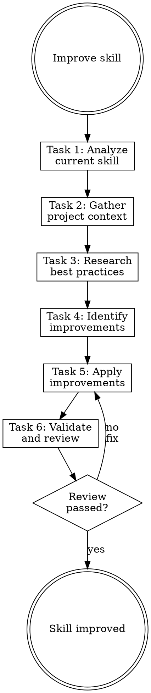

# Improving Skills

## Overview

**Improving skills IS refactoring documentation for clarity and effectiveness.**

Analyze current state, research best practices, apply targeted improvements.

**Core principle:** Improve what exists—don't rewrite from scratch unless necessary.

**Violating the letter of the rules is violating the spirit of the rules.**

## Task Initialization (MANDATORY)

Before ANY action, create task list using TaskCreate:

```
TaskCreate for EACH task below:
- Subject: "[improving-skills] Task N: <action>"
- ActiveForm: "<doing action>"
```

**Tasks:**
1. Analyze current skill
2. Gather project context
3. Research best practices
4. Identify improvements
5. Apply improvements
6. Validate and review

Announce: "Created 6 tasks. Starting execution..."

**Execution rules:**
1. `TaskUpdate status="in_progress"` BEFORE starting each task
2. `TaskUpdate status="completed"` ONLY after verification passes
3. If task fails → stay in_progress, diagnose, retry
4. NEVER skip to next task until current is completed
5. At end, `TaskList` to confirm all completed

## Task 1: Analyze Current Skill

**Goal:** Understand the skill's current state.

**Read the skill:**
```bash
cat <skill-path>/SKILL.md
ls -la <skill-path>/
```

**Document:**
- Purpose: What does it do?
- Triggers: What activates it?
- Structure: How is it organized?
- References: What supporting files exist?
- Issues: What problems are apparent?

**Common issues:**
- Vague triggers in description
- Missing verification criteria
- No task list enforcement
- Missing Red Flags/Rationalizations
- Content that should be in references

**Verification:** Have documented purpose, triggers, and issues.

## Task 2: Gather Project Context

**Goal:** Understand how the skill fits the project.

**Search for usage:**
```bash
grep -r "[skill-name]" . --include="*.md"
```

**Questions:**
- How often is this skill used?
- What files does it typically work on?
- Are there project-specific conventions it should follow?
- Does it overlap with other skills?

**Verification:** Understand skill's role in project context.

## Task 3: Research Best Practices

**Goal:** Find current best practices for the skill's domain.

**WebSearch:**
```
[skill domain] best practices 2025
[skill domain] patterns
```

**Optional: External skills search**

If `claude-skills-mcp` is available:
```
mcp__claude-skills-mcp__search_skills query="[skill domain]"
```

Compare with community implementations.

**Verification:** Have list of best practices to consider.

## Task 4: Identify Improvements

**Goal:** Create specific improvement plan.

**Check against standards:**
- [ ] Description starts with "Use when..."
- [ ] Description doesn't summarize workflow
- [ ] Has Task Initialization section
- [ ] Has verification for each task
- [ ] Has Red Flags section
- [ ] Has Rationalizations table
- [ ] Has flowchart
- [ ] Body < 300 lines
- [ ] Details in references

**Improvement types:**

| Issue | Improvement |
|-------|-------------|
| Vague triggers | Add specific "Use when..." phrases |
| No task list | Add Task Initialization section |
| No verification | Add verification criteria per task |
| No Red Flags | Add anti-rationalization section |
| Too long | Extract to references |
| Outdated | Update to current best practices |

**Verification:** Have specific list of improvements to make.

## Task 5: Apply Improvements

**Goal:** Make targeted edits to the skill.

**CRITICAL:** Make focused edits, not full rewrites.

**Order of changes:**
1. Fix frontmatter (description)
2. Add Task Initialization if missing
3. Add verification criteria
4. Add Red Flags / Rationalizations
5. Extract verbose content to references
6. Add flowchart if missing

**For each change:**
- Make the edit
- Verify it's correct
- Move to next change

**Verification:** All identified improvements applied.

## Task 6: Validate and Review

**Goal:** Verify skill meets quality standards.

**Validation:**
```bash
python3 scripts/validate_skill.py <skill-path>
```

**Or manual checklist:**
- [ ] Frontmatter valid
- [ ] Description starts with "Use when..."
- [ ] Has Task Initialization
- [ ] All tasks have verification
- [ ] Has Red Flags
- [ ] Has Rationalizations
- [ ] Body < 300 lines

**Quality review:**

**Invoke `skill-reviewer` subagent:**
```
Task tool:
- subagent_type: "rcc:skill-reviewer"
- prompt: "Review skill at [path]"
```

**Outcomes:**
- **Pass** → Done
- **Needs Fix** → Fix and re-run
- **Fail** → Consider full rewrite with writing-skills

**Verification:** skill-reviewer returns "Pass".

## Red Flags - STOP

These thoughts mean you're rationalizing. STOP and reconsider:

- "Just rewrite the whole thing"
- "Skip research, I know best practices"
- "This skill is fine as-is"
- "Skip validation, changes are small"
- "Red Flags aren't needed for this skill"

**All of these mean: You're about to make things worse. Follow the process.**

## Common Rationalizations

| Excuse | Reality |
|--------|---------|
| "Full rewrite" | Targeted fixes preserve what works. Edit, don't rewrite. |
| "Skip research" | Best practices evolve. Check current standards. |
| "Fine as-is" | If you're here, something needs improvement. Find it. |
| "Skip validation" | Small changes can break things. Validate. |
| "No Red Flags" | Every discipline skill needs anti-rationalization. |

## Flowchart: Skill Improvement



## References

- Use `writing-skills` skill for full rewrites
- Use `skill-reviewer` subagent for quality review
- See writing-skills/references/ for standards
