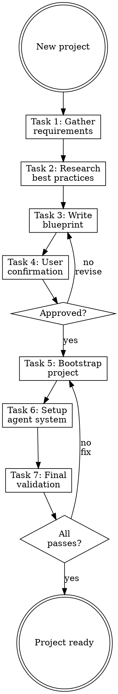

# Initializing Projects

## Overview

**Initializing projects IS bootstrapping with modern best practices AND agent system.**

Don't just create files—set up the full development environment including Claude Code integration.

**Core principle:** Research current best practices. Don't assume—verify with official docs.

**Violating the letter of the rules is violating the spirit of the rules.**

## Task Initialization (MANDATORY)

Before ANY action, create task list using TaskCreate:

```
TaskCreate for EACH task below:
- Subject: "[initializing-projects] Task N: <action>"
- ActiveForm: "<doing action>"
```

**Tasks:**
1. Gather requirements
2. Research best practices
3. Write blueprint
4. Get user confirmation
5. Bootstrap project
6. Setup agent system
7. Final validation

Announce: "Created 7 tasks. Starting execution..."

**Execution rules:**
1. `TaskUpdate status="in_progress"` BEFORE starting each task
2. `TaskUpdate status="completed"` ONLY after verification passes
3. If task fails → stay in_progress, diagnose, retry
4. NEVER skip to next task until current is completed
5. At end, `TaskList` to confirm all completed

## Task 1: Gather Requirements

**Goal:** Understand what project to create.

**First, ask Project Type:**

| Project Type | Follow-up Questions |
|--------------|---------------------|
| **Frontend SPA** | Language, Framework, UI Library, Styling, State, Testing |
| **Full-stack App** | Above + ORM, Database, API Style, Auth |
| **API Service** | Language, Framework, ORM, Validation, Auth |
| **CLI Tool** | Language, Package Manager, Testing |
| **Library** | Language, Build Tool, Testing, Docs |

**Ask iteratively.** Skip already-answered or N/A questions.

**Verification:** Have answers to all relevant questions for project type.

## Task 2: Research Best Practices

**Goal:** Find current best practices for the chosen stack.

**Use WebSearch to find:**
- Latest stable version of framework
- Official CLI/init command
- Recommended project structure
- Current best practices (2025/2026)

**CRITICAL:** Don't assume. Official docs change frequently.

**Verification:** Have official init command and current version numbers.

## Task 3: Write Blueprint

**Goal:** Create a blueprint document for user review.

**Write to:** `/docs/blueprint.md`

### Blueprint Format

```markdown
# Project Blueprint

## Stack
- Language: [name] [version]
- Framework: [name] [version]
- Package manager: [choice]

## Initialization Command
\`\`\`bash
[official CLI command]
\`\`\`

## Project Structure
[Expected directory layout after init]

## Key Dependencies
[Core packages to add]

## Agent System Plan
- CLAUDE.md: [key laws]
- Rules: [planned rules]
- Hooks: [planned quality gates]
```

**Verification:** Blueprint is written and covers all sections.

## Task 4: Get User Confirmation

**Goal:** Have user approve the blueprint before execution.

**CRITICAL:** Do not proceed without explicit user confirmation.

**Present:**
- Summary of planned stack
- Init command to run
- Agent system components

**Ask:** "Does this blueprint look correct? Should I proceed?"

**Verification:** User has explicitly approved the blueprint.

## Task 5: Bootstrap Project

**Goal:** Run the official CLI to create the project.

**Process:**
1. Run the official init command from blueprint
2. Install additional dependencies if needed
3. Apply any post-init configurations
4. Verify project builds/runs

**Example:**
```bash
npx create-next-app@latest my-app --typescript --tailwind --eslint
cd my-app && npm run dev
```

**Verification:** Project builds and runs without errors.

## Task 6: Setup Agent System

**Goal:** Configure Claude Code for the new project.

**CRITICAL: Invoke the `migrating-agent-systems` skill.**

This handles:
- Create CLAUDE.md with project-specific laws
- Setup rules for code conventions
- Configure hooks for linting/formatting
- Create useful skills if needed

**Verification:** Agent system is configured and working.

## Task 7: Final Validation

**Goal:** Verify everything works together.

**Checklist:**
- [ ] Project builds without errors
- [ ] Project runs without errors
- [ ] CLAUDE.md exists with `<law>` block
- [ ] Hooks run on file changes (if configured)
- [ ] README documents the setup

**Verification:** All checklist items pass.

## Project Type Quick Reference

### Frontend SPA
```bash
npx create-next-app@latest --typescript --tailwind
# or
npm create vite@latest -- --template react-ts
```

### Full-stack App
```bash
npx create-next-app@latest --typescript
# Add: prisma, next-auth, zod
```

### API Service
```bash
npm init -y && npm install express typescript
# or
cargo new --name api
```

### CLI Tool
```bash
npm init -y && npm install commander
# or
cargo new --name cli
```

## Red Flags - STOP

These thoughts mean you're rationalizing. STOP and reconsider:

- "I know the current version"
- "Skip research, I've done this before"
- "Don't need user confirmation"
- "Agent system can wait"
- "Skip validation, it's a fresh project"

**All of these mean: You're about to create a weak foundation. Follow the process.**

## Common Rationalizations

| Excuse | Reality |
|--------|---------|
| "I know the version" | Versions change monthly. Verify. |
| "Skip research" | Best practices evolve. Check official docs. |
| "Skip confirmation" | Blueprint approval prevents wasted effort. |
| "Agent system later" | Set it up now while context is fresh. |
| "Fresh = working" | Fresh projects can have config issues. Validate. |

## Flowchart: Project Initialization


