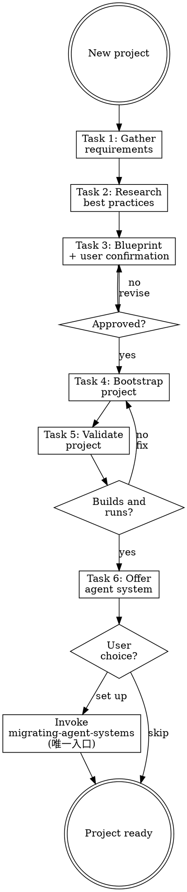

# Initializing Projects

## Overview

**Initializing projects IS bootstrapping with modern best practices, then optionally setting up an agent system.**

Don't just create files—research current docs, confirm with the user, then build.

**Core principle:** Research current best practices. Don't assume—verify with official docs.

**Violating the letter of the rules is violating the spirit of the rules.**

## Routing

**Pattern:** Chain
**Handoff:** user-confirmation
**Next:** `migrating-agent-systems`（agent system 唯一入口）
**Chain:** bootstrap

## Task Initialization (MANDATORY)

Before ANY action, create task list using TaskCreate:

```
TaskCreate for EACH task below:
- Subject: "[initializing-projects] Task N: <action>"
- ActiveForm: "<doing action>"
```

**Tasks:**
1. Gather requirements
2. Research best practices
3. Write blueprint and get confirmation
4. Bootstrap project
5. Validate project
6. Offer agent system setup

Announce: "Created 6 tasks. Starting execution..."

**Execution rules:**
1. `TaskUpdate status="in_progress"` BEFORE starting each task
2. `TaskUpdate status="completed"` ONLY after verification passes
3. If task fails → stay in_progress, diagnose, retry
4. NEVER skip to next task until current is completed
5. At end, `TaskList` to confirm all completed

## Task 1: Gather Requirements

**Goal:** Understand what project to create.

**First, ask Project Type:**

| Project Type | Follow-up Questions |
|--------------|---------------------|
| **Frontend SPA** | Language, Framework, UI Library, Styling, State, Testing |
| **Full-stack App** | Above + ORM, Database, API Style, Auth |
| **API Service** | Language, Framework, ORM, Validation, Auth |
| **CLI Tool** | Language, Package Manager, Testing |
| **Library** | Language, Build Tool, Testing, Docs |

**Ask iteratively.** Skip already-answered or N/A questions.

**Verification:** Have answers to all relevant questions for project type.

## Task 2: Research Best Practices

**Goal:** Find current best practices for the chosen stack.

**Use WebSearch to find:**
- Latest stable version of framework
- Official CLI/init command with current flags
- Recommended project structure
- Current best practices

**Important:** Don't assume versions or flags from training data. Official docs change frequently.

**Verification:** Have official init command and current version numbers from live sources.

## Task 3: Write Blueprint and Get Confirmation

**Goal:** Present a complete plan for user approval before creating anything.

**Present the blueprint directly to the user** (do NOT write to a file — the project directory doesn't exist yet).

### Blueprint Format

```
## Stack
- Language: [name] [version]
- Framework: [name] [version]
- Package manager: [choice]

## Initialization Command
[official CLI command with flags]

## Project Structure
[Expected directory layout after init]

## Key Dependencies
[Core packages to add, with purpose]
```

**Important:** Present FULL detail. The user must see exact versions, flags, and dependency list to catch mistakes.

**Ask:** "這個 blueprint 正確嗎？要開始執行嗎？"

**If rejected:** Revise based on feedback, present again.

**Verification:** User has reviewed the full blueprint and explicitly approved.

## Task 4: Bootstrap Project

**Goal:** Run the official CLI to create the project.

**Process:**
1. Run the official init command from blueprint
2. Install additional dependencies if needed
3. Apply any post-init configurations

**Verification:** Project directory exists with expected structure.

## Task 5: Validate Project

**Goal:** Verify the project builds and runs.

**Checklist:**
- [ ] Project builds without errors
- [ ] Project runs without errors (dev server starts, CLI executes, tests pass)
- [ ] Directory structure matches blueprint

**If validation fails:** Fix issues before proceeding. Do NOT skip to agent system setup with a broken project.

**Verification:** All checklist items pass.

## Task 6: Offer Agent System Setup

**Goal:** Ask the user if they want a Claude Code agent system for this project.

**Present options:**
- **Set up agent system** — invoke `migrating-agent-systems`（唯一入口，由該 skill 決定範圍與流程）
- **Skip** — no agent system

**If set up:**
- Invoke `migrating-agent-systems` skill
- It will detect maturity = None and route to the full pipeline (brainstorm → plan → apply → review)
- Agent system 的範圍（full vs minimal）由 `migrating-agent-systems` 內部與使用者討論決定

**If Skip:**
- End

**Important:** 不得繞過 `migrating-agent-systems` 直接呼叫 `writing-claude-md` 或其他 component skill。`migrating-agent-systems` 是 agent system 設定的唯一入口。

**Verification:** User's choice is executed or skipped.

## Red Flags - STOP

These thoughts mean you're rationalizing. STOP and reconsider:

- "I know the current version"
- "Skip research, I've done this before"
- "Don't need user confirmation"
- "A brief summary is enough for confirmation"
- "Write the blueprint to a file first"
- "Skip validation, it's a fresh project"

**All of these mean: You're about to create a weak foundation. Follow the process.**

## Common Rationalizations

| Excuse | Reality |
|--------|---------|
| "I know the version" | Versions change monthly. Verify with official docs. |
| "Skip research" | Best practices evolve. Check live sources. |
| "Skip confirmation" | Blueprint approval prevents wasted effort. |
| "Brief summary" | Brief summaries hide wrong decisions. Show full detail. |
| "Write blueprint to file" | Project directory doesn't exist yet. Present inline. |
| "Fresh = working" | Fresh projects can have config issues. Validate. |

## Flowchart: Project Initialization


```dot
digraph init_project {
    rankdir=TB;

    start [label="New project", shape=doublecircle];
    gather [label="Task 1: Gather\nrequirements", shape=box];
    research [label="Task 2: Research\nbest practices", shape=box];
    blueprint [label="Task 3: Blueprint\n+ user confirmation", shape=box];
    confirmed [label="Approved?", shape=diamond];
    bootstrap [label="Task 4: Bootstrap\nproject", shape=box];
    validate [label="Task 5: Validate\nproject", shape=box];
    valid [label="Builds and\nruns?", shape=diamond];
    offer [label="Task 6: Offer\nagent system", shape=box];
    choice [label="User\nchoice?", shape=diamond];
    migrate [label="Invoke\nmigrating-agent-systems\n(唯一入口)", shape=box];
    done [label="Project ready", shape=doublecircle];

    start -> gather;
    gather -> research;
    research -> blueprint;
    blueprint -> confirmed;
    confirmed -> bootstrap [label="yes"];
    confirmed -> blueprint [label="no\nrevise"];
    bootstrap -> validate;
    validate -> valid;
    valid -> offer [label="yes"];
    valid -> bootstrap [label="no\nfix"];
    offer -> choice;
    choice -> migrate [label="set up"];
    choice -> done [label="skip"];
    migrate -> done;
}
```

## Skill Chain Reference (Bootstrap)

| Step | Skill | Purpose |
|------|-------|---------|
| agent system | `migrating-agent-systems` | 唯一入口。Detects None maturity → brainstorm → plan → apply → review |
