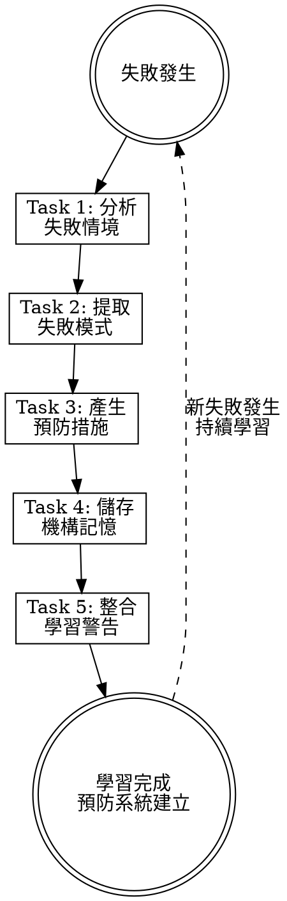

# Learning from Failures

## Overview

**Learning from failures IS converting failure patterns into institutional knowledge.**

當代理系統、工作流程或驗證失敗時，此技能將失敗案例轉換為可重用的預防知識。透過系統化記錄失敗模式、提取共同特徵、建立預防措施，避免相同問題重複發生。

**Core principle:** 每次失敗都是學習機會。將失敗模式轉化為預防性警告，建立機構記憶。

**Feedback loop:** 失敗案例 → 模式提取 → 預防措施 → 警告系統 → 預防執行

## Routing

**Pattern:** Utility
**Trigger:** 驗證失敗、工作流程中斷、代理系統問題
**Mode:** 被動觸發、問題分析
**Chain:** standalone

## Task Initialization (MANDATORY)

在開始任何行動之前，使用 TaskCreate 建立任務清單：

```
TaskCreate for EACH task below:
- Subject: "[learning-from-failures] Task N: <action>"
- ActiveForm: "<doing action>"
```

**Tasks:**
1. Analyze failure context
2. Extract failure patterns
3. Generate prevention measures
4. Store institutional memory
5. Integrate learning warnings

宣告："建立 5 個任務。開始執行..."

**執行規則：**
1. 在開始每個任務前 `TaskUpdate status="in_progress"`
2. 僅在驗證通過後 `TaskUpdate status="completed"`
3. 如果任務失敗 → 保持 in_progress，診斷，重試
4. 在當前任務完成前，絕不跳到下一個任務
5. 結束時，`TaskList` 確認全部完成

## Task 1: Analyze Failure Context

**Goal:** 分析失敗情境，識別關鍵因素。

**分析維度：**
- **失敗類型：** 代碼反模式、工作流程間隙、安全盲點、整合缺失
- **觸發條件：** 何時、何地、如何觸發
- **影響範圍：** 受影響的元件、工作流程、使用者
- **根因分析：** 技術因素、流程因素、知識盲點

**資料蒐集：**
- 錯誤訊息和堆疊追蹤
- 相關代碼和配置
- 工作流程上下文
- 相似歷史案例

**驗證：** 清楚了解失敗的完整情境和根本原因。

## Task 2: Extract Failure Patterns

**Goal:** 從失敗案例中提取可重用的模式特徵。

**CRITICAL:** 讀取 [references/memory-patterns.md](references/memory-patterns.md) 了解模式分類和提取策略。

**模式提取流程：**
1. **情境匹配：** 識別觸發條件和環境特徵
2. **問題識別：** 具體失敗模式和機制
3. **檢測規則：** 如何提早發現此類問題
4. **預防措施：** 如何避免重複發生

**使用 memory-manager.py 提取模式：**
```bash
python plugins/rcc/skills/learning-from-failures/scripts/memory-manager.py extract-pattern \
  --failure-type "代碼反模式" \
  --context "TypeScript 介面定義" \
  --problem "型別不匹配導致執行時錯誤"
```

**驗證：** 模式已結構化記錄，具備檢測和預防要素。

## Task 3: Generate Prevention Measures

**Goal:** 為識別的模式建立具體預防措施。

**預防措施類型：**
- **程式碼檢查：** 靜態分析規則、型別檢查
- **工作流程守衛：** 流程檢查點、驗證步驟
- **整合測試：** 自動化測試案例
- **文件規範：** 最佳實務指南

**警告產生：**
- 針對特定元件的警告訊息
- 相關情境的檢查清單
- 預防行動的具體步驟

**驗證：** 預防措施具體可執行，警告訊息清楚明確。

## Task 4: Store Institutional Memory

**Goal:** 將學習結果儲存到記憶系統。

**記憶結構：**
```
docs/agent-system/memory/
├── patterns/           # 學習模式庫
├── failures/          # 失敗案例記錄  
└── preventions/       # 預防措施清單
```

**使用 memory-manager.py 記錄：**
```bash
python plugins/rcc/skills/learning-from-failures/scripts/memory-manager.py record-failure \
  --type "integration-missing" \
  --component "agent-system" \
  --description "代理間通信缺乏錯誤處理"
```

**記憶格式遵循：**
```markdown
## Pattern: [Pattern Name]

**Context:** When [situation]
**Problem:** [specific failure mode]
**Detection:** [how to catch it early]
**Prevention:** [how to prevent it]
**Examples:** [real cases that triggered this learning]
```

**驗證：** 記憶檔案已建立，結構完整，可供檢索。

## Task 5: Integrate Learning Warnings

**Goal:** 將學習結果整合到相關技能和工作流程。

**整合點：**
- **planning-agent-systems:** 架構決策前載入警告
- **writing-* skills:** 應用預防措施
- **hook scripts:** 檢查已知失敗模式

**警告檢索指令：**
```bash
echo '{"component":"agent-system","context":"planning","type":"all"}' | \
python plugins/rcc/skills/learning-from-failures/scripts/memory-manager.py get-warnings
```

**更新相關技能：** 在 planning-agent-systems Task 2 中增加學習整合檢查。

**驗證：** 警告系統已整合，可在相關工作流程中觸發。

## Red Flags - STOP

這些想法表示你在合理化。立即停止並重新考慮：

- "跳過失敗分析"
- "直接套用通用解法"  
- "忽略根本原因"
- "不記錄學習過程"
- "簡化預防措施"
- "跳過整合步驟"
- "假設不會再發生"

## Common Rationalizations

| 想法 | 現實 |
|------|------|
| "跳過失敗分析" | 未分析的失敗會重複發生 |
| "直接套用通用解法" | 通用解法忽略特定情境 |
| "忽略根本原因" | 症狀治療無法預防復發 |
| "不記錄學習過程" | 知識流失，團隊無法受益 |
| "簡化預防措施" | 簡化的措施無法有效預防 |
| "跳過整合步驟" | 學習無法應用到實際工作流程 |
| "假設不會再發生" | 失敗模式會在類似情境下重現 |

## Flowchart: Learning from Failures



## References

- [references/memory-patterns.md](references/memory-patterns.md) — Memory system architecture, pattern categories, context matching strategies