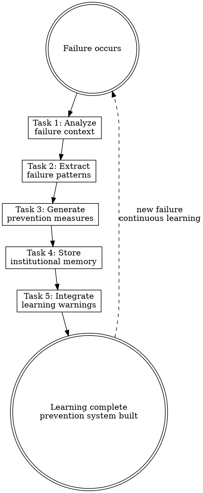

# Learning from Failures

## Overview

**Learning from failures IS converting failure patterns into institutional knowledge.**

When agent systems, workflows, or validations fail, this skill converts failure cases into reusable preventive knowledge. Systematically record failure patterns, extract common characteristics, establish preventive measures, and avoid the same problems from recurring.

**Core principle:** Every failure is a learning opportunity. Convert failure patterns into preventive warnings and build institutional memory.

**Feedback loop:** Failure case → pattern extraction → prevention measures → warning system → preventive execution

## Routing

**Pattern:** Utility
**Trigger:** Validation failures, workflow interruptions, agent system issues
**Mode:** Passive trigger, problem analysis
**Chain:** standalone

## Task Initialization (MANDATORY)

Before ANY action, create task list using TaskCreate:

```
TaskCreate for EACH task below:
- Subject: "[learning-from-failures] Task N: <action>"
- ActiveForm: "<doing action>"
```

**Tasks:**
1. Analyze failure context
2. Extract failure patterns
3. Generate prevention measures
4. Store institutional memory
5. Integrate learning warnings

Announce: "Created 5 tasks. Starting execution..."

**Execution rules:**
1. `TaskUpdate status="in_progress"` BEFORE starting each task
2. `TaskUpdate status="completed"` ONLY after verification passes
3. If task fails → stay in_progress, diagnose, retry
4. NEVER skip to next task until current is completed
5. At end, `TaskList` to confirm all completed

## Task 1: Analyze Failure Context

**Goal:** Analyze the failure context and identify key factors.

**Session type check (FIRST):**

| Session type | What to capture |
|--------------|-----------------|
| **Debug session** | TWO learning targets: (1) the bug itself — root cause, reproduction condition, prevention rule; (2) any model reasoning errors made during debugging |
| **Workflow failure** | The workflow gap or validation failure as a pattern |
| **Agent system issue** | Component misconfiguration, chain break, or bad architecture decision |

**If this is a debug session, capture the bug separately BEFORE analyzing model errors:**
- What is the bug? (exact behavior, not just symptoms)
- What condition triggers it?
- Why did it occur? (root cause, not just the fix)
- What prevention rule would have caught it early?

**Analysis dimensions:**
- **Failure type:** Code bug, code anti-pattern, workflow gap, security blind spot, integration missing, model reasoning error
- **Trigger condition:** When, where, how it was triggered
- **Impact scope:** Affected components, workflows, users
- **Root cause analysis:** Technical factors, process factors, knowledge gaps

**Data collection:**
- Error messages and stack traces
- Relevant code and configuration
- Workflow context
- Similar historical cases

**Verification:** Clear understanding of the complete failure context and root cause. Debug sessions have identified and separately documented the bug itself and model errors.

## Task 2: Extract Failure Patterns

**Goal:** Extract reusable pattern characteristics from failure cases.

**CRITICAL:** Read [references/memory-patterns.md](references/memory-patterns.md) for pattern classification and extraction strategies.

**For debug sessions — extract the bug as a separate pattern entry:**
```
Pattern type: code-bug
Context: [language/framework/component where bug lives]
Trigger: [exact condition that causes the bug]
Root cause: [why it happened]
Prevention rule: [what check would catch it before it reaches production]
```

This is distinct from model reasoning errors. A bug pattern prevents the same bug from being introduced again; a model error pattern prevents the same debugging mistake.

**Pattern extraction process:**
1. **Context matching:** Identify trigger conditions and environment characteristics
2. **Problem identification:** Specific failure pattern and mechanism
3. **Detection rules:** How to catch this type of problem early
4. **Prevention measures:** How to prevent recurrence

**Use memory-manager.py to extract patterns:**
```bash
python plugins/rcc/skills/learning-from-failures/scripts/memory-manager.py extract-pattern \
  --failure-type "code-anti-pattern" \
  --context "TypeScript interface definition" \
  --problem "type mismatch causes runtime error"
```

**Verification:** Pattern is structurally documented with detection and prevention elements.

## Task 3: Generate Prevention Measures

**Goal:** Create concrete prevention measures for identified patterns.

**Prevention measure types:**
- **Code checks:** Static analysis rules, type checking
- **Workflow guards:** Process checkpoints, validation steps
- **Integration tests:** Automated test cases
- **Documentation standards:** Best practice guidelines

**Warning generation:**
- Warning messages targeting specific components
- Checklists for relevant contexts
- Concrete steps for preventive actions

**Verification:** Prevention measures are specific and actionable; warning messages are clear.

## Task 4: Store Institutional Memory

**Goal:** Store learning results in the memory system.

**Memory structure:**
```
docs/agent-system/memory/
├── patterns/           # Learned pattern library
├── failures/           # Failure case records
└── preventions/        # Prevention measure list
```

**Use memory-manager.py to record:**
```bash
python plugins/rcc/skills/learning-from-failures/scripts/memory-manager.py record-failure \
  --type "integration-missing" \
  --component "agent-system" \
  --description "agent communication lacks error handling"
```

**Memory format:**
```markdown
## Pattern: [Pattern Name]

**Context:** When [situation]
**Problem:** [specific failure mode]
**Detection:** [how to catch it early]
**Prevention:** [how to prevent it]
**Examples:** [real cases that triggered this learning]
```

**Verification:** Memory file created, structure complete, retrievable.

## Task 5: Integrate Learning Warnings

**Goal:** Integrate learning results into relevant skills and workflows.

**Integration points:**
- **planning-agent-systems:** Load warnings before architecture decisions
- **writing-* skills:** Apply prevention measures
- **hook scripts:** Check for known failure patterns

**Warning retrieval command:**
```bash
echo '{"component":"agent-system","context":"planning","type":"all"}' | \
python plugins/rcc/skills/learning-from-failures/scripts/memory-manager.py get-warnings
```

**Update relevant skills:** Add learning integration check in planning-agent-systems Task 2.

**Verification:** Warning system integrated and triggerable in relevant workflows.

## Red Flags - STOP

These thoughts mean you're rationalizing. STOP and reconsider:

- "Skip failure analysis"
- "Apply a generic solution directly"
- "Ignore the root cause"
- "Don't record the learning"
- "Simplify the prevention measures"
- "Skip the integration step"
- "Assume it won't happen again"

## Common Rationalizations

| Thought | Reality |
|---------|---------|
| "Skip failure analysis" | Unanalyzed failures recur |
| "Apply generic solution" | Generic solutions ignore specific context |
| "Ignore root cause" | Treating symptoms cannot prevent recurrence |
| "Don't record learning" | Knowledge lost; team cannot benefit |
| "Simplify prevention" | Simplified measures fail to prevent effectively |
| "Skip integration" | Learning cannot be applied to actual workflows |
| "Won't happen again" | Failure patterns recur in similar contexts |

## Flowchart: Learning from Failures



## References

- [references/memory-patterns.md](references/memory-patterns.md) — Memory system architecture, pattern categories, context matching strategies
