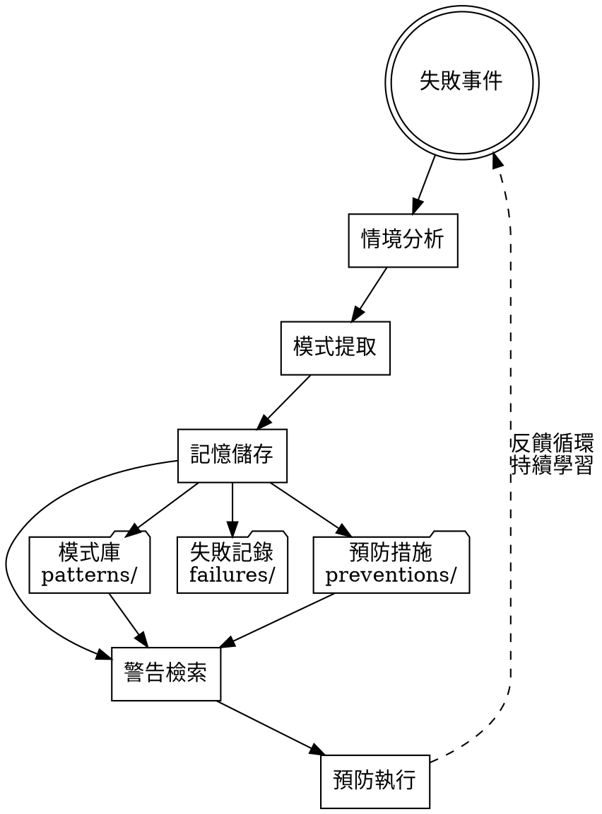

# Memory Patterns Reference

## Memory System Architecture



## Pattern Categories

### 1. Code Anti-patterns (代碼反模式)

**特徵：** 程式碼結構或實作導致的問題

**常見模式：**
- **Zod-TypeScript Mismatch:** Zod schema 與 TypeScript 介面不匹配
- **Mock Index Collision:** 測試 mock 索引衝突覆蓋
- **Undefined Dependency:** 相依性未正確定義或初始化
- **Type Assertion Overuse:** 過度使用型別斷言跳過檢查

**檢測策略：**
- 靜態型別檢查
- 測試覆蓋率分析
- 相依性圖檢驗
- 程式碼品質度量

### 2. Workflow Gaps (工作流程間隙)

**特徵：** 流程步驟缺失或連接不當

**常見模式：**
- **Missing Integration Test:** 缺乏整合測試驗證
- **Validation Bypass:** 跳過必要的驗證步驟
- **Error Handling Gap:** 錯誤處理邏輯缺失
- **State Synchronization:** 狀態同步機制不足

**檢測策略：**
- 流程完整性檢查
- 錯誤路徑分析
- 狀態一致性驗證
- 自動化流程審查

### 3. Security Blindspots (安全盲點)

**特徵：** 安全考慮不足或配置錯誤

**常見模式：**
- **Credential Exposure:** 憑證或金鑰外洩
- **Input Validation Missing:** 輸入驗證不足
- **Permission Misconfiguration:** 權限配置錯誤
- **Dependency Vulnerability:** 相依性安全漏洞

**檢測策略：**
- 安全掃描工具
- 權限審查機制
- 輸入驗證測試
- 相依性安全檢查

## Context Matching Strategies

### Python Context Matching Functions

```python
def match_code_context(failure_context: dict, pattern_context: dict) -> float:
    """計算代碼情境匹配度"""
    score = 0.0
    weights = {
        'language': 0.3,
        'framework': 0.25,
        'file_type': 0.2,
        'function_type': 0.15,
        'error_type': 0.1
    }
    
    for key, weight in weights.items():
        if key in failure_context and key in pattern_context:
            if failure_context[key] == pattern_context[key]:
                score += weight
            elif similar_technology(failure_context[key], pattern_context[key]):
                score += weight * 0.5
    
    return score

def match_workflow_context(failure_context: dict, pattern_context: dict) -> float:
    """計算工作流程情境匹配度"""
    score = 0.0
    weights = {
        'stage': 0.4,      # 流程階段
        'tool': 0.3,       # 使用工具
        'actor': 0.2,      # 執行者
        'trigger': 0.1     # 觸發條件
    }
    
    for key, weight in weights.items():
        if key in failure_context and key in pattern_context:
            if failure_context[key] == pattern_context[key]:
                score += weight
                
    return score

def match_component_context(failure_context: dict, pattern_context: dict) -> float:
    """計算元件情境匹配度"""
    score = 0.0
    
    # 元件類型匹配
    if failure_context.get('component') == pattern_context.get('component'):
        score += 0.4
    
    # 互動模式匹配 
    if failure_context.get('interaction') == pattern_context.get('interaction'):
        score += 0.3
        
    # 相依性匹配
    failure_deps = set(failure_context.get('dependencies', []))
    pattern_deps = set(pattern_context.get('dependencies', []))
    if failure_deps.intersection(pattern_deps):
        score += 0.3 * len(failure_deps.intersection(pattern_deps)) / len(failure_deps.union(pattern_deps))
    
    return score
```

### Context Similarity Functions

```python
def similar_technology(tech1: str, tech2: str) -> bool:
    """判斷技術相似性"""
    similarity_groups = {
        'typescript': ['javascript', 'ts', 'js'],
        'python': ['py', 'python3'],
        'react': ['nextjs', 'gatsby', 'preact'],
        'express': ['fastify', 'koa', 'hapi'],
        'jest': ['vitest', 'mocha', 'jasmine']
    }
    
    tech1_lower = tech1.lower()
    tech2_lower = tech2.lower()
    
    for group in similarity_groups.values():
        if tech1_lower in group and tech2_lower in group:
            return True
            
    return False

def calculate_context_weight(context_type: str, failure_severity: str) -> float:
    """計算情境權重"""
    base_weights = {
        'code': 1.0,
        'workflow': 0.8, 
        'component': 0.9,
        'security': 1.2
    }
    
    severity_multiplier = {
        'critical': 1.5,
        'high': 1.2,
        'medium': 1.0,
        'low': 0.8
    }
    
    return base_weights.get(context_type, 1.0) * severity_multiplier.get(failure_severity, 1.0)
```

## Warning Generation Mechanisms

### Warning Types

1. **Immediate Warnings:** 即時阻止類似失敗
2. **Contextual Warnings:** 特定情境下的提醒
3. **Preventive Warnings:** 預防性檢查建議
4. **Educational Warnings:** 學習和改進建議

### Warning Message Templates

```python
WARNING_TEMPLATES = {
    'code_antipattern': """
⚠️  代碼反模式警告: {pattern_name}

**情境:** {context_description}
**風險:** {risk_description}  
**檢查:** {detection_method}
**預防:** {prevention_action}

**相關失敗案例:** {example_count} 個案例
""",
    
    'workflow_gap': """
⚠️  工作流程間隙: {pattern_name}

**階段:** {workflow_stage}
**缺失:** {gap_description}
**影響:** {impact_description}
**建議:** {remediation_steps}

**歷史案例:** {historical_failures}
""",
    
    'security_blindspot': """
🔒 安全盲點警告: {pattern_name}

**威脅:** {threat_description}
**暴露:** {exposure_level}
**檢測:** {detection_criteria}
**緩解:** {mitigation_steps}

**嚴重性:** {severity_level}
"""
}
```

### Warning Generation Logic

```python
def generate_warnings(context: dict, patterns: List[dict]) -> List[str]:
    """產生相關警告訊息"""
    warnings = []
    
    for pattern in patterns:
        match_score = calculate_match_score(context, pattern)
        
        if match_score >= 0.7:  # 高匹配度
            warning = generate_high_priority_warning(pattern, context)
            warnings.append(warning)
        elif match_score >= 0.4:  # 中匹配度
            warning = generate_contextual_warning(pattern, context)
            warnings.append(warning)
    
    # 依優先級排序
    warnings.sort(key=lambda w: w.get('priority', 0), reverse=True)
    
    return warnings

def calculate_match_score(context: dict, pattern: dict) -> float:
    """計算整體匹配分數"""
    context_type = context.get('type', 'unknown')
    
    if context_type == 'code':
        return match_code_context(context, pattern.get('context', {}))
    elif context_type == 'workflow':
        return match_workflow_context(context, pattern.get('context', {}))
    elif context_type == 'component':
        return match_component_context(context, pattern.get('context', {}))
    
    return 0.0
```

## Real Example Patterns

### Example 1: Zod-TypeScript Mismatch

```markdown
## Pattern: Zod-TypeScript Type Mismatch

**Context:** When using Zod for runtime validation with TypeScript interfaces
**Problem:** Zod schema definition doesn't match TypeScript interface, causing runtime validation failures
**Detection:** 
- Compare Zod schema properties with TypeScript interface
- Run type checking with strict mode
- Test runtime validation against TypeScript types
**Prevention:**
- Use zod-to-typescript generators
- Add integration tests for schema validation
- Set up pre-commit hooks for type consistency check
**Examples:**
- API response validation failure in user service
- Form data validation mismatch in admin panel
- Configuration object validation error in build process
```

### Example 2: Missing Integration Test

```markdown
## Pattern: Missing Integration Test Coverage

**Context:** When developing multi-service features or complex workflows
**Problem:** Unit tests pass but integration between components fails in production
**Detection:**
- Check test coverage for cross-service calls
- Analyze test types ratio (unit vs integration)
- Review deployment failure patterns
**Prevention:**
- Require integration tests for cross-service features
- Set up service mesh testing environment
- Add integration test coverage to CI pipeline
**Examples:**
- Payment service integration failure
- Authentication flow breakdown
- Database migration coordination issues
```

### Example 3: Mock Index Collision

```markdown
## Pattern: Test Mock Index Collision

**Context:** When using indexed mocks in parallel test execution
**Problem:** Multiple tests using same mock index cause interference and flaky failures
**Detection:**
- Analyze test failure patterns in parallel execution
- Check for shared mock state between tests
- Monitor test isolation violations
**Prevention:**
- Use unique identifiers instead of sequential indexes
- Implement test isolation with beforeEach cleanup
- Add mock state reset mechanisms
**Examples:**
- Jest test suite random failures
- Database fixture conflicts
- API mock response interference
```

## Memory Storage Format

### Standard Pattern Entry

```markdown
---
id: unique-pattern-id
category: code|workflow|security
severity: critical|high|medium|low
created: timestamp
last_triggered: timestamp
trigger_count: number
---

# Pattern: [Descriptive Name]

## Context
When [specific situation or environment]

## Problem  
[Detailed description of the failure mode]

## Detection
[How to identify this pattern early]
- Technical indicators
- Warning signs
- Metrics to monitor

## Prevention
[Concrete steps to avoid this failure]
- Process changes
- Technical safeguards
- Verification steps

## Examples
[Real cases that triggered this learning]
- Case 1: [brief description and outcome]
- Case 2: [brief description and outcome]

## Related Patterns
- [Links to similar or connected patterns]

## Mitigation
If this pattern occurs:
1. Immediate response steps
2. Damage assessment
3. Recovery procedure
```

### Pattern Linking Strategy

```markdown
## Pattern Relationships

### Causal Chains
Pattern A → Pattern B → Pattern C

### Common Triggers
- Environmental factors
- Process gaps
- Knowledge deficits

### Compound Failures
When multiple patterns combine to create cascade failures

### Prevention Networks
How preventing one pattern helps prevent others
```