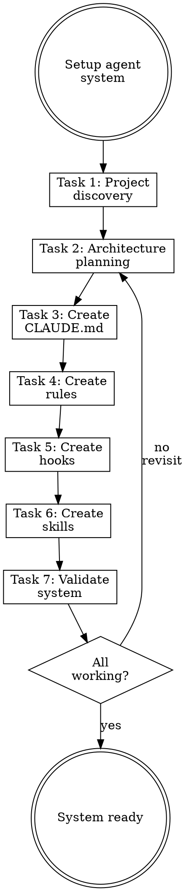

# Migrating Agent Systems

## Overview

**Migrating agent systems IS orchestrating component creation through skills.**

Don't create files directly—invoke the appropriate skill for each component type.

**Core principle:** Skills encode best practices. Direct file creation bypasses them.

**Violating the letter of the rules is violating the spirit of the rules.**

## Task Initialization (MANDATORY)

Before ANY action, create task list using TaskCreate:

```
TaskCreate for EACH task below:
- Subject: "[migrating-agent-systems] Task N: <action>"
- ActiveForm: "<doing action>"
```

**Tasks:**
1. Project discovery
2. Architecture planning
3. Create constitution (CLAUDE.md)
4. Create rules
5. Create hooks
6. Create skills (if needed)
7. Validate system

Announce: "Created 7 tasks. Starting execution..."

**Execution rules:**
1. `TaskUpdate status="in_progress"` BEFORE starting each task
2. `TaskUpdate status="completed"` ONLY after verification passes
3. If task fails → stay in_progress, diagnose, retry
4. NEVER skip to next task until current is completed
5. At end, `TaskList` to confirm all completed

## Task 1: Project Discovery

**Goal:** Understand the project before configuring agent system.

**Invoke `project-discovery` skill** (if available) or manually:

**Discover:**
- Tech stack (language, framework, build tools)
- Project structure (key directories)
- Existing workflows (CI/CD, testing, linting)
- Conventions (naming, architecture patterns)

**Output:** Discovery report with key findings.

**Verification:** Have documented tech stack and structure.

## Task 2: Architecture Planning

**Goal:** Design the agent system components.

**Invoke `agent-architect` skill** (if available) or manually plan:

### Component Planning

| Component | Purpose | Needed? |
|-----------|---------|---------|
| CLAUDE.md | Constitution with laws | **Always** |
| Rules | Path-scoped conventions | If conventions exist |
| Hooks | Quality gates | If linting/formatting needed |
| Skills | Project-specific capabilities | If repeated workflows |
| Agents | Specialized subagents | If isolated tasks needed |

**Output:** List of components to create with details.

**Verification:** Have component list with rationale for each.

## Task 3: Create Constitution (CLAUDE.md)

**Goal:** Create the project's CLAUDE.md with appropriate laws.

**CRITICAL: Invoke the `writing-claude-md` skill.**

Do not write CLAUDE.md directly. The skill ensures:
- Proper `<law>` block format
- Verifiable, actionable laws
- Self-Reinforcing Display law
- Quality review via claudemd-reviewer

**Typical laws to consider:**
- Communication style (language, verbosity)
- Code conventions (if critical)
- Version sync requirements
- Documentation requirements

**Verification:** CLAUDE.md created and passes claudemd-reviewer.

## Task 4: Create Rules

**Goal:** Create rule files for project conventions.

**For each convention identified in discovery:**

**CRITICAL: Invoke the `writing-rules` skill.**

**Common rules:**
- Code style (`paths: **/*.ts`)
- API conventions (`paths: src/api/**`)
- Test conventions (`paths: **/*.test.ts`)

**Skip if:** No conventions need enforcement.

**Verification:** All planned rules created.

## Task 5: Create Hooks

**Goal:** Create quality gate hooks.

**For each quality check needed:**

**CRITICAL: Invoke the `writing-hooks` skill.**

**Common hooks:**
- Linting (ESLint, Ruff)
- Formatting (Prettier)
- Type checking (TypeScript, mypy)

**Skip if:** No quality gates needed.

**Verification:** All planned hooks created and working.

## Task 6: Create Skills (if needed)

**Goal:** Create project-specific skills.

**Only create skills for:**
- Repeated workflows specific to this project
- Complex processes that need documentation
- Team knowledge that should be encoded

**CRITICAL: Invoke the `writing-skills` skill.**

**Skip if:** No project-specific capabilities needed.

**Verification:** All planned skills created.

## Task 7: Validate System

**Goal:** Verify the entire agent system works.

**Checklist:**
- [ ] CLAUDE.md exists with `<law>` block
- [ ] Laws display at start of responses
- [ ] Rules inject on matching files
- [ ] Hooks block violations
- [ ] Skills activate on triggers

**Test sequence:**
1. Start new Claude Code session
2. Verify laws display
3. Work on files matching rules—verify injection
4. Write violating code—verify hook blocks

**Verification:** All components work together.

## Skill Invocation Reference

| Component | Skill to Invoke |
|-----------|-----------------|
| CLAUDE.md | `writing-claude-md` |
| Rules | `writing-rules` |
| Hooks | `writing-hooks` |
| Skills | `writing-skills` |
| Agents | `writing-subagents` |

**NEVER create these files directly. Always use the skill.**

## Red Flags - STOP

These thoughts mean you're rationalizing. STOP and reconsider:

- "I can write CLAUDE.md directly"
- "Skip discovery, I know this stack"
- "Don't need rules, just laws"
- "Hooks are overkill"
- "Skip validation, I used the skills"

**All of these mean: You're about to create a weak agent system. Follow the process.**

## Common Rationalizations

| Excuse | Reality |
|--------|---------|
| "Write directly" | Skills encode best practices. Use them. |
| "Skip discovery" | Assumptions lead to misfit systems. Discover first. |
| "Just laws" | Laws + rules + hooks = defense in depth. |
| "Hooks overkill" | Hooks catch what humans miss. Worth it. |
| "Skip validation" | Untested systems fail in production. Validate. |

## Flowchart: Agent System Migration



## References

- `project-discovery` skill for analyzing projects
- `agent-architect` skill for planning components
- All writing-* skills for creating components
