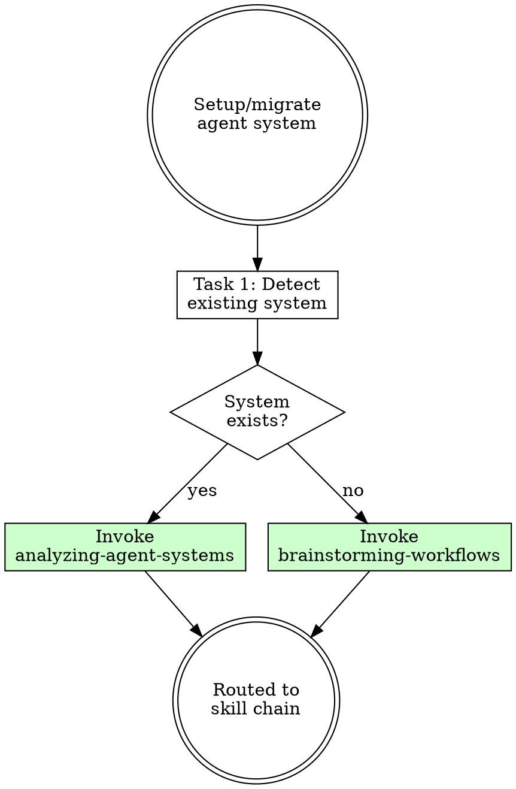

# Migrating Agent Systems

## Overview

**Migrating agent systems IS routing to the correct workflow based on project state.**

Detect whether an agent system already exists, then invoke the appropriate skill chain. This skill is a thin router — all logic lives in the specialized skills.

**Core principle:** Detect, don't assume. Route, don't implement.

**Violating the letter of the rules is violating the spirit of the rules.**

## Routing

**Pattern:** Tree
**Handoff:** auto-invoke
**Next:** `analyzing-agent-systems` | `brainstorming-workflows`
**Chain:** main

## Task Initialization (MANDATORY)

Before ANY action, create task list using TaskCreate:

```
TaskCreate for EACH task below:
- Subject: "[migrating-agent-systems] Task N: <action>"
- ActiveForm: "<doing action>"
```

**Tasks:**
1. Detect existing agent system
2. Route to appropriate skill chain

Announce: "Created 2 tasks. Starting execution..."

**Execution rules:**
1. `TaskUpdate status="in_progress"` BEFORE starting each task
2. `TaskUpdate status="completed"` ONLY after verification passes
3. If task fails → stay in_progress, diagnose, retry
4. NEVER skip to next task until current is completed
5. At end, `TaskList` to confirm all completed

## Task 1: Detect Existing Agent System

**Goal:** Determine if the project already has an agent system.

**Check for existence of ANY of these:**
- `CLAUDE.md` (project root)
- `.claude/` directory
- `.claude/rules/` directory
- `.claude/settings.json`
- `.claude/skills/` directory

**Classification:**
- **Existing system** → at least one component found
- **New project** → no components found

**Verification:** Clear classification as "existing" or "new".

## Task 2: Route to Appropriate Skill Chain

**Goal:** Invoke the correct starting skill.

**If existing system:**
- Announce: 「偵測到現有 agent system，開始分析...」
- Invoke `analyzing-agent-systems` skill
- The chain will automatically continue: analyzing → brainstorming → planning → applying → reviewing → refactoring

**If new project:**
- Announce: 「全新專案，開始探索工作流程...」
- Invoke `brainstorming-workflows` skill
- The chain will automatically continue: brainstorming → planning → applying → reviewing → refactoring

**Verification:** Correct skill invoked based on detection result.

## Red Flags - STOP

These thoughts mean you're rationalizing. STOP and reconsider:

- "I can see it's a new project, skip detection"
- "Just start building without analyzing"
- "Handle everything in this skill instead of routing"
- "Skip brainstorming, I know what's needed"

**All of these mean: You're about to bypass the specialized skills. Route correctly.**

## Common Rationalizations

| Excuse | Reality |
|--------|---------|
| "Skip detection" | Hidden configs exist. Always check. |
| "Build without analyzing" | Existing systems have history. Analyze first. |
| "Handle here" | This skill is a router. Logic lives in specialized skills. |
| "Skip brainstorming" | Assumptions about workflows lead to misfit systems. |

## Flowchart: Agent System Migration


```dot
digraph migrate_agent {
    rankdir=TB;

    start [label="Setup/migrate\nagent system", shape=doublecircle];
    detect [label="Task 1: Detect\nexisting system", shape=box];
    exists [label="System\nexists?", shape=diamond];
    analyze [label="Invoke\nanalyzing-agent-systems", shape=box, style=filled, fillcolor="#ccffcc"];
    brainstorm [label="Invoke\nbrainstorming-workflows", shape=box, style=filled, fillcolor="#ccffcc"];
    done [label="Routed to\nskill chain", shape=doublecircle];

    start -> detect;
    detect -> exists;
    exists -> analyze [label="yes"];
    exists -> brainstorm [label="no"];
    analyze -> done;
    brainstorm -> done;
}
```

## Skill Chain Reference

| Step | Skill | Purpose |
|------|-------|---------|
| 0 | `analyzing-agent-systems` | Scan + weakness detection (if existing) |
| 1 | `brainstorming-workflows` | Role-based workflow exploration |
| 2 | `planning-agent-systems` | Component planning |
| 3 | `applying-agent-systems` | Invoke writing-* skills |
| 4 | `refactoring-agent-systems` | Review + cleanup |
