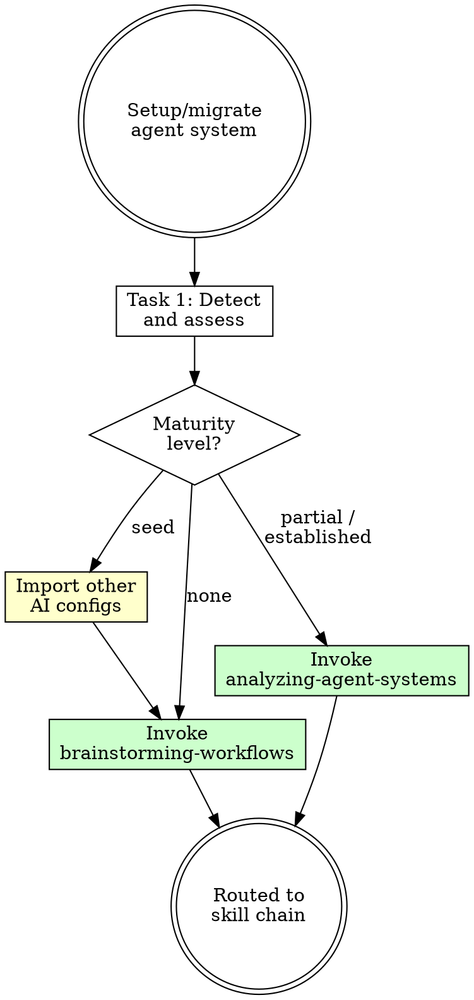

# Migrating Agent Systems

## Overview

**Migrating agent systems IS routing to the correct workflow based on project state.**

Detect whether an agent system already exists, then invoke the appropriate skill chain. This skill is a thin router — all logic lives in the specialized skills.

**Core principle:** Detect, don't assume. Route, don't implement.

**Violating the letter of the rules is violating the spirit of the rules.**

## Routing

**Pattern:** Tree
**Handoff:** auto-invoke
**Next:** `analyzing-agent-systems` | `brainstorming-workflows`
**Chain:** main

## Task Initialization (MANDATORY)

Before ANY action, create task list using TaskCreate:

```
TaskCreate for EACH task below:
- Subject: "[migrating-agent-systems] Task N: <action>"
- ActiveForm: "<doing action>"
```

**Tasks:**
1. Detect and assess existing agent system
2. Route to appropriate skill chain

Announce: "Created 2 tasks. Starting execution..."

**Execution rules:**
1. `TaskUpdate status="in_progress"` BEFORE starting each task
2. `TaskUpdate status="completed"` ONLY after verification passes
3. If task fails → stay in_progress, diagnose, retry
4. NEVER skip to next task until current is completed
5. At end, `TaskList` to confirm all completed

## Task 1: Detect and Assess Existing Agent System

**Goal:** Determine the project's agent system maturity level, not just presence/absence.

**Check for Claude Code components:**
- `CLAUDE.md` (project root)
- `.claude/` directory
- `.claude/rules/` directory
- `.claude/settings.json`
- `.claude/skills/` directory

**Check for other AI tool configurations:**
- `.cursorrules` (Cursor)
- `.github/copilot-instructions.md` (GitHub Copilot)
- `.windsurfrules` (Windsurf)
- `.aider.conf.yml` (Aider)

**Check for existing conventions:**
- `.editorconfig`
- Linter configs (`.eslintrc*`, `.prettierrc*`, `ruff.toml`, etc.)
- CI/CD pipeline configs (`.github/workflows/`, `.gitlab-ci.yml`)

**Maturity classification:**

| Level | Criteria | Route |
|-------|----------|-------|
| **None** | No components found | → `brainstorming-workflows` |
| **Seed** | Only other AI tool configs exist (`.cursorrules`, etc.) — no Claude Code components | → `brainstorming-workflows` (import existing configs as starting context) |
| **Partial** | Has CLAUDE.md or rules but missing skills/hooks | → `analyzing-agent-systems` |
| **Established** | Has CLAUDE.md + rules + at least one skill or hook | → `analyzing-agent-systems` |

**For Seed level:** Record which other AI configs exist and their content summary — these become input for the brainstorming step to avoid re-discovering known conventions.

**Verification:** Clear maturity classification with evidence (which components found, which missing).

## Task 2: Route to Appropriate Skill Chain

**Goal:** Invoke the correct starting skill based on maturity level.

**Language recommendation (all routes):**
Before routing, advise the user: "All skills, rules, CLAUDE.md, and prompt files should be written in English for best model performance. Use your native language only in CLAUDE.md communication rules (e.g., 'respond in Traditional Chinese'). Shall I proceed in English for all agent system files?"

**If None:**
- Announce: "New project with no existing configuration. Starting workflow exploration..."
- Invoke `brainstorming-workflows` skill
- Chain: brainstorming → planning → applying → reviewing → refactoring

**If Seed (other AI configs found):**
- Announce: "Found existing [tool] configuration. Importing as starting context for workflow exploration..."
- Read and summarize existing configs (`.cursorrules`, copilot instructions, etc.)
- Invoke `brainstorming-workflows` skill, passing the config summary as pre-loaded context
- Chain: brainstorming → planning → applying → reviewing → refactoring

**If Partial or Established:**
- Announce: "Existing agent system detected ([list components found]). Starting analysis..."
- If existing files contain non-English prompts, flag as a migration item: "Found non-English prompt files — recommend converting to English for optimal model performance."
- Invoke `analyzing-agent-systems` skill
- Chain: analyzing → brainstorming → planning → applying → reviewing → refactoring

**Verification:** Correct skill invoked based on maturity level, with appropriate context passed.

## Red Flags - STOP

These thoughts mean you're rationalizing. STOP and reconsider:

- "I can see it's a new project, skip detection"
- "Just start building without analyzing"
- "Handle everything in this skill instead of routing"
- "Skip brainstorming, I know what's needed"
- "Ignore the .cursorrules file, it's for a different tool"
- "It has a CLAUDE.md so it's established" (could be empty or minimal)

**All of these mean: You're about to bypass the specialized skills. Route correctly.**

## Common Rationalizations

| Excuse | Reality |
|--------|---------|
| "Skip detection" | Hidden configs exist. Always check. |
| "Build without analyzing" | Existing systems have history. Analyze first. |
| "Handle here" | This skill is a router. Logic lives in specialized skills. |
| "Skip brainstorming" | Assumptions about workflows lead to misfit systems. |
| "Ignore other AI configs" | `.cursorrules` and copilot instructions contain validated conventions worth importing. |
| "Has CLAUDE.md = established" | Quality matters more than presence. A 3-line CLAUDE.md is seed-level at best. |

## Flowchart: Agent System Migration


```dot
digraph migrate_agent {
    rankdir=TB;

    start [label="Setup/migrate\nagent system", shape=doublecircle];
    detect [label="Task 1: Detect\nand assess", shape=box];
    maturity [label="Maturity\nlevel?", shape=diamond];
    import_cfg [label="Import other\nAI configs", shape=box, style=filled, fillcolor="#ffffcc"];
    brainstorm [label="Invoke\nbrainstorming-workflows", shape=box, style=filled, fillcolor="#ccffcc"];
    analyze [label="Invoke\nanalyzing-agent-systems", shape=box, style=filled, fillcolor="#ccffcc"];
    done [label="Routed to\nskill chain", shape=doublecircle];

    start -> detect;
    detect -> maturity;
    maturity -> brainstorm [label="none"];
    maturity -> import_cfg [label="seed"];
    maturity -> analyze [label="partial /\nestablished"];
    import_cfg -> brainstorm;
    brainstorm -> done;
    analyze -> done;
}
```

## Skill Chain Reference

| Step | Skill | Purpose |
|------|-------|---------|
| 0 | `analyzing-agent-systems` | Scan + 10-category weakness detection (if partial/established) |
| 1 | `brainstorming-workflows` | Role-based workflow exploration + simplicity assessment |
| 2 | `planning-agent-systems` | Architecture flowchart + dependency-driven component planning |
| 3 | `applying-agent-systems` | Invoke writing-* skills per phase |
| 4 | `refactoring-agent-systems` | Review + cleanup |
