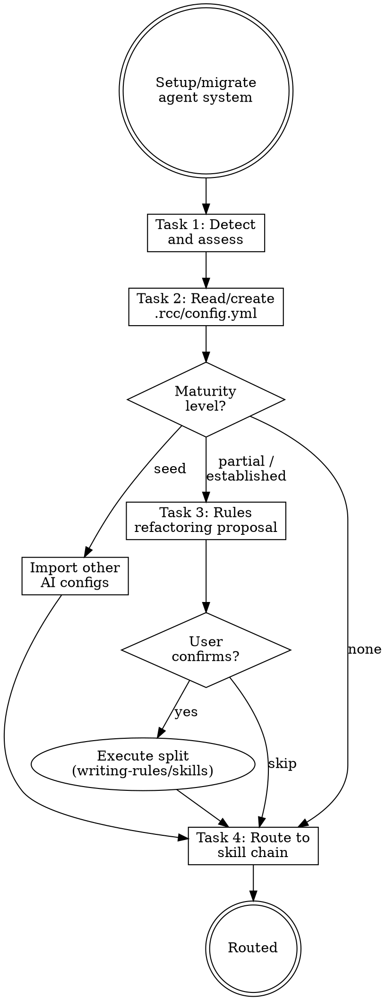

# Migrating Agent Systems

## Overview

**Migrating agent systems IS routing to the correct workflow based on project state.**

Detect whether an agent system already exists, then invoke the appropriate skill chain. This skill is a thin router — all logic lives in the specialized skills.

**Core principle:** Detect, don't assume. Route, don't implement.

**Violating the letter of the rules is violating the spirit of the rules.**

## Routing

**Pattern:** Tree
**Handoff:** auto-invoke
**Next:** `analyzing-agent-systems` | `brainstorming-workflows`
**Chain:** main

## Task Initialization (MANDATORY)

Before ANY action, create task list using TaskCreate:

```
TaskCreate for EACH task below:
- Subject: "[migrating-agent-systems] Task N: <action>"
- ActiveForm: "<doing action>"
```

**Tasks:**
1. Detect and assess existing agent system
2. Read or create `.rcc/config.yml`
3. Rules refactoring proposal
4. Route to appropriate skill chain

Announce: "Created 4 tasks. Starting execution..."

**Execution rules:**
1. `TaskUpdate status="in_progress"` BEFORE starting each task
2. `TaskUpdate status="completed"` ONLY after verification passes
3. If task fails → stay in_progress, diagnose, retry
4. NEVER skip to next task until current is completed
5. At end, `TaskList` to confirm all completed

## Task 1: Detect and Assess Existing Agent System

**Goal:** Determine the project's agent system maturity level, not just presence/absence.

**Check for Claude Code components:**
- `CLAUDE.md` (project root)
- `.claude/` directory
- `.claude/rules/` directory
- `.claude/settings.json`
- `.claude/skills/` directory

**Check for other AI tool configurations:**
- `.cursorrules` (Cursor)
- `.github/copilot-instructions.md` (GitHub Copilot)
- `.windsurfrules` (Windsurf)
- `.aider.conf.yml` (Aider)

**Check for existing conventions:**
- `.editorconfig`
- Linter configs (`.eslintrc*`, `.prettierrc*`, `ruff.toml`, etc.)
- CI/CD pipeline configs (`.github/workflows/`, `.gitlab-ci.yml`)

**Maturity classification:**

| Level | Criteria | Route |
|-------|----------|-------|
| **None** | No components found | → `brainstorming-workflows` |
| **Seed** | Only other AI tool configs exist (`.cursorrules`, etc.) — no Claude Code components | → `brainstorming-workflows` (import existing configs as starting context) |
| **Partial** | Has CLAUDE.md or rules but missing skills/hooks | → `analyzing-agent-systems` |
| **Established** | Has CLAUDE.md + rules + at least one skill or hook | → `analyzing-agent-systems` |

**For Seed level:** Record which other AI configs exist and their content summary — these become input for the brainstorming step to avoid re-discovering known conventions.

**Verification:** Clear maturity classification with evidence (which components found, which missing).

## Task 2: Read or Create `.rcc/config.yml`

**Goal:** Ensure the project has a `.rcc/config.yml` recording migration state and key decisions. Idempotent — on re-runs, this prevents redoing work. Also migrate legacy folders if present.

**Read [references/config-schema.md](references/config-schema.md)** for the full schema and field semantics.

**Process:**

### 2a — Legacy folder migration (run BEFORE creating config)

RCC v11 moved artifact output from `docs/agent-system/` + `docs/validation-reports/` into `.rcc/`. If legacy folders exist, migrate them first.

**Detect legacy folders:**
```bash
test -d docs/agent-system && echo "legacy-agent-system"
test -d docs/validation-reports && echo "legacy-validation"
```

**If either exists:**

1. List contents to the user:
   > 偵測到舊版路徑。RCC v11 起產出改寫到 `.rcc/`。建議遷移：
   > - `docs/agent-system/` → `.rcc/` （找到 N 份檔案）
   > - `docs/validation-reports/` → `.rcc/validation/` （找到 M 份檔案）
   >
   > 要執行遷移嗎？（預設：是）

2. **If confirmed:**
   - `mkdir -p .rcc/validation`
   - For each file in `docs/agent-system/`:
     - Tracked (`git ls-files <file>` returns path) → `git mv <file> .rcc/<basename>`
     - Untracked → `mv <file> .rcc/<basename>`
   - For each file in `docs/validation-reports/`:
     - Same tracked/untracked split → target `.rcc/validation/<basename>`
   - If `docs/agent-system/archive/` exists, move wholesale: `git mv docs/agent-system/archive .rcc/archive` (or `mv` for untracked)
   - `rmdir docs/agent-system docs/validation-reports` after emptying
   - If `docs/` is now empty, `rmdir docs/` too

3. **If declined:** record in `decisions_log` that legacy folders were kept, and note this skill will not re-offer migration unless forced.

4. **Report to user:** summary of files moved with tracked/untracked counts.

### 2b — Handle `.rcc/config.yml`

1. **Check `.rcc/config.yml` exists.**

2. **If exists:** Load it. Report to user:
   > 偵測到 `.rcc/config.yml`：上次遷移 `{migration.last_at}`，使用 rcc `{migration.last_rcc_version}`。本次 rcc 版本為 `{current}`。
   >
   > - release automation: `{release_automation.decision}` / `{release_automation.tool}`
   > - safety settings: `{settings_scope.safety_bypass}`
   - If `last_rcc_version < current`: offer re-migration to pull newer patterns
   - If `migration.completed: true` and versions match: ask if user wants to re-run anyway or proceed to specific task

3. **If missing:** Create `.rcc/` directory (if not already by 2a) and write a new `config.yml`. Ask the user (one round of questions):

   ```
   要記錄以下決策到 .rcc/config.yml 嗎？
   1. Release automation（版號自動化）：release-please / semantic-release / 跳過
   2. 安全規則 (safety_bypass) 要放在：
      - `.claude/settings.json`（團隊共享，checked in）[預設]
      - `.claude/settings.local.json`（個人，gitignored）
      - `~/.claude/settings.json`（使用者全域）
   3. 主調度員模型：claude-opus-4-7 @ xhigh [預設，依 4.7 最佳實踐]
   ```

4. **Write config.yml** with user answers + detected state from Task 1. Populate `decisions_log` with each confirmed answer. If 2a migrated folders, add a log entry recording that.

5. **Also ensure** `.gitignore` does not exclude `.rcc/` (config.yml must be tracked).

**Verification:** Legacy folders migrated or decline recorded. `.rcc/config.yml` exists, all key fields populated, user has confirmed or declined each decision.

## Task 3: Rules Refactoring Proposal

**Goal:** Analyze CLAUDE.md and rules content, propose splitting into appropriate locations.

**Skip condition:** If maturity is None or Seed, skip this task (no existing content to refactor).

**Process:**

1. Read all CLAUDE.md files and `.claude/rules/*.md`
2. For each content block, classify:

| Category | Criteria | Action |
|----------|----------|--------|
| Abstract directive (what/why) | Broad, applies to all work | Keep in CLAUDE.md |
| Path-related directive | Targets specific file types or directories | Extract to path-scoped rule |
| Procedural content (how/steps) | Multi-step process, code blocks as instructions | Extract to skill |
| Outdated/duplicate | Conflicts with or duplicates other content | Delete |

3. Produce refactoring proposal table:

```
## Rules Refactoring Proposal

| # | Source | Summary | Category | Action | Target |
|---|--------|---------|----------|--------|--------|
```

4. Present proposal to user for confirmation
5. If confirmed, invoke `writing-rules` or `writing-skills` for each item

**Verification:** User has confirmed or skipped the proposal.

## Task 4: Route to Appropriate Skill Chain

**Goal:** Invoke the correct starting skill based on maturity level.

**Language recommendation (all routes):**
Before routing, advise the user: "All skills, rules, CLAUDE.md, and prompt files should be written in English for best model performance. Use your native language only in CLAUDE.md communication rules (e.g., 'respond in Traditional Chinese'). Shall I proceed in English for all agent system files?"

**If None:**
- Announce: "New project with no existing configuration. Starting workflow exploration..."
- Invoke `brainstorming-workflows` skill
- Chain: brainstorming → planning → applying → reviewing → refactoring

**If Seed (other AI configs found):**
- Announce: "Found existing [tool] configuration. Importing as starting context for workflow exploration..."
- Read and summarize existing configs (`.cursorrules`, copilot instructions, etc.)
- Invoke `brainstorming-workflows` skill, passing the config summary as pre-loaded context
- Chain: brainstorming → planning → applying → reviewing → refactoring

**If Partial or Established:**
- Announce: "Existing agent system detected ([list components found]). Starting analysis..."
- If existing files contain non-English prompts, flag as a migration item: "Found non-English prompt files — recommend converting to English for optimal model performance."
- Invoke `analyzing-agent-systems` skill
- Chain: analyzing → brainstorming → planning → applying → reviewing → refactoring

**Verification:** Correct skill invoked based on maturity level, with appropriate context passed.

## Red Flags - STOP

These thoughts mean you're rationalizing. STOP and reconsider:

- "I can see it's a new project, skip detection"
- "Just start building without analyzing"
- "Handle everything in this skill instead of routing"
- "Skip brainstorming, I know what's needed"
- "Ignore the .cursorrules file, it's for a different tool"
- "It has a CLAUDE.md so it's established" (could be empty or minimal)

**All of these mean: You're about to bypass the specialized skills. Route correctly.**

## Common Rationalizations

| Excuse | Reality |
|--------|---------|
| "Skip detection" | Hidden configs exist. Always check. |
| "Build without analyzing" | Existing systems have history. Analyze first. |
| "Handle here" | This skill is a router. Logic lives in specialized skills. |
| "Skip brainstorming" | Assumptions about workflows lead to misfit systems. |
| "Ignore other AI configs" | `.cursorrules` and copilot instructions contain validated conventions worth importing. |
| "Has CLAUDE.md = established" | Quality matters more than presence. A 3-line CLAUDE.md is seed-level at best. |

## Flowchart: Agent System Migration


```dot
digraph migrate_agent {
    rankdir=TB;

    start [label="Setup/migrate\nagent system", shape=doublecircle];
    detect [label="Task 1: Detect\nand assess", shape=box];
    config [label="Task 2: Read/create\n.rcc/config.yml", shape=box];
    maturity [label="Maturity\nlevel?", shape=diamond];
    import_cfg [label="Import other\nAI configs", shape=box];
    refactor [label="Task 3: Rules\nrefactoring proposal", shape=box];
    confirm [label="User\nconfirms?", shape=diamond];
    execute [label="Execute split\n(writing-rules/skills)"];
    route [label="Task 4: Route to\nskill chain", shape=box];
    done [label="Routed", shape=doublecircle];

    start -> detect;
    detect -> config;
    config -> maturity;
    maturity -> route [label="none"];
    maturity -> import_cfg [label="seed"];
    maturity -> refactor [label="partial /\nestablished"];
    import_cfg -> route;
    refactor -> confirm;
    confirm -> execute [label="yes"];
    confirm -> route [label="skip"];
    execute -> route;
    route -> done;
}
```

## Skill Chain Reference

| Step | Skill | Purpose |
|------|-------|---------|
| 0 | `analyzing-agent-systems` | Scan + 11-category weakness detection (if partial/established) |
| 1 | `brainstorming-workflows` | Role-based workflow exploration + simplicity assessment |
| 2 | `planning-agent-systems` | Architecture flowchart + dependency-driven component planning |
| 3 | `applying-agent-systems` | Invoke writing-* skills per phase |
| 4 | `refactoring-agent-systems` | Review + cleanup |

## References

- [references/config-schema.md](references/config-schema.md) — `.rcc/config.yml` schema, field semantics, and read/write table per skill
