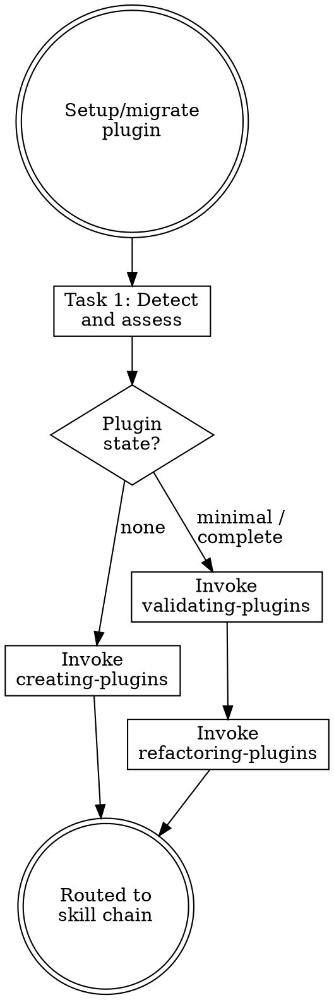

# Migrating Plugins

## Overview

**Migrating plugins IS routing to the correct workflow based on plugin state.**

Detect whether a plugin already exists, assess its completeness, then invoke the appropriate skill chain. This skill is a thin router — all logic lives in the specialized skills.

**Core principle:** Detect, don't assume. Route, don't implement.

**Violating the letter of the rules is violating the spirit of the rules.**

## Routing

**Pattern:** Tree
**Handoff:** auto-invoke
**Next:** `creating-plugins` | `validating-plugins` → `refactoring-plugins`
**Chain:** plugin

## Task Initialization (MANDATORY)

Before ANY action, create task list using TaskCreate:

```
TaskCreate for EACH task below:
- Subject: "[migrating-plugins] Task N: <action>"
- ActiveForm: "<doing action>"
```

**Tasks:**
1. Detect and assess plugin state
2. Route to appropriate skill chain

Announce: "Created 2 tasks. Starting execution..."

**Execution rules:**
1. `TaskUpdate status="in_progress"` BEFORE starting each task
2. `TaskUpdate status="completed"` ONLY after verification passes
3. If task fails → stay in_progress, diagnose, retry
4. NEVER skip to next task until current is completed
5. At end, `TaskList` to confirm all completed

## Plugin vs Project: Key Differences

Plugins have a different structure than projects. Do NOT look for project-level components:

| Component | Project | Plugin |
|-----------|---------|--------|
| CLAUDE.md | ✓ | ✗ |
| .claude/rules/ | ✓ | ✗ |
| .claude/settings.json | ✓ | ✗ (plugin has settings.json at root) |
| .claude-plugin/plugin.json | ✗ | ✓ (manifest) |
| marketplace.json | ✗ | ✓ (if marketplace) |
| skills/ | .claude/skills/ | plugin-root/skills/ |
| agents/ | .claude/agents/ | plugin-root/agents/ |
| hooks/ | .claude/settings.json | plugin-root/hooks/hooks.json |
| .mcp.json | ✓ | ✓ |
| .lsp.json | ✗ | ✓ |
| bin/ | ✗ | ✓ |

## Task 1: Detect and Assess Plugin State

**Goal:** Determine whether a plugin exists and its completeness level.

**Check for plugin components:**
- `.claude-plugin/plugin.json` (manifest — required)
- `skills/` directory with `*/SKILL.md` files
- `agents/` directory with `*.md` files
- `hooks/hooks.json` and hook scripts
- `commands/` directory (legacy, now merged with skills)
- `.mcp.json` (MCP server configs)
- `.lsp.json` (LSP server configs)
- `settings.json` (default settings)
- `bin/` (executables)

**Check for marketplace (if this is a marketplace repo):**
- `.claude-plugin/marketplace.json`
- Multiple plugin directories under `plugins/`

**Run `claude plugin validate`** on the plugin directory to catch structural issues.

**Maturity classification:**

| Level | Criteria | Route |
|-------|----------|-------|
| **None** | No `.claude-plugin/plugin.json` found | → `creating-plugins` |
| **Minimal** | Has manifest but missing skills/agents/hooks | → `validating-plugins` → `refactoring-plugins` |
| **Complete** | Has manifest + skills + agents or hooks | → `validating-plugins` → `refactoring-plugins` |

**For each component found, record:**
- Type (manifest / skill / agent / hook / command / mcp / lsp)
- Path
- Line count
- Brief purpose (from frontmatter or filename)

**Verification:** Clear maturity classification with evidence (which components found, which missing).

## Task 2: Route to Appropriate Skill Chain

**Goal:** Invoke the correct starting skill based on plugin state.

**If None:**
- Announce: "No plugin found. Starting plugin creation..."
- Invoke `creating-plugins` skill

**If Minimal or Complete:**
- Announce: "Existing plugin detected ([list components found]). Starting validation..."
- Invoke `validating-plugins` skill to produce a validation report
- After validation, invoke `refactoring-plugins` skill with the report as context
- Chain: validating → refactoring

**Verification:** Correct skill invoked based on maturity level, with appropriate context passed.

## Red Flags - STOP

These thoughts mean you're rationalizing. STOP and reconsider:

- "I can see there's no plugin, skip detection"
- "The plugin.json exists so it's complete"
- "Skip validation, just refactor"
- "Handle creation here instead of routing"
- "It has skills so it must be fine"
- "Ignore the hooks directory, it's optional"

**All of these mean: You're about to bypass the specialized skills. Route correctly.**

## Common Rationalizations

| Excuse | Reality |
|--------|---------|
| "Skip detection" | Hidden issues exist. Always scan. |
| "Has manifest = complete" | A 3-field plugin.json is minimal at best. Check all components. |
| "Skip validation" | `claude plugin validate` catches issues you can't see by reading. Run it. |
| "Handle here" | This skill is a router. Creation and refactoring logic live in specialized skills. |
| "Has skills = fine" | Skills without proper frontmatter silently fail to trigger. Validate. |
| "Hooks are optional" | Optional doesn't mean skip checking. If hooks exist, they must be valid. |

## Flowchart: Plugin Migration



## Skill Chain Reference

| Step | Skill | Purpose |
|------|-------|---------|
| 0 | `validating-plugins` | Batch scan all files for frontmatter, links, orphans |
| 1 | `refactoring-plugins` | Health-check and fix against official best practices |
| alt | `creating-plugins` | Scaffold new plugin from scratch |
