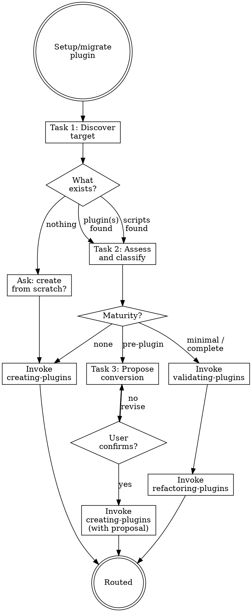

# Migrating Plugins

## Overview

**Migrating plugins IS identifying what to work with, then routing to the correct workflow.**

A workspace may contain existing plugins, a script project that should become a plugin, or nothing. This skill discovers the state, asks the user what they want, resolves paths, then routes.

**Core principle:** Discover what exists. Ask the user. Then route.

**Violating the letter of the rules is violating the spirit of the rules.**

## Routing

**Pattern:** Tree
**Handoff:** auto-invoke
**Next:** `creating-plugins` | `validating-plugins` → `refactoring-plugins`
**Chain:** plugin

## Task Initialization (MANDATORY)

Before ANY action, create task list using TaskCreate:

```
TaskCreate for EACH task below:
- Subject: "[migrating-plugins] Task N: <action>"
- ActiveForm: "<doing action>"
```

**Tasks:**
1. Discover and select target
2. Assess state and classify
3. Propose conversion (if pre-plugin)
4. Route to appropriate skill chain

Announce: "Created 4 tasks. Starting execution..."

**Execution rules:**
1. `TaskUpdate status="in_progress"` BEFORE starting each task
2. `TaskUpdate status="completed"` ONLY after verification passes
3. If task fails → stay in_progress, diagnose, retry
4. NEVER skip to next task until current is completed
5. At end, `TaskList` to confirm all completed

## Plugin vs Project: Key Differences

| Component | Project | Plugin |
|-----------|---------|--------|
| CLAUDE.md | ✓ | ✗ |
| .claude/rules/ | ✓ | ✗ |
| .claude/settings.json | ✓ | ✗ (plugin has settings.json at root) |
| .claude-plugin/plugin.json | ✗ | ✓ (manifest) |
| marketplace.json | ✗ | ✓ (if marketplace) |
| skills/ | .claude/skills/ | plugin-root/skills/ |
| agents/ | .claude/agents/ | plugin-root/agents/ |
| hooks/ | .claude/settings.json | plugin-root/hooks/hooks.json |
| .mcp.json | ✓ | ✓ |
| .lsp.json | ✗ | ✓ |
| bin/ | ✗ | ✓ |

## Task 1: Discover and Select Target

**Goal:** Find existing plugins or identify a script project to convert.

**Discovery strategy (try in order):**

1. **Check for marketplace.json** — scan for `**/.claude-plugin/marketplace.json`. Read `plugins` array for names and `source` paths.

2. **Check for standalone plugins** — scan for `**/.claude-plugin/plugin.json`. Each parent of `.claude-plugin/` is a plugin root.

3. **Check for script project** — if no plugins found, scan for signs of a convertible project:
   - Script files (`*.sh`, `*.py`, `*.js`, `*.ts`) in root or `scripts/`, `src/`, `bin/`
   - README.md describing a tool or utility
   - Package manifest (`package.json`, `pyproject.toml`, `Cargo.toml`)
   - Existing `.claude/` directory with skills, commands, or agents

4. **Check user-specified path** — if the user provided a path, use it directly.

**For each plugin found, record:**
- Name (from plugin.json `name` field)
- Root path
- Version
- Source path (from marketplace.json if applicable)

**If multiple plugins found:**
- Present numbered list, ask which to work on

**If exactly one plugin found:**
- Confirm: "Found plugin '[name]' at [path]. Proceed?"

**If no plugins but script project detected:**
- Announce: "No plugin found, but this looks like a script project that could become a plugin."
- List what was found (scripts, README, package manifest, .claude/ configs)
- Ask: "Do you want to package this as a Claude Code plugin?"

**If nothing found:**
- Ask: "Do you want to create a new plugin from scratch?"

**Set the target path** for all subsequent tasks.

**Verification:** Target is selected, path is resolved, user has confirmed.

## Task 2: Assess State and Classify

**Goal:** Determine the maturity level of the target.

**Maturity classification:**

| Level | Criteria | Route |
|-------|----------|-------|
| **None** | No plugin, no scripts, user wants new | → `creating-plugins` |
| **Pre-plugin** | Script project without `.claude-plugin/` — has scripts, tools, or `.claude/` configs that can become plugin components | → Task 3 (conversion proposal) → `creating-plugins` |
| **Minimal** | Has `.claude-plugin/plugin.json` but missing skills/agents/hooks | → `validating-plugins` → `refactoring-plugins` |
| **Complete** | Has manifest + skills + agents or hooks | → `validating-plugins` → `refactoring-plugins` |

**For Pre-plugin, scan and categorize existing assets:**

| Asset Type | Example | Becomes |
|------------|---------|---------|
| Scripts with reusable logic | `scripts/deploy.sh`, `tools/lint.py` | `bin/` executables or skill-bundled scripts |
| Markdown instructions | `.claude/commands/*.md` | `skills/` or `commands/` |
| Agent definitions | `.claude/agents/*.md` | `agents/` |
| Hook scripts | `.claude/hooks/*` | `hooks/` |
| Skill directories | `.claude/skills/*/SKILL.md` | `skills/` |
| MCP server configs | `.mcp.json` | `.mcp.json` |
| Validation/linting scripts | `scripts/validate.py` | `hooks/` |

**For each asset found, record:**
- Source path
- Type (script / instruction / agent / hook / skill / config)
- Suggested plugin component
- Line count

**Run `claude plugin validate`** if `.claude-plugin/` exists.

**Verification:** Clear maturity classification with asset inventory.

## Task 3: Propose Conversion (Pre-plugin Only)

**Skip if:** Maturity is None, Minimal, or Complete.

**Goal:** Present a conversion proposal for the script project.

**Conversion proposal format:**

```
## Plugin Conversion Proposal

Plugin name: [suggested-name]
Source: [project path]

| # | Source | Type | Plugin Component | Action |
|---|--------|------|-----------------|--------|
| 1 | scripts/deploy.sh | script | bin/deploy.sh | Copy to bin/, make executable |
| 2 | .claude/commands/review.md | instruction | skills/reviewing/SKILL.md | Convert to skill with frontmatter |
| 3 | .claude/agents/checker.md | agent | agents/checker.md | Copy, verify frontmatter |
| 4 | scripts/lint.py | validator | hooks/lint.py + hooks.json | Wrap as PostToolUse hook |
| 5 | README.md | docs | README.md | Adapt for plugin installation |
```

**Present to user for confirmation.**

**If confirmed:**
- Pass the conversion proposal as context to `creating-plugins`
- `creating-plugins` will use the proposal to pre-populate the plugin structure instead of starting from scratch

**If rejected:**
- Ask what to change, revise proposal, present again

**Verification:** User has confirmed or revised the conversion proposal.

## Task 4: Route to Appropriate Skill Chain

**Goal:** Invoke the correct skill with the target path.

**CRITICAL:** Always pass the target path to downstream skills.

**If None:**
- Invoke `creating-plugins`

**If Pre-plugin (after Task 3 confirmation):**
- Invoke `creating-plugins` with the conversion proposal as context
- The proposal tells `creating-plugins` which files to move/convert instead of scaffolding from scratch

**If Minimal or Complete:**
- Invoke `validating-plugins` with plugin root path
- After validation, invoke `refactoring-plugins` with report and plugin root path

**Verification:** Correct skill invoked with target path and context.

## Red Flags - STOP

These thoughts mean you're rationalizing. STOP and reconsider:

- "I know which plugin they mean"
- "There's only one plugin, skip asking"
- "This project can't be a plugin"
- "Just create a new plugin, ignore existing scripts"
- "The plugin.json exists so it's complete"
- "Skip validation, just refactor"
- "I'll just use the current directory"

**All of these mean: You're about to guess instead of discover. Scan, ask, then route.**

## Common Rationalizations

| Excuse | Reality |
|--------|---------|
| "I know which one" | Multiple plugins can exist. Always list and confirm. |
| "Can't be a plugin" | Any project with reusable scripts or instructions can become a plugin. |
| "Ignore existing scripts" | Existing scripts are validated, working code. Reuse them. |
| "Has manifest = complete" | A 3-field plugin.json is minimal at best. Check all components. |
| "Skip validation" | `claude plugin validate` catches structural issues you can't see by reading. |
| "Use current directory" | Plugin root may be nested. Resolve from marketplace.json or plugin.json. |

## Flowchart: Plugin Migration



## Skill Chain Reference

| Step | Skill | Purpose |
|------|-------|---------|
| 0 | `validating-plugins` | Batch scan all files for frontmatter, links, orphans |
| 1 | `refactoring-plugins` | Health-check and fix against official best practices |
| alt-a | `creating-plugins` | Scaffold new plugin (from scratch or from conversion proposal) |
