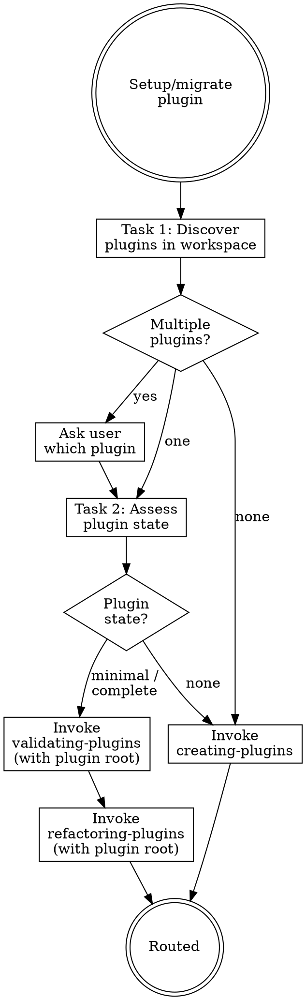

# Migrating Plugins

## Overview

**Migrating plugins IS identifying which plugin to work on, then routing to the correct workflow.**

A workspace may contain multiple plugins. This skill first locates all plugins, asks the user which one to target, resolves its root path, then routes to the appropriate chain.

**Core principle:** Ask which plugin. Resolve the path. Then route.

**Violating the letter of the rules is violating the spirit of the rules.**

## Routing

**Pattern:** Tree
**Handoff:** auto-invoke
**Next:** `creating-plugins` | `validating-plugins` → `refactoring-plugins`
**Chain:** plugin

## Task Initialization (MANDATORY)

Before ANY action, create task list using TaskCreate:

```
TaskCreate for EACH task below:
- Subject: "[migrating-plugins] Task N: <action>"
- ActiveForm: "<doing action>"
```

**Tasks:**
1. Discover and select target plugin
2. Assess plugin state
3. Route to appropriate skill chain

Announce: "Created 3 tasks. Starting execution..."

**Execution rules:**
1. `TaskUpdate status="in_progress"` BEFORE starting each task
2. `TaskUpdate status="completed"` ONLY after verification passes
3. If task fails → stay in_progress, diagnose, retry
4. NEVER skip to next task until current is completed
5. At end, `TaskList` to confirm all completed

## Plugin vs Project: Key Differences

Plugins have a different structure than projects. Do NOT look for project-level components:

| Component | Project | Plugin |
|-----------|---------|--------|
| CLAUDE.md | ✓ | ✗ |
| .claude/rules/ | ✓ | ✗ |
| .claude/settings.json | ✓ | ✗ (plugin has settings.json at root) |
| .claude-plugin/plugin.json | ✗ | ✓ (manifest) |
| marketplace.json | ✗ | ✓ (if marketplace) |
| skills/ | .claude/skills/ | plugin-root/skills/ |
| agents/ | .claude/agents/ | plugin-root/agents/ |
| hooks/ | .claude/settings.json | plugin-root/hooks/hooks.json |
| .mcp.json | ✓ | ✓ |
| .lsp.json | ✗ | ✓ |
| bin/ | ✗ | ✓ |

## Task 1: Discover and Select Target Plugin

**Goal:** Find all plugins in the workspace and let the user choose which one to work on.

**Discovery strategy (try in order):**

1. **Check for marketplace.json** — scan for `**/. claude-plugin/marketplace.json`. If found, read the `plugins` array to get all plugin names and `source` paths (relative to marketplace.json location).

2. **Check for standalone plugins** — scan for `**/.claude-plugin/plugin.json`. Each parent directory of `.claude-plugin/` is a plugin root.

3. **Check user-specified path** — if the user provided a path in their request, use it directly.

**For each plugin found, record:**
- Name (from plugin.json `name` field)
- Root path (the directory containing `.claude-plugin/`)
- Version (from plugin.json `version` field)
- Source path (from marketplace.json `source` if applicable)

**If multiple plugins found:**
- Present a numbered list to the user
- Ask: "Which plugin do you want to work on?"
- Wait for user selection

**If exactly one plugin found:**
- Confirm with user: "Found plugin '[name]' at [path]. Proceed?"

**If no plugins found:**
- Announce: "No existing plugins found. Do you want to create a new one?"
- If yes → route to `creating-plugins` in Task 3

**Set the target plugin root path** — all subsequent tasks and skill invocations use this path as their working context.

**Verification:** A single plugin is selected, its root path is resolved to an absolute path, and the user has confirmed.

## Task 2: Assess Plugin State

**Goal:** Scan the selected plugin's components and classify its maturity.

**Working directory:** Use the plugin root path from Task 1.

**Check for plugin components (relative to plugin root):**
- `.claude-plugin/plugin.json` (manifest — required)
- `skills/` directory with `*/SKILL.md` files
- `agents/` directory with `*.md` files
- `hooks/hooks.json` and hook scripts
- `commands/` directory (legacy, now merged with skills)
- `.mcp.json` (MCP server configs)
- `.lsp.json` (LSP server configs)
- `settings.json` (default settings)
- `bin/` (executables)

**Run `claude plugin validate`** on the plugin root directory.

**Maturity classification:**

| Level | Criteria | Route |
|-------|----------|-------|
| **None** | No `.claude-plugin/plugin.json` found | → `creating-plugins` |
| **Minimal** | Has manifest but missing skills/agents/hooks | → `validating-plugins` → `refactoring-plugins` |
| **Complete** | Has manifest + skills + agents or hooks | → `validating-plugins` → `refactoring-plugins` |

**For each component found, record:**
- Type (manifest / skill / agent / hook / command / mcp / lsp)
- Path (relative to plugin root)
- Line count
- Brief purpose (from frontmatter or filename)

**Verification:** Clear maturity classification with component inventory. Plugin root path confirmed.

## Task 3: Route to Appropriate Skill Chain

**Goal:** Invoke the correct starting skill, passing the plugin root path.

**CRITICAL:** When invoking downstream skills, always specify the plugin root path so they operate on the correct target. Do NOT assume the current working directory is the plugin root.

**If None:**
- Announce: "No plugin found at [path]. Starting plugin creation..."
- Invoke `creating-plugins` skill

**If Minimal or Complete:**
- Announce: "Plugin '[name]' at [path] — [maturity]. Starting validation..."
- Invoke `validating-plugins` skill with the plugin root path
- After validation, invoke `refactoring-plugins` skill with the validation report and plugin root path
- Chain: validating → refactoring

**Verification:** Correct skill invoked with plugin root path passed as context.

## Red Flags - STOP

These thoughts mean you're rationalizing. STOP and reconsider:

- "I know which plugin they mean"
- "There's only one plugin, skip asking"
- "The plugin.json exists so it's complete"
- "Skip validation, just refactor"
- "Handle creation here instead of routing"
- "I'll just use the current directory"

**All of these mean: You're about to guess instead of verify. Ask, resolve, then route.**

## Common Rationalizations

| Excuse | Reality |
|--------|---------|
| "I know which one" | Multiple plugins can exist. Always list and confirm. |
| "Only one plugin" | Even with one, confirm the path. User may want a different directory. |
| "Has manifest = complete" | A 3-field plugin.json is minimal at best. Check all components. |
| "Skip validation" | `claude plugin validate` catches structural issues you can't see by reading. |
| "Handle here" | This skill is a router. Logic lives in specialized skills. |
| "Use current directory" | Plugin root may be nested. Resolve from marketplace.json or plugin.json location. |

## Flowchart: Plugin Migration



## Skill Chain Reference

| Step | Skill | Purpose |
|------|-------|---------|
| 0 | `validating-plugins` | Batch scan all files for frontmatter, links, orphans |
| 1 | `refactoring-plugins` | Health-check and fix against official best practices |
| alt | `creating-plugins` | Scaffold new plugin from scratch |
