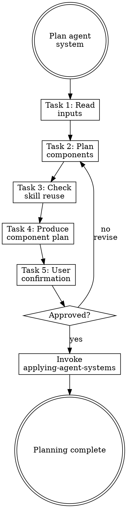

# Planning Agent Systems

## Overview

**Planning agent systems IS mapping workflows to components with explicit rationale.**

Read the analysis report and workflow summary, decide what to create/modify/delete, identify which writing-* skills to invoke, and get user confirmation before execution.

**Core principle:** Every component must trace back to a workflow need or a weakness fix. No speculative components.

**Violating the letter of the rules is violating the spirit of the rules.**

## Task Initialization (MANDATORY)

Before ANY action, create task list using TaskCreate:

```
TaskCreate for EACH task below:
- Subject: "[planning-agent-systems] Task N: <action>"
- ActiveForm: "<doing action>"
```

**Tasks:**
1. Read inputs
2. Plan components
3. Check skill reuse
4. Produce component plan
5. Get user confirmation

Announce: "Created 5 tasks. Starting execution..."

**Execution rules:**
1. `TaskUpdate status="in_progress"` BEFORE starting each task
2. `TaskUpdate status="completed"` ONLY after verification passes
3. If task fails → stay in_progress, diagnose, retry
4. NEVER skip to next task until current is completed
5. At end, `TaskList` to confirm all completed

## Task 1: Read Inputs

**Goal:** Load analysis report (if available) and workflow summary.

**Read:**
- `docs/agent-system/*-analysis.md` (most recent, if exists)
- `docs/agent-system/*-workflows.md` (most recent)

**Extract:**
- Weaknesses marked for fixing
- Workflows to support
- Conventions to enforce
- Component recommendations from workflow summary

**Verification:** Have a clear list of requirements from both sources.

## Task 2: Plan Components

**Goal:** Decide action for each component type.

**For each component type, evaluate:**

| Component | Input Sources | Decision |
|-----------|--------------|----------|
| CLAUDE.md | Workflow conventions + analysis constitution findings | Create / Modify / Keep |
| Rules | Workflow conventions + analysis path-match findings | Which rules, with paths: globs |
| Hooks | Workflow quality checks + analysis security findings | Which hooks, which events |
| Skills | Workflow repeated tasks | Which skills |
| Agents | Workflow isolated analysis needs | Which agents (read-only only) |

**Decision criteria:**
- Does this component trace to a workflow need? → Create
- Does this fix an analysis weakness? → Create/Modify
- Does it already exist and work? → Keep
- Does it conflict with another component? → Modify/Delete
- Is it speculative? → **Don't create (YAGNI)**

**CRITICAL constraints:**
- CLAUDE.md MUST stay under 200 lines
- Each rule MUST stay under 50 lines
- Each skill MUST stay under 300 lines
- Agents MUST be read-only (no `.claude/` writes)
- All `.claude/` writes happen via main conversation, never subagents

**Verification:** Each planned component has a traced rationale.

## Task 3: Check Skill Reuse

**Goal:** Identify which existing writing-* skills to invoke for each component.

**Available skills:**

| Component | Writing Skill | Notes |
|-----------|--------------|-------|
| CLAUDE.md | `writing-claude-md` | Uses official markdown format |
| Rules | `writing-rules` | One invocation per rule |
| Hooks | `writing-hooks` | One invocation per hook |
| Skills | `writing-skills` | One invocation per skill |
| Agents | `writing-subagents` | One invocation per agent |

**Check for conflicts:**
- Will new components duplicate existing ones?
- Will new rules conflict with existing CLAUDE.md content?
- Will new hooks overlap with existing hooks?

**Verification:** Each component has an assigned writing-* skill and no conflicts identified.

## Task 4: Produce Component Plan

**Goal:** Write structured plan to `docs/agent-system/{timestamp}-plan.md`.

**Plan format:**

```markdown
# Agent System Component Plan

**Date:** YYYY-MM-DD HH:MM
**Based on:** [analysis report path] + [workflow summary path]

## Execution Order

Components MUST be created in this order:
1. CLAUDE.md (foundation)
2. Rules (conventions)
3. Hooks (enforcement)
4. Skills (capabilities)
5. Agents (analysis)

## Components

### 1. CLAUDE.md
- **Action:** create / modify
- **Key content:** [bullet list of what to include]
- **Writing skill:** `writing-claude-md`
- **Traces to:** [workflow/weakness references]

### 2. Rule: [name]
- **Action:** create
- **Paths:** `[glob pattern]`
- **Key constraints:** [bullet list]
- **Writing skill:** `writing-rules`
- **Traces to:** [workflow/weakness references]

[...repeat for each component...]

## Expected Fixes
| Weakness | Component | How It Fixes |
|----------|-----------|-------------|
```

**Verification:** Plan written with complete execution order and traceability.

## Task 5: Get User Confirmation

**Goal:** Present plan and get explicit approval.

**Present the FULL plan to user.** Do NOT summarize — show every detail:
1. Each component to create/modify: name, type, purpose, and key content
2. Execution order with rationale for sequencing
3. Which weaknesses will be fixed and how each component addresses them
4. Design decisions made and alternatives considered
5. Estimated scope (how many writing-* invocations)

**Anti-pattern:** Listing component names without explaining what they do or why they're needed is NOT presenting. The user must see enough detail to evaluate whether the plan is correct.

**Ask:** "這個計畫看起來可以嗎？要開始建立元件嗎？"

**Handoff:** After user confirms → invoke `applying-agent-systems` skill, pass plan path

**Verification:** User has reviewed the full plan and explicitly approved.

## Red Flags - STOP

These thoughts mean you're rationalizing. STOP and reconsider:

- "Create everything, we might need it later"
- "Skip traceability, the components are obvious"
- "Don't need user confirmation, the plan is solid"
- "A brief summary is enough for the user to decide"
- "Skip reuse check, just write new ones"
- "One big rule instead of several small ones"

**All of these mean: You're about to create an over-engineered system. Follow the process.**

## Common Rationalizations

| Excuse | Reality |
|--------|---------|
| "Create everything" | YAGNI. Only create what traces to a need. |
| "Skip traceability" | Untraceable components become mystery debt. |
| "Skip confirmation" | User approval prevents wasted effort. |
| "Skip reuse check" | Duplicating existing skills creates conflicts. |
| "One big rule" | Multiple focused rules > one bloated rule. |

## Flowchart: Agent System Planning


