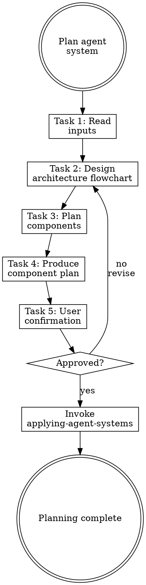

# Planning Agent Systems

## Overview

**Planning agent systems IS mapping workflows to components with explicit rationale.**

Read the analysis report and workflow summary, decide what to create/modify/delete, identify which writing-* skills to invoke, and get user confirmation before execution.

**Core principle:** Every component must trace back to a workflow need or a weakness fix. No speculative components.

**Violating the letter of the rules is violating the spirit of the rules.**

## Routing

**Pattern:** Chain
**Handoff:** user-confirmation
**Next:** `applying-agent-systems`
**Chain:** main

## Task Initialization (MANDATORY)

Before ANY action, create task list using TaskCreate:

```
TaskCreate for EACH task below:
- Subject: "[planning-agent-systems] Task N: <action>"
- ActiveForm: "<doing action>"
```

**Tasks:**
1. Read inputs
2. Design architecture flowchart
3. Plan components (includes reuse check)
4. Produce component plan
5. Get user confirmation

Announce: "Created 5 tasks. Starting execution..."

**Execution rules:**
1. `TaskUpdate status="in_progress"` BEFORE starting each task
2. `TaskUpdate status="completed"` ONLY after verification passes
3. If task fails → stay in_progress, diagnose, retry
4. NEVER skip to next task until current is completed
5. At end, `TaskList` to confirm all completed

## Task 1: Read Inputs

**Goal:** Load analysis report (if available) and workflow summary.

**Read:**
- `.rcc/*-analysis.md` (most recent, if exists)
- `.rcc/*-workflows.md` (most recent, if exists)
- `.rcc/*-reflection.md` (most recent, if exists)

**Extract:**
- Weaknesses marked for fixing
- Workflows to support
- Conventions to enforce
- Component recommendations from workflow summary or reflection report
- Learnings and suggested components from reflection report (if available)

**Verification:** Have a clear list of requirements from both sources.

## Task 2: Design Architecture Flowchart

**Goal:** Visualize the entire agent system topology before deciding individual components.

**Why this comes first:** Component lists hide dependency gaps and workflow disconnects. A flowchart forces you to see the whole picture — entry points, decision branches, data flow, and handoff points — before committing to any component.

**Important:** Read [references/anthropic-patterns.md](references/anthropic-patterns.md) for the six Anthropic workflow patterns, DOT flowchart conventions, and dependency graph template.

**Step 1 — Classify workflows into Anthropic patterns** using the reference table.

**Step 2 — Draw the architecture flowchart** in DOT format using the reference conventions.

**Step 3 — Build the dependency graph** from the flowchart, assigning phases by dependency depth.

**Step 4 — Check learning integration** before architecture decisions:

**Important:** Load relevant failure pattern warnings to avoid known issues:

```bash
echo '{"component":"agent-system","context":"planning","type":"architecture"}' | \
python plugins/rcc/skills/learning-from-failures/scripts/memory-manager.py get-warnings
```

**Apply warnings to architecture decisions:**
- Review each warning's pattern match against the current design
- Adjust architecture to avoid known failure modes
- Document how each relevant warning is addressed

**Step 5 — Identify the simplest viable subset:**

Ask: "What is the minimum set of components that delivers value?"
- Mark each component as **core** (must-have for any workflow to work) or **enhancement** (improves but not required)
- Phase 1 should contain ONLY core components
- Present the phased rollout to user for early feedback

**Verification:** Architecture flowchart produced showing all workflows, patterns identified, dependency graph built, phases assigned, learning warnings addressed.

## Task 3: Plan Components

**Goal:** Decide action for each component type.

**Important:** Read [references/component-planning.md](references/component-planning.md) for the evaluation table, decision criteria, size constraints, and writing skill assignments.

**Use the dependency graph from Task 2** to determine execution order. Do NOT use a fixed order — let dependencies drive sequencing. Components in the same phase with no mutual dependencies can be built in parallel.

**Agent layer ordering — follow this sequence when planning agents:**

1. **Sonnet implementer first** — establish the core implementation agent before anything else. This is the foundation all other layers depend on.

   **Implementer capability analysis (MANDATORY before moving on):**
   Based on what the implementer will do (from the planned workflows), identify what project-specific knowledge it needs that Claude Code does NOT already know:

   | Question | If yes, plan this component |
   |----------|-----------------------------|
   | Are there non-standard conventions specific to this project/framework? | CLAUDE.md update or scoped rule |
   | Do file types need different conventions (e.g., API vs. domain model)? | Path-scoped rule per file type |
   | Should any quality constraint be enforced deterministically (not advisory)? | Hook with exit code 2 |
   | Are there project-specific gotchas Claude would get wrong without being told? | CLAUDE.md or rule |

   **Exclude:** Standard language conventions, general best practices, anything a linter already enforces, anything Claude knows from training. Only plan components that add project-specific signal.

2. **Orchestrator second** — add only if dispatch complexity justifies a dedicated coordinator. If there is only one implementer doing a single job, a separate orchestrator adds overhead without value.
   - Use **Haiku** when dispatch is simple: explicit task list, direct assignment, no ambiguity.
   - Use **Sonnet** when decomposition requires reasoning: ambiguous requirements, multi-level decisions, dynamic routing.
3. **Opus quality gate / advisor third** — add only if (a) a revision loop exists and (b) the output will be mechanically executable by downstream Sonnet. Without both conditions, skip Opus.

**Safety baseline (MANDATORY check):** Every plan must include or explicitly waive the safety bypass prevention rules. These are baseline defaults, not project-specific additions:

| Rule | Scope | Source |
|------|-------|--------|
| `git-safety.md` | Global | [writing-rules/references/examples.md](../writing-rules/references/examples.md) |
| `deploy-safety.md` | Global (if project deploys) | same |
| `destructive-ops.md` | Global | same |

Pair with `reflecting` skill's `safety_bypass` event detection for prevent-detect-learn loop. If the user already has equivalent global rules in `~/.claude/rules/`, note them in the plan as "inherited — no project-level duplicate needed". If the user waives safety rules, record the justification explicitly.

**Verification:** Each planned component has a traced rationale and assigned writing-* skill. Agent layers follow the ordering above. Implementer capability analysis completed. Safety baseline resolved (planned, inherited, or explicitly waived). No conflicts identified.

## Task 4: Produce Component Plan

**Goal:** Write structured plan to `.rcc/{timestamp}-plan.md`.

**Important:** Read [references/plan-template.md](references/plan-template.md) for the full plan format including architecture flowchart, pattern mapping, dependency graph, and component sections.

**Verification:** Plan written with complete execution order and traceability.

## Task 5: Get User Confirmation

**Goal:** Present plan and get explicit approval.

**Present the FULL plan to user.** Show: architecture flowchart, pattern mapping, dependency graph with phases, each component's purpose and content, weakness fixes, core/enhancement classification, and estimated scope per phase.

**Anti-pattern:** Listing component names without explaining what they do is NOT presenting.

**Ask:** "Does this plan look good? Ready to start building components?"

**Handoff:** After user confirms → invoke `applying-agent-systems` skill, pass plan path

**Verification:** User has reviewed the full plan and explicitly approved.

## Red Flags - STOP

These thoughts mean you're rationalizing. STOP and reconsider:

- "Skip the flowchart"
- "Create everything"
- "Skip traceability"
- "Skip confirmation"
- "Skip reuse check"
- "One big rule"
- "Fixed order is fine"

## Common Rationalizations

| Thought | Reality |
|---------|---------|
| "Skip the flowchart" | Component lists hide dependency gaps. The flowchart reveals what's missing. |
| "Create everything" | YAGNI. Only create what traces to a need. |
| "Skip traceability" | Untraceable components become mystery debt. |
| "Skip confirmation" | User approval prevents wasted effort. |
| "Skip reuse check" | Duplicating existing skills creates conflicts. |
| "One big rule" | Multiple focused rules > one bloated rule. |
| "Fixed order is fine" | Dependencies vary per project. Let the graph decide. |

## Flowchart: Agent System Planning



## References

- [references/anthropic-patterns.md](references/anthropic-patterns.md) — Six Anthropic workflow patterns, DOT conventions, dependency graph template
- [references/component-planning.md](references/component-planning.md) — Evaluation table, decision criteria, size constraints, writing skills
- [references/plan-template.md](references/plan-template.md) — Full component plan document format
