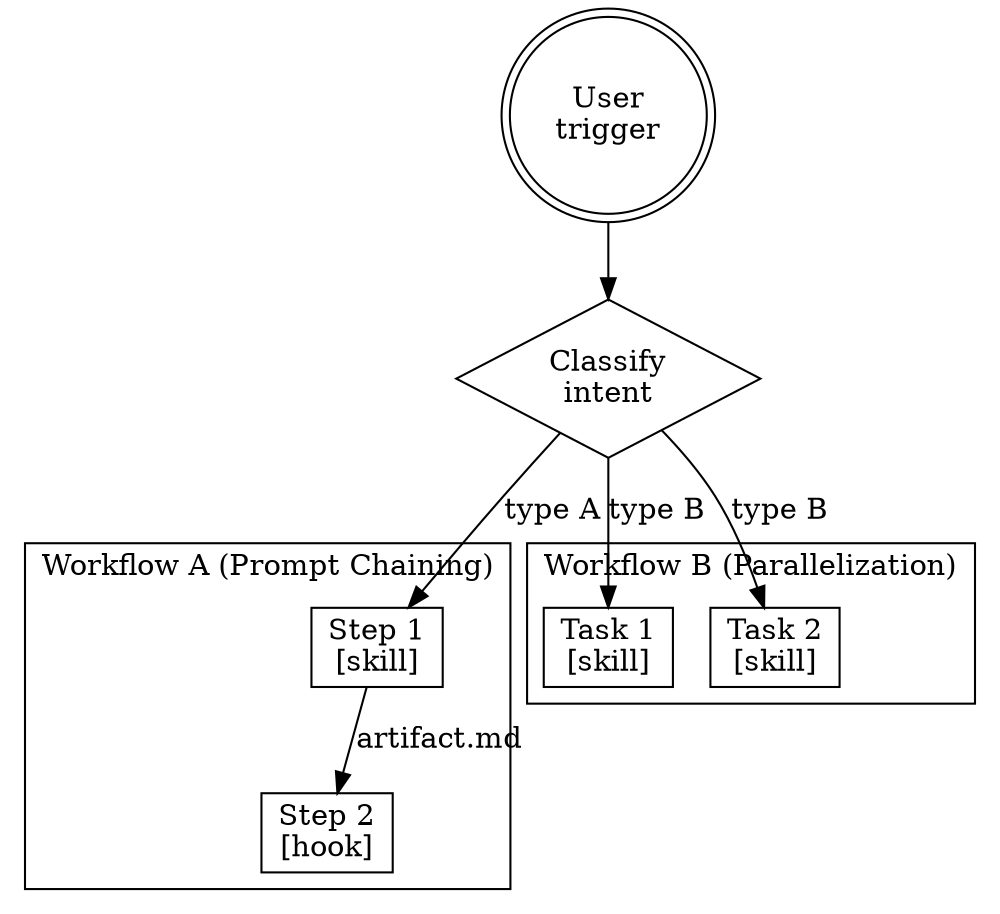

# Anthropic Workflow Patterns

## Six Production Patterns

Map each workflow from the summary to one of these patterns:

| Pattern | When to Use | Example |
|---------|------------|---------|
| **Prompt Chaining** | Clear sequential steps, each transforms previous output | lint → test → deploy |
| **Routing** | Input classification determines handler | detect language → route to lang-specific rules |
| **Parallelization** | Independent tasks that can run concurrently | parallel code review + test run |
| **Orchestrator-Workers** | Central coordinator dynamically delegates subtasks | refactor planner spawning file-specific agents |
| **Evaluator-Optimizer** | Generate-then-critique loop | write skill → review skill → revise |
| **Autonomous Agent** | Open-ended, LLM decides next step | debugging with tool access |

## Flowchart Conventions

When drawing the architecture flowchart, use these DOT conventions:
- **Entry points** (doublecircle) — how the user triggers each workflow
- **Decision nodes** (diamond) — routing/classification points
- **Process nodes** (box) — skills, hooks, rules that execute
- **Data flow edges** — what artifact passes between nodes
- **Parallel lanes** — workflows that can run concurrently (use subgraph clusters)



## Dependency Graph Template

From the flowchart, extract a dependency table:

| Component | Depends On | Depended By | Phase |
|-----------|-----------|-------------|-------|
| CLAUDE.md | (none) | all rules, skills | 1 |
| Rule: X | CLAUDE.md | Hook: Y | 1 |
| Hook: Y | Rule: X | (none) | 2 |
| Skill: Z | Rule: X | (none) | 2 |

Phase assignment rules:
- Phase 1: Components with no dependencies (foundation)
- Phase 2: Components depending only on Phase 1
- Phase 3+: Components depending on Phase 2+
- Within same phase: can be built in parallel

## Security Architecture Patterns

### 八層防禦體系

| 層級 | 職責 | 實施方式 | Hook 事件 |
|------|------|--------|-----------|
| 1. 代碼層 | SAST 掃描、秘密檢測 | PreToolUse hook | Write, Edit |
| 2. 依賴層 | SCA 掃描 | Stop hook | package install |
| 3. 構建層 | 容器映像掃描 | Stop hook | build artifacts |
| 4. 部署前 | IaC 驗證 | PreToolUse hook | Bash deploy commands |
| 5. 部署層 | 工件簽名驗證 | Stop hook | git push |
| 6. 註冊層 | 持續映像評估 | Cron job | background scan |
| 7. 運行時 | 工作負載監控 | Monitor hook | runtime events |
| 8. 合規層 | CSPM 檢查 | Stop hook | policy changes |

### 護欄策略

實施最低安全基線，非完美要求。優先警告而非阻斷（除關鍵漏洞）：

- **CRITICAL** → BLOCK（停止執行）
- **HIGH** → WARN + PROCEED（警告後繼續）
- **MEDIUM/LOW** → LOG（記錄後繼續）

### Security Warning 實作範例

```python
def security_warning(severity, finding, tool_call):
    """30秒內完成的安全檢查"""
    if severity == "CRITICAL":
        return {"action": "BLOCK", "message": f"Critical: {finding}"}
    elif severity == "HIGH": 
        return {"action": "WARN", "message": f"Warning: {finding}", "proceed": True}
    else:
        return {"action": "LOG", "message": f"Info: {finding}"}
```

**Performance Constraint**: All security checks MUST complete within 30 seconds to maintain workflow efficiency.
