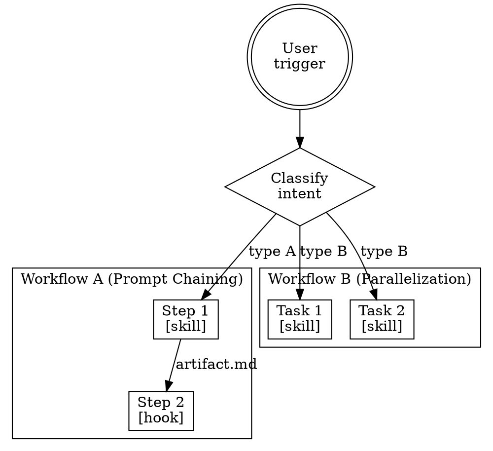

# Anthropic Workflow Patterns

## Six Production Patterns

Map each workflow from the summary to one of these patterns:

| Pattern | When to Use | Example |
|---------|------------|---------|
| **Prompt Chaining** | Clear sequential steps, each transforms previous output | lint → test → deploy |
| **Routing** | Input classification determines handler | detect language → route to lang-specific rules |
| **Parallelization** | Independent tasks that can run concurrently | parallel code review + test run |
| **Orchestrator-Workers** | Central coordinator dynamically delegates subtasks | refactor planner spawning file-specific agents |
| **Evaluator-Optimizer** | Generate-then-critique loop | write skill → review skill → revise |
| **Autonomous Agent** | Open-ended, LLM decides next step | debugging with tool access |

## Flowchart Conventions

When drawing the architecture flowchart, use these DOT conventions:
- **Entry points** (doublecircle) — how the user triggers each workflow
- **Decision nodes** (diamond) — routing/classification points
- **Process nodes** (box) — skills, hooks, rules that execute
- **Data flow edges** — what artifact passes between nodes
- **Parallel lanes** — workflows that can run concurrently (use subgraph clusters)

## Dependency Graph Template

From the flowchart, extract a dependency table:

| Component | Depends On | Depended By | Phase |
|-----------|-----------|-------------|-------|
| CLAUDE.md | (none) | all rules, skills | 1 |
| Rule: X | CLAUDE.md | Hook: Y | 1 |
| Hook: Y | Rule: X | (none) | 2 |
| Skill: Z | Rule: X | (none) | 2 |

Phase assignment rules:
- Phase 1: Components with no dependencies (foundation)
- Phase 2: Components depending only on Phase 1
- Phase 3+: Components depending on Phase 2+
- Within same phase: can be built in parallel
