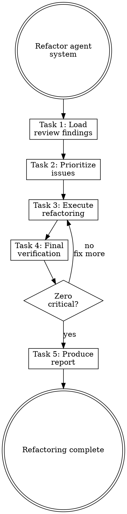

# Refactoring Agent Systems

## Overview

**Refactoring agent systems IS applying clean code principles to agent configurations.**

Re-analyze after changes, compare before/after, fix remaining issues, simplify over-engineering.

**Core principle:** Refactoring without measurement is guessing. Analyze, then change, then verify.

**Violating the letter of the rules is violating the spirit of the rules.**

## Routing

**Pattern:** Skill Steps
**Handoff:** none
**Next:** none
**Chain:** main (terminal)

## Task Initialization (MANDATORY)

Before ANY action, create task list using TaskCreate:

```
TaskCreate for EACH task below:
- Subject: "[refactoring-agent-systems] Task N: <action>"
- ActiveForm: "<doing action>"
```

**Tasks:**
1. Load review findings
2. Prioritize issues
3. Execute refactoring
4. Final verification
5. Produce refactoring report

Announce: "Created 5 tasks. Starting execution..."

**Execution rules:**
1. `TaskUpdate status="in_progress"` BEFORE starting each task
2. `TaskUpdate status="completed"` ONLY after verification passes
3. If task fails → stay in_progress, diagnose, retry
4. NEVER skip to next task until current is completed
5. At end, `TaskList` to confirm all completed

## Task 1: Load Review Findings

**Goal:** Load the review report as the basis for refactoring.

**If review report path was provided** (from `reviewing-agent-systems`):
1. Read the review report
2. Extract all Critical and Major issues
3. These are your refactoring targets

**If no review report** (standalone invocation):
1. Invoke `reviewing-agent-systems` skill first to produce a report
2. Then continue with the report's findings

**Verification:** Have a list of specific issues to fix from the review report.

## Task 2: Prioritize Issues

**Goal:** Classify and order issues from the review report for fixing.

**Priority order:**
1. **Critical** — must fix before shipping
2. **Major** — should fix for quality
3. **Minor** — nice to have, fix if time permits

**Present the prioritized list to user.** Do NOT summarize — show each issue with its component, severity, and planned fix.

**Ask:** "這些修正項目正確嗎？要開始修正嗎？"

**Verification:** User has confirmed the prioritized fix list.

## Task 3: Execute Refactoring

**Goal:** Fix remaining and new issues.

**Refactoring actions (in priority order):**

| Issue Type | Action | Method |
|------------|--------|--------|
| Duplicate logic across components | Merge or extract to rule | Main conversation edits |
| Conflicting instructions | Unify or remove one | Main conversation edits |
| Over-engineered component | Simplify (YAGNI) | Main conversation edits |
| Weak skill trigger | Improve description | Main conversation edits |
| Missing isolation | Add `context: fork` to agent | Main conversation edits |
| CLAUDE.md too long | Move content to rules/skills | Main conversation edits |
| Skill missing asset | Add scripts/, templates/, or references/ | Create directly — no user confirmation needed |

**CRITICAL:** All edits happen in main conversation. Never delegate refactoring writes to subagents.

**For each refactoring action:**
1. Identify the specific change
2. Make the edit
3. Verify the fix resolves the issue
4. Move to next action

**Verification:** All REMAINING and NEW issues addressed.

## Task 4: Final Verification

**Goal:** Confirm no critical issues remain.

**Re-run the relevant reviewer agents** on components that were modified in Task 3.

**Pass criteria:**
- Zero CRITICAL issues from any reviewer
- All Major issues from the original review are resolved
- No new issues introduced by refactoring

**If critical issues remain:** Return to Task 3 and fix.

**Verification:** All modified components pass their reviewer.

## Task 5: Produce Refactoring Report

**Goal:** Document what was changed and why.

**Write to:** `docs/agent-system/{timestamp}-refactoring-report.md`

**Report format:**

```markdown
# Agent System Refactoring Report

**Date:** YYYY-MM-DD HH:MM

## Changes Made

| # | Component | Change | Rationale |
|---|-----------|--------|-----------|

## Before/After Comparison

| Metric | Before | After |
|--------|--------|-------|
| Components | N | N |
| Critical issues | N | 0 |
| Warnings | N | N |
| Total lines (CLAUDE.md) | N | N |

## Remaining Items (INFO)

- [Low priority items for future consideration]
```

**Verification:** Report accurately reflects all changes.

## Red Flags - STOP

These thoughts mean you're rationalizing. STOP and reconsider:

- "Skip re-analysis, I just built this"
- "No need to compare, everything is new"
- "Use a subagent to make the edits"
- "Skip final verification, I just fixed it"
- "The report is busywork"

**All of these mean: You're about to leave mess behind. Follow the process.**

## Common Rationalizations

| Excuse | Reality |
|--------|---------|
| "Skip re-analysis" | Building introduces new issues. Always re-analyze. |
| "Skip comparison" | Without before/after, you can't prove improvement. |
| "Subagent edits" | Subagents can't write to `.claude/`. Use main conversation. |
| "Skip verification" | Refactoring can break things. Verify. |
| "Skip report" | Report documents decisions for future maintainers. |

## Flowchart: Agent System Refactoring


