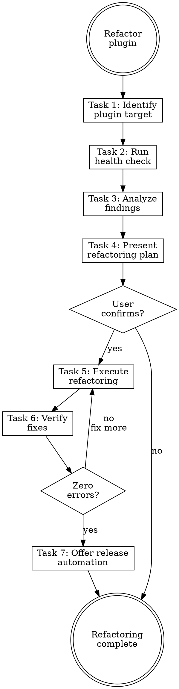

# Refactoring Plugins

## Overview

**Refactoring plugins IS aligning plugin structure with official Claude Code best practices.**

Run health checks, detect structural drift, fix anti-patterns, and verify the result. Plugins differ from agent systems — they have an official schema (`plugin.json`), auto-discovery conventions, and distribution requirements.

**Core principle:** A plugin that fails health check will fail in production. Measure first, then fix.

**Violating the letter of the rules is violating the spirit of the rules.**

## Routing

**Pattern:** Skill Steps
**Handoff:** none
**Next:** none

## Task Initialization (MANDATORY)

Before ANY action, create task list using TaskCreate:

```
TaskCreate for EACH task below:
- Subject: "[refactoring-plugins] Task N: <action>"
- ActiveForm: "<doing action>"
```

**Tasks:**
1. Identify plugin target
2. Run health check
3. Analyze findings against checklist
4. Present refactoring plan
5. Execute refactoring
6. Verify fixes
7. Offer release automation (if missing)

Announce: "Created 7 tasks. Starting execution..."

**Execution rules:**
1. `TaskUpdate status="in_progress"` BEFORE starting each task
2. `TaskUpdate status="completed"` ONLY after verification passes
3. If task fails → stay in_progress, diagnose, retry
4. NEVER skip to next task until current is completed
5. At end, `TaskList` to confirm all completed

## Task 1: Identify Plugin Target

**Goal:** Locate the plugin to refactor.

**Discovery order:**
1. User provided a path → use it
2. Current directory has `.claude-plugin/plugin.json` → use it
3. Search for `*/.claude-plugin/plugin.json` in working directory
4. Ask user to specify

**Record:**
- Plugin root path
- Plugin name (from plugin.json or directory name)
- Whether a marketplace.json exists upstream

**Verification:** Have a valid plugin directory with `.claude-plugin/plugin.json`.

## Task 2: Run Health Check

**Goal:** Execute the automated health check script.

**Step 1:** Run `claude plugin validate <plugin-path>` (official CLI).

**Step 2:** Run extended health check (bash-first, three-runner fallback with brace grouping):
```bash
{ command -v uv >/dev/null 2>&1 && uv run "${CLAUDE_SKILL_DIR}/scripts/validate_plugin.py" <plugin-path>; } \
  || { python3 --version >/dev/null 2>&1 && python3 "${CLAUDE_SKILL_DIR}/scripts/validate_plugin.py" <plugin-path>; } \
  || python "${CLAUDE_SKILL_DIR}/scripts/validate_plugin.py" <plugin-path>
```
The script integrates CLI validation and adds checks for manifest, structure, skills quality, commands, agents, path safety, and version sync.

**Capture output** for analysis in Task 3.

**Verification:** Health check completed with error/warning counts.

## Task 3: Analyze Findings Against Checklist

**Goal:** Deep analysis beyond the automated script.

**Important:** Read [references/plugin-health-checklist.md](references/plugin-health-checklist.md) for the full checklist.

**The script catches structural issues. Manual analysis catches:**
- Skill trigger overlaps
- Cross-component duplication
- Distribution readiness problems
- README documentation gaps
- Hook safety concerns

**For each finding, record:**
- Category (from checklist)
- Severity: CRITICAL / WARNING / INFO
- Component affected
- Specific issue
- Suggested fix

**Verification:** All 9 checklist categories evaluated.

## Task 4: Present Refactoring Plan

**Goal:** Show user the full findings and planned fixes.

**Present ALL findings with detail.** Do NOT summarize:
1. Health check script output (errors and warnings)
2. Manual analysis findings by severity
3. Planned fix for each issue

**Format:**

| # | Severity | Category | Component | Issue | Planned Fix |
|---|----------|----------|-----------|-------|-------------|

**Ask:** "以上是插件健康檢查結果，要開始修正嗎？"

**Verification:** User has confirmed the refactoring plan.

## Task 5: Execute Refactoring

**Goal:** Fix all confirmed issues.

**Important:** Read [references/plugin-structure-rules.md](references/plugin-structure-rules.md) for official rules and execution order.

**Important:** All edits in main conversation. Never delegate writes to subagents.

**Verification:** Each fix applied and individually verified.

## Task 6: Verify Fixes

**Goal:** Re-run health check to confirm all issues resolved.

**Process:**
1. Re-run the Step 2 fallback chain (`uv run` → `python3` → `python`) on the refactored plugin
2. Verify zero CRITICAL errors
3. Verify all WARNING items from Task 3 are resolved
4. Check no new issues introduced

**If issues remain:** Return to Task 5 and fix.

**Produce final report** with changes made (component, change, rationale) and before/after health check metrics.

**Verification:** Health check passes with zero errors.

## Task 7: Offer Release Automation (If Missing)

**Goal:** If plugin has no release automation, ask the user whether to add it.

**Detection:** Check for all three:
- `release-please-config.json` (or equivalent `.releaserc*`, `package.json` `release` key)
- `.release-please-manifest.json` (or semantic-release manifest)
- `.github/workflows/release-please.yml` (or any release workflow)

**Skip this task if** any release automation is already configured. State "release automation already present — skipping" and move on.

**If none configured, ask:**
> 偵測到未設定版號自動化。plugin 有 3+ 處版號欄位（plugin.json、marketplace.json、README），手動維護容易 drift。要建立 release-please 嗎？
> - **是** — 依 `creating-plugins` Task 6 流程建立 3 個 config 檔 + README markers
> - **否** — 記下為 technical debt，結束

**If yes:** Read [creating-plugins/references/plugin-templates.md](../creating-plugins/references/plugin-templates.md) for the `release-please-config.json`, `.release-please-manifest.json`, and workflow templates. Generate, add README markers, tell user to enable Actions write permissions.

**If no:** Document the decision in the final report under "Deferred".

**Verification:** Either automation exists (pre-existing or newly added), or user explicitly declined and decision recorded.

## Red Flags - STOP

- "Skip health check"
- "Structure looks fine"
- "Fix without showing"
- "Skip re-verification"
- "Simple plugin"
- "I know the official structure"

## Common Rationalizations

| Thought | Reality |
|---------|---------|
| "Skip health check" | Scripts catch what eyes miss. Always run it. |
| "Structure looks fine" | Anti-patterns hide in config files. Check all 9 categories. |
| "Fix without showing" | User must confirm before structural changes. |
| "Skip re-verification" | Fixes can break other things. Re-run the script. |
| "Simple plugin" | Simple plugins still need valid manifests and naming. |
| "I know the official structure" | Official structure evolves. Verify against the checklist. |

## Flowchart: Plugin Refactoring



## References

- [references/plugin-health-checklist.md](references/plugin-health-checklist.md) — Full 9-category plugin health checklist
- Health check script: `${CLAUDE_SKILL_DIR}/scripts/validate_plugin.py` (cross-platform, supports `uv run`)
