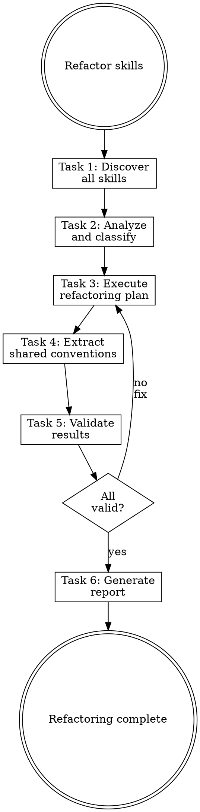

# Refactoring Skills

## Overview

**Refactoring skills IS applying clean code principles to documentation.**

Consolidate, simplify, extract shared conventions, remove redundancy.

**Core principle:** Fewer focused skills > many overlapping skills.

**Violating the letter of the rules is violating the spirit of the rules.**

## Task Initialization (MANDATORY)

Before ANY action, create task list using TaskCreate:

```
TaskCreate for EACH task below:
- Subject: "[refactoring-skills] Task N: <action>"
- ActiveForm: "<doing action>"
```

**Tasks:**
1. Discover all skills
2. Analyze and classify
3. Execute refactoring plan
4. Extract shared conventions
5. Validate results
6. Generate report

Announce: "Created 6 tasks. Starting execution..."

**Execution rules:**
1. `TaskUpdate status="in_progress"` BEFORE starting each task
2. `TaskUpdate status="completed"` ONLY after verification passes
3. If task fails → stay in_progress, diagnose, retry
4. NEVER skip to next task until current is completed
5. At end, `TaskList` to confirm all completed

## Task 1: Discover All Skills

**Goal:** Find all skills in the project.

**Search locations:**
```bash
find . -name "SKILL.md" -type f 2>/dev/null
ls -la .claude/skills/ 2>/dev/null
```

**Also check:**
- Plugin directories
- User-level skills (`~/.claude/skills/`)

**Document:**
- Skill name
- Location
- Brief description

**Verification:** Complete list of all skills with locations.

## Task 2: Analyze and Classify

**Goal:** Classify each skill for action.

### Classification Matrix

| Status | Criteria | Action |
|--------|----------|--------|
| **Keep** | Well-structured, unique purpose, follows standards | None |
| **Refactor** | Has issues but valuable | Use writing-skills to improve |
| **Merge** | Overlaps with another skill | Consolidate into primary |
| **Extract** | Has conventions shared by others | Move to rule file |
| **Delete** | Redundant, unused, or superseded | Remove entirely |

### Analysis Questions

For each skill:
1. Is the purpose clear and unique?
2. Does it overlap with another skill?
3. Does it contain shared conventions (→ extract to rule)?
4. Is it actually used?
5. Does it follow current standards?

**Optional: External Search**

If `claude-skills-mcp` is available:
```
mcp__claude-skills-mcp__search_skills query="[skill domain]"
```

Compare with community implementations. Better patterns exist?

**Verification:** Each skill has a classification and action.

## Task 3: Execute Refactoring Plan

**Goal:** Apply the classified actions.

### For Skills to Refactor

**Invoke the `writing-skills` skill** with the existing skill path.

### For Skills to Merge

1. Identify the primary skill (keep this one)
2. Extract unique content from secondary skill
3. Integrate into primary skill
4. Delete secondary skill directory

### For Skills to Delete

1. Confirm no dependencies (grep for skill name)
2. Remove entire skill directory
3. Remove from any manifest references

**CRITICAL:** One action at a time. Verify after each.

**Verification:** All classified actions executed.

## Task 4: Extract Shared Conventions

**Goal:** Move duplicated conventions to rule files.

**Signs of shared conventions:**
- Same constraint appears in 2+ skills
- Convention is about "what" not "how"
- Convention is path-specific

**Process:**
1. Identify duplicated constraint
2. **Invoke `writing-rules` skill** to create rule
3. Remove constraint from all skills
4. Verify rule auto-injects correctly

**Verification:** No duplicated conventions across skills.

## Task 5: Validate Results

**Goal:** Verify all remaining skills are valid.

**For each skill:**
```bash
python3 scripts/validate_skill.py <skill-path>
```

**Or manual checklist:**
- [ ] Frontmatter has name and description
- [ ] Description starts with "Use when..."
- [ ] Body < 300 lines
- [ ] No duplicated conventions (now in rules)

**Verification:** All remaining skills pass validation.

## Task 6: Generate Report

**Goal:** Document what was done.

### Report Format

```markdown
## Refactoring Summary

### Skills Analyzed: N

### Actions Taken:
| Skill | Action | Notes |
|-------|--------|-------|
| skill-name | kept/refactored/merged/deleted | details |

### Rules Extracted:
| Rule | Source Skills |
|------|--------------|
| rule-name | skill-a, skill-b |

### Recommendations:
- [Future improvements]
```

**Verification:** Report accurately reflects all changes.

## Red Flags - STOP

These thoughts mean you're rationalizing. STOP and reconsider:

- "Keep all skills, they might be useful"
- "Too much overlap is fine"
- "Don't need to extract conventions"
- "Skip validation, I just fixed them"
- "Report is busywork"

**All of these mean: You're about to leave mess behind. Follow the process.**

## Common Rationalizations

| Excuse | Reality |
|--------|---------|
| "Keep everything" | Unused skills are clutter. Delete them. |
| "Overlap is fine" | Overlap = confusion. Merge or differentiate. |
| "Skip extraction" | Duplicated conventions drift. Extract to rules. |
| "Skip validation" | Fixed skills can still be broken. Validate. |
| "Skip report" | Report documents decisions for future you. |

## Flowchart: Skill Refactoring



## References

- Use `writing-skills` skill for improving skills
- Use `writing-rules` skill for extracting conventions
- Use `skill-reviewer` subagent for quality checks
