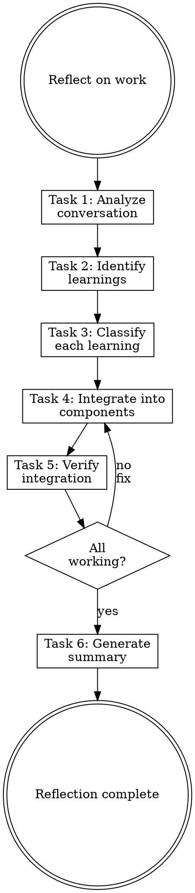

# Reflecting

## Overview

**Reflecting IS converting experience into reusable knowledge.**

Analyze what worked, what failed, and encode learnings into the appropriate component (law, skill, rule, or documentation).

**Core principle:** Experience without reflection is wasted. Capture it before context is lost.

**Violating the letter of the rules is violating the spirit of the rules.**

## Task Initialization (MANDATORY)

Before ANY action, create task list using TaskCreate:

```
TaskCreate for EACH task below:
- Subject: "[reflecting] Task N: <action>"
- ActiveForm: "<doing action>"
```

**Tasks:**
1. Analyze conversation
2. Identify learnings
3. Classify each learning
4. Integrate into components
5. Verify integration
6. Generate summary

Announce: "Created 6 tasks. Starting execution..."

**Execution rules:**
1. `TaskUpdate status="in_progress"` BEFORE starting each task
2. `TaskUpdate status="completed"` ONLY after verification passes
3. If task fails → stay in_progress, diagnose, retry
4. NEVER skip to next task until current is completed
5. At end, `TaskList` to confirm all completed

## Task 1: Analyze Conversation

**Goal:** Review the conversation to identify significant events.

**Look for:**
- **Successes:** Patterns that led to good outcomes
- **Failures:** Errors, multiple attempts, dead ends
- **Discoveries:** New insights about the project/domain
- **Repetitions:** Actions performed multiple times

**Document each event:**
```
Event: [What happened]
Context: [When/where it occurred]
Outcome: [Success/failure/discovery]
```

**Verification:** Listed at least 3 significant events.

## Task 2: Identify Learnings

**Goal:** Extract actionable learnings from events.

**For each event, ask:**
- What would have prevented this failure?
- What made this succeed that could be repeated?
- What did we learn that applies beyond this task?

**Learning format:**
```yaml
Learning:
  context: [When this applies]
  insight: [What was learned]
  evidence: [Specific event that taught this]
```

**Verification:** Each event has at least one learning.

## Task 3: Classify Each Learning

**Goal:** Determine where each learning belongs.

### Classification Decision Tree

```
Is it IMMUTABLE (must enforce every response)?
├─ Yes → LAW in CLAUDE.md
└─ No → Is it a CAPABILITY (how to do)?
    ├─ Yes → SKILL
    │   └─ Is it SHARED across multiple skills?
    │       ├─ Yes → Also extract to RULE
    │       └─ No → Keep in Skill only
    └─ No → Is it a CONVENTION (what to do)?
        ├─ Yes → RULE in .claude/rules/
        └─ No → DOCUMENTATION only
```

### Classification Guide

| Type | Characteristics | Example |
|------|-----------------|---------|
| **Law** | Immutable, every response, critical | "Always display laws" |
| **Skill** | How to do something, reusable | "How to write tests" |
| **Rule** | Convention, path-scoped | "API responses use { data, error }" |
| **Documentation** | Reference, not actionable | "Architecture overview" |

**Verification:** Each learning has a classification.

## Task 4: Integrate Into Components

**Goal:** Add learnings to the appropriate components.

### For Laws

**Invoke `writing-claude-md` skill** or edit CLAUDE.md directly:
```markdown
**Law N: [Name]** - [Specific, verifiable constraint]
```

### For Skills

**Invoke `writing-skills` skill** to create/update skill.

### For Rules

**Invoke `writing-rules` skill** to create rule file.

### For Documentation

Add to appropriate `references/` or `docs/` location.

**CRITICAL:** Invoke the appropriate skill—don't create components directly.

**Verification:** All learnings integrated into components.

## Task 5: Verify Integration

**Goal:** Confirm learnings are correctly integrated.

**Check:**
- [ ] New laws appear in `<law>` block
- [ ] New skills pass validation
- [ ] New rules have correct `paths:` scope
- [ ] Documentation is in correct location

**Test:**
- Laws: Verify they display in responses
- Skills: Verify they activate on triggers
- Rules: Verify they inject on matching files

**Verification:** All integrated components work correctly.

## Task 6: Generate Summary

**Goal:** Document what was captured.

### Summary Format

```markdown
## Reflection Summary

### Session Context
[What work was done]

### Learnings Captured

| Learning | Classification | Location |
|----------|----------------|----------|
| [insight] | law/skill/rule/doc | [path] |

### Components Modified
- Laws: [new/updated laws]
- Skills: [new/updated skills]
- Rules: [new/updated rules]

### Recommendations
- [Future improvements]
```

**Verification:** Summary accurately reflects all changes.

## When to Reflect

**Trigger reflection after:**
- Completing a significant feature
- Resolving a difficult bug
- Multiple failed attempts → eventual success
- Discovering something unexpected
- End of long working session

**Don't wait for "later"—context fades quickly.**

## Red Flags - STOP

These thoughts mean you're rationalizing. STOP and reconsider:

- "Nothing worth capturing"
- "I'll remember this"
- "Too small to document"
- "Reflection is overhead"
- "Skip classification, just document"

**All of these mean: You're about to lose valuable learnings. Follow the process.**

## Common Rationalizations

| Excuse | Reality |
|--------|---------|
| "Nothing learned" | Every session has learnings. Look harder. |
| "I'll remember" | You won't. Context fades. Capture now. |
| "Too small" | Small learnings compound. Capture them. |
| "Overhead" | 10 minutes now saves hours later. |
| "Skip classification" | Wrong location = unfindable. Classify properly. |

## Flowchart: Reflection Process



## References

- Use `writing-claude-md` for laws
- Use `writing-skills` for capabilities
- Use `writing-rules` for conventions
- Use `agent-architect` for classification help
