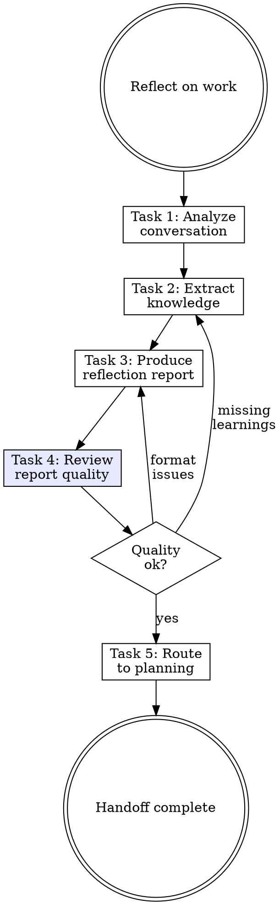

# Reflecting

## Overview

**Reflecting IS converting experience into a structured report for the planning pipeline.**

Analyze the conversation, extract learnings, and produce a reflection report. Route the report to planning-agent-systems — do not classify or create components directly.

**Core principle:** Capture before context is lost. Classify just enough for planning to act on.

**Violating the letter of the rules is violating the spirit of the rules.**

## Routing

**Pattern:** Chain
**Handoff:** auto-invoke
**Next:** `planning-agent-systems`

## Task Initialization (MANDATORY)

Before ANY action, create task list using TaskCreate:

```
TaskCreate for EACH task below:
- Subject: "[reflecting] Task N: <action>"
- ActiveForm: "<doing action>"
```

**Tasks:**
1. Analyze conversation
2. Extract knowledge
3. Produce reflection report
4. Review report quality
5. Route to planning

Announce: "Created 5 tasks. Starting execution..."

**Execution rules:**
1. `TaskUpdate status="in_progress"` BEFORE starting each task
2. `TaskUpdate status="completed"` ONLY after verification passes
3. If task fails → stay in_progress, diagnose, retry
4. NEVER skip to next task until current is completed
5. At end, `TaskList` to confirm all completed

## Task 1: Analyze Conversation

**Goal:** Review the conversation to identify significant events.

**Look for:**
- **Corrections** — user corrected the agent's approach or output
- **Errors** — agent made a mistake, multiple attempts needed
- **Discoveries** — new insights about the project, domain, or tooling
- **Repetitions** — same action performed multiple times (automation candidate)

**Document each event:**
```
Event: [What happened]
Context: [When/where it occurred]
Outcome: [Result]
Type: correction / error / discovery / repetition
```

**Verification:** Listed at least 3 significant events. If fewer than 3 occurred, document why.

## Task 2: Extract Knowledge

**Goal:** Derive actionable learnings from each event.

**For each event, ask:**
- What would have prevented this failure?
- What made this succeed that could be repeated?
- What did we learn that applies beyond this task?

**Simplicity principle:** Prefer the simplest component type that works.
- A one-line convention → `rule`, not a `skill`
- A repeated multi-step process → `skill`, not a `doc`
- An immutable project constraint → `law`, not a `rule`

**Learning format:**
```yaml
Learning:
  context: [When this applies]
  insight: [What was learned]
  evidence: [Specific event that taught this]
  suggested_component: rule / law / skill / hook / doc
  rationale: [Why this component type fits]
```

**Verification:** Each event has at least one learning with a suggested component and rationale.

## Task 3: Produce Reflection Report

**Goal:** Write a structured report for the planning pipeline.

1. Read `references/report-template.md` for format and completeness checklist
2. Determine timestamp: `YYYY-MM-DD` format
3. Write report to `docs/agent-system/{timestamp}-reflection.md`

The report must follow the template exactly, including:
- Session context
- Events table (Event / Context / Outcome / Type)
- Learnings table (Learning / Evidence / Suggested Component / Rationale)
- Component recommendations with path hints and content summaries
- Weaknesses addressed (if applicable)

**Verification:** Report file exists at the expected path with no placeholder text.

## Task 4: Review Report Quality

**Goal:** Verify the report is complete before routing.

Use the completeness checklist from `references/report-template.md`:

- [ ] Every event has at least one learning
- [ ] Every learning has a suggested component with rationale
- [ ] Every component recommendation has type, path hint, content summary, and traces-to
- [ ] No placeholder text (TBD, TODO, etc.)
- [ ] Session context accurately describes the work done
- [ ] At least 3 events documented (or explanation of why fewer)

**If missing learnings** → return to Task 2, extract more, then re-run Task 3.
**If format issues** → return to Task 3, fix the report.

**Verification:** All checklist items pass.

## Task 5: Route to Planning

**Goal:** Hand off the reflection report to planning-agent-systems.

1. Announce: "Reflection complete. Routing report to planning-agent-systems."
2. State the report path
3. Invoke `planning-agent-systems` with the report path as input

**Do not** classify components yourself. **Do not** create components directly. Planning handles classification and execution.

**Verification:** planning-agent-systems invoked with correct report path.

## When to Reflect

**Trigger reflection after:**
- Completing a significant feature
- Resolving a difficult bug
- Multiple failed attempts → eventual success
- Discovering something unexpected
- End of long working session

**Don't wait for "later" — context fades quickly.**

## Red Flags — STOP

These thoughts mean you're rationalizing. STOP and reconsider:

- "Nothing worth capturing"
- "I'll remember this"
- "Too small to document"
- "Reflection is overhead"
- "Skip the report, just create components directly"
- "I know where this learning belongs, skip planning"

**All of these mean: You're about to short-circuit the pipeline. Follow the process.**

## Common Rationalizations

| Excuse | Reality |
|--------|---------|
| "Nothing learned" | Every session has learnings. Look harder. |
| "I'll remember" | You won't. Context fades. Capture now. |
| "Too small" | Small learnings compound. Capture them. |
| "Overhead" | 10 minutes now saves hours later. |
| "Create directly" | Bypasses conflict checks, simplicity gates, and reviews. |
| "I know where it goes" | Planning has component-planning criteria you don't carry inline. |

## Flowchart


```dot
digraph reflecting {
    rankdir=TB;

    start [label="Reflect on work", shape=doublecircle];
    analyze [label="Task 1: Analyze\nconversation", shape=box];
    extract [label="Task 2: Extract\nknowledge", shape=box];
    report [label="Task 3: Produce\nreflection report", shape=box];
    review [label="Task 4: Review\nreport quality", shape=box, style=filled, fillcolor="#e8e8ff"];
    quality_ok [label="Quality\nok?", shape=diamond];
    route [label="Task 5: Route\nto planning", shape=box];
    done [label="Handoff complete", shape=doublecircle];

    start -> analyze;
    analyze -> extract;
    extract -> report;
    report -> review;
    review -> quality_ok;
    quality_ok -> route [label="yes"];
    quality_ok -> extract [label="missing\nlearnings"];
    quality_ok -> report [label="format\nissues"];
    route -> done;
}
```

## References

- `references/report-template.md` — report format and completeness checklist
- `planning-agent-systems` — classification and component creation
