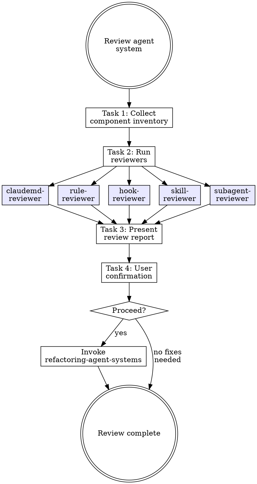

# Reviewing Agent Systems

## Overview

**Reviewing agent systems IS running every reviewer against every component.**

After components are built, each one must pass its corresponding reviewer agent before moving to refactoring. This is the quality gate between "built" and "ready to ship".

**Core principle:** Building without reviewing is shipping without testing. Every component type has a reviewer — use it.

**Violating the letter of the rules is violating the spirit of the rules.**

## Task Initialization (MANDATORY)

Before ANY action, create task list using TaskCreate:

```
TaskCreate for EACH task below:
- Subject: "[reviewing-agent-systems] Task N: <action>"
- ActiveForm: "<doing action>"
```

**Tasks:**
1. Collect component inventory
2. Run reviewers
3. Present review report to user
4. Get user confirmation

Announce: "Created 4 tasks. Starting execution..."

**Execution rules:**
1. `TaskUpdate status="in_progress"` BEFORE starting each task
2. `TaskUpdate status="completed"` ONLY after verification passes
3. If task fails → stay in_progress, diagnose, retry
4. NEVER skip to next task until current is completed
5. At end, `TaskList` to confirm all completed

## Task 1: Collect Component Inventory

**Goal:** Identify all components to review.

**Scan for:**

| Component Type | Location | Reviewer Agent |
|----------------|----------|----------------|
| CLAUDE.md | `CLAUDE.md` or `.claude/CLAUDE.md` | `claudemd-reviewer` |
| Skills | `.claude/skills/*/SKILL.md` | `skill-reviewer` |
| Rules | `.claude/rules/*.md` | `rule-reviewer` |
| Hooks | `.claude/hooks/*` + `.claude/settings.json` | `hook-reviewer` |
| Subagents | `.claude/agents/*.md` | `subagent-reviewer` |

**If a component plan path was provided:** Use the plan to identify which components were just created/modified — review only those.

**If no plan:** Scan all locations and review everything found.

**Verification:** Complete inventory with component paths and assigned reviewer.

## Task 2: Run Reviewers

**Goal:** Invoke the correct reviewer agent for each component.

**For each component, invoke its reviewer:**

```
Agent tool:
- subagent_type: "rcc:[reviewer-name]"
- prompt: "Review [component type] at [path]"
```

**Execution order:**
1. CLAUDE.md → `claudemd-reviewer`
2. Rules → `rule-reviewer` (one per rule)
3. Hooks → `hook-reviewer` (one per hook)
4. Skills → `skill-reviewer` (one per skill)
5. Subagents → `subagent-reviewer` (one per agent)

**Collect each reviewer's output:**
- Rating: Pass / Needs Fix / Fail
- Critical issues
- Major issues
- Minor issues

**CRITICAL:** Run ALL reviewers. Do NOT skip components because "they were just created by a writing-* skill". Writing-* skills have their own internal review, but system-level review catches cross-component issues.

**Verification:** Every component has a reviewer result.

## Task 3: Present Review Report to User

**Goal:** Show the user the full review results.

**Present ALL findings with detail.** Do NOT summarize into brief bullet points.

**Report format:**

```markdown
## Agent System Review Report

### Summary

| Component | Type | Reviewer | Rating | Critical | Major | Minor |
|-----------|------|----------|--------|----------|-------|-------|
| [name] | [type] | [reviewer] | Pass/Fix/Fail | N | N | N |

### Detailed Findings

#### [Component Name] — [Rating]

**Critical Issues:**
- [Issue]: [what's wrong, why it matters, suggested fix]

**Major Issues:**
- [Issue]: [what's wrong, why it matters, suggested fix]

**Minor Issues:**
- [Suggestion]
```

**Anti-pattern:** "5 components reviewed, 2 need fixes" without listing what the fixes are is NOT presenting. Show every finding.

**Write report to:** `docs/agent-system/{timestamp}-review-report.md`

**Verification:** Report written with all findings from all reviewers.

## Task 4: Get User Confirmation

**Goal:** User decides whether to proceed to refactoring.

**Ask:** "Review 完成。要繼續進行重構修正嗎？"

**Handoff:** After user confirms → invoke `refactoring-agent-systems` skill, pass review report path

**Verification:** User has explicitly confirmed.

## Red Flags - STOP

These thoughts mean you're rationalizing. STOP and reconsider:

- "Writing-* skills already reviewed, skip system review"
- "Only review components that look wrong"
- "Skip reviewer for simple components"
- "A brief summary is enough for the user"
- "Don't need all 5 reviewers"

**All of these mean: You're about to ship unreviewed components. Follow the process.**

## Common Rationalizations

| Excuse | Reality |
|--------|---------|
| "Already reviewed by writing-*" | Writing-* reviews individual quality. System review catches cross-component issues. |
| "Only review suspicious ones" | You can't judge quality by looking. Run the reviewer. |
| "Simple = correct" | Simple components can still have wrong globs, missing fields, or duplicated logic. |
| "Brief summary is enough" | Users need full details to decide which issues to fix vs accept. |
| "Not all types present" | Review what exists. Skip types with zero components. |

## Flowchart: Agent System Review


